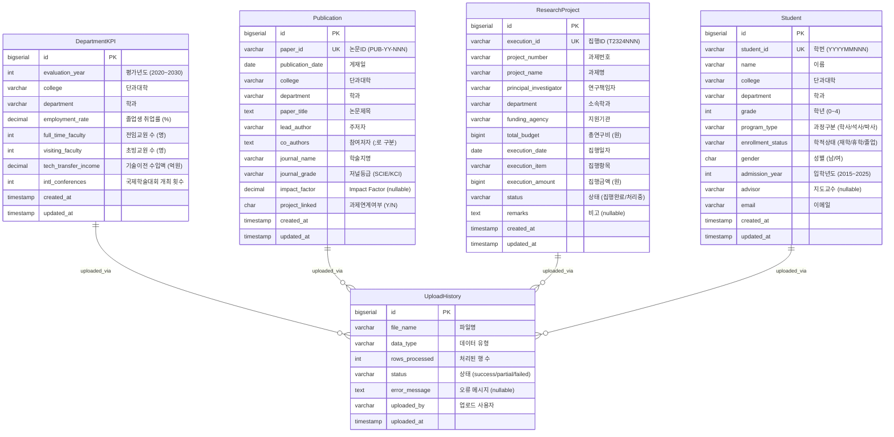

# 데이터베이스 설계 문서 (Database Design Document)

## 문서 정보
- **프로젝트명**: 대학교 사내 데이터 시각화 대시보드
- **문서 버전**: v1.1.0
- **작성일**: 2025년 11월 2일
- **데이터베이스**: PostgreSQL (Supabase)
- **기반 문서**: PRD v1.1.0, Userflow v1.1.0

---

## 목차
1. [개요](#개요)
2. [데이터 플로우 (Data Flow)](#데이터-플로우-data-flow)
3. [ERD (Entity Relationship Diagram)](#erd-entity-relationship-diagram)
4. [테이블 스키마 상세](#테이블-스키마-상세)
5. [CSV 컬럼 매핑](#csv-컬럼-매핑)
6. [데이터 검증 규칙](#데이터-검증-규칙)
7. [인덱스 전략](#인덱스-전략)
8. [마이그레이션 가이드](#마이그레이션-가이드)

---

## 개요

### 설계 원칙
1. **최소 스펙 준수**: Userflow에 명시된 데이터만 포함
2. **정규화**: 제3정규형 (3NF) 준수
3. **확장성**: 향후 추가 데이터 타입 지원 가능한 구조
4. **성능**: 조회 성능 최적화를 위한 인덱스 설계
5. **무결성**: 제약 조건을 통한 데이터 정합성 보장
6. **감사 추적**: 모든 테이블에 created_at, updated_at 포함

### 데이터 소스 (4개 CSV 파일)
본 시스템은 다음 4가지 CSV 파일로부터 데이터를 수집합니다:

1. **department_kpi.csv** - 학과 KPI 데이터
   - 평가년도별 단과대학 및 학과 성과 지표
   - 취업률, 교원 수, 기술이전 수입, 학술대회 개최 횟수 등

2. **publication_list.csv** - 논문 목록
   - 학술지 게재 논문 정보
   - 주저자, 참여저자, Impact Factor, 과제 연계 여부 등

3. **research_project_data.csv** - 연구 과제 데이터
   - 연구 과제별 예산 집행 현황
   - 연구책임자, 지원기관, 집행 항목, 집행 상태 등

4. **student_roster.csv** - 학생 명단
   - 학생 기본 정보 및 학적 상태
   - 학년, 과정 구분, 학적 상태, 지도교수, 입학년도 등

---

## 데이터 플로우 (Data Flow)

### 1. 전체 시스템 데이터 플로우

```
┌──────────────────────────────────────────────────────────────┐
│                    CSV 파일 (4종)                            │
│  - department_kpi.csv                                        │
│  - publication_list.csv                                      │
│  - research_project_data.csv                                 │
│  - student_roster.csv                                        │
└─────────────────────┬────────────────────────────────────────┘
                      │ Upload (관리자)
                      ↓
┌──────────────────────────────────────────────────────────────┐
│           Django Backend - File Processing                   │
│                                                              │
│  1. UploadView (Presentation Layer)                          │
│     - HTTP 요청 수신                                         │
│     - 파일 검증 (크기, 형식)                                 │
│                                                              │
│  2. FileProcessorService (Service Layer)                     │
│     - 파일 처리 오케스트레이션                               │
│                                                              │
│  3. ExcelParser (Service Layer)                              │
│     - openpyxl/pandas로 파일 파싱                            │
│     - 행별 데이터 추출                                       │
│                                                              │
│  4. DataValidator (Service Layer)                            │
│     - 비즈니스 룰 검증                                       │
│     - 데이터 타입 검증                                       │
│     - 범위 검증                                              │
│     - 중복 검증                                              │
│                                                              │
│  5. Repository Layer                                         │
│     - bulk_create() 호출                                     │
│     - 트랜잭션 관리                                          │
└─────────────────────┬────────────────────────────────────────┘
                      │ INSERT (Bulk)
                      ↓
┌──────────────────────────────────────────────────────────────┐
│              PostgreSQL Database (Supabase)                  │
│                                                              │
│  ┌────────────────┐  ┌────────────────┐  ┌────────────────┐ │
│  │ department_kpi │  │  publication   │  │research_project││
│  └────────────────┘  └────────────────┘  └────────────────┘ │
│                                                              │
│  ┌────────────────┐  ┌────────────────┐                     │
│  │    student     │  │ upload_history │                     │
│  └────────────────┘  └────────────────┘                     │
└─────────────────────┬────────────────────────────────────────┘
                      │ SELECT (Query)
                      ↓
┌──────────────────────────────────────────────────────────────┐
│         Django Backend - Data Retrieval                      │
│                                                              │
│  1. DashboardView (Presentation Layer)                       │
│     - HTTP 요청 수신 + 필터 파라미터                         │
│                                                              │
│  2. DashboardService (Service Layer)                         │
│     - 비즈니스 로직 실행                                     │
│     - Repository 병렬 호출                                   │
│     - MetricCalculator (증감률 계산)                         │
│     - ChartDataBuilder (차트 데이터 변환)                    │
│                                                              │
│  3. Repository Layer (병렬 실행)                             │
│     - DepartmentKPIRepository.get_summary()                  │
│     - PublicationRepository.get_count_by_period()            │
│     - ResearchProjectRepository.get_budget_stats()           │
│     - StudentRepository.get_count_by_department()            │
│                                                              │
│  4. Serializer (Presentation Layer)                          │
│     - Domain Model → JSON 변환                               │
└─────────────────────┬────────────────────────────────────────┘
                      │ JSON Response
                      ↓
┌──────────────────────────────────────────────────────────────┐
│              React Frontend - Visualization                  │
│                                                              │
│  1. Dashboard Page                                           │
│     - API 호출 (useDashboard hook)                           │
│     - 로딩 상태 관리                                         │
│                                                              │
│  2. ChartTransformer                                         │
│     - API 응답 → Recharts 형식 변환                          │
│     - 날짜/숫자 포맷팅                                       │
│                                                              │
│  3. UI Components                                            │
│     - MetricCard (KPI 카드)                                  │
│     - BarChart (막대 그래프)                                 │
│     - LineChart (라인 차트)                                  │
│     - PieChart (파이 차트)                                   │
└──────────────────────────────────────────────────────────────┘
```

### 2. CSV별 상세 데이터 플로우

#### 2.1 학과 KPI 데이터 플로우

```
[department_kpi.csv]
평가년도,단과대학,학과,졸업생 취업률 (%),전임교원 수 (명),...
2024,공과대학,컴퓨터공학과,87.1,16,...
2024,공과대학,전자공학과,89.0,18,...
    ↓
[ExcelParser.parse()]
- openpyxl/pandas로 파싱
- 헤더 행 추출: ['평가년도', '단과대학', ...]
- 데이터 행 추출: [{'평가년도': 2024, ...}, ...]
    ↓
[DataValidator.validate()]
검증 항목:
✓ 평가년도: 2020 <= year <= 2030
✓ 취업률: 0 <= rate <= 100
✓ 교원 수: >= 0
✓ 기술이전 수입: >= 0
✓ 학술대회: >= 0
✓ 고유성: (평가년도, 학과) 조합 고유
    ↓
[DepartmentKPIRepository.bulk_create()]
- Transaction 시작
- INSERT INTO department_kpi (year, college, ...)
  VALUES (2024, '공과대학', ...), (2024, '공과대학', ...)
- Transaction 커밋
    ↓
[department_kpi 테이블]
id | year | college  | department       | employment_rate | ...
1  | 2024 | 공과대학 | 컴퓨터공학과     | 87.10           | ...
2  | 2024 | 공과대학 | 전자공학과       | 89.00           | ...
    ↓
[DashboardService.get_kpi_summary(filters)]
SQL 쿼리:
- SELECT AVG(employment_rate) FROM department_kpi WHERE year = 2024
- SELECT SUM(full_time_faculty) FROM department_kpi WHERE year = 2024
- GROUP BY college, department
    ↓
[API Response]
{
  "avg_employment_rate": 88.05,
  "total_faculty": 34,
  "tech_transfer_income": 26.0,
  "by_department": [...]
}
    ↓
[Frontend - Dashboard UI]
- KPI 카드: 평균 취업률 88.05%
- 막대 그래프: 학과별 교원 수
- 라인 차트: 연도별 취업률 추이
```

#### 2.2 논문 목록 데이터 플로우

```
[publication_list.csv]
논문ID,게재일,학과,논문제목,주저자,학술지명,저널등급,Impact Factor,...
PUB-24-001,2024-01-30,컴퓨터공학과,Deep Learning...,이서연,Expert Systems...,SCIE,8.5,...
    ↓
[ExcelParser.parse() + DataValidator.validate()]
검증 항목:
✓ 논문ID 형식: PUB-YY-NNN
✓ 논문ID 고유성
✓ 게재일 형식: YYYY-MM-DD
✓ 저널등급: SCIE 또는 KCI
✓ Impact Factor: SCIE는 필수, KCI는 NULL 허용
✓ 과제연계: Y 또는 N
    ↓
[PublicationRepository.bulk_create()]
    ↓
[publication 테이블]
id | paper_id    | pub_date   | dept           | title         | journal_grade | impact_factor | project_linked
1  | PUB-24-001  | 2024-01-30 | 컴퓨터공학과   | Deep Learning | SCIE          | 8.5           | Y
    ↓
[DashboardService.get_publication_stats(filters)]
SQL 쿼리:
- SELECT COUNT(*) FROM publication WHERE EXTRACT(YEAR FROM pub_date) = 2024
- SELECT journal_grade, COUNT(*) FROM publication GROUP BY journal_grade
- SELECT AVG(impact_factor) FROM publication WHERE journal_grade = 'SCIE'
- SELECT COUNT(*) FROM publication WHERE project_linked = 'Y'
    ↓
[API Response]
{
  "total_papers": 45,
  "scie_count": 30,
  "kci_count": 15,
  "avg_impact_factor": 6.8,
  "project_linked_ratio": 0.73
}
    ↓
[Frontend - Research Dashboard]
- 총 논문 수: 45편
- SCIE/KCI 비율: 파이 차트
- 평균 Impact Factor: 6.8
- 과제 연계 비율: 73%
```

#### 2.3 연구 과제 데이터 플로우

```
[research_project_data.csv]
집행ID,과제번호,과제명,연구책임자,총연구비,집행일자,집행항목,집행금액,상태,...
T2301001,NRF-2023-015,차세대 AI 반도체,김민준,500000000,2023-03-15,연구장비,120000000,집행완료,...
    ↓
[ExcelParser.parse() + DataValidator.validate()]
검증 항목:
✓ 집행ID 형식: T2324NNN
✓ 집행ID 고유성
✓ 총연구비 >= 0
✓ 집행금액 >= 0
✓ 집행일자 형식: YYYY-MM-DD
✓ 상태: 집행완료 또는 처리중
✓ 과제별 집행액 합계 <= 총연구비
    ↓
[ResearchProjectRepository.bulk_create()]
    ↓
[research_project 테이블]
id | execution_id | project_number  | total_budget | execution_amount | status    | ...
1  | T2301001     | NRF-2023-015    | 500000000    | 120000000        | 집행완료  | ...
    ↓
[DashboardService.get_budget_summary(filters)]
SQL 쿼리:
- SELECT SUM(total_budget) FROM research_project
- SELECT SUM(execution_amount) FROM research_project WHERE status = '집행완료'
- SELECT execution_item, SUM(execution_amount) FROM ... GROUP BY execution_item
- SELECT funding_agency, SUM(total_budget) FROM ... GROUP BY funding_agency
    ↓
[API Response]
{
  "total_budget": 1680000000,
  "total_execution": 393500000,
  "execution_rate": 0.23,
  "by_item": {"연구장비": 120000000, "인건비": 170000000, ...},
  "by_agency": {"한국연구재단": 580000000, ...}
}
    ↓
[Frontend - Budget Dashboard]
- 총 연구비: 16.8억원
- 집행률: 23% (프로그레스 바)
- 집행 항목별 비율: 파이 차트
- 지원 기관별 현황: 막대 그래프
```

#### 2.4 학생 명단 데이터 플로우

```
[student_roster.csv]
학번,이름,학과,학년,과정구분,학적상태,성별,입학년도,지도교수,이메일
20201101,김유진,컴퓨터공학과,4,학사,재학,여,2020,이서연,yjkim@university.ac.kr
    ↓
[ExcelParser.parse() + DataValidator.validate()]
검증 항목:
✓ 학번 형식: YYYYMMNNN
✓ 학번 고유성
✓ 학년: 0~4 (학사 1~4, 석사/박사 0)
✓ 과정구분: 학사, 석사, 박사
✓ 학적상태: 재학, 휴학, 졸업
✓ 성별: 남, 여
✓ 입학년도: 2015~2025
✓ 이메일 형식
    ↓
[StudentRepository.bulk_create()]
    ↓
[student 테이블]
id | student_id | name   | dept           | grade | program_type | status | ...
1  | 20201101   | 김유진 | 컴퓨터공학과   | 4     | 학사         | 재학   | ...
    ↓
[DashboardService.get_student_stats(filters)]
SQL 쿼리:
- SELECT COUNT(*) FROM student WHERE status = '재학'
- SELECT program_type, COUNT(*) FROM student GROUP BY program_type
- SELECT dept, COUNT(*) FROM student WHERE status = '재학' GROUP BY dept
- SELECT advisor, COUNT(*) FROM student WHERE advisor IS NOT NULL GROUP BY advisor
    ↓
[API Response]
{
  "total_students": 320,
  "by_program": {"학사": 280, "석사": 30, "박사": 10},
  "by_status": {"재학": 290, "휴학": 20, "졸업": 10},
  "by_department": {"컴퓨터공학과": 80, ...}
}
    ↓
[Frontend - Student Dashboard]
- 총 학생 수: 320명
- 과정별 분포: 파이 차트
- 학과별 학생 수: 막대 그래프
- 학적 상태별 분포: 도넛 차트
```

---

## ERD (Entity Relationship Diagram)

### Mermaid ERD



### 관계 설명

1. **독립 테이블 구조**: 4개의 주요 테이블은 서로 외래키 관계를 가지지 않음
   - **이유**: CSV 파일이 독립적으로 관리되며, 실시간 조인 필요성 없음
   - **장점**: 데이터 삽입/수정 시 복잡도 감소, 성능 향상, 독립적 스케일링 가능

2. **UploadHistory 테이블**: 모든 업로드 이력 추적
   - 논리적 연결만 유지 (외래키 없음)
   - `data_type` 필드로 어떤 테이블 데이터인지 구분

3. **정규화 수준**: 제3정규형 (3NF)
   - 중복 데이터 최소화
   - 단, 조회 성능을 위해 일부 비정규화 적용 (예: 학과명, 단과대학명 중복 허용)

---

## 테이블 스키마 상세

### 1. department_kpi (학과 KPI 데이터)

#### 목적
평가년도별 학과 성과 지표를 저장하여 대시보드에서 취업률, 교원 수, 기술이전 수입, 학술대회 개최 횟수 등의 KPI를 조회 및 비교할 수 있도록 지원합니다.

#### 테이블 정의

```sql
CREATE TABLE department_kpi (
    id BIGSERIAL PRIMARY KEY,
    evaluation_year INTEGER NOT NULL,
    college VARCHAR(100) NOT NULL,
    department VARCHAR(100) NOT NULL,
    employment_rate NUMERIC(5,2) NOT NULL CHECK (employment_rate >= 0 AND employment_rate <= 100),
    full_time_faculty INTEGER NOT NULL CHECK (full_time_faculty >= 0),
    visiting_faculty INTEGER NOT NULL CHECK (visiting_faculty >= 0),
    tech_transfer_income NUMERIC(10,1) NOT NULL CHECK (tech_transfer_income >= 0),
    intl_conferences INTEGER NOT NULL CHECK (intl_conferences >= 0),
    created_at TIMESTAMP WITH TIME ZONE DEFAULT CURRENT_TIMESTAMP,
    updated_at TIMESTAMP WITH TIME ZONE DEFAULT CURRENT_TIMESTAMP,
    CONSTRAINT uk_department_kpi_year_dept UNIQUE (evaluation_year, department)
);

COMMENT ON TABLE department_kpi IS '학과 KPI 데이터 - 평가년도별 학과 성과 지표';
COMMENT ON COLUMN department_kpi.evaluation_year IS '평가년도 (2020~2030 범위)';
COMMENT ON COLUMN department_kpi.employment_rate IS '졸업생 취업률 (%, 소수점 2자리)';
COMMENT ON COLUMN department_kpi.tech_transfer_income IS '연간 기술이전 수입액 (억원 단위)';
COMMENT ON COLUMN department_kpi.intl_conferences IS '국제학술대회 개최 횟수';
```

#### 제약 조건

| 제약 조건 | 타입 | 설명 |
|---------|------|------|
| id PRIMARY KEY | 기본키 | 자동 증가 정수 |
| (evaluation_year, department) UNIQUE | 고유키 | 동일 연도에 동일 학과는 하나의 레코드만 존재 |
| employment_rate CHECK (0~100) | 체크 | 취업률은 0 이상 100 이하 |
| full_time_faculty CHECK (>= 0) | 체크 | 전임교원 수는 음수 불가 |
| visiting_faculty CHECK (>= 0) | 체크 | 초빙교원 수는 음수 불가 |
| tech_transfer_income CHECK (>= 0) | 체크 | 기술이전 수입은 음수 불가 |
| intl_conferences CHECK (>= 0) | 체크 | 학술대회 개최 횟수는 음수 불가 |

---

### 2. publication (논문 목록)

#### 목적
학술지 게재 논문 정보를 저장하여 연구 성과 대시보드에서 SCIE/KCI 논문 수, Impact Factor 평균, 과제 연계 비율 등을 조회할 수 있도록 지원합니다.

#### 테이블 정의

```sql
CREATE TABLE publication (
    id BIGSERIAL PRIMARY KEY,
    paper_id VARCHAR(50) NOT NULL UNIQUE,
    publication_date DATE NOT NULL,
    college VARCHAR(100) NOT NULL,
    department VARCHAR(100) NOT NULL,
    paper_title TEXT NOT NULL CHECK (LENGTH(paper_title) >= 1 AND LENGTH(paper_title) <= 500),
    lead_author VARCHAR(100) NOT NULL,
    co_authors TEXT,
    journal_name VARCHAR(200) NOT NULL,
    journal_grade VARCHAR(10) NOT NULL CHECK (journal_grade IN ('SCIE', 'KCI')),
    impact_factor NUMERIC(6,2) CHECK (impact_factor IS NULL OR impact_factor >= 0),
    project_linked CHAR(1) NOT NULL CHECK (project_linked IN ('Y', 'N')),
    created_at TIMESTAMP WITH TIME ZONE DEFAULT CURRENT_TIMESTAMP,
    updated_at TIMESTAMP WITH TIME ZONE DEFAULT CURRENT_TIMESTAMP
);

COMMENT ON TABLE publication IS '논문 목록 - 학술지 게재 논문 정보';
COMMENT ON COLUMN publication.paper_id IS '논문 고유 ID (PUB-YY-NNN 형식)';
COMMENT ON COLUMN publication.co_authors IS '참여저자 (세미콜론으로 구분)';
COMMENT ON COLUMN publication.journal_grade IS '저널 등급 (SCIE 또는 KCI)';
COMMENT ON COLUMN publication.impact_factor IS 'Impact Factor (SCIE만 필수, KCI는 NULL)';
COMMENT ON COLUMN publication.project_linked IS '과제연계여부 (Y 또는 N)';
```

#### 제약 조건

| 제약 조건 | 타입 | 설명 |
|---------|------|------|
| paper_id UNIQUE | 고유키 | 논문ID는 고유해야 함 |
| paper_title CHECK (1~500자) | 체크 | 논문 제목은 1자 이상 500자 이하 |
| journal_grade CHECK (SCIE/KCI) | 체크 | 저널 등급은 SCIE 또는 KCI만 허용 |
| impact_factor CHECK (>= 0 or NULL) | 체크 | Impact Factor는 0 이상 또는 NULL |
| project_linked CHECK (Y/N) | 체크 | 과제 연계 여부는 Y 또는 N |

---

### 3. research_project (연구 과제 데이터)

#### 목적
연구 과제별 예산 집행 현황을 저장하여 예산 집행 대시보드에서 총 연구비, 집행률, 지원 기관별 통계 등을 조회할 수 있도록 지원합니다.

#### 테이블 정의

```sql
CREATE TABLE research_project (
    id BIGSERIAL PRIMARY KEY,
    execution_id VARCHAR(50) NOT NULL UNIQUE,
    project_number VARCHAR(100) NOT NULL,
    project_name VARCHAR(200) NOT NULL,
    principal_investigator VARCHAR(100) NOT NULL,
    department VARCHAR(100) NOT NULL,
    funding_agency VARCHAR(100) NOT NULL,
    total_budget BIGINT NOT NULL CHECK (total_budget >= 0),
    execution_date DATE NOT NULL,
    execution_item VARCHAR(200) NOT NULL,
    execution_amount BIGINT NOT NULL CHECK (execution_amount >= 0),
    status VARCHAR(20) NOT NULL CHECK (status IN ('집행완료', '처리중')),
    remarks TEXT,
    created_at TIMESTAMP WITH TIME ZONE DEFAULT CURRENT_TIMESTAMP,
    updated_at TIMESTAMP WITH TIME ZONE DEFAULT CURRENT_TIMESTAMP
);

COMMENT ON TABLE research_project IS '연구 과제 집행 데이터 - 예산 집행 현황';
COMMENT ON COLUMN research_project.execution_id IS '집행 고유 ID (T2324NNN 형식)';
COMMENT ON COLUMN research_project.project_number IS '과제번호 (예: NRF-2023-015)';
COMMENT ON COLUMN research_project.total_budget IS '총 연구비 (원 단위)';
COMMENT ON COLUMN research_project.execution_amount IS '집행 금액 (원 단위)';
COMMENT ON COLUMN research_project.status IS '집행 상태 (집행완료 또는 처리중)';
```

#### 제약 조건

| 제약 조건 | 타입 | 설명 |
|---------|------|------|
| execution_id UNIQUE | 고유키 | 집행ID는 고유해야 함 |
| total_budget CHECK (>= 0) | 체크 | 총 연구비는 0 이상 |
| execution_amount CHECK (>= 0) | 체크 | 집행 금액은 0 이상 |
| status CHECK (집행완료/처리중) | 체크 | 상태는 두 가지 값만 허용 |

---

### 4. student (학생 명단)

#### 목적
학생 기본 정보와 학적 상태를 저장하여 학생 현황 대시보드에서 과정별 학생 수, 학적 상태별 분포, 지도교수별 현황 등을 조회할 수 있도록 지원합니다.

#### 테이블 정의

```sql
CREATE TABLE student (
    id BIGSERIAL PRIMARY KEY,
    student_id VARCHAR(20) NOT NULL UNIQUE,
    name VARCHAR(50) NOT NULL CHECK (LENGTH(name) >= 2 AND LENGTH(name) <= 50),
    college VARCHAR(100) NOT NULL,
    department VARCHAR(100) NOT NULL,
    grade INTEGER NOT NULL CHECK (grade >= 0 AND grade <= 4),
    program_type VARCHAR(10) NOT NULL CHECK (program_type IN ('학사', '석사', '박사')),
    enrollment_status VARCHAR(10) NOT NULL CHECK (enrollment_status IN ('재학', '휴학', '졸업')),
    gender CHAR(1) NOT NULL CHECK (gender IN ('남', '여')),
    admission_year INTEGER NOT NULL CHECK (admission_year >= 2015 AND admission_year <= 2025),
    advisor VARCHAR(100),
    email VARCHAR(100) NOT NULL,
    created_at TIMESTAMP WITH TIME ZONE DEFAULT CURRENT_TIMESTAMP,
    updated_at TIMESTAMP WITH TIME ZONE DEFAULT CURRENT_TIMESTAMP
);

COMMENT ON TABLE student IS '학생 명단 - 학생 기본 정보 및 학적 상태';
COMMENT ON COLUMN student.student_id IS '학번 (YYYYMMNNN 형식)';
COMMENT ON COLUMN student.grade IS '학년 (학사: 1~4, 석사/박사: 0)';
COMMENT ON COLUMN student.program_type IS '과정 구분 (학사/석사/박사)';
COMMENT ON COLUMN student.enrollment_status IS '학적 상태 (재학/휴학/졸업)';
COMMENT ON COLUMN student.advisor IS '지도교수 (학부생은 NULL 가능)';
```

#### 제약 조건

| 제약 조건 | 타입 | 설명 |
|---------|------|------|
| student_id UNIQUE | 고유키 | 학번은 고유해야 함 |
| name CHECK (2~50자) | 체크 | 이름은 2자 이상 50자 이하 |
| grade CHECK (0~4) | 체크 | 학년은 0 이상 4 이하 |
| program_type CHECK | 체크 | 학사, 석사, 박사만 허용 |
| enrollment_status CHECK | 체크 | 재학, 휴학, 졸업만 허용 |
| gender CHECK (남/여) | 체크 | 남 또는 여만 허용 |
| admission_year CHECK (2015~2025) | 체크 | 입학년도는 2015 이상 2025 이하 |

---

### 5. upload_history (업로드 이력)

#### 목적
CSV 파일 업로드 이력을 추적하여 관리자가 업로드 성공/실패 현황을 조회하고, 오류 발생 시 원인을 파악할 수 있도록 지원합니다.

#### 테이블 정의

```sql
CREATE TABLE upload_history (
    id BIGSERIAL PRIMARY KEY,
    file_name VARCHAR(255) NOT NULL,
    data_type VARCHAR(50) NOT NULL CHECK (data_type IN ('department_kpi', 'publication', 'research_project', 'student_roster')),
    rows_processed INTEGER NOT NULL DEFAULT 0 CHECK (rows_processed >= 0),
    status VARCHAR(20) NOT NULL CHECK (status IN ('success', 'partial', 'failed')),
    error_message TEXT,
    uploaded_by VARCHAR(100) NOT NULL,
    uploaded_at TIMESTAMP WITH TIME ZONE DEFAULT CURRENT_TIMESTAMP
);

COMMENT ON TABLE upload_history IS '업로드 이력 - CSV 파일 업로드 추적';
COMMENT ON COLUMN upload_history.data_type IS '데이터 유형 (4가지 CSV 타입 중 하나)';
COMMENT ON COLUMN upload_history.rows_processed IS '성공적으로 처리된 행 수';
COMMENT ON COLUMN upload_history.status IS '업로드 상태 (success: 전체 성공, partial: 부분 성공, failed: 전체 실패)';
COMMENT ON COLUMN upload_history.error_message IS '오류 발생 시 상세 메시지';
```

#### 제약 조건

| 제약 조건 | 타입 | 설명 |
|---------|------|------|
| data_type CHECK | 체크 | 4가지 CSV 타입만 허용 |
| rows_processed CHECK (>= 0) | 체크 | 처리된 행 수는 0 이상 |
| status CHECK | 체크 | success, partial, failed만 허용 |

---

## CSV 컬럼 매핑

### 1. department_kpi.csv → department_kpi 테이블

| CSV 컬럼명 | DB 컬럼명 | 데이터 타입 | 범위/형식 | 예시 |
|-----------|----------|-----------|---------|------|
| 평가년도 | evaluation_year | INTEGER | 2020~2030 | 2024 |
| 단과대학 | college | VARCHAR(100) | - | 공과대학 |
| 학과 | department | VARCHAR(100) | - | 컴퓨터공학과 |
| 졸업생 취업률 (%) | employment_rate | NUMERIC(5,2) | 0~100 | 87.10 |
| 전임교원 수 (명) | full_time_faculty | INTEGER | >= 0 | 16 |
| 초빙교원 수 (명) | visiting_faculty | INTEGER | >= 0 | 5 |
| 연간 기술이전 수입액 (억원) | tech_transfer_income | NUMERIC(10,1) | >= 0 | 10.2 |
| 국제학술대회 개최 횟수 | intl_conferences | INTEGER | >= 0 | 3 |

### 2. publication_list.csv → publication 테이블

| CSV 컬럼명 | DB 컬럼명 | 데이터 타입 | 범위/형식 | 예시 |
|-----------|----------|-----------|---------|------|
| 논문ID | paper_id | VARCHAR(50) | PUB-YY-NNN | PUB-24-001 |
| 게재일 | publication_date | DATE | YYYY-MM-DD | 2024-01-30 |
| 단과대학 | college | VARCHAR(100) | - | 공과대학 |
| 학과 | department | VARCHAR(100) | - | 컴퓨터공학과 |
| 논문제목 | paper_title | TEXT | 1~500자 | Deep Learning... |
| 주저자 | lead_author | VARCHAR(100) | - | 이서연 |
| 참여저자 | co_authors | TEXT | ;로 구분 | 정현우;김유진 |
| 학술지명 | journal_name | VARCHAR(200) | - | Expert Systems... |
| 저널등급 | journal_grade | VARCHAR(10) | SCIE/KCI | SCIE |
| Impact Factor | impact_factor | NUMERIC(6,2) | >= 0 or NULL | 8.50 |
| 과제연계여부 | project_linked | CHAR(1) | Y/N | Y |

### 3. research_project_data.csv → research_project 테이블

| CSV 컬럼명 | DB 컬럼명 | 데이터 타입 | 범위/형식 | 예시 |
|-----------|----------|-----------|---------|------|
| 집행ID | execution_id | VARCHAR(50) | T2324NNN | T2301001 |
| 과제번호 | project_number | VARCHAR(100) | - | NRF-2023-015 |
| 과제명 | project_name | VARCHAR(200) | - | 차세대 AI 반도체 |
| 연구책임자 | principal_investigator | VARCHAR(100) | - | 김민준 |
| 소속학과 | department | VARCHAR(100) | - | 전자공학과 |
| 지원기관 | funding_agency | VARCHAR(100) | - | 한국연구재단 |
| 총연구비 | total_budget | BIGINT | >= 0 (원) | 500000000 |
| 집행일자 | execution_date | DATE | YYYY-MM-DD | 2023-03-15 |
| 집행항목 | execution_item | VARCHAR(200) | - | 연구장비 도입 |
| 집행금액 | execution_amount | BIGINT | >= 0 (원) | 120000000 |
| 상태 | status | VARCHAR(20) | 집행완료/처리중 | 집행완료 |
| 비고 | remarks | TEXT | 선택사항 | A-1급 스펙트로미터 |

### 4. student_roster.csv → student 테이블

| CSV 컬럼명 | DB 컬럼명 | 데이터 타입 | 범위/형식 | 예시 |
|-----------|----------|-----------|---------|------|
| 학번 | student_id | VARCHAR(20) | YYYYMMNNN | 20201101 |
| 이름 | name | VARCHAR(50) | 2~50자 | 김유진 |
| 단과대학 | college | VARCHAR(100) | - | 공과대학 |
| 학과 | department | VARCHAR(100) | - | 컴퓨터공학과 |
| 학년 | grade | INTEGER | 0~4 | 4 |
| 과정구분 | program_type | VARCHAR(10) | 학사/석사/박사 | 학사 |
| 학적상태 | enrollment_status | VARCHAR(10) | 재학/휴학/졸업 | 재학 |
| 성별 | gender | CHAR(1) | 남/여 | 여 |
| 입학년도 | admission_year | INTEGER | 2015~2025 | 2020 |
| 지도교수 | advisor | VARCHAR(100) | 선택사항 | 이서연 |
| 이메일 | email | VARCHAR(100) | 이메일 형식 | yjkim@university.ac.kr |

---

## 데이터 검증 규칙

### 1. DepartmentKPI 검증 규칙

| 검증 항목 | 규칙 | 검증 위치 | 오류 메시지 예시 |
|---------|------|---------|----------------|
| 연도 범위 | 2020 <= year <= 2030 | DataValidator | "평가년도는 2020~2030 범위여야 합니다: {year}" |
| 취업률 범위 | 0 <= rate <= 100 | CHECK 제약 | "취업률은 0~100 범위여야 합니다: {rate}" |
| 취업률 소수점 | 소수점 2자리 이하 | DataValidator | "취업률은 소수점 2자리까지만 허용됩니다: {rate}" |
| 교원 수 양수 | faculty >= 0 | CHECK 제약 | "교원 수는 0 이상이어야 합니다: {faculty}" |
| 수입액 양수 | income >= 0 | CHECK 제약 | "기술이전 수입액은 0 이상이어야 합니다: {income}" |
| 학술대회 양수 | conferences >= 0 | CHECK 제약 | "학술대회 개최 횟수는 0 이상이어야 합니다: {conferences}" |
| 고유성 | (year, dept) UNIQUE | UNIQUE 제약 | "{year}년 {dept}는 이미 존재합니다" |

### 2. Publication 검증 규칙

| 검증 항목 | 규칙 | 검증 위치 | 오류 메시지 예시 |
|---------|------|---------|----------------|
| 논문ID 형식 | PUB-YY-NNN 패턴 | DataValidator | "논문ID 형식이 올바르지 않습니다: {paper_id} (PUB-YY-NNN 형식 필요)" |
| 논문ID 고유성 | paper_id UNIQUE | UNIQUE 제약 | "논문ID가 이미 존재합니다: {paper_id}" |
| 제목 길이 | 1 <= len <= 500 | CHECK 제약 | "논문 제목은 1자 이상 500자 이하여야 합니다" |
| 날짜 형식 | YYYY-MM-DD | DataValidator | "게재일 형식이 올바르지 않습니다: {date} (YYYY-MM-DD 필요)" |
| 저널 등급 | SCIE 또는 KCI | CHECK 제약 | "저널 등급은 SCIE 또는 KCI여야 합니다: {grade}" |
| Impact Factor 조건 | SCIE는 필수, KCI는 NULL | DataValidator | "SCIE 논문은 Impact Factor가 필수입니다: {paper_id}" |
| 과제연계 값 | Y 또는 N | CHECK 제약 | "과제연계여부는 Y 또는 N이어야 합니다: {value}" |

### 3. ResearchProject 검증 규칙

| 검증 항목 | 규칙 | 검증 위치 | 오류 메시지 예시 |
|---------|------|---------|----------------|
| 집행ID 형식 | T2324NNN 패턴 | DataValidator | "집행ID 형식이 올바르지 않습니다: {execution_id} (T2324NNN 형식 필요)" |
| 집행ID 고유성 | execution_id UNIQUE | UNIQUE 제약 | "집행ID가 이미 존재합니다: {execution_id}" |
| 예산 양수 | budget >= 0 | CHECK 제약 | "총연구비는 0 이상이어야 합니다: {budget}" |
| 집행액 양수 | amount >= 0 | CHECK 제약 | "집행금액은 0 이상이어야 합니다: {amount}" |
| 집행액 <= 총연구비 | sum(amount) <= budget | DataValidator | "과제 {project_number}의 집행액 합계가 총연구비를 초과합니다" |
| 날짜 형식 | YYYY-MM-DD | DataValidator | "집행일자 형식이 올바르지 않습니다: {date} (YYYY-MM-DD 필요)" |
| 상태 값 | 집행완료 or 처리중 | CHECK 제약 | "상태는 '집행완료' 또는 '처리중'이어야 합니다: {status}" |

### 4. Student 검증 규칙

| 검증 항목 | 규칙 | 검증 위치 | 오류 메시지 예시 |
|---------|------|---------|----------------|
| 학번 형식 | YYYYMMNNN 패턴 | DataValidator | "학번 형식이 올바르지 않습니다: {student_id} (YYYYMMNNN 형식 필요)" |
| 학번 고유성 | student_id UNIQUE | UNIQUE 제약 | "학번이 이미 존재합니다: {student_id}" |
| 이름 길이 | 2 <= len <= 50 | CHECK 제약 | "이름은 2자 이상 50자 이하여야 합니다: {name}" |
| 학년 범위 | 0 <= grade <= 4 | CHECK 제약 | "학년은 0~4 범위여야 합니다: {grade}" |
| 학년-과정 일치 | 학사: 1~4, 석사/박사: 0 | DataValidator | "석사/박사는 학년이 0이어야 합니다: {program_type}, {grade}" |
| 과정구분 값 | 학사/석사/박사 | CHECK 제약 | "과정구분은 학사, 석사, 박사 중 하나여야 합니다: {type}" |
| 학적상태 값 | 재학/휴학/졸업 | CHECK 제약 | "학적상태는 재학, 휴학, 졸업 중 하나여야 합니다: {status}" |
| 성별 값 | 남 또는 여 | CHECK 제약 | "성별은 남 또는 여여야 합니다: {gender}" |
| 입학년도 범위 | 2015 <= year <= 2025 | CHECK 제약 | "입학년도는 2015~2025 범위여야 합니다: {year}" |
| 이메일 형식 | 이메일 정규식 | DataValidator | "이메일 형식이 올바르지 않습니다: {email}" |

---

## 인덱스 전략

### 1. 인덱스 설계 원칙

1. **조회 성능 최적화**: WHERE, ORDER BY, GROUP BY에 자주 사용되는 컬럼에 인덱스 생성
2. **복합 인덱스**: 두 개 이상의 컬럼을 함께 조회하는 경우 복합 인덱스 생성
3. **인덱스 순서**: 카디널리티가 높은 컬럼을 앞에 배치
4. **부분 인덱스**: 특정 조건의 데이터만 인덱싱하여 공간 절약
5. **과도한 인덱스 지양**: INSERT/UPDATE 성능 저하 방지

### 2. 테이블별 인덱스

#### 2.1 department_kpi 인덱스

```sql
-- 평가년도별 조회 (대시보드 메인 쿼리)
CREATE INDEX idx_dept_kpi_year ON department_kpi(evaluation_year DESC);

-- 학과별 조회
CREATE INDEX idx_dept_kpi_dept ON department_kpi(department);

-- 단과대학별 조회
CREATE INDEX idx_dept_kpi_college ON department_kpi(college);

-- 연도 + 단과대학 복합 조회 (필터링)
CREATE INDEX idx_dept_kpi_year_college ON department_kpi(evaluation_year, college);

-- 생성 시각 기준 정렬 (최근 업데이트 확인)
CREATE INDEX idx_dept_kpi_created ON department_kpi(created_at DESC);
```

#### 2.2 publication 인덱스

```sql
-- 게재일 기준 조회 (연도별 추이)
CREATE INDEX idx_pub_date ON publication(publication_date DESC);

-- 학과별 조회
CREATE INDEX idx_pub_dept ON publication(department);

-- 단과대학별 조회
CREATE INDEX idx_pub_college ON publication(college);

-- 저널 등급별 조회 (SCIE/KCI 분류)
CREATE INDEX idx_pub_grade ON publication(journal_grade);

-- 과제 연계 여부 조회
CREATE INDEX idx_pub_linked ON publication(project_linked);

-- 연도 + 학과 복합 조회 (필터링)
CREATE INDEX idx_pub_year_dept ON publication(EXTRACT(YEAR FROM publication_date), department);

-- Impact Factor 통계 (SCIE 논문만)
CREATE INDEX idx_pub_if ON publication(impact_factor) WHERE journal_grade = 'SCIE' AND impact_factor IS NOT NULL;
```

#### 2.3 research_project 인덱스

```sql
-- 과제번호별 조회 (집행 내역 조회)
CREATE INDEX idx_rp_project_number ON research_project(project_number);

-- 연구책임자별 조회
CREATE INDEX idx_rp_pi ON research_project(principal_investigator);

-- 학과별 조회
CREATE INDEX idx_rp_dept ON research_project(department);

-- 지원 기관별 조회
CREATE INDEX idx_rp_agency ON research_project(funding_agency);

-- 집행일자별 조회 (월별/분기별 추이)
CREATE INDEX idx_rp_date ON research_project(execution_date DESC);

-- 상태별 조회 (집행완료/처리중)
CREATE INDEX idx_rp_status ON research_project(status);

-- 과제번호 + 집행일자 복합 조회
CREATE INDEX idx_rp_project_date ON research_project(project_number, execution_date);

-- 집행 항목별 집계
CREATE INDEX idx_rp_item ON research_project(execution_item);
```

#### 2.4 student 인덱스

```sql
-- 학과별 조회
CREATE INDEX idx_student_dept ON student(department);

-- 단과대학별 조회
CREATE INDEX idx_student_college ON student(college);

-- 과정 구분별 조회 (학사/석사/박사)
CREATE INDEX idx_student_program ON student(program_type);

-- 학적 상태별 조회 (재학/휴학/졸업)
CREATE INDEX idx_student_status ON student(enrollment_status);

-- 학년별 조회
CREATE INDEX idx_student_grade ON student(grade);

-- 지도교수별 조회
CREATE INDEX idx_student_advisor ON student(advisor) WHERE advisor IS NOT NULL;

-- 입학년도별 조회
CREATE INDEX idx_student_admission ON student(admission_year);

-- 학과 + 학적상태 복합 조회 (가장 자주 사용)
CREATE INDEX idx_student_dept_status ON student(department, enrollment_status);

-- 성별 통계
CREATE INDEX idx_student_gender ON student(gender);
```

#### 2.5 upload_history 인덱스

```sql
-- 업로드 일시 기준 조회 (최근 이력)
CREATE INDEX idx_upload_history_date ON upload_history(uploaded_at DESC);

-- 데이터 타입별 조회
CREATE INDEX idx_upload_history_type ON upload_history(data_type);

-- 상태별 조회 (실패 이력 조회)
CREATE INDEX idx_upload_history_status ON upload_history(status);

-- 업로드 사용자별 조회
CREATE INDEX idx_upload_history_user ON upload_history(uploaded_by);
```

### 3. 인덱스 사용 예시 쿼리

#### 3.1 대시보드 메인 화면 쿼리

```sql
-- 2024년 평균 취업률 (idx_dept_kpi_year 사용)
SELECT AVG(employment_rate) as avg_rate
FROM department_kpi
WHERE evaluation_year = 2024;

-- 공과대학 학과별 전임교원 수 (idx_dept_kpi_year_college 사용)
SELECT department, SUM(full_time_faculty) as total_faculty
FROM department_kpi
WHERE evaluation_year = 2024 AND college = '공과대학'
GROUP BY department;
```

#### 3.2 연구 성과 대시보드 쿼리

```sql
-- 2024년 SCIE 논문 수 및 평균 Impact Factor (idx_pub_date, idx_pub_if 사용)
SELECT
    COUNT(*) as scie_count,
    AVG(impact_factor) as avg_if
FROM publication
WHERE EXTRACT(YEAR FROM publication_date) = 2024
  AND journal_grade = 'SCIE'
  AND impact_factor IS NOT NULL;

-- 학과별 논문 수 (idx_pub_year_dept 사용)
SELECT department, COUNT(*) as paper_count
FROM publication
WHERE EXTRACT(YEAR FROM publication_date) = 2024
GROUP BY department
ORDER BY paper_count DESC;
```

#### 3.3 예산 집행 대시보드 쿼리

```sql
-- 과제별 총 집행액 및 집행률 (idx_rp_project_number 사용)
SELECT
    project_number,
    project_name,
    MAX(total_budget) as budget,
    SUM(execution_amount) as total_execution,
    ROUND(SUM(execution_amount)::NUMERIC / MAX(total_budget) * 100, 2) as rate
FROM research_project
GROUP BY project_number, project_name;

-- 지원 기관별 연구비 현황 (idx_rp_agency 사용)
SELECT
    funding_agency,
    SUM(total_budget) as total_budget,
    SUM(execution_amount) as total_execution
FROM research_project
GROUP BY funding_agency
ORDER BY total_budget DESC;
```

#### 3.4 학생 현황 대시보드 쿼리

```sql
-- 학과별 재학생 수 (idx_student_dept_status 사용)
SELECT department, COUNT(*) as student_count
FROM student
WHERE enrollment_status = '재학'
GROUP BY department
ORDER BY student_count DESC;

-- 지도교수별 대학원생 수 (idx_student_advisor 사용)
SELECT advisor, program_type, COUNT(*) as student_count
FROM student
WHERE advisor IS NOT NULL
  AND program_type IN ('석사', '박사')
  AND enrollment_status = '재학'
GROUP BY advisor, program_type;
```

### 4. 인덱스 유지보수

#### 4.1 인덱스 사용률 모니터링

```sql
-- PostgreSQL 인덱스 사용 통계 확인
SELECT
    schemaname,
    tablename,
    indexname,
    idx_scan as scans,
    idx_tup_read as tuples_read,
    idx_tup_fetch as tuples_fetched
FROM pg_stat_user_indexes
WHERE schemaname = 'public'
ORDER BY idx_scan ASC
LIMIT 20;

-- 사용되지 않는 인덱스 식별
SELECT
    schemaname,
    tablename,
    indexname
FROM pg_stat_user_indexes
WHERE schemaname = 'public'
  AND idx_scan = 0
  AND indexrelname NOT LIKE '%_pkey';
```

#### 4.2 인덱스 재구성

```sql
-- 테이블별 인덱스 재구성 (디스크 조각화 해소)
REINDEX TABLE department_kpi;
REINDEX TABLE publication;
REINDEX TABLE research_project;
REINDEX TABLE student;
REINDEX TABLE upload_history;
```

#### 4.3 인덱스 크기 확인

```sql
-- 테이블 및 인덱스 크기 확인
SELECT
    tablename,
    pg_size_pretty(pg_total_relation_size(schemaname||'.'||tablename)) as total_size,
    pg_size_pretty(pg_relation_size(schemaname||'.'||tablename)) as table_size,
    pg_size_pretty(pg_total_relation_size(schemaname||'.'||tablename) - pg_relation_size(schemaname||'.'||tablename)) as index_size
FROM pg_tables
WHERE schemaname = 'public'
ORDER BY pg_total_relation_size(schemaname||'.'||tablename) DESC;
```

---

## 마이그레이션 가이드

### 1. 마이그레이션 파일 구조

```
supabase/migrations/
├── 20251102000001_create_department_kpi_table.sql
├── 20251102000002_create_publication_table.sql
├── 20251102000003_create_research_project_table.sql
├── 20251102000004_create_student_table.sql
├── 20251102000005_create_upload_history_table.sql
└── 20251102000006_create_indexes.sql
```

### 2. 마이그레이션 실행 순서

1. **테이블 생성** (마이그레이션 1~5)
   - 의존성이 없는 순서로 생성
   - 제약 조건 포함

2. **인덱스 생성** (마이그레이션 6)
   - 테이블 생성 후 별도 실행
   - 대량 데이터 삽입 시 인덱스 비활성화 후 재생성 권장

3. **초기 데이터 삽입** (선택사항)
   - 테스트용 샘플 데이터
   - 운영 환경에서는 실행하지 않음

### 3. Supabase CLI 명령어

```bash
# 마이그레이션 실행
supabase migration up

# 특정 마이그레이션 실행
supabase migration up --version 20251102000001

# 마이그레이션 롤백
supabase migration down

# 마이그레이션 상태 확인
supabase migration list

# 새 마이그레이션 생성
supabase migration new create_new_table
```

### 4. 롤백 전략

각 마이그레이션 파일에는 UP (생성) 및 DOWN (롤백) 스크립트를 포함합니다:

```sql
-- UP: 테이블 생성
CREATE TABLE department_kpi (...);

-- DOWN: 테이블 삭제 (롤백 시 실행)
DROP TABLE IF EXISTS department_kpi CASCADE;
```

### 5. 데이터 무결성 체크

마이그레이션 후 다음 쿼리로 데이터 무결성을 확인합니다:

```sql
-- 제약 조건 확인
SELECT
    conname as constraint_name,
    contype as constraint_type,
    conrelid::regclass as table_name
FROM pg_constraint
WHERE conrelid::regclass::text LIKE 'department_kpi'
   OR conrelid::regclass::text LIKE 'publication'
   OR conrelid::regclass::text LIKE 'research_project'
   OR conrelid::regclass::text LIKE 'student'
   OR conrelid::regclass::text LIKE 'upload_history';

-- 인덱스 확인
SELECT
    tablename,
    indexname,
    indexdef
FROM pg_indexes
WHERE schemaname = 'public'
  AND tablename IN ('department_kpi', 'publication', 'research_project', 'student', 'upload_history')
ORDER BY tablename, indexname;
```

---

## 부록

### A. 샘플 쿼리 모음

#### A.1 KPI 계산 쿼리

```sql
-- 전체 전임교원 수 (2024년)
SELECT SUM(full_time_faculty) as total_faculty
FROM department_kpi
WHERE evaluation_year = 2024;

-- 평균 취업률 (2024년)
SELECT AVG(employment_rate) as avg_rate
FROM department_kpi
WHERE evaluation_year = 2024;

-- 기술이전 수입 총액 (2024년)
SELECT SUM(tech_transfer_income) as total_income
FROM department_kpi
WHERE evaluation_year = 2024;
```

#### A.2 연도별 추이 쿼리

```sql
-- 연도별 논문 수 추이
SELECT
    EXTRACT(YEAR FROM publication_date) as year,
    COUNT(*) as paper_count
FROM publication
WHERE publication_date >= '2023-01-01'
GROUP BY year
ORDER BY year;

-- 학과별 취업률 추이 (3개년)
SELECT
    department,
    evaluation_year,
    employment_rate
FROM department_kpi
WHERE evaluation_year >= 2023
ORDER BY department, evaluation_year;
```

#### A.3 비교 분석 쿼리

```sql
-- 학과별 논문 수 비교 (2024년)
SELECT
    department,
    COUNT(*) as total_papers,
    SUM(CASE WHEN journal_grade = 'SCIE' THEN 1 ELSE 0 END) as scie_count,
    SUM(CASE WHEN journal_grade = 'KCI' THEN 1 ELSE 0 END) as kci_count
FROM publication
WHERE EXTRACT(YEAR FROM publication_date) = 2024
GROUP BY department
ORDER BY total_papers DESC;

-- 단과대학별 학생 수 분포
SELECT
    college,
    program_type,
    enrollment_status,
    COUNT(*) as student_count
FROM student
GROUP BY college, program_type, enrollment_status
ORDER BY college, program_type, enrollment_status;
```

### B. 성능 최적화 팁

1. **EXPLAIN ANALYZE**: 쿼리 실행 계획 분석
   ```sql
   EXPLAIN ANALYZE
   SELECT * FROM department_kpi
   WHERE evaluation_year = 2024 AND college = '공과대학';
   ```

2. **Materialized View**: 복잡한 집계 쿼리는 Materialized View로 사전 계산
   ```sql
   CREATE MATERIALIZED VIEW mv_department_kpi_summary AS
   SELECT
       evaluation_year,
       college,
       AVG(employment_rate) as avg_rate,
       SUM(full_time_faculty) as total_faculty
   FROM department_kpi
   GROUP BY evaluation_year, college;

   -- 주기적으로 갱신
   REFRESH MATERIALIZED VIEW mv_department_kpi_summary;
   ```

3. **파티셔닝**: 데이터가 많아지면 연도별 파티셔닝 고려
   ```sql
   -- 연도별 파티션 테이블 생성 (예시)
   CREATE TABLE department_kpi_2024 PARTITION OF department_kpi
   FOR VALUES FROM (2024) TO (2025);
   ```

4. **커넥션 풀링**: Django의 CONN_MAX_AGE 설정으로 연결 재사용
   ```python
   # settings.py
   DATABASES = {
       'default': {
           'CONN_MAX_AGE': 600,  # 10분
       }
   }
   ```

### C. 백업 및 복구

#### C.1 데이터베이스 백업

```bash
# PostgreSQL 백업 (pg_dump)
pg_dump -h db.your-project.supabase.co -U postgres -d your-database > backup.sql

# Supabase CLI 백업
supabase db dump -f backup.sql
```

#### C.2 데이터베이스 복구

```bash
# PostgreSQL 복구 (psql)
psql -h db.your-project.supabase.co -U postgres -d your-database < backup.sql

# Supabase CLI 복구
supabase db reset
```

---

## 요약

### 테이블 목록 (5개)

| 테이블명 | 주요 용도 | 컬럼 수 | 주요 인덱스 수 |
|---------|---------|--------|--------------|
| department_kpi | 학과 KPI 데이터 | 11 | 5 |
| publication | 논문 목록 | 13 | 7 |
| research_project | 연구 과제 집행 데이터 | 14 | 8 |
| student | 학생 명단 | 13 | 9 |
| upload_history | 업로드 이력 | 8 | 4 |

### 핵심 특징

1. **CSV 정확 반영**: 실제 CSV 파일 구조와 정확히 매핑
2. **Userflow 기반**: 최소 스펙 준수
3. **데이터 무결성**: CHECK 제약 조건으로 품질 보장
4. **성능 최적화**: 조회 패턴에 맞춘 33개 인덱스
5. **확장 가능**: 향후 기능 추가 용이
6. **감사 추적**: 모든 테이블에 created_at, updated_at 포함

### 다음 단계

1. ✅ 데이터베이스 스키마 설계 완료
2. ⏭️ 마이그레이션 SQL 파일 생성 (다음 섹션)
3. ⏭️ Django ORM 모델 작성
4. ⏭️ Repository 패턴 구현
5. ⏭️ Service Layer 비즈니스 로직 구현

---

**문서 종료**
