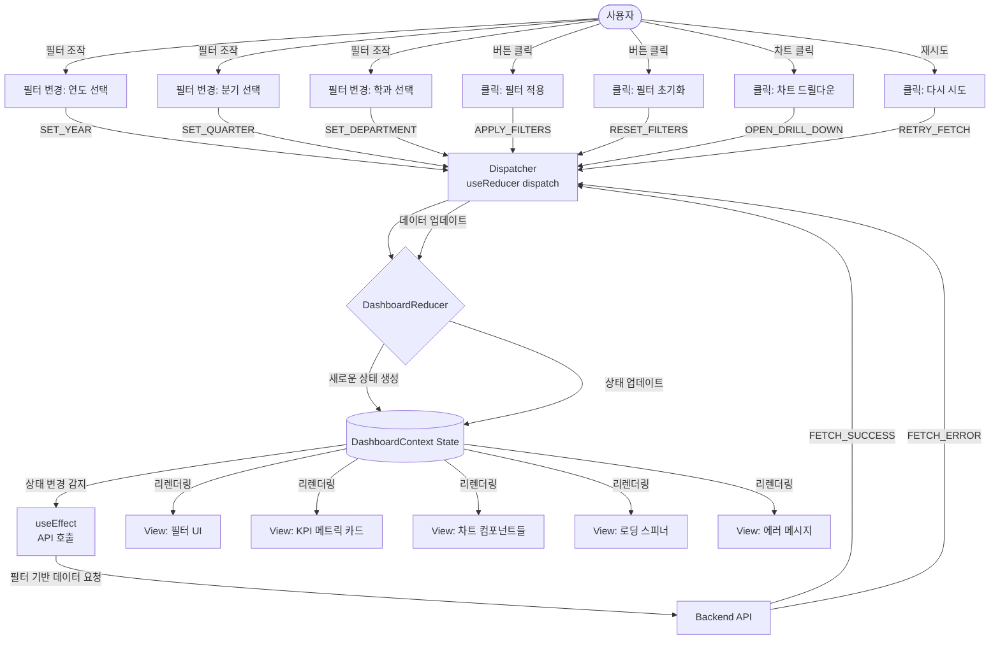
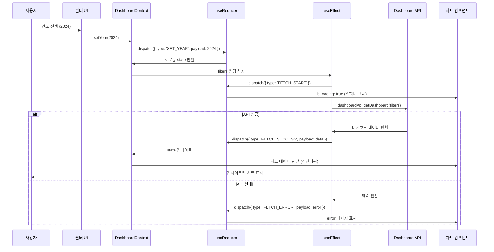

# 대시보드 페이지 상태관리 설계

## 1. 상태 필요성 판단

대시보드 페이지는 **Context + useReducer를 사용한 복잡한 상태관리가 필요**합니다.

### 이유
1. **복잡한 데이터 구조**: 여러 차트, 필터, 메트릭 데이터를 동시에 관리
2. **다중 API 호출**: 대시보드 데이터, 필터 옵션, 차트 데이터 등 여러 API 동시 관리
3. **필터 상태 공유**: 연도, 학과, 분기 등 필터가 모든 차트에 영향
4. **하위 컴포넌트 많음**: MetricCard, BarChart, LineChart, PieChart 등 다수의 자식 컴포넌트
5. **상태 간 의존성**: 필터 변경 시 모든 차트 데이터 재조회 필요

## 2. 관리할 데이터 분류

### 2.1 상태 데이터 (State)

#### 2.1.1 필터 상태 (filters)
| 상태명 | 타입 | 초기값 | 설명 |
|--------|------|--------|------|
| selectedYear | number | 2024 | 선택된 연도 |
| selectedQuarter | string \| null | null | 선택된 분기 (Q1, Q2, Q3, Q4, null=전체) |
| selectedDepartment | string \| null | null | 선택된 학과 (null=전체) |
| selectedCollege | string \| null | null | 선택된 단과대학 (null=전체) |

#### 2.1.2 데이터 상태 (data)
| 상태명 | 타입 | 초기값 | 설명 |
|--------|------|--------|------|
| metrics | MetricData \| null | null | KPI 메트릭 카드 데이터 |
| performanceChart | ChartData \| null | null | 실적 추세 차트 데이터 |
| paperChart | ChartData \| null | null | 논문 분포 차트 데이터 |
| budgetChart | ChartData \| null | null | 예산 비율 파이 차트 데이터 |
| studentChart | ChartData \| null | null | 학생 수 막대 차트 데이터 |

#### 2.1.3 UI 상태 (ui)
| 상태명 | 타입 | 초기값 | 설명 |
|--------|------|--------|------|
| isLoading | boolean | false | 전체 데이터 로딩 상태 |
| error | string \| null | null | 전역 에러 메시지 |
| chartLoading | Record<string, boolean> | {} | 차트별 개별 로딩 상태 |
| lastUpdated | Date \| null | null | 마지막 데이터 업데이트 시간 |

#### 2.1.4 메타데이터 (metadata)
| 상태명 | 타입 | 초기값 | 설명 |
|--------|------|--------|------|
| availableYears | number[] | [] | 선택 가능한 연도 목록 |
| availableDepartments | string[] | [] | 선택 가능한 학과 목록 |
| availableColleges | string[] | [] | 선택 가능한 단과대학 목록 |

### 2.2 화면상에 보이지만 상태가 아닌 것
- **정적 UI 요소**: 페이지 제목, 섹션 헤더, 아이콘
- **레이블**: "연도 선택", "필터", "주요 지표" 등의 텍스트
- **레이아웃 구조**: 그리드 레이아웃, 카드 컨테이너
- **스타일**: 색상, 폰트, 간격 등

### 2.3 파생 데이터 (계산 가능한 값)
- **hasData**: `metrics !== null && performanceChart !== null`
- **isEmpty**: `metrics === null && error === null && !isLoading`
- **isFiltered**: `selectedQuarter !== null || selectedDepartment !== null`
- **filterCount**: `[selectedQuarter, selectedDepartment].filter(Boolean).length`

## 3. 상태 변경 조건 및 화면 반영

| 상태 | 변경 조건 | 화면 변경 사항 |
|------|-----------|----------------|
| **selectedYear** | 연도 드롭다운 선택 | URL 쿼리 스트링 업데이트, 모든 차트 데이터 재조회 |
| **selectedQuarter** | 분기 버튼 클릭 | URL 쿼리 스트링 업데이트, 모든 차트 데이터 재조회 |
| **selectedDepartment** | 학과 드롭다운 선택 | URL 쿼리 스트링 업데이트, 학과별 차트만 재조회 |
| **isLoading** | true: API 요청 시작<br/>false: API 응답 수신 | 전체 로딩 스피너 표시/숨김, 차트 영역 반투명 처리 |
| **metrics** | API 응답으로 데이터 수신 | KPI 메트릭 카드 4개에 데이터 표시 (실적, 논문, 학생, 예산) |
| **performanceChart** | API 응답으로 차트 데이터 수신 | 라인 차트 렌더링 (애니메이션 효과) |
| **paperChart** | API 응답으로 차트 데이터 수신 | 막대 차트 렌더링 (애니메이션 효과) |
| **budgetChart** | API 응답으로 차트 데이터 수신 | 파이 차트 렌더링 (애니메이션 효과) |
| **studentChart** | API 응답으로 차트 데이터 수신 | 막대 차트 렌더링 (애니메이션 효과) |
| **error** | API 오류 발생 시 메시지 설정 | 에러 메시지 배너 표시, [다시 시도] 버튼 표시 |
| **chartLoading** | 개별 차트 API 요청 시작/완료 | 해당 차트 영역에 스켈레톤 UI 또는 스피너 표시 |
| **lastUpdated** | 데이터 로드 성공 시 현재 시간 저장 | "마지막 업데이트: 2024-11-02 10:30" 표시 |

## 4. Flux 패턴 흐름도 (Mermaid)



## 5. Context + useReducer 상태관리 설계

### 5.1 상태 구조 (TypeScript Interface)

```typescript
// 필터 타입
interface DashboardFilters {
  selectedYear: number;
  selectedQuarter: string | null;
  selectedDepartment: string | null;
  selectedCollege: string | null;
}

// 메트릭 데이터 타입
interface MetricData {
  performance: {
    total: number;
    change: number; // 전년 대비 증감률 (%)
    trend: 'up' | 'down' | 'neutral';
  };
  papers: {
    total: number;
    change: number;
    trend: 'up' | 'down' | 'neutral';
  };
  students: {
    total: number;
    change: number;
    trend: 'up' | 'down' | 'neutral';
  };
  budget: {
    total: number;
    change: number;
    trend: 'up' | 'down' | 'neutral';
  };
}

// 차트 데이터 타입 (Recharts 호환)
interface ChartData {
  data: any[]; // Recharts 형식 데이터
  labels: string[];
  colors?: string[];
}

// UI 상태 타입
interface DashboardUI {
  isLoading: boolean;
  error: string | null;
  chartLoading: Record<string, boolean>;
  lastUpdated: Date | null;
}

// 메타데이터 타입
interface DashboardMetadata {
  availableYears: number[];
  availableDepartments: string[];
  availableColleges: string[];
}

// 전체 상태 타입
interface DashboardState {
  filters: DashboardFilters;
  data: {
    metrics: MetricData | null;
    performanceChart: ChartData | null;
    paperChart: ChartData | null;
    budgetChart: ChartData | null;
    studentChart: ChartData | null;
  };
  ui: DashboardUI;
  metadata: DashboardMetadata;
}
```

### 5.2 액션 타입 정의

```typescript
// 액션 타입 열거
type DashboardActionType =
  // 필터 액션
  | 'SET_YEAR'
  | 'SET_QUARTER'
  | 'SET_DEPARTMENT'
  | 'SET_COLLEGE'
  | 'APPLY_FILTERS'
  | 'RESET_FILTERS'
  // 데이터 로딩 액션
  | 'FETCH_START'
  | 'FETCH_SUCCESS'
  | 'FETCH_ERROR'
  | 'FETCH_CHART_START'
  | 'FETCH_CHART_SUCCESS'
  | 'FETCH_CHART_ERROR'
  // UI 액션
  | 'SET_LOADING'
  | 'CLEAR_ERROR'
  | 'UPDATE_LAST_UPDATED'
  // 메타데이터 액션
  | 'SET_METADATA';

// 액션 인터페이스
interface DashboardAction {
  type: DashboardActionType;
  payload?: any;
}
```

### 5.3 Reducer 함수 설계

```typescript
const dashboardReducer = (
  state: DashboardState,
  action: DashboardAction
): DashboardState => {
  switch (action.type) {
    // 필터 변경
    case 'SET_YEAR':
      return {
        ...state,
        filters: { ...state.filters, selectedYear: action.payload },
      };

    case 'SET_QUARTER':
      return {
        ...state,
        filters: { ...state.filters, selectedQuarter: action.payload },
      };

    case 'SET_DEPARTMENT':
      return {
        ...state,
        filters: { ...state.filters, selectedDepartment: action.payload },
      };

    case 'SET_COLLEGE':
      return {
        ...state,
        filters: { ...state.filters, selectedCollege: action.payload },
      };

    case 'RESET_FILTERS':
      return {
        ...state,
        filters: {
          selectedYear: new Date().getFullYear(),
          selectedQuarter: null,
          selectedDepartment: null,
          selectedCollege: null,
        },
      };

    // 데이터 로딩
    case 'FETCH_START':
      return {
        ...state,
        ui: { ...state.ui, isLoading: true, error: null },
      };

    case 'FETCH_SUCCESS':
      return {
        ...state,
        data: action.payload.data,
        ui: {
          ...state.ui,
          isLoading: false,
          lastUpdated: new Date(),
        },
      };

    case 'FETCH_ERROR':
      return {
        ...state,
        ui: {
          ...state.ui,
          isLoading: false,
          error: action.payload.error,
        },
      };

    case 'FETCH_CHART_START':
      return {
        ...state,
        ui: {
          ...state.ui,
          chartLoading: {
            ...state.ui.chartLoading,
            [action.payload.chartName]: true,
          },
        },
      };

    case 'FETCH_CHART_SUCCESS':
      return {
        ...state,
        data: {
          ...state.data,
          [action.payload.chartName]: action.payload.data,
        },
        ui: {
          ...state.ui,
          chartLoading: {
            ...state.ui.chartLoading,
            [action.payload.chartName]: false,
          },
        },
      };

    // UI 상태
    case 'CLEAR_ERROR':
      return {
        ...state,
        ui: { ...state.ui, error: null },
      };

    // 메타데이터
    case 'SET_METADATA':
      return {
        ...state,
        metadata: action.payload,
      };

    default:
      return state;
  }
};
```

### 5.4 초기 상태

```typescript
const initialDashboardState: DashboardState = {
  filters: {
    selectedYear: new Date().getFullYear(),
    selectedQuarter: null,
    selectedDepartment: null,
    selectedCollege: null,
  },
  data: {
    metrics: null,
    performanceChart: null,
    paperChart: null,
    budgetChart: null,
    studentChart: null,
  },
  ui: {
    isLoading: false,
    error: null,
    chartLoading: {},
    lastUpdated: null,
  },
  metadata: {
    availableYears: [],
    availableDepartments: [],
    availableColleges: [],
  },
};
```

### 5.5 Context 생성

```typescript
interface DashboardContextValue {
  state: DashboardState;
  dispatch: React.Dispatch<DashboardAction>;
  // 헬퍼 함수들
  setYear: (year: number) => void;
  setQuarter: (quarter: string | null) => void;
  setDepartment: (department: string | null) => void;
  setCollege: (college: string | null) => void;
  applyFilters: () => void;
  resetFilters: () => void;
  refreshData: () => Promise<void>;
}

const DashboardContext = createContext<DashboardContextValue | undefined>(
  undefined
);
```

## 6. Context Provider 구현 설계

### 6.1 데이터 로딩 흐름



### 6.2 Provider 컴포넌트 구조

```typescript
// frontend/src/application/contexts/DashboardContext.tsx

const DashboardProvider: React.FC<{ children: React.ReactNode }> = ({
  children,
}) => {
  // Reducer 초기화
  const [state, dispatch] = useReducer(dashboardReducer, initialDashboardState);

  // API 서비스
  const dashboardApi = useMemo(() => new DashboardApiService(), []);

  // 필터 변경 시 데이터 재조회
  useEffect(() => {
    const fetchDashboardData = async () => {
      dispatch({ type: 'FETCH_START' });
      try {
        const data = await dashboardApi.getDashboard(state.filters);
        dispatch({ type: 'FETCH_SUCCESS', payload: { data } });
      } catch (error) {
        dispatch({
          type: 'FETCH_ERROR',
          payload: { error: error.message },
        });
      }
    };

    fetchDashboardData();
  }, [state.filters, dashboardApi]);

  // 메타데이터 초기 로딩
  useEffect(() => {
    const fetchMetadata = async () => {
      const metadata = await dashboardApi.getMetadata();
      dispatch({ type: 'SET_METADATA', payload: metadata });
    };

    fetchMetadata();
  }, [dashboardApi]);

  // 헬퍼 함수들
  const setYear = useCallback((year: number) => {
    dispatch({ type: 'SET_YEAR', payload: year });
  }, []);

  const setQuarter = useCallback((quarter: string | null) => {
    dispatch({ type: 'SET_QUARTER', payload: quarter });
  }, []);

  const setDepartment = useCallback((department: string | null) => {
    dispatch({ type: 'SET_DEPARTMENT', payload: department });
  }, []);

  const setCollege = useCallback((college: string | null) => {
    dispatch({ type: 'SET_COLLEGE', payload: college });
  }, []);

  const resetFilters = useCallback(() => {
    dispatch({ type: 'RESET_FILTERS' });
  }, []);

  const refreshData = useCallback(async () => {
    dispatch({ type: 'FETCH_START' });
    try {
      const data = await dashboardApi.getDashboard(state.filters);
      dispatch({ type: 'FETCH_SUCCESS', payload: { data } });
    } catch (error) {
      dispatch({
        type: 'FETCH_ERROR',
        payload: { error: error.message },
      });
    }
  }, [state.filters, dashboardApi]);

  const value: DashboardContextValue = {
    state,
    dispatch,
    setYear,
    setQuarter,
    setDepartment,
    setCollege,
    resetFilters,
    refreshData,
  };

  return (
    <DashboardContext.Provider value={value}>
      {children}
    </DashboardContext.Provider>
  );
};
```

### 6.3 Custom Hook 설계

```typescript
// frontend/src/application/hooks/useDashboard.ts

const useDashboard = () => {
  const context = useContext(DashboardContext);

  if (!context) {
    throw new Error('useDashboard must be used within DashboardProvider');
  }

  return context;
};

// 필터 전용 훅 (필터 UI 컴포넌트용)
const useDashboardFilters = () => {
  const { state, setYear, setQuarter, setDepartment, setCollege, resetFilters } =
    useDashboard();

  return {
    filters: state.filters,
    metadata: state.metadata,
    setYear,
    setQuarter,
    setDepartment,
    setCollege,
    resetFilters,
  };
};

// 차트 데이터 전용 훅 (차트 컴포넌트용)
const useDashboardChart = (chartName: keyof DashboardState['data']) => {
  const { state } = useDashboard();

  return {
    data: state.data[chartName],
    isLoading: state.ui.chartLoading[chartName] || state.ui.isLoading,
    error: state.ui.error,
  };
};

// 메트릭 전용 훅 (KPI 카드 컴포넌트용)
const useDashboardMetrics = () => {
  const { state } = useDashboard();

  return {
    metrics: state.data.metrics,
    isLoading: state.ui.isLoading,
    error: state.ui.error,
    lastUpdated: state.ui.lastUpdated,
  };
};
```

## 7. 하위 컴포넌트에 노출할 변수 및 함수

### 7.1 필터 컴포넌트 (DashboardFilters.tsx)

#### 노출 변수
- `filters: DashboardFilters` - 현재 필터 상태
- `metadata.availableYears: number[]` - 선택 가능한 연도 목록
- `metadata.availableDepartments: string[]` - 선택 가능한 학과 목록
- `metadata.availableColleges: string[]` - 선택 가능한 단과대학 목록

#### 노출 함수
- `setYear: (year: number) => void` - 연도 변경
- `setQuarter: (quarter: string | null) => void` - 분기 변경
- `setDepartment: (department: string | null) => void` - 학과 변경
- `setCollege: (college: string | null) => void` - 단과대학 변경
- `resetFilters: () => void` - 필터 초기화

### 7.2 메트릭 카드 컴포넌트 (MetricCard.tsx)

#### 노출 변수
- `metrics: MetricData | null` - KPI 메트릭 데이터
- `isLoading: boolean` - 로딩 상태
- `error: string | null` - 에러 메시지
- `lastUpdated: Date | null` - 마지막 업데이트 시간

### 7.3 차트 컴포넌트들 (PerformanceChart.tsx, PaperChart.tsx 등)

#### 노출 변수
- `data: ChartData | null` - 해당 차트의 데이터
- `isLoading: boolean` - 해당 차트의 로딩 상태
- `error: string | null` - 에러 메시지

### 7.4 대시보드 페이지 (DashboardPage.tsx)

#### 노출 변수
- `state: DashboardState` - 전체 상태 (디버깅용)
- `isLoading: boolean` - 전체 로딩 상태
- `error: string | null` - 전역 에러 메시지

#### 노출 함수
- `refreshData: () => Promise<void>` - 데이터 새로고침

## 8. 컴포넌트 트리 구조

```
DashboardProvider (Context)
│
└── DashboardPage
    ├── DashboardFilters (useDashboardFilters)
    │   ├── YearSelect
    │   ├── QuarterButtons
    │   ├── DepartmentSelect
    │   └── ResetButton
    │
    ├── MetricCards (useDashboardMetrics)
    │   ├── PerformanceMetricCard
    │   ├── PaperMetricCard
    │   ├── StudentMetricCard
    │   └── BudgetMetricCard
    │
    ├── ChartsSection
    │   ├── PerformanceLineChart (useDashboardChart('performanceChart'))
    │   ├── PaperBarChart (useDashboardChart('paperChart'))
    │   ├── BudgetPieChart (useDashboardChart('budgetChart'))
    │   └── StudentBarChart (useDashboardChart('studentChart'))
    │
    └── ErrorBanner (state.ui.error)
```

## 9. 주요 액션 흐름

### 9.1 초기 로딩
```
DashboardPage 마운트
→ DashboardProvider 초기화
→ useEffect (메타데이터 로딩)
→ dispatch({ type: 'SET_METADATA', payload: metadata })
→ useEffect (필터 기반 데이터 로딩)
→ dispatch({ type: 'FETCH_START' })
→ API 호출
→ dispatch({ type: 'FETCH_SUCCESS', payload: data })
→ 모든 하위 컴포넌트 리렌더링 (데이터 표시)
```

### 9.2 필터 변경
```
사용자가 연도 선택 (2024 → 2023)
→ setYear(2023) 호출
→ dispatch({ type: 'SET_YEAR', payload: 2023 })
→ Reducer가 state.filters.selectedYear 업데이트
→ useEffect가 filters 변경 감지
→ dispatch({ type: 'FETCH_START' })
→ API 재호출 (새로운 필터로)
→ dispatch({ type: 'FETCH_SUCCESS', payload: newData })
→ 차트들 리렌더링 (애니메이션 효과)
```

### 9.3 개별 차트 재조회 (드릴다운)
```
사용자가 파이 차트의 "인건비" 클릭
→ 드릴다운 모달 표시 (별도 상태)
→ dispatch({ type: 'FETCH_CHART_START', payload: { chartName: 'budgetDetail' } })
→ API 호출 (세부 데이터)
→ dispatch({ type: 'FETCH_CHART_SUCCESS', payload: { chartName: 'budgetDetail', data } })
→ 모달 내 차트 렌더링
```

### 9.4 에러 처리
```
API 호출 실패
→ catch 블록에서 에러 캐치
→ dispatch({ type: 'FETCH_ERROR', payload: { error: error.message } })
→ state.ui.error에 메시지 저장
→ ErrorBanner 컴포넌트 표시
→ 사용자가 [다시 시도] 클릭
→ refreshData() 호출
→ 처음부터 다시 로딩
```

## 10. 성능 최적화 전략

### 10.1 메모이제이션
- **useMemo**: 차트 데이터 변환 (API 데이터 → Recharts 형식)
- **useCallback**: 헬퍼 함수들 (setYear, setQuarter 등)
- **React.memo**: 차트 컴포넌트들 (데이터 변경 시에만 리렌더링)

### 10.2 지연 로딩
- 차트 라이브러리 (Recharts)를 동적 임포트 (`React.lazy`)
- 대용량 데이터는 페이지네이션 또는 가상 스크롤

### 10.3 캐싱
- 동일한 필터 조합에 대해 5분간 캐싱 (선택 사항)
- React Query 또는 SWR 사용 고려

## 11. 파일 구조

```
frontend/src/
├── application/
│   ├── contexts/
│   │   └── DashboardContext.tsx (Provider, Context, Reducer)
│   │
│   └── hooks/
│       ├── useDashboard.ts (메인 훅)
│       ├── useDashboardFilters.ts (필터 전용 훅)
│       ├── useDashboardChart.ts (차트 전용 훅)
│       └── useDashboardMetrics.ts (메트릭 전용 훅)
│
├── presentation/
│   ├── pages/
│   │   └── DashboardPage.tsx (DashboardProvider로 감싸진 페이지)
│   │
│   └── components/
│       ├── dashboard/
│       │   ├── DashboardFilters.tsx
│       │   ├── MetricCard.tsx
│       │   ├── PerformanceChart.tsx
│       │   ├── PaperChart.tsx
│       │   ├── BudgetChart.tsx
│       │   └── StudentChart.tsx
│       │
│       └── common/
│           ├── Loading.tsx
│           └── ErrorBanner.tsx
│
├── domain/
│   └── models/
│       └── Dashboard.ts (TypeScript 인터페이스 정의)
│
└── services/
    └── api/
        └── dashboardApi.ts (API 호출 서비스)
```

## 12. 결론

대시보드 페이지는 **Context + useReducer를 사용한 복잡한 상태관리가 필수**입니다.

### 핵심 이유
1. **다중 데이터 소스**: 메트릭, 4개 이상의 차트 데이터 동시 관리
2. **필터 공유**: 모든 하위 컴포넌트가 동일한 필터 상태 공유
3. **복잡한 상태 전환**: 로딩, 에러, 성공 등 여러 상태 간 전환
4. **하위 컴포넌트 많음**: Prop drilling 방지 필요

### 구현 우선순위
1. **DashboardContext 및 Reducer 구현** (최우선)
2. **API 연동 및 useEffect 훅** (데이터 로딩)
3. **하위 컴포넌트에 Custom Hook 제공** (useDashboardFilters, useDashboardChart 등)
4. **에러 처리 및 로딩 상태 UI** (사용자 경험)
5. **성능 최적화** (메모이제이션, 지연 로딩)

---

**문서 버전**: v1.0.0
**작성일**: 2025년 11월 2일
**상태**: 최종 (Context + useReducer 필수)
