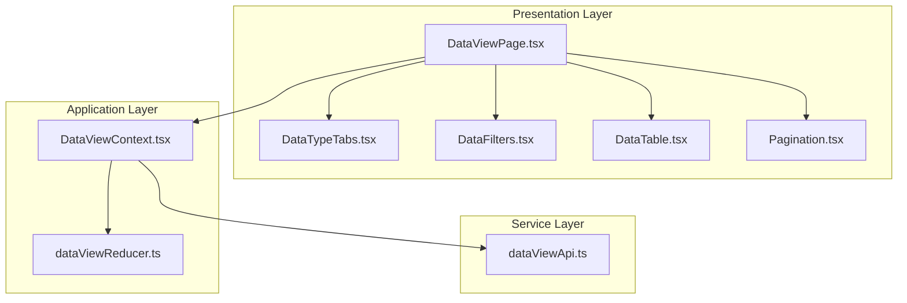
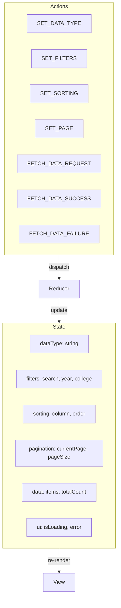

# 데이터 조회 페이지 구현 계획

## 문서 정보
- **버전**: v1.0.0
- **작성일**: 2025년 11월 2일
- **상태**: 최종
- **관련 문서**:
  - `/docs/prd.md` (v1.1.0)
  - `/docs/usecases/004/spec.md` (UC-004: 데이터 조회)
  - `/docs/pages/data-view/state.md`
  - `/docs/rules/tdd.md`

---

## 1. 개요

### 1.1 목적
사용자가 4가지 데이터 유형(학과 KPI, 논문, 연구 과제, 학생)의 원본 데이터를 테이블 형식으로 조회하고 필터링, 정렬, 페이지네이션을 수행할 수 있는 페이지를 구현합니다.

### 1.2 주요 기능
- 데이터 유형 선택 (4가지 탭)
- 필터링 (검색어, 연도, 학과 등)
- 정렬 (컬럼별 오름차순/내림차순)
- 페이지네이션 (페이지 크기: 10, 25, 50, 100)
- 데이터 테이블 렌더링
- 로딩 및 에러 상태
- CSV 다운로드 (옵션)

### 1.3 상태 관리 방식
- **Context + useReducer**: 복잡한 필터, 정렬, 페이지네이션 상태 관리 필요

### 1.4 구현 모듈 목록

| 모듈명 | 위치 | 설명 |
|--------|------|------|
| **DataViewPage** | `frontend/src/presentation/pages/DataViewPage.tsx` | 데이터 조회 메인 페이지 |
| **DataViewContext** | `frontend/src/application/contexts/DataViewContext.tsx` | 데이터 조회 상태 관리 |
| **dataViewReducer** | `frontend/src/application/contexts/dataViewReducer.ts` | 데이터 조회 Reducer |
| **DataTypeTabs** | `frontend/src/presentation/components/data-view/DataTypeTabs.tsx` | 데이터 유형 탭 |
| **DataFilters** | `frontend/src/presentation/components/data-view/DataFilters.tsx` | 필터 UI |
| **DataTable** | `frontend/src/presentation/components/data-view/DataTable.tsx` | 데이터 테이블 |
| **Pagination** | `frontend/src/presentation/components/common/Pagination.tsx` | 페이지네이션 |
| **dataViewApi** | `frontend/src/services/api/dataViewApi.ts` | 데이터 조회 API |

---

## 2. 아키텍처 다이어그램

### 2.1 모듈 관계도



### 2.2 상태 관리 구조



---

## 3. 구현 계획 (TDD 기반)

### 3.1 구현 순서

#### 단계 1: DataView Reducer (Application Layer)

##### RED: 테스트 작성
```typescript
// frontend/src/application/contexts/__tests__/dataViewReducer.test.ts
describe('dataViewReducer', () => {
  it('SET_DATA_TYPE 액션 시 데이터 유형을 변경해야 함', () => {
    const state = dataViewReducer(initialState, {
      type: 'SET_DATA_TYPE',
      payload: 'publication',
    });
    expect(state.dataType).toBe('publication');
  });

  it('SET_FILTERS 액션 시 필터를 업데이트해야 함', () => {
    const state = dataViewReducer(initialState, {
      type: 'SET_FILTERS',
      payload: { search: '컴퓨터' },
    });
    expect(state.filters.search).toBe('컴퓨터');
  });

  it('SET_SORTING 액션 시 정렬을 업데이트해야 함', () => {
    const state = dataViewReducer(initialState, {
      type: 'SET_SORTING',
      payload: { column: 'name', order: 'asc' },
    });
    expect(state.sorting.column).toBe('name');
    expect(state.sorting.order).toBe('asc');
  });

  it('SET_PAGE 액션 시 페이지를 변경해야 함', () => {
    const state = dataViewReducer(initialState, {
      type: 'SET_PAGE',
      payload: 2,
    });
    expect(state.pagination.currentPage).toBe(2);
  });

  it('FETCH_DATA_SUCCESS 액션 시 데이터를 설정해야 함', () => {
    const mockData = { items: [{ id: 1 }], totalCount: 100 };
    const state = dataViewReducer(initialState, {
      type: 'FETCH_DATA_SUCCESS',
      payload: mockData,
    });
    expect(state.data).toEqual(mockData);
    expect(state.ui.isLoading).toBe(false);
  });
});
```

**실행**: `npm test dataViewReducer.test.ts` → **실패/통과 확인**

##### GREEN: 구현
```typescript
// frontend/src/application/contexts/dataViewReducer.ts
export interface DataViewState {
  dataType: string;
  filters: {
    search: string;
    year: number | null;
    college: string;
  };
  sorting: {
    column: string;
    order: 'asc' | 'desc';
  };
  pagination: {
    currentPage: number;
    pageSize: number;
  };
  data: {
    items: any[];
    totalCount: number;
  };
  ui: {
    isLoading: boolean;
    error: string | null;
  };
}

export const initialState: DataViewState = {
  dataType: 'department_kpi',
  filters: { search: '', year: null, college: 'all' },
  sorting: { column: '', order: 'asc' },
  pagination: { currentPage: 1, pageSize: 25 },
  data: { items: [], totalCount: 0 },
  ui: { isLoading: false, error: null },
};

export type DataViewAction =
  | { type: 'SET_DATA_TYPE'; payload: string }
  | { type: 'SET_FILTERS'; payload: Partial<DataViewState['filters']> }
  | { type: 'SET_SORTING'; payload: { column: string; order: 'asc' | 'desc' } }
  | { type: 'SET_PAGE'; payload: number }
  | { type: 'SET_PAGE_SIZE'; payload: number }
  | { type: 'FETCH_DATA_REQUEST' }
  | { type: 'FETCH_DATA_SUCCESS'; payload: { items: any[]; totalCount: number } }
  | { type: 'FETCH_DATA_FAILURE'; payload: string };

export const dataViewReducer = (state: DataViewState, action: DataViewAction): DataViewState => {
  switch (action.type) {
    case 'SET_DATA_TYPE':
      return { ...state, dataType: action.payload, pagination: { ...state.pagination, currentPage: 1 } };

    case 'SET_FILTERS':
      return { ...state, filters: { ...state.filters, ...action.payload }, pagination: { ...state.pagination, currentPage: 1 } };

    case 'SET_SORTING':
      return { ...state, sorting: action.payload };

    case 'SET_PAGE':
      return { ...state, pagination: { ...state.pagination, currentPage: action.payload } };

    case 'SET_PAGE_SIZE':
      return { ...state, pagination: { currentPage: 1, pageSize: action.payload } };

    case 'FETCH_DATA_REQUEST':
      return { ...state, ui: { isLoading: true, error: null } };

    case 'FETCH_DATA_SUCCESS':
      return { ...state, data: action.payload, ui: { isLoading: false, error: null } };

    case 'FETCH_DATA_FAILURE':
      return { ...state, ui: { isLoading: false, error: action.payload } };

    default:
      return state;
  }
};
```

---

#### 단계 2-6: API, Context, UI 컴포넌트

**구현 순서**:
1. **dataViewApi** - 데이터 조회 API (TDD)
2. **DataViewContext** - Context 통합 테스트
3. **DataTypeTabs** - 탭 UI (QA Sheet)
4. **DataFilters** - 필터 UI (QA Sheet)
5. **DataTable** - 테이블 UI (QA Sheet)
6. **Pagination** - 페이지네이션 (QA Sheet)
7. **DataViewPage** - 메인 페이지 통합
8. **E2E 테스트** - 데이터 조회 시나리오

---

## 4. 파일 구조

```
frontend/src/
├── presentation/
│   ├── pages/
│   │   └── DataViewPage.tsx
│   └── components/
│       ├── data-view/
│       │   ├── DataTypeTabs.tsx
│       │   ├── DataFilters.tsx
│       │   └── DataTable.tsx
│       └── common/
│           └── Pagination.tsx
│
├── application/
│   └── contexts/
│       ├── DataViewContext.tsx
│       └── dataViewReducer.ts
│
└── services/
    └── api/
        └── dataViewApi.ts
```

---

## 5. 구현 우선순위

| 단계 | 예상 시간 |
|------|-----------|
| Phase 1: Reducer + API | 12시간 |
| Phase 2: Context | 6시간 |
| Phase 3: UI 컴포넌트 | 18시간 |
| Phase 4: 메인 페이지 | 6시간 |
| Phase 5: E2E 테스트 | 4시간 |
| **총합** | **46시간 (약 9일)** |

---

## 6. 테스트 체크리스트

- [ ] dataViewReducer (10개 테스트)
- [ ] dataViewApi (5개 테스트)
- [ ] DataViewContext (6개 테스트)
- [ ] UI 컴포넌트 QA Sheet (20개 항목)
- [ ] E2E 테스트 (3개 시나리오)

---

**문서 작성 완료**
**다음 단계**: 프로필 페이지 구현 계획 작성
