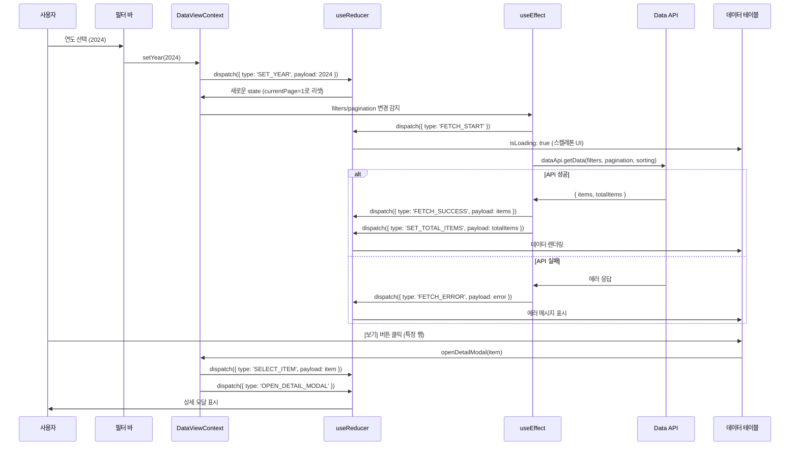

# 데이터 조회 페이지 상태관리 설계

## 1. 상태 필요성 판단

데이터 조회 페이지는 **Context + useReducer를 사용한 복잡한 상태관리가 필요**합니다.

### 이유
1. **다양한 필터 조합**: 데이터 유형, 연도, 학과, 검색어 등 여러 필터
2. **페이지네이션**: 대용량 데이터에 대한 페이지 관리
3. **정렬 기능**: 컬럼별 오름차순/내림차순 정렬
4. **다중 데이터 소스**: 4가지 CSV 타입 (학과KPI, 논문, 연구과제, 학생)
5. **하위 컴포넌트 많음**: 필터 바, 데이터 테이블, 페이지네이션, 상세 모달 등

## 2. 관리할 데이터 분류

### 2.1 상태 데이터 (State)

#### 2.1.1 필터 상태 (filters)
| 상태명 | 타입 | 초기값 | 설명 |
|--------|------|--------|------|
| dataType | DataType | 'department_kpi' | 조회할 데이터 유형 |
| year | number \| null | null | 연도 필터 (null=전체) |
| department | string \| null | null | 학과 필터 (null=전체) |
| college | string \| null | null | 단과대학 필터 (null=전체) |
| searchQuery | string | "" | 검색어 |
| status | string \| null | null | 상태 필터 (재학/휴학/졸업 등) |

#### 2.1.2 페이지네이션 상태 (pagination)
| 상태명 | 타입 | 초기값 | 설명 |
|--------|------|--------|------|
| currentPage | number | 1 | 현재 페이지 번호 |
| pageSize | number | 20 | 페이지당 항목 수 |
| totalItems | number | 0 | 전체 항목 수 |
| totalPages | number | 0 | 전체 페이지 수 |

#### 2.1.3 정렬 상태 (sorting)
| 상태명 | 타입 | 초기값 | 설명 |
|--------|------|--------|------|
| sortBy | string \| null | null | 정렬 기준 컬럼 |
| sortOrder | 'asc' \| 'desc' | 'desc' | 정렬 방향 |

#### 2.1.4 데이터 상태 (data)
| 상태명 | 타입 | 초기값 | 설명 |
|--------|------|--------|------|
| items | any[] | [] | 현재 페이지의 데이터 목록 |
| selectedItem | any \| null | null | 상세 보기 선택 항목 |

#### 2.1.5 UI 상태 (ui)
| 상태명 | 타입 | 초기값 | 설명 |
|--------|------|--------|------|
| isLoading | boolean | false | 데이터 로딩 중 여부 |
| error | string \| null | null | 에러 메시지 |
| showDetailModal | boolean | false | 상세 보기 모달 표시 여부 |
| showExportDialog | boolean | false | CSV 내보내기 다이얼로그 표시 여부 |

#### 2.1.6 메타데이터 (metadata)
| 상태명 | 타입 | 초기값 | 설명 |
|--------|------|--------|------|
| availableYears | number[] | [] | 선택 가능한 연도 목록 |
| availableDepartments | string[] | [] | 선택 가능한 학과 목록 |
| availableColleges | string[] | [] | 선택 가능한 단과대학 목록 |
| columns | ColumnDef[] | [] | 데이터 유형별 컬럼 정의 |

### 2.2 화면상에 보이지만 상태가 아닌 것
- **정적 UI 요소**: 페이지 제목, 탭 레이블, 아이콘
- **테이블 헤더 레이블**: "날짜", "유형", "항목", "금액" 등
- **버튼 텍스트**: "검색", "초기화", "CSV 다운로드" 등
- **안내 문구**: "총 245건", "페이지 1/10" 등 (파생 데이터)

### 2.3 파생 데이터 (계산 가능한 값)
- **hasData**: `items.length > 0`
- **isEmpty**: `items.length === 0 && !isLoading && !error`
- **isFiltered**: `year !== null || department !== null || searchQuery !== ""`
- **filterCount**: 적용된 필터 개수
- **pageRange**: `{ start: (currentPage - 1) * pageSize + 1, end: currentPage * pageSize }`

## 3. 상태 변경 조건 및 화면 반영

| 상태 | 변경 조건 | 화면 변경 사항 |
|------|-----------|----------------|
| **dataType** | 탭 클릭 (학과KPI, 논문, 연구과제, 학생) | URL 업데이트, 테이블 컬럼 변경, 데이터 재조회 |
| **year** | 연도 드롭다운 선택 | URL 업데이트, 데이터 재조회 |
| **searchQuery** | 검색 입력 필드에서 엔터 또는 [검색] 클릭 | URL 업데이트, 데이터 재조회, currentPage=1로 리셋 |
| **currentPage** | 페이지 번호 클릭 또는 이전/다음 버튼 | URL 업데이트, 데이터 재조회 |
| **pageSize** | 페이지 크기 드롭다운 선택 (20, 50, 100) | currentPage=1로 리셋, 데이터 재조회 |
| **sortBy, sortOrder** | 테이블 헤더 클릭 | 정렬 아이콘 변경 (↑↓), 데이터 재조회 |
| **items** | API 응답 수신 | 테이블 행 렌더링 (애니메이션) |
| **isLoading** | true: API 요청 시작<br/>false: API 응답 수신 | true: 스켈레톤 UI 표시<br/>false: 데이터 표시 |
| **selectedItem** | 테이블 행의 [보기] 버튼 클릭 | 상세 보기 모달 표시 |
| **showDetailModal** | true: [보기] 클릭<br/>false: 모달 [닫기] 클릭 | 모달 표시/숨김 |
| **error** | API 오류 발생 | 에러 메시지 배너 표시 |

## 4. Flux 패턴 흐름도 (Mermaid)

```mermaid
flowchart TB
    %% User Actions
    User([사용자])

    %% Actions
    A1[탭 클릭: 데이터 유형 변경]
    A2[필터 변경: 연도/학과 선택]
    A3[입력: 검색어]
    A4[클릭: 테이블 헤더 정렬]
    A5[클릭: 페이지 번호]
    A6[클릭: 행 [보기] 버튼]
    A7[클릭: CSV 다운로드]
    A8[클릭: 필터 초기화]

    %% Dispatcher
    Dispatch[Dispatcher<br/>useReducer dispatch]

    %% Reducer
    Reducer{DataViewReducer}

    %% Store
    Store[(DataViewContext State)]

    %% Side Effects
    Effect[useEffect<br/>데이터 조회]

    %% API
    API[Backend Data API]

    %% Views
    V1[View: 데이터 유형 탭]
    V2[View: 필터 바]
    V3[View: 데이터 테이블]
    V4[View: 페이지네이션]
    V5[View: 상세 모달]
    V6[View: 로딩 스피너]

    %% Flow
    User -->|탭 클릭| A1
    User -->|필터 조작| A2
    User -->|검색어 입력| A3
    User -->|헤더 클릭| A4
    User -->|페이지 클릭| A5
    User -->|보기 클릭| A6
    User -->|다운로드 클릭| A7
    User -->|초기화 클릭| A8

    A1 -->|SET_DATA_TYPE| Dispatch
    A2 -->|SET_FILTER| Dispatch
    A3 -->|SET_SEARCH_QUERY| Dispatch
    A4 -->|SET_SORT| Dispatch
    A5 -->|SET_PAGE| Dispatch
    A6 -->|OPEN_DETAIL| Dispatch
    A7 -->|EXPORT_CSV| Dispatch
    A8 -->|RESET_FILTERS| Dispatch

    Dispatch --> Reducer
    Reducer -->|새로운 상태| Store

    Store -->|필터/페이지 변경 감지| Effect
    Store -->|리렌더링| V1
    Store -->|리렌더링| V2
    Store -->|리렌더링| V3
    Store -->|리렌더링| V4
    Store -->|리렌더링| V5
    Store -->|리렌더링| V6

    Effect -->|데이터 요청| API
    API -->|FETCH_SUCCESS| Dispatch
    API -->|FETCH_ERROR| Dispatch

    Dispatch -->|상태 업데이트| Reducer
    Reducer -->|데이터 반영| Store
```

## 5. Context + useReducer 상태관리 설계

### 5.1 상태 구조 (TypeScript Interface)

```typescript
// 데이터 유형 열거
type DataType = 'department_kpi' | 'publication_list' | 'research_project' | 'student_roster';

// 정렬 방향
type SortOrder = 'asc' | 'desc';

// 컬럼 정의
interface ColumnDef {
  key: string;
  label: string;
  sortable: boolean;
  width?: string;
}

// 필터 상태
interface DataViewFilters {
  dataType: DataType;
  year: number | null;
  department: string | null;
  college: string | null;
  searchQuery: string;
  status: string | null;
}

// 페이지네이션 상태
interface PaginationState {
  currentPage: number;
  pageSize: number;
  totalItems: number;
  totalPages: number;
}

// 정렬 상태
interface SortingState {
  sortBy: string | null;
  sortOrder: SortOrder;
}

// 데이터 상태
interface DataState {
  items: any[];
  selectedItem: any | null;
}

// UI 상태
interface UIState {
  isLoading: boolean;
  error: string | null;
  showDetailModal: boolean;
  showExportDialog: boolean;
}

// 메타데이터
interface MetadataState {
  availableYears: number[];
  availableDepartments: string[];
  availableColleges: string[];
  columns: ColumnDef[];
}

// 전체 상태
interface DataViewState {
  filters: DataViewFilters;
  pagination: PaginationState;
  sorting: SortingState;
  data: DataState;
  ui: UIState;
  metadata: MetadataState;
}
```

### 5.2 액션 타입 정의

```typescript
type DataViewActionType =
  // 필터 액션
  | 'SET_DATA_TYPE'
  | 'SET_YEAR'
  | 'SET_DEPARTMENT'
  | 'SET_COLLEGE'
  | 'SET_SEARCH_QUERY'
  | 'SET_STATUS'
  | 'RESET_FILTERS'
  // 페이지네이션 액션
  | 'SET_PAGE'
  | 'SET_PAGE_SIZE'
  | 'SET_TOTAL_ITEMS'
  // 정렬 액션
  | 'SET_SORT'
  | 'TOGGLE_SORT'
  // 데이터 액션
  | 'FETCH_START'
  | 'FETCH_SUCCESS'
  | 'FETCH_ERROR'
  | 'SELECT_ITEM'
  | 'DESELECT_ITEM'
  // UI 액션
  | 'OPEN_DETAIL_MODAL'
  | 'CLOSE_DETAIL_MODAL'
  | 'OPEN_EXPORT_DIALOG'
  | 'CLOSE_EXPORT_DIALOG'
  | 'CLEAR_ERROR'
  // 메타데이터 액션
  | 'SET_METADATA';

interface DataViewAction {
  type: DataViewActionType;
  payload?: any;
}
```

### 5.3 Reducer 함수 설계

```typescript
const dataViewReducer = (
  state: DataViewState,
  action: DataViewAction
): DataViewState => {
  switch (action.type) {
    // 필터 변경
    case 'SET_DATA_TYPE':
      return {
        ...state,
        filters: { ...state.filters, dataType: action.payload },
        pagination: { ...state.pagination, currentPage: 1 },
      };

    case 'SET_YEAR':
      return {
        ...state,
        filters: { ...state.filters, year: action.payload },
        pagination: { ...state.pagination, currentPage: 1 },
      };

    case 'SET_DEPARTMENT':
      return {
        ...state,
        filters: { ...state.filters, department: action.payload },
        pagination: { ...state.pagination, currentPage: 1 },
      };

    case 'SET_SEARCH_QUERY':
      return {
        ...state,
        filters: { ...state.filters, searchQuery: action.payload },
        pagination: { ...state.pagination, currentPage: 1 },
      };

    case 'RESET_FILTERS':
      return {
        ...state,
        filters: {
          ...state.filters,
          year: null,
          department: null,
          college: null,
          searchQuery: '',
          status: null,
        },
        pagination: { ...state.pagination, currentPage: 1 },
      };

    // 페이지네이션
    case 'SET_PAGE':
      return {
        ...state,
        pagination: { ...state.pagination, currentPage: action.payload },
      };

    case 'SET_PAGE_SIZE':
      return {
        ...state,
        pagination: {
          ...state.pagination,
          pageSize: action.payload,
          currentPage: 1,
        },
      };

    case 'SET_TOTAL_ITEMS':
      return {
        ...state,
        pagination: {
          ...state.pagination,
          totalItems: action.payload,
          totalPages: Math.ceil(action.payload / state.pagination.pageSize),
        },
      };

    // 정렬
    case 'SET_SORT':
      return {
        ...state,
        sorting: {
          sortBy: action.payload.sortBy,
          sortOrder: action.payload.sortOrder,
        },
      };

    case 'TOGGLE_SORT':
      return {
        ...state,
        sorting: {
          sortBy: action.payload,
          sortOrder:
            state.sorting.sortBy === action.payload &&
            state.sorting.sortOrder === 'asc'
              ? 'desc'
              : 'asc',
        },
      };

    // 데이터 로딩
    case 'FETCH_START':
      return {
        ...state,
        ui: { ...state.ui, isLoading: true, error: null },
      };

    case 'FETCH_SUCCESS':
      return {
        ...state,
        data: { ...state.data, items: action.payload.items },
        ui: { ...state.ui, isLoading: false },
      };

    case 'FETCH_ERROR':
      return {
        ...state,
        ui: {
          ...state.ui,
          isLoading: false,
          error: action.payload,
        },
      };

    case 'SELECT_ITEM':
      return {
        ...state,
        data: { ...state.data, selectedItem: action.payload },
      };

    case 'DESELECT_ITEM':
      return {
        ...state,
        data: { ...state.data, selectedItem: null },
      };

    // UI 상태
    case 'OPEN_DETAIL_MODAL':
      return {
        ...state,
        ui: { ...state.ui, showDetailModal: true },
      };

    case 'CLOSE_DETAIL_MODAL':
      return {
        ...state,
        ui: { ...state.ui, showDetailModal: false },
        data: { ...state.data, selectedItem: null },
      };

    case 'CLEAR_ERROR':
      return {
        ...state,
        ui: { ...state.ui, error: null },
      };

    // 메타데이터
    case 'SET_METADATA':
      return {
        ...state,
        metadata: action.payload,
      };

    default:
      return state;
  }
};
```

### 5.4 초기 상태

```typescript
const initialDataViewState: DataViewState = {
  filters: {
    dataType: 'department_kpi',
    year: null,
    department: null,
    college: null,
    searchQuery: '',
    status: null,
  },
  pagination: {
    currentPage: 1,
    pageSize: 20,
    totalItems: 0,
    totalPages: 0,
  },
  sorting: {
    sortBy: null,
    sortOrder: 'desc',
  },
  data: {
    items: [],
    selectedItem: null,
  },
  ui: {
    isLoading: false,
    error: null,
    showDetailModal: false,
    showExportDialog: false,
  },
  metadata: {
    availableYears: [],
    availableDepartments: [],
    availableColleges: [],
    columns: [],
  },
};
```

### 5.5 Context 생성

```typescript
interface DataViewContextValue {
  state: DataViewState;
  dispatch: React.Dispatch<DataViewAction>;
  // 헬퍼 함수들
  setDataType: (dataType: DataType) => void;
  setYear: (year: number | null) => void;
  setDepartment: (department: string | null) => void;
  setSearchQuery: (query: string) => void;
  resetFilters: () => void;
  setPage: (page: number) => void;
  setPageSize: (size: number) => void;
  setSorting: (sortBy: string, sortOrder: SortOrder) => void;
  toggleSort: (column: string) => void;
  openDetailModal: (item: any) => void;
  closeDetailModal: () => void;
  exportToCSV: () => Promise<void>;
}

const DataViewContext = createContext<DataViewContextValue | undefined>(
  undefined
);
```

## 6. Context Provider 구현 설계

### 6.1 데이터 흐름 시각화



### 6.2 Provider 컴포넌트 구조

```typescript
// frontend/src/application/contexts/DataViewContext.tsx

const DataViewProvider: React.FC<{ children: React.ReactNode }> = ({
  children,
}) => {
  const [state, dispatch] = useReducer(dataViewReducer, initialDataViewState);

  const dataApi = useMemo(() => new DataApiService(), []);

  // URL 쿼리 스트링 동기화
  const navigate = useNavigate();
  const location = useLocation();

  useEffect(() => {
    const params = new URLSearchParams(location.search);
    const dataType = params.get('type') as DataType || 'department_kpi';
    const year = params.get('year') ? Number(params.get('year')) : null;
    const page = params.get('page') ? Number(params.get('page')) : 1;

    dispatch({ type: 'SET_DATA_TYPE', payload: dataType });
    dispatch({ type: 'SET_YEAR', payload: year });
    dispatch({ type: 'SET_PAGE', payload: page });
  }, [location.search]);

  // 필터/페이지네이션 변경 시 데이터 조회
  useEffect(() => {
    const fetchData = async () => {
      dispatch({ type: 'FETCH_START' });

      try {
        const response = await dataApi.getData({
          dataType: state.filters.dataType,
          filters: state.filters,
          page: state.pagination.currentPage,
          pageSize: state.pagination.pageSize,
          sortBy: state.sorting.sortBy,
          sortOrder: state.sorting.sortOrder,
        });

        dispatch({
          type: 'FETCH_SUCCESS',
          payload: { items: response.items },
        });
        dispatch({
          type: 'SET_TOTAL_ITEMS',
          payload: response.totalItems,
        });
      } catch (error) {
        dispatch({ type: 'FETCH_ERROR', payload: error.message });
      }
    };

    fetchData();
  }, [
    state.filters,
    state.pagination.currentPage,
    state.pagination.pageSize,
    state.sorting,
    dataApi,
  ]);

  // 메타데이터 초기 로드
  useEffect(() => {
    const fetchMetadata = async () => {
      const metadata = await dataApi.getMetadata(state.filters.dataType);
      dispatch({ type: 'SET_METADATA', payload: metadata });
    };

    fetchMetadata();
  }, [state.filters.dataType, dataApi]);

  // 헬퍼 함수들
  const setDataType = useCallback((dataType: DataType) => {
    dispatch({ type: 'SET_DATA_TYPE', payload: dataType });
    navigate(`?type=${dataType}`);
  }, [navigate]);

  const setYear = useCallback((year: number | null) => {
    dispatch({ type: 'SET_YEAR', payload: year });
  }, []);

  const setDepartment = useCallback((department: string | null) => {
    dispatch({ type: 'SET_DEPARTMENT', payload: department });
  }, []);

  const setSearchQuery = useCallback((query: string) => {
    dispatch({ type: 'SET_SEARCH_QUERY', payload: query });
  }, []);

  const resetFilters = useCallback(() => {
    dispatch({ type: 'RESET_FILTERS' });
  }, []);

  const setPage = useCallback((page: number) => {
    dispatch({ type: 'SET_PAGE', payload: page });
  }, []);

  const setPageSize = useCallback((size: number) => {
    dispatch({ type: 'SET_PAGE_SIZE', payload: size });
  }, []);

  const toggleSort = useCallback((column: string) => {
    dispatch({ type: 'TOGGLE_SORT', payload: column });
  }, []);

  const openDetailModal = useCallback((item: any) => {
    dispatch({ type: 'SELECT_ITEM', payload: item });
    dispatch({ type: 'OPEN_DETAIL_MODAL' });
  }, []);

  const closeDetailModal = useCallback(() => {
    dispatch({ type: 'CLOSE_DETAIL_MODAL' });
  }, []);

  const exportToCSV = useCallback(async () => {
    try {
      await dataApi.exportCSV(state.filters, state.sorting);
      // CSV 다운로드 성공 알림
    } catch (error) {
      dispatch({ type: 'SET_ERROR', payload: error.message });
    }
  }, [state.filters, state.sorting, dataApi]);

  const value: DataViewContextValue = {
    state,
    dispatch,
    setDataType,
    setYear,
    setDepartment,
    setSearchQuery,
    resetFilters,
    setPage,
    setPageSize,
    toggleSort,
    openDetailModal,
    closeDetailModal,
    exportToCSV,
  };

  return (
    <DataViewContext.Provider value={value}>
      {children}
    </DataViewContext.Provider>
  );
};
```

### 6.3 Custom Hook 설계

```typescript
// frontend/src/application/hooks/useDataView.ts

const useDataView = () => {
  const context = useContext(DataViewContext);

  if (!context) {
    throw new Error('useDataView must be used within DataViewProvider');
  }

  return context;
};

// 필터 전용 훅
const useDataViewFilters = () => {
  const {
    state,
    setDataType,
    setYear,
    setDepartment,
    setSearchQuery,
    resetFilters,
  } = useDataView();

  return {
    filters: state.filters,
    metadata: state.metadata,
    setDataType,
    setYear,
    setDepartment,
    setSearchQuery,
    resetFilters,
  };
};

// 테이블 전용 훅
const useDataViewTable = () => {
  const { state, toggleSort, openDetailModal } = useDataView();

  return {
    items: state.data.items,
    columns: state.metadata.columns,
    isLoading: state.ui.isLoading,
    error: state.ui.error,
    sorting: state.sorting,
    toggleSort,
    openDetailModal,
  };
};

// 페이지네이션 전용 훅
const useDataViewPagination = () => {
  const { state, setPage, setPageSize } = useDataView();

  return {
    pagination: state.pagination,
    setPage,
    setPageSize,
  };
};
```

## 7. 하위 컴포넌트에 노출할 변수 및 함수

### 7.1 필터 바 컴포넌트 (DataViewFilters.tsx)

#### 노출 변수
- `filters: DataViewFilters` - 현재 필터 상태
- `metadata: MetadataState` - 메타데이터 (선택 가능한 옵션들)

#### 노출 함수
- `setDataType: (dataType: DataType) => void` - 데이터 유형 변경
- `setYear: (year: number | null) => void` - 연도 변경
- `setDepartment: (department: string | null) => void` - 학과 변경
- `setSearchQuery: (query: string) => void` - 검색어 변경
- `resetFilters: () => void` - 필터 초기화

### 7.2 데이터 테이블 컴포넌트 (DataTable.tsx)

#### 노출 변수
- `items: any[]` - 현재 페이지 데이터
- `columns: ColumnDef[]` - 테이블 컬럼 정의
- `isLoading: boolean` - 로딩 상태
- `error: string | null` - 에러 메시지
- `sorting: SortingState` - 현재 정렬 상태

#### 노출 함수
- `toggleSort: (column: string) => void` - 컬럼 정렬 토글
- `openDetailModal: (item: any) => void` - 상세 보기 열기

### 7.3 페이지네이션 컴포넌트 (Pagination.tsx)

#### 노출 변수
- `pagination: PaginationState` - 페이지네이션 상태

#### 노출 함수
- `setPage: (page: number) => void` - 페이지 변경
- `setPageSize: (size: number) => void` - 페이지 크기 변경

### 7.4 상세 모달 컴포넌트 (DetailModal.tsx)

#### 노출 변수
- `selectedItem: any | null` - 선택된 항목
- `showDetailModal: boolean` - 모달 표시 여부

#### 노출 함수
- `closeDetailModal: () => void` - 모달 닫기

## 8. 컴포넌트 트리 구조

```
DataViewProvider (Context)
│
└── DataViewPage
    ├── DataTypeTabs (useDataView)
    │   └── Tab (학과KPI, 논문, 연구과제, 학생)
    │
    ├── DataViewFilters (useDataViewFilters)
    │   ├── YearSelect
    │   ├── DepartmentSelect
    │   ├── SearchInput
    │   └── ResetButton
    │
    ├── ActionBar
    │   └── ExportButton (exportToCSV)
    │
    ├── DataTable (useDataViewTable)
    │   ├── TableHeader (sortable)
    │   ├── TableBody
    │   │   └── TableRow
    │   │       └── ViewButton (openDetailModal)
    │   └── EmptyState (isEmpty)
    │
    ├── Pagination (useDataViewPagination)
    │   ├── PageNumbers
    │   ├── PrevNextButtons
    │   └── PageSizeSelect
    │
    └── DetailModal (useDataView)
        └── ItemDetails
```

## 9. 주요 액션 흐름

### 9.1 데이터 유형 변경
```
사용자가 "논문 목록" 탭 클릭
→ setDataType('publication_list') 호출
→ dispatch({ type: 'SET_DATA_TYPE', payload: 'publication_list' })
→ currentPage=1로 리셋
→ URL 업데이트 (?type=publication_list)
→ useEffect가 filters 변경 감지
→ 메타데이터 재조회 (논문 목록 컬럼)
→ 데이터 재조회 (논문 데이터)
→ 테이블 컬럼 및 데이터 변경 (애니메이션)
```

### 9.2 검색 및 필터링
```
사용자가 검색어 "컴퓨터공학과" 입력 후 엔터
→ setSearchQuery("컴퓨터공학과") 호출
→ dispatch({ type: 'SET_SEARCH_QUERY', payload: "컴퓨터공학과" })
→ currentPage=1로 리셋
→ useEffect가 filters 변경 감지
→ 데이터 재조회 (검색어 포함)
→ 필터링된 결과 표시
→ "총 15건" 표시
```

### 9.3 페이지네이션
```
사용자가 페이지 "3" 클릭
→ setPage(3) 호출
→ dispatch({ type: 'SET_PAGE', payload: 3 })
→ useEffect가 pagination 변경 감지
→ 데이터 재조회 (page=3)
→ 테이블 업데이트
→ 스크롤 최상단으로 이동 (옵션)
```

### 9.4 정렬
```
사용자가 "날짜" 컬럼 헤더 클릭
→ toggleSort('date') 호출
→ dispatch({ type: 'TOGGLE_SORT', payload: 'date' })
→ sortBy='date', sortOrder='asc' (또는 'desc'로 토글)
→ 정렬 아이콘 변경 (↑ 또는 ↓)
→ useEffect가 sorting 변경 감지
→ 데이터 재조회 (정렬 적용)
→ 테이블 업데이트
```

## 10. 성능 최적화 전략

### 10.1 메모이제이션
- **useMemo**: API 서비스 인스턴스, 컬럼 정의
- **useCallback**: 모든 헬퍼 함수들
- **React.memo**: 테이블 행 컴포넌트 (대용량 데이터)

### 10.2 가상 스크롤 (Virtual Scrolling)
- 대용량 데이터 (1000행 이상) 시 react-window 또는 react-virtualized 사용

### 10.3 Debounce
- 검색 입력 필드에 debounce 적용 (300ms)

## 11. 파일 구조

```
frontend/src/
├── application/
│   ├── contexts/
│   │   └── DataViewContext.tsx
│   │
│   └── hooks/
│       ├── useDataView.ts
│       ├── useDataViewFilters.ts
│       ├── useDataViewTable.ts
│       └── useDataViewPagination.ts
│
├── presentation/
│   ├── pages/
│   │   └── DataViewPage.tsx
│   │
│   └── components/
│       └── data-view/
│           ├── DataTypeTabs.tsx
│           ├── DataViewFilters.tsx
│           ├── DataTable.tsx
│           ├── Pagination.tsx
│           └── DetailModal.tsx
│
├── domain/
│   └── models/
│       └── Data.ts
│
└── services/
    └── api/
        └── dataApi.ts
```

## 12. 결론

데이터 조회 페이지는 **Context + useReducer를 사용한 복잡한 상태관리가 필수**입니다.

### 핵심 이유
1. **다양한 필터 및 정렬 조합**: 여러 상태 간 의존성
2. **페이지네이션**: 페이지 변경 시 데이터 재조회 필요
3. **다중 데이터 소스**: 4가지 CSV 타입별 다른 컬럼 및 데이터
4. **하위 컴포넌트 많음**: 필터, 테이블, 페이지네이션 등 분리

### 구현 우선순위
1. **DataViewContext 및 Reducer 구현** (최우선)
2. **필터 및 페이지네이션 로직** (상태 전환)
3. **데이터 테이블 렌더링** (동적 컬럼)
4. **정렬 및 검색 기능** (사용자 경험)
5. **성능 최적화** (가상 스크롤, debounce)

---

**문서 버전**: v1.0.0
**작성일**: 2025년 11월 2일
**상태**: 최종 (Context + useReducer 필수)
