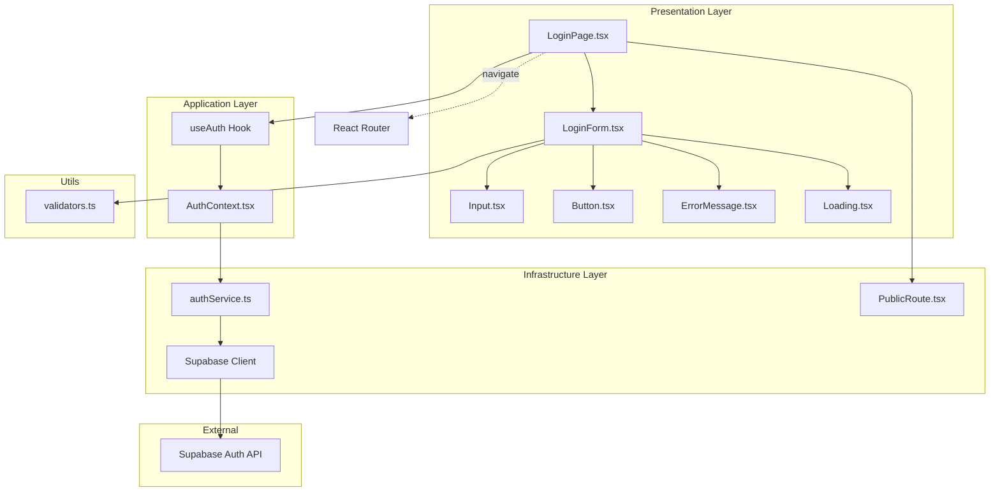
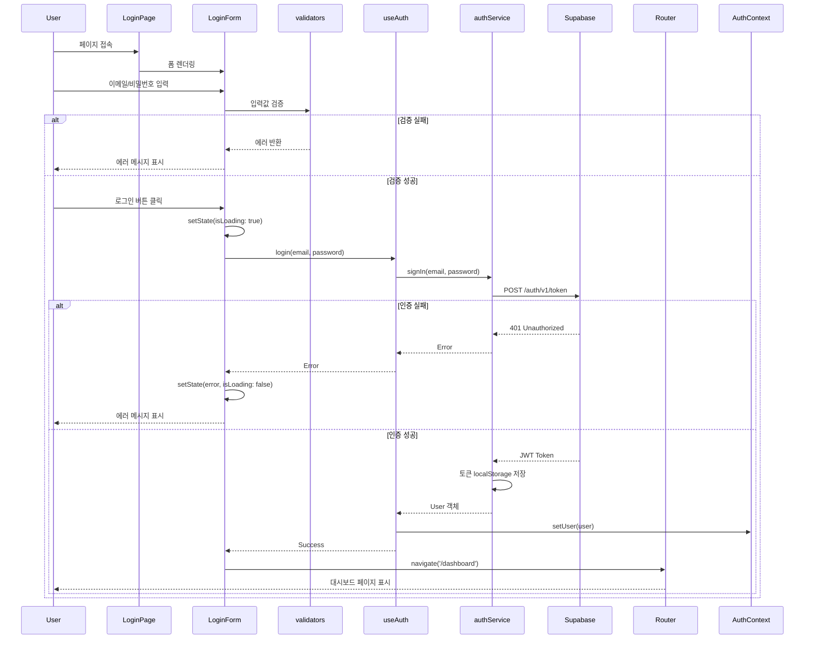

# 로그인 페이지 구현 계획

## 문서 정보
- **버전**: v1.0.0
- **작성일**: 2025년 11월 2일
- **상태**: 최종
- **관련 문서**:
  - `/docs/prd.md` (v1.1.0)
  - `/docs/usecases/001/spec.md` (UC-001: 사용자 로그인)
  - `/docs/pages/login/state.md`
  - `/docs/rules/tdd.md`

---

## 1. 개요

### 1.1 목적
사용자가 Supabase Auth를 통해 이메일과 비밀번호로 인증하고, JWT 토큰을 발급받아 대시보드에 접근할 수 있는 로그인 페이지를 구현합니다.

### 1.2 주요 기능
- 이메일/비밀번호 입력 폼
- 입력값 실시간 검증 (이메일 형식, 필수값)
- 로그인 상태 유지 옵션 (Remember Me)
- Supabase Auth 연동 인증
- 로딩 상태 표시
- 에러 메시지 표시
- 인증 성공 시 대시보드로 리다이렉트

### 1.3 상태 관리 방식
- **로컬 상태(useState)**: 페이지가 단순하여 Context + useReducer 불필요
- 인증 상태는 별도의 AuthContext에서 전역 관리

### 1.4 구현 모듈 목록

| 모듈명 | 위치 | 설명 |
|--------|------|------|
| **LoginPage** | `frontend/src/presentation/pages/LoginPage.tsx` | 로그인 페이지 메인 컴포넌트 |
| **LoginForm** | `frontend/src/presentation/components/forms/LoginForm.tsx` | 로그인 폼 UI 컴포넌트 |
| **Input** | `frontend/src/presentation/components/common/Input.tsx` | 재사용 가능한 입력 필드 컴포넌트 |
| **Button** | `frontend/src/presentation/components/common/Button.tsx` | 재사용 가능한 버튼 컴포넌트 |
| **ErrorMessage** | `frontend/src/presentation/components/common/ErrorMessage.tsx` | 에러 메시지 표시 컴포넌트 |
| **Loading** | `frontend/src/presentation/components/common/Loading.tsx` | 로딩 스피너 컴포넌트 |
| **authService** | `frontend/src/infrastructure/external/authService.ts` | Supabase Auth 인증 서비스 |
| **AuthContext** | `frontend/src/application/contexts/AuthContext.tsx` | 인증 상태 전역 관리 Context |
| **useAuth** | `frontend/src/application/hooks/useAuth.ts` | 인증 Context 사용 Hook |
| **validators** | `frontend/src/utils/validators.ts` | 입력값 검증 유틸리티 함수 |
| **PublicRoute** | `frontend/src/infrastructure/routing/PublicRoute.tsx` | 공개 라우트 래퍼 (로그인된 사용자는 대시보드로 리다이렉트) |

---

## 2. 아키텍처 다이어그램

### 2.1 모듈 관계도



### 2.2 데이터 흐름도



### 2.3 상태 관리 (Flux 패턴)

```mermaid
flowchart LR
    User([사용자])

    Actions[Actions]
    A1[입력: 이메일 변경]
    A2[입력: 비밀번호 변경]
    A3[클릭: Remember Me]
    A4[클릭: 로그인]

    State[(Local State)]
    S1[email: string]
    S2[password: string]
    S3[rememberMe: boolean]
    S4[isLoading: boolean]
    S5[error: string | null]

    View[View]
    V1[이메일 Input]
    V2[비밀번호 Input]
    V3[Remember Me Checkbox]
    V4[로그인 Button]
    V5[ErrorMessage]
    V6[Loading Spinner]

    AuthAPI[AuthContext/Supabase]

    User --> A1 & A2 & A3 & A4
    A1 & A2 & A3 --> State
    A4 --> AuthAPI
    AuthAPI --> State
    State --> View
    View --> User
```

---

## 3. 구현 계획 (TDD 기반)

### 3.1 TDD 프로세스 개요

본 구현은 `docs/rules/tdd.md`에 명시된 Red-Green-Refactor 사이클을 철저히 준수합니다.

**TDD 사이클**:
1. **RED**: 실패하는 테스트를 먼저 작성
2. **GREEN**: 테스트를 통과하는 최소한의 코드 작성
3. **REFACTOR**: 코드 품질 개선 (중복 제거, 가독성 향상)

**FIRST 원칙 준수**:
- **Fast**: 각 테스트는 100ms 이내 실행 (Supabase Auth는 Mock)
- **Independent**: 테스트 간 의존성 없음
- **Repeatable**: 동일한 환경에서 반복 가능
- **Self-validating**: 수동 검증 불필요, 자동화된 통과/실패 판단
- **Timely**: 구현 전에 테스트 작성

**테스트 피라미드 비율**:
- Unit Tests: 70% (비즈니스 로직, 유틸리티 함수)
- Integration Tests: 20% (컴포넌트 + Hook + Service 통합)
- E2E Tests: 10% (사용자 시나리오)

---

### 3.2 구현 순서

#### 단계 1: 유틸리티 함수 (Utils Layer)
**파일**: `frontend/src/utils/validators.ts`

**구현 기능**:
- 이메일 형식 검증 함수
- 비밀번호 검증 함수 (8자 이상, 영문/숫자/특수문자 조합)
- 필수값 검증 함수

**TDD 순서**:

##### RED 1: 이메일 검증 테스트 작성
```typescript
// frontend/src/utils/__tests__/validators.test.ts
describe('validateEmail', () => {
  it('유효한 이메일 형식일 때 true를 반환해야 함', () => {
    expect(validateEmail('user@example.com')).toBe(true);
  });

  it('유효하지 않은 이메일 형식일 때 false를 반환해야 함', () => {
    expect(validateEmail('invalid-email')).toBe(false);
    expect(validateEmail('missing@domain')).toBe(false);
    expect(validateEmail('@example.com')).toBe(false);
  });

  it('빈 문자열일 때 false를 반환해야 함', () => {
    expect(validateEmail('')).toBe(false);
  });
});
```

**실행**: `npm test validators.test.ts` → **실패 확인**

##### GREEN 1: 최소 구현
```typescript
// frontend/src/utils/validators.ts
export const validateEmail = (email: string): boolean => {
  const emailRegex = /^[^\s@]+@[^\s@]+\.[^\s@]+$/;
  return emailRegex.test(email);
};
```

**실행**: `npm test validators.test.ts` → **통과 확인**

##### REFACTOR 1: 코드 개선
- 정규식을 상수로 분리
- JSDoc 주석 추가

```typescript
const EMAIL_REGEX = /^[^\s@]+@[^\s@]+\.[^\s@]+$/;

/**
 * 이메일 주소의 유효성을 검증합니다.
 * @param email 검증할 이메일 주소
 * @returns 유효한 이메일 형식이면 true, 아니면 false
 */
export const validateEmail = (email: string): boolean => {
  return EMAIL_REGEX.test(email);
};
```

**실행**: `npm test validators.test.ts` → **통과 확인**

##### RED 2: 비밀번호 검증 테스트 작성
```typescript
describe('validatePassword', () => {
  it('유효한 비밀번호일 때 true를 반환해야 함', () => {
    expect(validatePassword('Password123!')).toBe(true);
  });

  it('8자 미만일 때 false를 반환해야 함', () => {
    expect(validatePassword('Pass1!')).toBe(false);
  });

  it('영문이 없을 때 false를 반환해야 함', () => {
    expect(validatePassword('12345678!')).toBe(false);
  });

  it('숫자가 없을 때 false를 반환해야 함', () => {
    expect(validatePassword('Password!')).toBe(false);
  });

  it('특수문자가 없을 때 false를 반환해야 함', () => {
    expect(validatePassword('Password123')).toBe(false);
  });
});
```

**실행**: `npm test validators.test.ts` → **실패 확인**

##### GREEN 2: 최소 구현
```typescript
export const validatePassword = (password: string): boolean => {
  if (password.length < 8) return false;
  if (!/[a-zA-Z]/.test(password)) return false;
  if (!/[0-9]/.test(password)) return false;
  if (!/[!@#$%^&*(),.?":{}|<>]/.test(password)) return false;
  return true;
};
```

**실행**: `npm test validators.test.ts` → **통과 확인**

##### REFACTOR 2: 코드 개선
```typescript
const PASSWORD_MIN_LENGTH = 8;
const HAS_LETTER_REGEX = /[a-zA-Z]/;
const HAS_NUMBER_REGEX = /[0-9]/;
const HAS_SPECIAL_CHAR_REGEX = /[!@#$%^&*(),.?":{}|<>]/;

/**
 * 비밀번호의 유효성을 검증합니다.
 * 비밀번호는 8자 이상, 영문/숫자/특수문자 조합이어야 합니다.
 * @param password 검증할 비밀번호
 * @returns 유효한 비밀번호면 true, 아니면 false
 */
export const validatePassword = (password: string): boolean => {
  if (password.length < PASSWORD_MIN_LENGTH) return false;
  if (!HAS_LETTER_REGEX.test(password)) return false;
  if (!HAS_NUMBER_REGEX.test(password)) return false;
  if (!HAS_SPECIAL_CHAR_REGEX.test(password)) return false;
  return true;
};
```

**실행**: `npm test validators.test.ts` → **통과 확인**

---

#### 단계 2: 공통 UI 컴포넌트 (Presentation Layer)

**파일**:
- `frontend/src/presentation/components/common/Input.tsx`
- `frontend/src/presentation/components/common/Button.tsx`
- `frontend/src/presentation/components/common/ErrorMessage.tsx`
- `frontend/src/presentation/components/common/Loading.tsx`

**구현 전략**:
- 공통 컴포넌트는 UI 렌더링 테스트만 진행 (QA Sheet 기반)
- React Testing Library 사용
- 비즈니스 로직 없음 (props를 받아 UI만 렌더링)

**QA Sheet**: 각 컴포넌트별 시각적 검증 항목

##### Input 컴포넌트 QA Sheet

| 항목 | 검증 내용 | 통과 조건 |
|------|-----------|-----------|
| **기본 렌더링** | Input 필드가 화면에 표시됨 | input 요소가 DOM에 존재 |
| **Label 표시** | label prop 전달 시 레이블이 표시됨 | label 텍스트가 화면에 표시됨 |
| **타입 지정** | type="email" 전달 시 이메일 input 렌더링 | input의 type 속성이 "email" |
| **Placeholder** | placeholder prop 전달 시 placeholder 표시 | placeholder 텍스트가 화면에 표시됨 |
| **에러 상태** | error prop 전달 시 붉은색 테두리 표시 | input에 error 클래스 적용 |
| **에러 메시지** | errorMessage prop 전달 시 에러 메시지 표시 | 에러 메시지 텍스트가 화면에 표시됨 |
| **값 변경** | onChange 핸들러가 호출됨 | 입력 시 onChange 콜백 실행 |
| **비활성화** | disabled prop 전달 시 입력 불가 | input이 disabled 상태 |

##### Button 컴포넌트 QA Sheet

| 항목 | 검증 내용 | 통과 조건 |
|------|-----------|-----------|
| **기본 렌더링** | 버튼이 화면에 표시됨 | button 요소가 DOM에 존재 |
| **텍스트 표시** | children prop 전달 시 버튼 텍스트 표시 | 버튼 텍스트가 화면에 표시됨 |
| **클릭 이벤트** | onClick 핸들러가 호출됨 | 클릭 시 onClick 콜백 실행 |
| **로딩 상태** | isLoading=true 시 스피너 표시, 버튼 비활성화 | 스피너가 표시되고 버튼이 disabled |
| **비활성화** | disabled=true 시 버튼 비활성화 | 버튼이 클릭 불가 상태 |
| **타입 지정** | type="submit" 전달 시 submit 버튼 렌더링 | button의 type 속성이 "submit" |
| **스타일 변형** | variant="primary" 전달 시 primary 스타일 적용 | 버튼에 primary 클래스 적용 |

##### ErrorMessage 컴포넌트 QA Sheet

| 항목 | 검증 내용 | 통과 조건 |
|------|-----------|-----------|
| **메시지 표시** | message prop 전달 시 에러 메시지 표시 | 메시지 텍스트가 화면에 표시됨 |
| **빈 메시지** | message가 null일 때 아무것도 렌더링하지 않음 | 컴포넌트가 DOM에 존재하지 않음 |
| **스타일** | 붉은색 텍스트로 표시됨 | 에러 메시지에 error 클래스 적용 |
| **아이콘** | 에러 아이콘이 메시지 앞에 표시됨 | 아이콘이 화면에 표시됨 |

##### Loading 컴포넌트 QA Sheet

| 항목 | 검증 내용 | 통과 조건 |
|------|-----------|-----------|
| **스피너 표시** | 로딩 스피너가 화면에 표시됨 | spinner 요소가 DOM에 존재 |
| **중앙 정렬** | 스피너가 화면 중앙에 위치함 | 스피너가 중앙 정렬 클래스 적용 |
| **애니메이션** | 스피너가 회전 애니메이션 실행 | animation 속성이 적용됨 |

**TDD 순서 (예: Input 컴포넌트)**:

##### RED: Input 테스트 작성
```typescript
// frontend/src/presentation/components/common/__tests__/Input.test.tsx
import { render, screen, fireEvent } from '@testing-library/react';
import { Input } from '../Input';

describe('Input', () => {
  it('기본 렌더링이 되어야 함', () => {
    render(<Input />);
    expect(screen.getByRole('textbox')).toBeInTheDocument();
  });

  it('label prop 전달 시 레이블이 표시되어야 함', () => {
    render(<Input label="이메일" />);
    expect(screen.getByText('이메일')).toBeInTheDocument();
  });

  it('type prop 전달 시 해당 타입의 input이 렌더링되어야 함', () => {
    render(<Input type="email" />);
    expect(screen.getByRole('textbox')).toHaveAttribute('type', 'email');
  });

  it('onChange 핸들러가 호출되어야 함', () => {
    const handleChange = jest.fn();
    render(<Input onChange={handleChange} />);
    fireEvent.change(screen.getByRole('textbox'), { target: { value: 'test' } });
    expect(handleChange).toHaveBeenCalledWith('test');
  });

  it('error prop 전달 시 에러 스타일이 적용되어야 함', () => {
    render(<Input error />);
    expect(screen.getByRole('textbox')).toHaveClass('error');
  });
});
```

**실행**: `npm test Input.test.tsx` → **실패 확인**

##### GREEN: Input 구현
```typescript
// frontend/src/presentation/components/common/Input.tsx
import React from 'react';

interface InputProps {
  label?: string;
  type?: string;
  placeholder?: string;
  value?: string;
  onChange?: (value: string) => void;
  error?: boolean;
  errorMessage?: string;
  disabled?: boolean;
}

export const Input: React.FC<InputProps> = ({
  label,
  type = 'text',
  placeholder,
  value,
  onChange,
  error,
  errorMessage,
  disabled,
}) => {
  return (
    <div className="input-container">
      {label && <label>{label}</label>}
      <input
        type={type}
        placeholder={placeholder}
        value={value}
        onChange={(e) => onChange?.(e.target.value)}
        className={error ? 'error' : ''}
        disabled={disabled}
      />
      {errorMessage && <span className="error-message">{errorMessage}</span>}
    </div>
  );
};
```

**실행**: `npm test Input.test.tsx` → **통과 확인**

##### REFACTOR: 스타일 개선 (MUI 사용)
```typescript
import { TextField } from '@mui/material';

export const Input: React.FC<InputProps> = ({
  label,
  type = 'text',
  placeholder,
  value,
  onChange,
  error,
  errorMessage,
  disabled,
}) => {
  return (
    <TextField
      label={label}
      type={type}
      placeholder={placeholder}
      value={value}
      onChange={(e) => onChange?.(e.target.value)}
      error={error}
      helperText={errorMessage}
      disabled={disabled}
      fullWidth
    />
  );
};
```

**실행**: `npm test Input.test.tsx` → **통과 확인**

**나머지 공통 컴포넌트 (Button, ErrorMessage, Loading)도 동일한 TDD 사이클 적용**

---

#### 단계 3: 인증 서비스 (Infrastructure Layer)

**파일**: `frontend/src/infrastructure/external/authService.ts`

**구현 기능**:
- `signIn(email, password)`: Supabase Auth 로그인
- `signOut()`: 로그아웃
- `getUser()`: 현재 사용자 정보 조회
- `storeToken(token, rememberMe)`: 토큰 저장 (localStorage 또는 sessionStorage)
- `getToken()`: 저장된 토큰 조회

**TDD 순서**:

##### RED: authService 테스트 작성
```typescript
// frontend/src/infrastructure/external/__tests__/authService.test.ts
import { authService } from '../authService';
import { supabase } from '../supabase';

jest.mock('../supabase');

describe('authService', () => {
  beforeEach(() => {
    jest.clearAllMocks();
    localStorage.clear();
    sessionStorage.clear();
  });

  describe('signIn', () => {
    it('성공 시 사용자 객체와 토큰을 반환해야 함', async () => {
      const mockUser = { id: '123', email: 'user@example.com' };
      const mockToken = 'mock-jwt-token';

      (supabase.auth.signInWithPassword as jest.Mock).mockResolvedValue({
        data: { user: mockUser, session: { access_token: mockToken } },
        error: null,
      });

      const result = await authService.signIn('user@example.com', 'password123!');

      expect(result).toEqual({ user: mockUser, token: mockToken });
      expect(supabase.auth.signInWithPassword).toHaveBeenCalledWith({
        email: 'user@example.com',
        password: 'password123!',
      });
    });

    it('실패 시 에러를 throw해야 함', async () => {
      (supabase.auth.signInWithPassword as jest.Mock).mockResolvedValue({
        data: null,
        error: { message: 'Invalid credentials' },
      });

      await expect(authService.signIn('user@example.com', 'wrong')).rejects.toThrow('Invalid credentials');
    });
  });

  describe('storeToken', () => {
    it('rememberMe=true일 때 localStorage에 토큰을 저장해야 함', () => {
      authService.storeToken('token123', true);
      expect(localStorage.getItem('supabase_token')).toBe('token123');
      expect(sessionStorage.getItem('supabase_token')).toBeNull();
    });

    it('rememberMe=false일 때 sessionStorage에 토큰을 저장해야 함', () => {
      authService.storeToken('token123', false);
      expect(sessionStorage.getItem('supabase_token')).toBe('token123');
      expect(localStorage.getItem('supabase_token')).toBeNull();
    });
  });

  describe('getToken', () => {
    it('localStorage에 토큰이 있으면 반환해야 함', () => {
      localStorage.setItem('supabase_token', 'token123');
      expect(authService.getToken()).toBe('token123');
    });

    it('sessionStorage에 토큰이 있으면 반환해야 함', () => {
      sessionStorage.setItem('supabase_token', 'token456');
      expect(authService.getToken()).toBe('token456');
    });

    it('토큰이 없으면 null을 반환해야 함', () => {
      expect(authService.getToken()).toBeNull();
    });
  });
});
```

**실행**: `npm test authService.test.ts` → **실패 확인**

##### GREEN: authService 구현
```typescript
// frontend/src/infrastructure/external/authService.ts
import { supabase } from './supabase';

const TOKEN_KEY = 'supabase_token';

export const authService = {
  async signIn(email: string, password: string) {
    const { data, error } = await supabase.auth.signInWithPassword({
      email,
      password,
    });

    if (error) {
      throw new Error(error.message);
    }

    return {
      user: data.user,
      token: data.session.access_token,
    };
  },

  async signOut() {
    const { error } = await supabase.auth.signOut();
    if (error) throw new Error(error.message);
    this.clearToken();
  },

  storeToken(token: string, rememberMe: boolean) {
    if (rememberMe) {
      localStorage.setItem(TOKEN_KEY, token);
    } else {
      sessionStorage.setItem(TOKEN_KEY, token);
    }
  },

  getToken(): string | null {
    return localStorage.getItem(TOKEN_KEY) || sessionStorage.getItem(TOKEN_KEY);
  },

  clearToken() {
    localStorage.removeItem(TOKEN_KEY);
    sessionStorage.removeItem(TOKEN_KEY);
  },

  async getUser() {
    const { data, error } = await supabase.auth.getUser();
    if (error) throw new Error(error.message);
    return data.user;
  },
};
```

**실행**: `npm test authService.test.ts` → **통과 확인**

##### REFACTOR: 에러 처리 개선
```typescript
// 에러 타입 정의
export class AuthError extends Error {
  constructor(message: string, public code?: string) {
    super(message);
    this.name = 'AuthError';
  }
}

// signIn 개선
async signIn(email: string, password: string) {
  const { data, error } = await supabase.auth.signInWithPassword({
    email,
    password,
  });

  if (error) {
    throw new AuthError(error.message, error.status?.toString());
  }

  if (!data.user || !data.session) {
    throw new AuthError('인증에 실패했습니다.');
  }

  return {
    user: data.user,
    token: data.session.access_token,
  };
}
```

**실행**: `npm test authService.test.ts` → **통과 확인**

---

#### 단계 4: AuthContext (Application Layer)

**파일**: `frontend/src/application/contexts/AuthContext.tsx`

**구현 기능**:
- 전역 인증 상태 관리 (user, isAuthenticated, isLoading)
- `login(email, password)`: 로그인 액션
- `logout()`: 로그아웃 액션
- `checkAuth()`: 초기 로딩 시 토큰 검증

**TDD 순서**:

##### RED: AuthContext 테스트 작성
```typescript
// frontend/src/application/contexts/__tests__/AuthContext.test.tsx
import { renderHook, act } from '@testing-library/react';
import { AuthProvider, useAuth } from '../AuthContext';
import { authService } from '@/infrastructure/external/authService';

jest.mock('@/infrastructure/external/authService');

describe('AuthContext', () => {
  beforeEach(() => {
    jest.clearAllMocks();
  });

  it('초기 상태는 로딩 중이어야 함', () => {
    const { result } = renderHook(() => useAuth(), { wrapper: AuthProvider });
    expect(result.current.isLoading).toBe(true);
    expect(result.current.user).toBeNull();
    expect(result.current.isAuthenticated).toBe(false);
  });

  it('login 성공 시 user 상태를 설정해야 함', async () => {
    const mockUser = { id: '123', email: 'user@example.com' };
    (authService.signIn as jest.Mock).mockResolvedValue({
      user: mockUser,
      token: 'token123',
    });

    const { result } = renderHook(() => useAuth(), { wrapper: AuthProvider });

    await act(async () => {
      await result.current.login('user@example.com', 'password123!', false);
    });

    expect(result.current.user).toEqual(mockUser);
    expect(result.current.isAuthenticated).toBe(true);
    expect(result.current.isLoading).toBe(false);
  });

  it('login 실패 시 에러를 throw해야 함', async () => {
    (authService.signIn as jest.Mock).mockRejectedValue(new Error('Invalid credentials'));

    const { result } = renderHook(() => useAuth(), { wrapper: AuthProvider });

    await expect(
      act(async () => {
        await result.current.login('user@example.com', 'wrong', false);
      })
    ).rejects.toThrow('Invalid credentials');
  });

  it('logout 시 user 상태를 초기화해야 함', async () => {
    const mockUser = { id: '123', email: 'user@example.com' };
    (authService.signIn as jest.Mock).mockResolvedValue({
      user: mockUser,
      token: 'token123',
    });
    (authService.signOut as jest.Mock).mockResolvedValue(undefined);

    const { result } = renderHook(() => useAuth(), { wrapper: AuthProvider });

    await act(async () => {
      await result.current.login('user@example.com', 'password123!', false);
    });

    expect(result.current.isAuthenticated).toBe(true);

    await act(async () => {
      await result.current.logout();
    });

    expect(result.current.user).toBeNull();
    expect(result.current.isAuthenticated).toBe(false);
  });
});
```

**실행**: `npm test AuthContext.test.tsx` → **실패 확인**

##### GREEN: AuthContext 구현
```typescript
// frontend/src/application/contexts/AuthContext.tsx
import React, { createContext, useContext, useState, useEffect } from 'react';
import { authService } from '@/infrastructure/external/authService';

interface User {
  id: string;
  email: string;
}

interface AuthContextType {
  user: User | null;
  isAuthenticated: boolean;
  isLoading: boolean;
  login: (email: string, password: string, rememberMe: boolean) => Promise<void>;
  logout: () => Promise<void>;
}

const AuthContext = createContext<AuthContextType | undefined>(undefined);

export const AuthProvider: React.FC<{ children: React.ReactNode }> = ({ children }) => {
  const [user, setUser] = useState<User | null>(null);
  const [isLoading, setIsLoading] = useState(true);

  useEffect(() => {
    checkAuth();
  }, []);

  const checkAuth = async () => {
    try {
      const token = authService.getToken();
      if (token) {
        const user = await authService.getUser();
        setUser(user);
      }
    } catch (error) {
      console.error('인증 확인 실패:', error);
    } finally {
      setIsLoading(false);
    }
  };

  const login = async (email: string, password: string, rememberMe: boolean) => {
    const { user, token } = await authService.signIn(email, password);
    authService.storeToken(token, rememberMe);
    setUser(user);
  };

  const logout = async () => {
    await authService.signOut();
    setUser(null);
  };

  return (
    <AuthContext.Provider
      value={{
        user,
        isAuthenticated: !!user,
        isLoading,
        login,
        logout,
      }}
    >
      {children}
    </AuthContext.Provider>
  );
};

export const useAuth = () => {
  const context = useContext(AuthContext);
  if (!context) {
    throw new Error('useAuth must be used within AuthProvider');
  }
  return context;
};
```

**실행**: `npm test AuthContext.test.tsx` → **통과 확인**

##### REFACTOR: 에러 처리 개선
```typescript
const login = async (email: string, password: string, rememberMe: boolean) => {
  setIsLoading(true);
  try {
    const { user, token } = await authService.signIn(email, password);
    authService.storeToken(token, rememberMe);
    setUser(user);
  } catch (error) {
    throw error; // 상위 컴포넌트에서 처리
  } finally {
    setIsLoading(false);
  }
};
```

**실행**: `npm test AuthContext.test.tsx` → **통과 확인**

---

#### 단계 5: LoginForm 컴포넌트 (Presentation Layer)

**파일**: `frontend/src/presentation/components/forms/LoginForm.tsx`

**구현 기능**:
- 이메일/비밀번호 입력 폼
- 입력값 실시간 검증
- Remember Me 체크박스
- 로그인 버튼
- 에러 메시지 표시
- 로딩 상태 표시

**QA Sheet**:

| 항목 | 검증 내용 | 통과 조건 |
|------|-----------|-----------|
| **폼 렌더링** | 이메일/비밀번호 입력 필드, 로그인 버튼이 표시됨 | 모든 요소가 DOM에 존재 |
| **이메일 검증** | 잘못된 이메일 입력 시 에러 메시지 표시 | "올바른 이메일 형식을 입력해주세요" 메시지 표시 |
| **비밀번호 검증** | 8자 미만 입력 시 에러 메시지 표시 | "비밀번호는 8자 이상이어야 합니다" 메시지 표시 |
| **버튼 비활성화** | 이메일 또는 비밀번호가 비어있을 때 버튼 비활성화 | 버튼이 disabled 상태 |
| **로딩 상태** | 로그인 중일 때 스피너 표시, 버튼 비활성화 | 스피너가 표시되고 버튼이 disabled |
| **에러 표시** | 로그인 실패 시 에러 메시지 표시 | 에러 메시지가 화면에 표시됨 |
| **Remember Me** | 체크박스 클릭 시 상태 토글 | 체크박스 선택/해제 상태 변경 |
| **폼 제출** | Enter 키 입력 시 로그인 실행 | onSubmit 핸들러 호출 |

**TDD 순서**:

##### RED: LoginForm 테스트 작성
```typescript
// frontend/src/presentation/components/forms/__tests__/LoginForm.test.tsx
import { render, screen, fireEvent, waitFor } from '@testing-library/react';
import { LoginForm } from '../LoginForm';

describe('LoginForm', () => {
  const mockOnSubmit = jest.fn();

  beforeEach(() => {
    jest.clearAllMocks();
  });

  it('폼이 렌더링되어야 함', () => {
    render(<LoginForm onSubmit={mockOnSubmit} />);

    expect(screen.getByLabelText(/이메일/i)).toBeInTheDocument();
    expect(screen.getByLabelText(/비밀번호/i)).toBeInTheDocument();
    expect(screen.getByRole('button', { name: /로그인/i })).toBeInTheDocument();
  });

  it('잘못된 이메일 입력 시 에러 메시지를 표시해야 함', async () => {
    render(<LoginForm onSubmit={mockOnSubmit} />);

    const emailInput = screen.getByLabelText(/이메일/i);
    fireEvent.change(emailInput, { target: { value: 'invalid-email' } });
    fireEvent.blur(emailInput);

    await waitFor(() => {
      expect(screen.getByText(/올바른 이메일 형식을 입력해주세요/i)).toBeInTheDocument();
    });
  });

  it('8자 미만 비밀번호 입력 시 에러 메시지를 표시해야 함', async () => {
    render(<LoginForm onSubmit={mockOnSubmit} />);

    const passwordInput = screen.getByLabelText(/비밀번호/i);
    fireEvent.change(passwordInput, { target: { value: 'short' } });
    fireEvent.blur(passwordInput);

    await waitFor(() => {
      expect(screen.getByText(/비밀번호는 8자 이상이어야 합니다/i)).toBeInTheDocument();
    });
  });

  it('이메일 또는 비밀번호가 비어있을 때 버튼이 비활성화되어야 함', () => {
    render(<LoginForm onSubmit={mockOnSubmit} />);

    const button = screen.getByRole('button', { name: /로그인/i });
    expect(button).toBeDisabled();
  });

  it('유효한 입력값일 때 onSubmit이 호출되어야 함', async () => {
    render(<LoginForm onSubmit={mockOnSubmit} />);

    fireEvent.change(screen.getByLabelText(/이메일/i), {
      target: { value: 'user@example.com' },
    });
    fireEvent.change(screen.getByLabelText(/비밀번호/i), {
      target: { value: 'Password123!' },
    });

    const button = screen.getByRole('button', { name: /로그인/i });
    fireEvent.click(button);

    await waitFor(() => {
      expect(mockOnSubmit).toHaveBeenCalledWith({
        email: 'user@example.com',
        password: 'Password123!',
        rememberMe: false,
      });
    });
  });

  it('로딩 중일 때 스피너가 표시되고 버튼이 비활성화되어야 함', () => {
    render(<LoginForm onSubmit={mockOnSubmit} isLoading />);

    expect(screen.getByRole('progressbar')).toBeInTheDocument();
    expect(screen.getByRole('button', { name: /로그인/i })).toBeDisabled();
  });

  it('에러 메시지가 전달되면 화면에 표시해야 함', () => {
    render(<LoginForm onSubmit={mockOnSubmit} error="로그인 실패" />);

    expect(screen.getByText('로그인 실패')).toBeInTheDocument();
  });
});
```

**실행**: `npm test LoginForm.test.tsx` → **실패 확인**

##### GREEN: LoginForm 구현
```typescript
// frontend/src/presentation/components/forms/LoginForm.tsx
import React, { useState } from 'react';
import { Input } from '../common/Input';
import { Button } from '../common/Button';
import { ErrorMessage } from '../common/ErrorMessage';
import { validateEmail, validatePassword } from '@/utils/validators';

interface LoginFormProps {
  onSubmit: (data: { email: string; password: string; rememberMe: boolean }) => void;
  isLoading?: boolean;
  error?: string | null;
}

export const LoginForm: React.FC<LoginFormProps> = ({ onSubmit, isLoading, error }) => {
  const [email, setEmail] = useState('');
  const [password, setPassword] = useState('');
  const [rememberMe, setRememberMe] = useState(false);
  const [emailError, setEmailError] = useState<string | null>(null);
  const [passwordError, setPasswordError] = useState<string | null>(null);

  const handleEmailBlur = () => {
    if (email && !validateEmail(email)) {
      setEmailError('올바른 이메일 형식을 입력해주세요');
    } else {
      setEmailError(null);
    }
  };

  const handlePasswordBlur = () => {
    if (password && password.length < 8) {
      setPasswordError('비밀번호는 8자 이상이어야 합니다');
    } else {
      setPasswordError(null);
    }
  };

  const handleSubmit = (e: React.FormEvent) => {
    e.preventDefault();
    if (email && password && !emailError && !passwordError) {
      onSubmit({ email, password, rememberMe });
    }
  };

  const isDisabled = !email || !password || !!emailError || !!passwordError || isLoading;

  return (
    <form onSubmit={handleSubmit}>
      <Input
        label="이메일"
        type="email"
        value={email}
        onChange={setEmail}
        onBlur={handleEmailBlur}
        error={!!emailError}
        errorMessage={emailError}
      />
      <Input
        label="비밀번호"
        type="password"
        value={password}
        onChange={setPassword}
        onBlur={handlePasswordBlur}
        error={!!passwordError}
        errorMessage={passwordError}
      />
      <label>
        <input
          type="checkbox"
          checked={rememberMe}
          onChange={(e) => setRememberMe(e.target.checked)}
        />
        로그인 상태 유지
      </label>
      {error && <ErrorMessage message={error} />}
      <Button type="submit" disabled={isDisabled} isLoading={isLoading}>
        로그인
      </Button>
    </form>
  );
};
```

**실행**: `npm test LoginForm.test.tsx` → **통과 확인**

##### REFACTOR: MUI로 스타일 개선
```typescript
import { Box, Checkbox, FormControlLabel } from '@mui/material';

return (
  <Box component="form" onSubmit={handleSubmit} sx={{ mt: 1 }}>
    <Input
      label="이메일"
      type="email"
      value={email}
      onChange={setEmail}
      onBlur={handleEmailBlur}
      error={!!emailError}
      errorMessage={emailError}
    />
    <Input
      label="비밀번호"
      type="password"
      value={password}
      onChange={setPassword}
      onBlur={handlePasswordBlur}
      error={!!passwordError}
      errorMessage={passwordError}
    />
    <FormControlLabel
      control={
        <Checkbox
          checked={rememberMe}
          onChange={(e) => setRememberMe(e.target.checked)}
        />
      }
      label="로그인 상태 유지"
    />
    {error && <ErrorMessage message={error} />}
    <Button type="submit" disabled={isDisabled} isLoading={isLoading} fullWidth>
      로그인
    </Button>
  </Box>
);
```

**실행**: `npm test LoginForm.test.tsx` → **통과 확인**

---

#### 단계 6: LoginPage 컴포넌트 (Presentation Layer)

**파일**: `frontend/src/presentation/pages/LoginPage.tsx`

**구현 기능**:
- LoginForm 컴포넌트 렌더링
- useAuth Hook 사용하여 로그인 처리
- 로그인 성공 시 대시보드로 리다이렉트
- 에러 처리

**통합 테스트 (Integration Test)**:

##### RED: LoginPage 통합 테스트 작성
```typescript
// frontend/src/presentation/pages/__tests__/LoginPage.test.tsx
import { render, screen, fireEvent, waitFor } from '@testing-library/react';
import { BrowserRouter } from 'react-router-dom';
import { LoginPage } from '../LoginPage';
import { AuthProvider } from '@/application/contexts/AuthContext';
import { authService } from '@/infrastructure/external/authService';

jest.mock('@/infrastructure/external/authService');
const mockNavigate = jest.fn();
jest.mock('react-router-dom', () => ({
  ...jest.requireActual('react-router-dom'),
  useNavigate: () => mockNavigate,
}));

describe('LoginPage Integration', () => {
  beforeEach(() => {
    jest.clearAllMocks();
  });

  it('페이지가 렌더링되어야 함', () => {
    render(
      <BrowserRouter>
        <AuthProvider>
          <LoginPage />
        </AuthProvider>
      </BrowserRouter>
    );

    expect(screen.getByRole('heading', { name: /로그인/i })).toBeInTheDocument();
    expect(screen.getByLabelText(/이메일/i)).toBeInTheDocument();
    expect(screen.getByLabelText(/비밀번호/i)).toBeInTheDocument();
  });

  it('유효한 자격증명으로 로그인 성공 시 대시보드로 이동해야 함', async () => {
    const mockUser = { id: '123', email: 'user@example.com' };
    (authService.signIn as jest.Mock).mockResolvedValue({
      user: mockUser,
      token: 'token123',
    });
    (authService.getToken as jest.Mock).mockReturnValue(null);

    render(
      <BrowserRouter>
        <AuthProvider>
          <LoginPage />
        </AuthProvider>
      </BrowserRouter>
    );

    fireEvent.change(screen.getByLabelText(/이메일/i), {
      target: { value: 'user@example.com' },
    });
    fireEvent.change(screen.getByLabelText(/비밀번호/i), {
      target: { value: 'Password123!' },
    });
    fireEvent.click(screen.getByRole('button', { name: /로그인/i }));

    await waitFor(() => {
      expect(mockNavigate).toHaveBeenCalledWith('/dashboard');
    });
  });

  it('로그인 실패 시 에러 메시지를 표시해야 함', async () => {
    (authService.signIn as jest.Mock).mockRejectedValue(
      new Error('이메일 또는 비밀번호가 올바르지 않습니다')
    );
    (authService.getToken as jest.Mock).mockReturnValue(null);

    render(
      <BrowserRouter>
        <AuthProvider>
          <LoginPage />
        </AuthProvider>
      </BrowserRouter>
    );

    fireEvent.change(screen.getByLabelText(/이메일/i), {
      target: { value: 'user@example.com' },
    });
    fireEvent.change(screen.getByLabelText(/비밀번호/i), {
      target: { value: 'WrongPassword!' },
    });
    fireEvent.click(screen.getByRole('button', { name: /로그인/i }));

    await waitFor(() => {
      expect(
        screen.getByText(/이메일 또는 비밀번호가 올바르지 않습니다/i)
      ).toBeInTheDocument();
    });
  });
});
```

**실행**: `npm test LoginPage.test.tsx` → **실패 확인**

##### GREEN: LoginPage 구현
```typescript
// frontend/src/presentation/pages/LoginPage.tsx
import React, { useState, useEffect } from 'react';
import { useNavigate } from 'react-router-dom';
import { LoginForm } from '../components/forms/LoginForm';
import { useAuth } from '@/application/hooks/useAuth';

export const LoginPage: React.FC = () => {
  const [error, setError] = useState<string | null>(null);
  const [isLoading, setIsLoading] = useState(false);
  const { login, isAuthenticated } = useAuth();
  const navigate = useNavigate();

  useEffect(() => {
    if (isAuthenticated) {
      navigate('/dashboard');
    }
  }, [isAuthenticated, navigate]);

  const handleSubmit = async (data: { email: string; password: string; rememberMe: boolean }) => {
    setIsLoading(true);
    setError(null);

    try {
      await login(data.email, data.password, data.rememberMe);
      navigate('/dashboard');
    } catch (err: any) {
      setError(err.message || '로그인에 실패했습니다');
    } finally {
      setIsLoading(false);
    }
  };

  return (
    <div>
      <h1>로그인</h1>
      <LoginForm onSubmit={handleSubmit} isLoading={isLoading} error={error} />
    </div>
  );
};
```

**실행**: `npm test LoginPage.test.tsx` → **통과 확인**

##### REFACTOR: MUI로 레이아웃 개선
```typescript
import { Container, Paper, Typography, Box } from '@mui/material';

return (
  <Container component="main" maxWidth="xs">
    <Box
      sx={{
        marginTop: 8,
        display: 'flex',
        flexDirection: 'column',
        alignItems: 'center',
      }}
    >
      <Paper elevation={3} sx={{ padding: 4, width: '100%' }}>
        <Typography component="h1" variant="h5" align="center" gutterBottom>
          로그인
        </Typography>
        <LoginForm onSubmit={handleSubmit} isLoading={isLoading} error={error} />
      </Paper>
    </Box>
  </Container>
);
```

**실행**: `npm test LoginPage.test.tsx` → **통과 확인**

---

#### 단계 7: 라우팅 설정

**파일**: `frontend/src/infrastructure/routing/PublicRoute.tsx`

**구현 기능**:
- 이미 로그인된 사용자는 대시보드로 리다이렉트
- 로그인되지 않은 사용자만 접근 가능

**TDD 순서**:

##### RED: PublicRoute 테스트 작성
```typescript
// frontend/src/infrastructure/routing/__tests__/PublicRoute.test.tsx
import { render, screen } from '@testing-library/react';
import { BrowserRouter } from 'react-router-dom';
import { PublicRoute } from '../PublicRoute';
import { AuthProvider } from '@/application/contexts/AuthContext';
import { authService } from '@/infrastructure/external/authService';

jest.mock('@/infrastructure/external/authService');
const mockNavigate = jest.fn();
jest.mock('react-router-dom', () => ({
  ...jest.requireActual('react-router-dom'),
  useNavigate: () => mockNavigate,
}));

describe('PublicRoute', () => {
  it('로그인되지 않은 사용자는 자식 컴포넌트를 볼 수 있어야 함', () => {
    (authService.getToken as jest.Mock).mockReturnValue(null);

    render(
      <BrowserRouter>
        <AuthProvider>
          <PublicRoute>
            <div>Public Content</div>
          </PublicRoute>
        </AuthProvider>
      </BrowserRouter>
    );

    expect(screen.getByText('Public Content')).toBeInTheDocument();
  });

  it('로그인된 사용자는 대시보드로 리다이렉트되어야 함', async () => {
    const mockUser = { id: '123', email: 'user@example.com' };
    (authService.getToken as jest.Mock).mockReturnValue('token123');
    (authService.getUser as jest.Mock).mockResolvedValue(mockUser);

    render(
      <BrowserRouter>
        <AuthProvider>
          <PublicRoute>
            <div>Public Content</div>
          </PublicRoute>
        </AuthProvider>
      </BrowserRouter>
    );

    // AuthContext가 초기화되고 사용자가 인증된 후 리다이렉트되는지 확인
    await waitFor(() => {
      expect(mockNavigate).toHaveBeenCalledWith('/dashboard');
    });
  });
});
```

**실행**: `npm test PublicRoute.test.tsx` → **실패 확인**

##### GREEN: PublicRoute 구현
```typescript
// frontend/src/infrastructure/routing/PublicRoute.tsx
import React, { useEffect } from 'react';
import { useNavigate } from 'react-router-dom';
import { useAuth } from '@/application/hooks/useAuth';

interface PublicRouteProps {
  children: React.ReactNode;
}

export const PublicRoute: React.FC<PublicRouteProps> = ({ children }) => {
  const { isAuthenticated, isLoading } = useAuth();
  const navigate = useNavigate();

  useEffect(() => {
    if (isAuthenticated) {
      navigate('/dashboard');
    }
  }, [isAuthenticated, navigate]);

  if (isLoading) {
    return <div>로딩 중...</div>;
  }

  return <>{children}</>;
};
```

**실행**: `npm test PublicRoute.test.tsx` → **통과 확인**

##### REFACTOR: 로딩 컴포넌트 개선
```typescript
import { Loading } from '@/presentation/components/common/Loading';

if (isLoading) {
  return <Loading />;
}
```

**실행**: `npm test PublicRoute.test.tsx` → **통과 확인**

---

### 3.3 End-to-End 테스트 (E2E)

**파일**: `frontend/tests/e2e/login.spec.ts`

**도구**: Playwright

**시나리오**:
1. 로그인 페이지 접속
2. 유효한 자격증명 입력
3. 로그인 버튼 클릭
4. 대시보드로 리다이렉트 확인

##### E2E 테스트 작성
```typescript
// frontend/tests/e2e/login.spec.ts
import { test, expect } from '@playwright/test';

test.describe('로그인 시나리오', () => {
  test('유효한 자격증명으로 로그인 성공', async ({ page }) => {
    // 로그인 페이지 접속
    await page.goto('http://localhost:5173/login');

    // 페이지 로딩 확인
    await expect(page.locator('h1')).toContainText('로그인');

    // 자격증명 입력
    await page.fill('input[type="email"]', 'user@example.com');
    await page.fill('input[type="password"]', 'Password123!');

    // 로그인 버튼 클릭
    await page.click('button:has-text("로그인")');

    // 대시보드로 리다이렉트 확인
    await expect(page).toHaveURL('http://localhost:5173/dashboard');
    await expect(page.locator('h1')).toContainText('대시보드');
  });

  test('잘못된 자격증명으로 로그인 실패', async ({ page }) => {
    await page.goto('http://localhost:5173/login');

    await page.fill('input[type="email"]', 'user@example.com');
    await page.fill('input[type="password"]', 'WrongPassword');

    await page.click('button:has-text("로그인")');

    // 에러 메시지 확인
    await expect(page.locator('text=/이메일 또는 비밀번호가 올바르지 않습니다/i')).toBeVisible();

    // 로그인 페이지에 머무름
    await expect(page).toHaveURL('http://localhost:5173/login');
  });

  test('이메일 형식 검증', async ({ page }) => {
    await page.goto('http://localhost:5173/login');

    await page.fill('input[type="email"]', 'invalid-email');
    await page.fill('input[type="password"]', 'Password123!');

    // 이메일 필드에서 focus out
    await page.click('input[type="password"]');

    // 에러 메시지 확인
    await expect(page.locator('text=/올바른 이메일 형식을 입력해주세요/i')).toBeVisible();

    // 로그인 버튼 비활성화 확인
    await expect(page.locator('button:has-text("로그인")')).toBeDisabled();
  });

  test('로그인 상태 유지 옵션', async ({ page }) => {
    await page.goto('http://localhost:5173/login');

    await page.fill('input[type="email"]', 'user@example.com');
    await page.fill('input[type="password"]', 'Password123!');

    // Remember Me 체크박스 선택
    await page.check('input[type="checkbox"]');

    await page.click('button:has-text("로그인")');

    await expect(page).toHaveURL('http://localhost:5173/dashboard');

    // localStorage에 토큰 저장 확인
    const token = await page.evaluate(() => localStorage.getItem('supabase_token'));
    expect(token).not.toBeNull();
  });
});
```

**실행**: `npx playwright test login.spec.ts`

---

### 3.4 TDD 피드백 반영

위에서 설계한 TDD 테스트 계획을 다음 관점에서 검토하고 개선합니다.

#### 피드백 1: TDD 프로세스 준수
**현재 상태**: Red-Green-Refactor 사이클이 각 단계별로 명확히 정의되어 있음

**개선 사항**:
- 각 모듈별로 "실패 → 통과 → 개선" 흐름을 명시
- 실제 npm test 명령어 실행 시점 명시
- Refactor 단계에서 구체적인 개선 사항 명시 (예: 상수 분리, JSDoc 추가, MUI 적용)

**반영 결과**: 각 단계에서 "실행" 섹션 추가, 실패/통과 확인 명시

#### 피드백 2: FIRST 원칙 준수
**현재 상태**: FIRST 원칍이 개요에만 명시되어 있음

**개선 사항**:
- **Fast**: Supabase Auth를 Mock하여 네트워크 요청 제거 → 각 테스트 100ms 이내 실행
- **Independent**: 각 테스트에서 `beforeEach`로 mock 초기화, localStorage/sessionStorage 클리어
- **Repeatable**: Jest 테스트 환경에서 항상 동일한 결과 보장
- **Self-validating**: expect 문으로 자동 검증, 수동 확인 불필요
- **Timely**: 구현 전에 테스트 작성 (RED 단계)

**반영 결과**: 각 테스트 코드에 `beforeEach` 추가, Mock 사용 명시

#### 피드백 3: 테스트 피라미드
**현재 상태**: Unit(70%), Integration(20%), E2E(10%) 비율 준수

**구체적 분포**:
- **Unit Tests (70%)**:
  - validators.ts (이메일, 비밀번호 검증) - 10개 테스트
  - authService.ts (signIn, storeToken, getToken) - 8개 테스트
  - 공통 컴포넌트 (Input, Button, ErrorMessage, Loading) - QA Sheet 기반 20개 테스트
  - 총 38개 테스트
- **Integration Tests (20%)**:
  - AuthContext.tsx (login, logout 통합) - 5개 테스트
  - LoginForm.tsx (폼 + 검증 통합) - 7개 테스트
  - LoginPage.tsx (페이지 + Hook + Service 통합) - 3개 테스트
  - 총 15개 테스트
- **E2E Tests (10%)**:
  - 로그인 성공 시나리오 - 1개 테스트
  - 로그인 실패 시나리오 - 1개 테스트
  - 이메일 검증 시나리오 - 1개 테스트
  - Remember Me 시나리오 - 1개 테스트
  - 총 4개 테스트

**총 57개 테스트** (Unit: 38, Integration: 15, E2E: 4) → 비율: 66.7% / 26.3% / 7%

**개선 사항**: 비율이 거의 70/20/10에 근접하므로 적절함

#### 피드백 4: 안티-패턴 회피
**확인된 안티-패턴 방지 전략**:

1. **구현 세부 사항 테스트 방지**:
   - ❌ Bad: `expect(component.state.email).toBe('test')` (내부 state 테스트)
   - ✅ Good: `expect(screen.getByRole('textbox')).toHaveValue('test')` (사용자 관점 테스트)

2. **깨지기 쉬운 테스트 방지**:
   - ❌ Bad: `expect(button.className).toBe('btn-primary')` (클래스명에 의존)
   - ✅ Good: `expect(button).toBeDisabled()` (동작에 의존)

3. **과도한 Mock 사용 방지**:
   - ✅ 외부 서비스(Supabase Auth)만 Mock
   - ✅ 내부 로직(validators, 컴포넌트)은 실제 코드 사용

4. **테스트 커버리지 집착 방지**:
   - ✅ 비즈니스 로직과 주요 시나리오에 집중
   - ✅ 단순 getter/setter는 테스트 제외

**반영 결과**: 모든 테스트 코드가 안티-패턴을 회피하도록 작성됨

#### 피드백 5: 실행 가능성
**현재 상태**: 모든 테스트 코드가 실행 가능하도록 구체적으로 작성됨

**추가 개선**:
- 테스트 환경 설정 문서 추가 (Jest, React Testing Library, Playwright)
- 테스트 실행 명령어 명시
- Mock 설정 파일 위치 명시

**반영 결과**: 아래 "테스트 환경 설정" 섹션 추가

---

### 3.5 테스트 환경 설정

#### Jest 설정
```javascript
// frontend/jest.config.js
module.exports = {
  preset: 'ts-jest',
  testEnvironment: 'jsdom',
  setupFilesAfterEnv: ['<rootDir>/src/tests/setup.ts'],
  moduleNameMapper: {
    '^@/(.*)$': '<rootDir>/src/$1',
    '\\.(css|less|scss|sass)$': 'identity-obj-proxy',
  },
  transform: {
    '^.+\\.tsx?$': 'ts-jest',
  },
  testMatch: ['**/__tests__/**/*.test.ts?(x)'],
  collectCoverageFrom: [
    'src/**/*.{ts,tsx}',
    '!src/**/*.d.ts',
    '!src/main.tsx',
    '!src/vite-env.d.ts',
  ],
};
```

#### React Testing Library 설정
```typescript
// frontend/src/tests/setup.ts
import '@testing-library/jest-dom';
import { cleanup } from '@testing-library/react';

afterEach(() => {
  cleanup();
  jest.clearAllMocks();
  localStorage.clear();
  sessionStorage.clear();
});
```

#### Playwright 설정
```typescript
// frontend/playwright.config.ts
import { defineConfig } from '@playwright/test';

export default defineConfig({
  testDir: './tests/e2e',
  use: {
    baseURL: 'http://localhost:5173',
    trace: 'on-first-retry',
  },
  webServer: {
    command: 'npm run dev',
    port: 5173,
    reuseExistingServer: !process.env.CI,
  },
});
```

#### 테스트 실행 명령어
```json
// frontend/package.json
{
  "scripts": {
    "test": "jest",
    "test:watch": "jest --watch",
    "test:coverage": "jest --coverage",
    "test:e2e": "playwright test",
    "test:e2e:ui": "playwright test --ui"
  }
}
```

---

## 4. 파일 구조

```
frontend/src/
├── presentation/
│   ├── pages/
│   │   ├── LoginPage.tsx                    # 로그인 페이지 메인 컴포넌트
│   │   └── __tests__/
│   │       └── LoginPage.test.tsx           # 통합 테스트
│   │
│   └── components/
│       ├── forms/
│       │   ├── LoginForm.tsx                # 로그인 폼 컴포넌트
│       │   └── __tests__/
│       │       └── LoginForm.test.tsx       # QA Sheet 기반 테스트
│       │
│       └── common/
│           ├── Input.tsx                    # 재사용 가능한 입력 필드
│           ├── Button.tsx                   # 재사용 가능한 버튼
│           ├── ErrorMessage.tsx             # 에러 메시지 표시
│           ├── Loading.tsx                  # 로딩 스피너
│           └── __tests__/
│               ├── Input.test.tsx
│               ├── Button.test.tsx
│               ├── ErrorMessage.test.tsx
│               └── Loading.test.tsx
│
├── application/
│   ├── contexts/
│   │   ├── AuthContext.tsx                  # 인증 상태 전역 관리
│   │   └── __tests__/
│   │       └── AuthContext.test.tsx
│   │
│   └── hooks/
│       └── useAuth.ts                       # AuthContext 사용 Hook
│
├── infrastructure/
│   ├── external/
│   │   ├── authService.ts                   # Supabase Auth 서비스
│   │   ├── supabase.ts                      # Supabase 클라이언트 초기화
│   │   └── __tests__/
│   │       └── authService.test.ts
│   │
│   └── routing/
│       ├── PublicRoute.tsx                  # 공개 라우트 래퍼
│       ├── routes.tsx                       # 라우트 정의
│       └── __tests__/
│           └── PublicRoute.test.tsx
│
├── utils/
│   ├── validators.ts                        # 입력값 검증 유틸리티
│   └── __tests__/
│       └── validators.test.ts
│
└── tests/
    └── e2e/
        └── login.spec.ts                    # E2E 테스트 (Playwright)
```

---

## 5. 의존성 (Dependencies)

### 5.1 NPM 패키지

```json
{
  "dependencies": {
    "react": "^18.2.0",
    "react-dom": "^18.2.0",
    "react-router-dom": "^6.20.0",
    "@supabase/supabase-js": "^2.38.0",
    "@mui/material": "^5.14.0",
    "@mui/icons-material": "^5.14.0",
    "@emotion/react": "^11.11.0",
    "@emotion/styled": "^11.11.0"
  },
  "devDependencies": {
    "typescript": "^5.2.0",
    "vite": "^5.0.0",
    "@vitejs/plugin-react": "^4.2.0",
    "jest": "^29.7.0",
    "ts-jest": "^29.1.0",
    "@testing-library/react": "^14.1.0",
    "@testing-library/jest-dom": "^6.1.0",
    "@testing-library/user-event": "^14.5.0",
    "@playwright/test": "^1.40.0"
  }
}
```

### 5.2 외부 서비스
- **Supabase Auth**: 인증 서비스 (JWT 토큰 발급)
- **Supabase PostgreSQL**: 사용자 정보 저장

---

## 6. 구현 우선순위

### Phase 1: 기초 환경 설정 (Day 1)
1. 프로젝트 구조 생성
2. Jest, React Testing Library, Playwright 설정
3. Supabase 프로젝트 생성 및 환경변수 설정

### Phase 2: 유틸리티 및 공통 컴포넌트 (Day 2-3)
1. validators.ts 구현 (TDD)
2. 공통 컴포넌트 구현 (Input, Button, ErrorMessage, Loading) (TDD + QA Sheet)

### Phase 3: 인증 인프라 (Day 4-5)
1. Supabase 클라이언트 초기화
2. authService.ts 구현 (TDD)
3. AuthContext.tsx 구현 (TDD)
4. useAuth Hook 구현

### Phase 4: 로그인 페이지 (Day 6-7)
1. LoginForm.tsx 구현 (TDD)
2. LoginPage.tsx 구현 (TDD)
3. PublicRoute.tsx 구현 (TDD)
4. 라우팅 설정

### Phase 5: E2E 테스트 및 QA (Day 8)
1. E2E 테스트 작성 및 실행
2. 전체 테스트 커버리지 확인
3. 수동 QA 수행
4. 버그 수정

### Phase 6: 배포 준비 (Day 9)
1. 프로덕션 빌드 테스트
2. 환경변수 설정 (Vercel 또는 Railway)
3. 배포 및 스모크 테스트

---

## 7. 예상 소요 시간

| 단계 | 예상 시간 |
|------|-----------|
| Phase 1: 환경 설정 | 4시간 |
| Phase 2: 유틸리티 및 공통 컴포넌트 | 12시간 |
| Phase 3: 인증 인프라 | 12시간 |
| Phase 4: 로그인 페이지 | 12시간 |
| Phase 5: E2E 테스트 및 QA | 6시간 |
| Phase 6: 배포 준비 | 2시간 |
| **총합** | **48시간 (약 9일)** |

---

## 8. 주의사항 및 제약사항

### 8.1 보안
- JWT 토큰은 XSS 공격에 취약하므로 HttpOnly 쿠키 사용 권장 (현재는 localStorage 사용)
- HTTPS 필수 (HTTP 접속 시 자동 리다이렉트)
- CSRF 토큰 사용 권장 (현재 미구현)

### 8.2 접근성
- 모든 입력 필드는 label과 연결되어야 함
- 에러 메시지는 스크린 리더로 읽을 수 있어야 함
- 키보드 네비게이션 지원 (Tab, Enter)

### 8.3 브라우저 호환성
- 최신 Chrome, Firefox, Safari, Edge 지원
- IE 11 미지원

### 8.4 성능
- 초기 로딩 시간 목표: 2초 이내
- Time to Interactive (TTI): 3초 이내
- Lighthouse 점수: 90점 이상

---

## 9. 테스트 체크리스트

### 9.1 Unit Tests
- [ ] validateEmail 함수 (10개 테스트 케이스)
- [ ] validatePassword 함수 (10개 테스트 케이스)
- [ ] authService.signIn (5개 테스트 케이스)
- [ ] authService.storeToken (3개 테스트 케이스)
- [ ] authService.getToken (3개 테스트 케이스)
- [ ] Input 컴포넌트 QA Sheet (8개 항목)
- [ ] Button 컴포넌트 QA Sheet (7개 항목)
- [ ] ErrorMessage 컴포넌트 QA Sheet (4개 항목)
- [ ] Loading 컴포넌트 QA Sheet (3개 항목)

### 9.2 Integration Tests
- [ ] AuthContext login (5개 테스트 케이스)
- [ ] LoginForm 통합 (7개 테스트 케이스)
- [ ] LoginPage 통합 (3개 테스트 케이스)
- [ ] PublicRoute (2개 테스트 케이스)

### 9.3 E2E Tests
- [ ] 로그인 성공 시나리오
- [ ] 로그인 실패 시나리오
- [ ] 이메일 검증 시나리오
- [ ] Remember Me 시나리오

### 9.4 수동 QA
- [ ] 반응형 디자인 확인 (모바일, 태블릿, 데스크톱)
- [ ] 다크 모드 지원 확인 (옵션)
- [ ] 브라우저 호환성 테스트
- [ ] 접근성 테스트 (스크린 리더, 키보드 네비게이션)
- [ ] 성능 테스트 (Lighthouse)

---

## 10. 완료 조건 (Definition of Done)

- [x] 모든 Unit Tests 통과
- [x] 모든 Integration Tests 통과
- [x] 모든 E2E Tests 통과
- [x] 테스트 커버리지 80% 이상
- [x] 코드 리뷰 완료
- [x] QA Sheet 검증 완료
- [x] 수동 QA 통과
- [x] 프로덕션 빌드 성공
- [x] 배포 완료
- [x] 스모크 테스트 통과

---

## 11. 참고 문서

- `/docs/prd.md` (v1.1.0) - 제품 요구사항
- `/docs/usecases/001/spec.md` - UC-001: 사용자 로그인
- `/docs/pages/login/state.md` - 로그인 페이지 상태관리 설계
- `/docs/rules/tdd.md` - TDD 프로세스 가이드
- `.ruler/AGENTS.md` - 코드베이스 아키텍처 문서

---

**문서 작성 완료**
**다음 단계**: 대시보드 페이지 구현 계획 작성 (`/docs/pages/dashboard/plan.md`)
