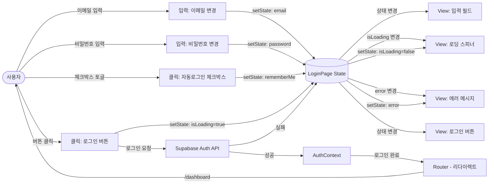
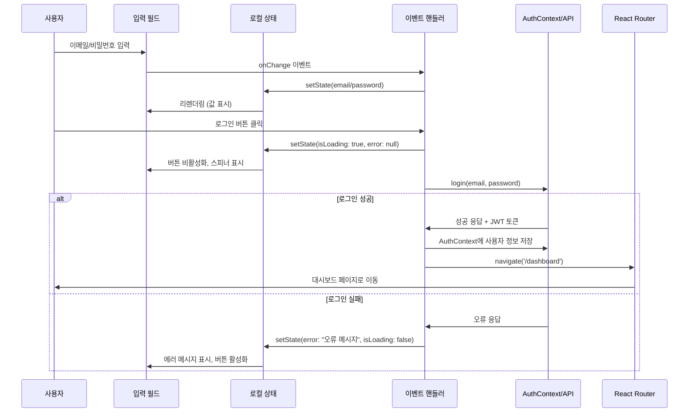

# 로그인 페이지 상태관리 설계

## 1. 상태 필요성 판단

로그인 페이지는 **상태관리가 필요하지 않거나 최소한의 상태만 필요**합니다.

### 이유
1. **단순한 폼 입력**: 이메일과 비밀번호 2개의 입력 필드만 존재
2. **일회성 동작**: 로그인 성공 시 즉시 대시보드로 리다이렉트
3. **컴포넌트 로컬 상태로 충분**: `useState`로 충분히 관리 가능
4. **전역 상태 불필요**: AuthContext는 별도로 관리되며, 로그인 페이지 자체의 상태는 전역화할 필요 없음

## 2. 관리할 데이터 분류

### 2.1 상태 데이터 (useState로 관리)
| 상태명 | 타입 | 초기값 | 설명 |
|--------|------|--------|------|
| email | string | "" | 사용자가 입력한 이메일 |
| password | string | "" | 사용자가 입력한 비밀번호 |
| rememberMe | boolean | false | 자동 로그인 유지 옵션 |
| isLoading | boolean | false | 로그인 API 요청 진행 중 여부 |
| error | string \| null | null | 로그인 오류 메시지 |

### 2.2 화면상에 보이지만 상태가 아닌 것
- **정적 UI 요소**: 로고, 페이지 제목, 안내 문구
- **레이블**: "이메일", "비밀번호", "로그인" 등의 텍스트
- **링크**: "비밀번호 찾기" (기능 구현 전까지는 정적)
- **레이아웃 스타일**: CSS 클래스, 디자인 요소

### 2.3 파생 데이터 (계산 가능한 값)
- **버튼 활성화 여부**: `isLoginDisabled = !email || !password || isLoading`
- **에러 표시 여부**: `showError = error !== null`

## 3. 상태 변경 조건 및 화면 반영

| 상태 | 변경 조건 | 화면 변경 사항 |
|------|-----------|----------------|
| **email** | 사용자가 이메일 입력 필드에 타이핑 | 입력 필드 값 실시간 업데이트 |
| **password** | 사용자가 비밀번호 입력 필드에 타이핑 | 입력 필드 값 실시간 업데이트 (마스킹 처리) |
| **rememberMe** | 사용자가 체크박스 클릭 | 체크박스 선택/해제 상태 토글 |
| **isLoading** | true: 로그인 버튼 클릭 시<br/>false: API 응답 수신 시 | true: 로딩 스피너 표시, 버튼 비활성화<br/>false: 로딩 스피너 제거, 버튼 활성화 |
| **error** | API 응답에서 오류 발생 시 메시지 설정<br/>입력 필드 수정 시 null로 초기화 | error 있을 때: 붉은색 에러 메시지 표시<br/>error 없을 때: 에러 메시지 숨김 |

## 4. Flux 패턴 흐름도 (Mermaid)



## 5. 로컬 상태관리 (useState 방식)

### 5.1 상태 구조 (TypeScript Interface)

```typescript
interface LoginPageState {
  email: string;
  password: string;
  rememberMe: boolean;
  isLoading: boolean;
  error: string | null;
}
```

### 5.2 상태 초기값

```typescript
const initialState: LoginPageState = {
  email: "",
  password: "",
  rememberMe: false,
  isLoading: false,
  error: null,
};
```

### 5.3 노출할 변수 및 함수 (컴포넌트 레벨)

#### 변수 (읽기 전용)
- `email: string` - 현재 이메일 입력값
- `password: string` - 현재 비밀번호 입력값
- `rememberMe: boolean` - 자동 로그인 체크 여부
- `isLoading: boolean` - 로딩 상태
- `error: string | null` - 에러 메시지

#### 함수 (액션)
- `handleEmailChange: (value: string) => void` - 이메일 입력 변경 핸들러
- `handlePasswordChange: (value: string) => void` - 비밀번호 입력 변경 핸들러
- `handleRememberMeChange: (checked: boolean) => void` - 자동 로그인 토글 핸들러
- `handleLogin: () => Promise<void>` - 로그인 실행 핸들러
- `clearError: () => void` - 에러 메시지 초기화

## 6. 컴포넌트 구조

```
LoginPage (컴포넌트)
├── useState (로컬 상태)
│   ├── email
│   ├── password
│   ├── rememberMe
│   ├── isLoading
│   └── error
│
├── useAuth (AuthContext 훅)
│   ├── login(email, password)
│   └── isAuthenticated
│
├── useNavigate (Router 훅)
│   └── navigate('/dashboard')
│
└── UI Components
    ├── EmailInput
    ├── PasswordInput
    ├── RememberMeCheckbox
    ├── LoginButton
    └── ErrorMessage
```

## 7. 데이터 흐름 시각화



## 8. 주요 액션 흐름

### 8.1 이메일 입력 변경
```
사용자 입력 → onChange 이벤트 → handleEmailChange(value)
→ setState({ email: value, error: null }) → 리렌더링
```

### 8.2 로그인 버튼 클릭
```
버튼 클릭 → handleLogin()
→ setState({ isLoading: true, error: null })
→ authService.login(email, password) 호출
→ (성공) AuthContext 업데이트 → navigate('/dashboard')
→ (실패) setState({ error: errorMessage, isLoading: false })
```

### 8.3 입력 필드 클리어 (에러 발생 후)
```
에러 상태에서 입력 필드 수정
→ handleEmailChange 또는 handlePasswordChange
→ setState({ error: null })
```

## 9. 에러 처리 시나리오

| 에러 유형 | 조건 | 에러 메시지 | 화면 동작 |
|-----------|------|-------------|-----------|
| **빈 입력** | email === "" 또는 password === "" | 없음 (버튼 비활성화) | 로그인 버튼 비활성화 |
| **잘못된 자격증명** | API 401 Unauthorized | "이메일 또는 비밀번호가 올바르지 않습니다." | 붉은색 에러 메시지 표시 |
| **네트워크 오류** | API 요청 실패 (Network Error) | "서버에 연결할 수 없습니다. 잠시 후 다시 시도해주세요." | 붉은색 에러 메시지 표시 |
| **이메일 미인증** | API 403 Forbidden (Email not verified) | "이메일 인증이 필요합니다. 인증 메일을 확인해주세요." | 에러 메시지 + "인증 메일 재발송" 버튼 (옵션) |
| **계정 잠금** | API 403 Forbidden (Account locked) | "로그인 시도 횟수를 초과했습니다. 15분 후 다시 시도해주세요." | 에러 메시지 표시, 버튼 비활성화 |

## 10. 성능 최적화 고려사항

### 10.1 불필요한 리렌더링 방지
- 입력 필드 변경 시 debounce 적용하지 않음 (즉각적인 피드백 필요)
- 이메일/비밀번호 입력은 독립적 상태 → 각각 변경 시 전체 리렌더링 발생하지만 경량 컴포넌트이므로 문제 없음

### 10.2 메모이제이션 불필요
- 로그인 페이지는 일회성이며, 계산이 필요한 복잡한 로직이 없음
- `useMemo`, `useCallback` 사용 불필요

## 11. 결론

로그인 페이지는 **Context + useReducer를 사용할 필요가 없으며**, 컴포넌트 로컬의 `useState`로 충분히 관리 가능합니다.

### 이유
1. **상태가 단순함**: 5개의 독립적인 상태만 존재
2. **컴포넌트 범위가 좁음**: 하위 컴포넌트에 상태를 전달할 필요 없음
3. **일회성 동작**: 로그인 성공 시 페이지를 벗어남
4. **AuthContext와 분리**: 인증 상태는 별도의 AuthContext에서 관리

### 권장 구현 방식
- **로컬 상태**: `useState` 사용
- **인증 로직**: `AuthContext` 사용 (별도 관리)
- **폼 검증**: 로컬 함수로 처리
- **API 호출**: `authService.login()` 호출

### 파일 구조
```
frontend/src/presentation/pages/LoginPage.tsx (단일 파일로 충분)
```

### 예시 코드 구조 (인터페이스만)
```typescript
// frontend/src/presentation/pages/LoginPage.tsx
const LoginPage: React.FC = () => {
  // 로컬 상태
  const [email, setEmail] = useState("");
  const [password, setPassword] = useState("");
  const [rememberMe, setRememberMe] = useState(false);
  const [isLoading, setIsLoading] = useState(false);
  const [error, setError] = useState<string | null>(null);

  // Context 및 Router
  const { login } = useAuth();
  const navigate = useNavigate();

  // 핸들러 함수들
  const handleEmailChange = (value: string) => { /* ... */ };
  const handlePasswordChange = (value: string) => { /* ... */ };
  const handleRememberMeChange = (checked: boolean) => { /* ... */ };
  const handleLogin = async () => { /* ... */ };
  const clearError = () => { /* ... */ };

  // JSX 렌더링
  return (
    <div>
      {/* UI 컴포넌트들 */}
    </div>
  );
};
```

---

**문서 버전**: v1.0.0
**작성일**: 2025년 11월 2일
**상태**: 최종 (Context + useReducer 불필요 판단)
