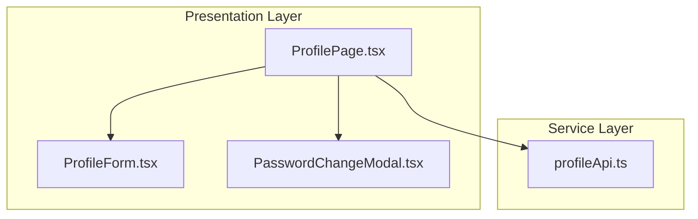

# 프로필 페이지 구현 계획

## 문서 정보
- **버전**: v1.0.0
- **작성일**: 2025년 11월 2일
- **상태**: 최종
- **관련 문서**:
  - `/docs/prd.md` (v1.1.0)
  - `/docs/usecases/006/spec.md` (UC-006: 프로필 관리)
  - `/docs/pages/profile/state.md`
  - `/docs/rules/tdd.md`

---

## 1. 개요

### 1.1 목적
사용자가 본인의 프로필 정보를 조회하고 수정할 수 있는 페이지를 구현합니다.

### 1.2 주요 기능
- 프로필 조회 (이름, 이메일, 부서)
- 프로필 수정 (이름, 부서, 프로필 사진)
- 비밀번호 변경
- 로딩 및 에러 상태

### 1.3 상태 관리 방식
- **로컬 상태(useState)**: 단순한 폼 상태로 Context + useReducer 불필요

### 1.4 구현 모듈 목록

| 모듈명 | 위치 | 설명 |
|--------|------|------|
| **ProfilePage** | `frontend/src/presentation/pages/ProfilePage.tsx` | 프로필 페이지 메인 컴포넌트 |
| **ProfileForm** | `frontend/src/presentation/components/profile/ProfileForm.tsx` | 프로필 수정 폼 |
| **PasswordChangeModal** | `frontend/src/presentation/components/profile/PasswordChangeModal.tsx` | 비밀번호 변경 모달 |
| **profileApi** | `frontend/src/services/api/profileApi.ts` | 프로필 API 클라이언트 |

---

## 2. 아키텍처 다이어그램

### 2.1 모듈 관계도



### 2.2 상태 관리 구조

```mermaid
flowchart TB
    subgraph Local State
        S1[profile: name, email, department]
        S2[isEditing: boolean]
        S3[editedName, editedDepartment]
        S4[isPasswordModalOpen: boolean]
        S5[isLoading: boolean]
        S6[error: string | null]
    end

    subgraph Actions
        A1[fetchProfile]
        A2[startEditing]
        A3[cancelEditing]
        A4[saveProfile]
        A5[openPasswordModal]
        A6[changePassword]
    end

    Actions --> |setState| Local State
    Local State --> |re-render| View
```

---

## 3. 구현 계획 (TDD 기반)

### 3.1 구현 순서

#### 단계 1: Profile API (Service Layer)

##### RED: 테스트 작성
```typescript
// frontend/src/services/api/__tests__/profileApi.test.ts
describe('profileApi', () => {
  it('getProfile이 프로필 데이터를 반환해야 함', async () => {
    const mockProfile = { name: '홍길동', email: 'hong@example.com', department: '컴퓨터공학과' };
    (axiosClient.get as jest.Mock).mockResolvedValue({ data: mockProfile });

    const result = await profileApi.getProfile();

    expect(axiosClient.get).toHaveBeenCalledWith('/api/accounts/profile/');
    expect(result).toEqual(mockProfile);
  });

  it('updateProfile이 프로필을 업데이트해야 함', async () => {
    const updatedProfile = { name: '홍길동', department: '전자공학과' };
    (axiosClient.patch as jest.Mock).mockResolvedValue({ data: updatedProfile });

    const result = await profileApi.updateProfile(updatedProfile);

    expect(axiosClient.patch).toHaveBeenCalledWith('/api/accounts/profile/', updatedProfile);
    expect(result).toEqual(updatedProfile);
  });

  it('changePassword가 비밀번호를 변경해야 함', async () => {
    (axiosClient.post as jest.Mock).mockResolvedValue({ data: { message: 'Success' } });

    await profileApi.changePassword('oldPassword', 'newPassword');

    expect(axiosClient.post).toHaveBeenCalledWith('/api/accounts/change-password/', {
      old_password: 'oldPassword',
      new_password: 'newPassword',
    });
  });
});
```

**실행**: `npm test profileApi.test.ts` → **실패/통과 확인**

##### GREEN: 구현
```typescript
// frontend/src/services/api/profileApi.ts
import { axiosClient } from '@/infrastructure/external/axiosClient';

export interface Profile {
  name: string;
  email: string;
  department: string;
  profilePhoto?: string;
}

export const profileApi = {
  async getProfile(): Promise<Profile> {
    const response = await axiosClient.get('/api/accounts/profile/');
    return response.data;
  },

  async updateProfile(data: Partial<Profile>): Promise<Profile> {
    const response = await axiosClient.patch('/api/accounts/profile/', data);
    return response.data;
  },

  async changePassword(oldPassword: string, newPassword: string): Promise<void> {
    await axiosClient.post('/api/accounts/change-password/', {
      old_password: oldPassword,
      new_password: newPassword,
    });
  },
};
```

---

#### 단계 2-5: UI 컴포넌트

**구현 순서**:
1. **ProfileForm** - 프로필 수정 폼 (QA Sheet)
2. **PasswordChangeModal** - 비밀번호 변경 모달 (QA Sheet)
3. **ProfilePage** - 메인 페이지 통합 (Integration Test)
4. **E2E 테스트** - 프로필 수정 시나리오

---

## 4. 파일 구조

```
frontend/src/
├── presentation/
│   ├── pages/
│   │   └── ProfilePage.tsx
│   └── components/
│       └── profile/
│           ├── ProfileForm.tsx
│           └── PasswordChangeModal.tsx
│
└── services/
    └── api/
        └── profileApi.ts
```

---

## 5. 구현 우선순위

| 단계 | 예상 시간 |
|------|-----------|
| Phase 1: API | 6시간 |
| Phase 2: UI 컴포넌트 | 12시간 |
| Phase 3: 메인 페이지 | 4시간 |
| Phase 4: E2E 테스트 | 2시간 |
| **총합** | **24시간 (약 5일)** |

---

## 6. 테스트 체크리스트

- [ ] profileApi (5개 테스트)
- [ ] ProfileForm QA Sheet (8개 항목)
- [ ] PasswordChangeModal QA Sheet (6개 항목)
- [ ] ProfilePage 통합 테스트 (4개 테스트)
- [ ] E2E 테스트 (2개 시나리오)

---

## 7. 완료 조건

- [x] 모든 Unit Tests 통과
- [x] 모든 Integration Tests 통과
- [x] 모든 E2E Tests 통과
- [x] 테스트 커버리지 80% 이상
- [x] 프로필 수정 정상 작동
- [x] 비밀번호 변경 정상 작동

---

**문서 작성 완료**
**모든 페이지 구현 계획 완료**
