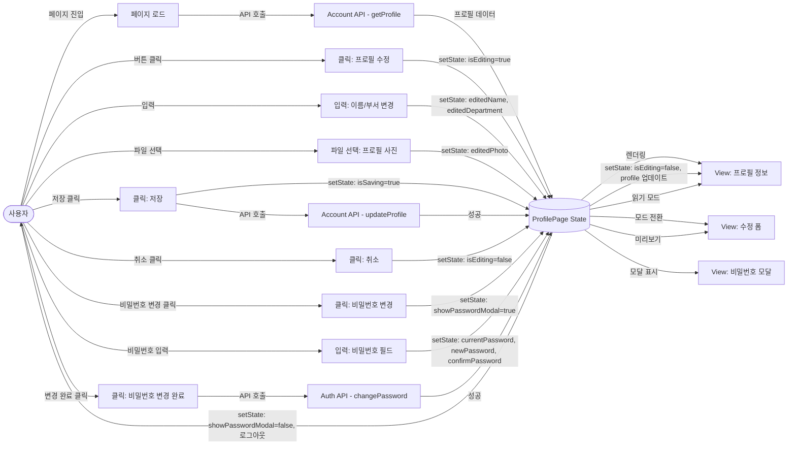
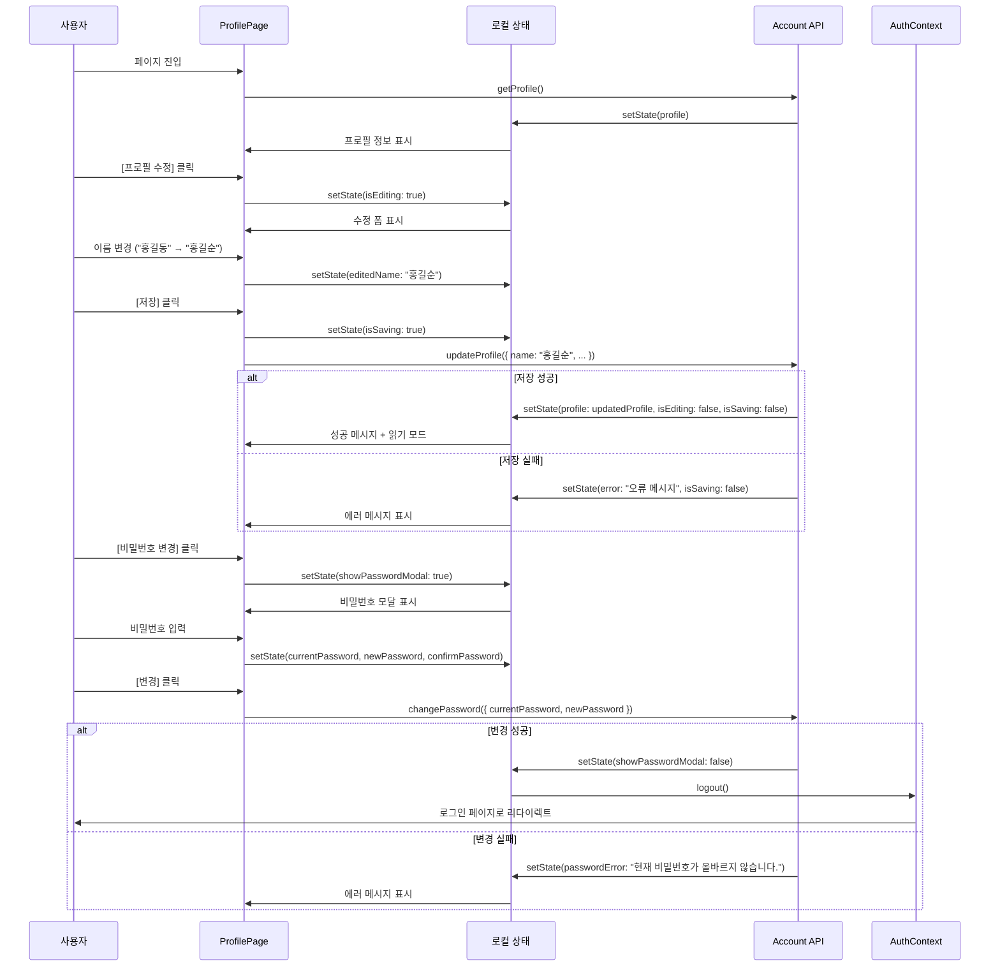

# 프로필 페이지 상태관리 설계

## 1. 상태 필요성 판단

프로필 페이지는 **useState를 사용한 로컬 상태관리로 충분**합니다.

### 이유
1. **단순한 CRUD 기능**: 프로필 조회, 수정, 비밀번호 변경
2. **컴포넌트 범위가 좁음**: 단일 페이지 내에서만 사용
3. **하위 컴포넌트 적음**: 프로필 표시 영역, 수정 폼, 비밀번호 변경 모달 정도
4. **AuthContext 분리**: 인증 상태는 별도의 AuthContext에서 관리

## 2. 관리할 데이터 분류

### 2.1 상태 데이터 (useState로 관리)

| 상태명 | 타입 | 초기값 | 설명 |
|--------|------|--------|------|
| profile | UserProfile \| null | null | 사용자 프로필 정보 |
| isEditing | boolean | false | 프로필 수정 모드 여부 |
| isLoading | boolean | false | 데이터 로딩 중 여부 |
| isSaving | boolean | false | 저장 중 여부 |
| error | string \| null | null | 에러 메시지 |
| showPasswordModal | boolean | false | 비밀번호 변경 모달 표시 여부 |

### 2.2 수정 폼 상태 (isEditing=true일 때)

| 상태명 | 타입 | 초기값 | 설명 |
|--------|------|--------|------|
| editedName | string | "" | 수정 중인 이름 |
| editedDepartment | string | "" | 수정 중인 부서 |
| editedPhoto | File \| null | null | 수정 중인 프로필 사진 |

### 2.3 비밀번호 변경 폼 상태 (showPasswordModal=true일 때)

| 상태명 | 타입 | 초기값 | 설명 |
|--------|------|--------|------|
| currentPassword | string | "" | 현재 비밀번호 |
| newPassword | string | "" | 새 비밀번호 |
| confirmPassword | string | "" | 새 비밀번호 확인 |
| passwordError | string \| null | null | 비밀번호 관련 에러 |

### 2.4 화면상에 보이지만 상태가 아닌 것
- **정적 UI 요소**: 페이지 제목, 섹션 헤더, 라벨
- **버튼 텍스트**: "프로필 수정", "비밀번호 변경", "저장", "취소"
- **안내 문구**: "최대 2MB", "JPG/PNG만 가능"

### 2.5 파생 데이터 (계산 가능한 값)
- **canSave**: `editedName !== "" && !isSaving`
- **passwordsMatch**: `newPassword === confirmPassword`
- **isPasswordValid**: `newPassword.length >= 8 && /[A-Za-z]/.test(newPassword) && /[0-9]/.test(newPassword)`

## 3. 상태 변경 조건 및 화면 반영

| 상태 | 변경 조건 | 화면 변경 사항 |
|------|-----------|----------------|
| **profile** | 페이지 로드 시 API 호출 | 프로필 정보 표시 (이름, 이메일, 부서, 역할, 가입일, 사진) |
| **isEditing** | true: [프로필 수정] 클릭<br/>false: [취소] 또는 저장 성공 | true: 입력 필드 활성화, [저장] [취소] 버튼 표시<br/>false: 읽기 모드, [프로필 수정] 버튼 표시 |
| **isLoading** | true: API 요청 시작<br/>false: API 응답 수신 | true: 스켈레톤 UI 또는 스피너<br/>false: 데이터 표시 |
| **isSaving** | true: [저장] 클릭<br/>false: 저장 완료 또는 실패 | true: 버튼 비활성화, 로딩 스피너<br/>false: 버튼 활성화 |
| **error** | API 오류 발생 시 | 붉은색 에러 메시지 표시 |
| **showPasswordModal** | true: [비밀번호 변경] 클릭<br/>false: 모달 [닫기] 또는 변경 완료 | true: 비밀번호 변경 모달 표시<br/>false: 모달 숨김 |
| **editedPhoto** | 사진 파일 선택 시 | 미리보기 이미지 표시 |

## 4. Flux 패턴 흐름도 (Mermaid)



## 5. 로컬 상태관리 (useState 방식)

### 5.1 상태 구조 (TypeScript Interface)

```typescript
// 사용자 프로필 타입
interface UserProfile {
  id: string;
  name: string;
  email: string;
  department: string;
  role: string;
  photoUrl: string | null;
  createdAt: string; // ISO 8601
}

// 프로필 페이지 상태 (개별 useState로 관리)
interface ProfilePageState {
  // 데이터
  profile: UserProfile | null;
  // 수정 모드
  isEditing: boolean;
  editedName: string;
  editedDepartment: string;
  editedPhoto: File | null;
  // UI 상태
  isLoading: boolean;
  isSaving: boolean;
  error: string | null;
  // 비밀번호 변경
  showPasswordModal: boolean;
  currentPassword: string;
  newPassword: string;
  confirmPassword: string;
  passwordError: string | null;
}
```

### 5.2 노출할 변수 및 함수 (컴포넌트 레벨)

#### 변수 (읽기 전용)
- `profile: UserProfile | null` - 프로필 정보
- `isEditing: boolean` - 수정 모드 여부
- `isLoading: boolean` - 로딩 상태
- `isSaving: boolean` - 저장 중 상태
- `error: string | null` - 에러 메시지
- `showPasswordModal: boolean` - 비밀번호 모달 표시 여부

#### 함수 (액션)
- `loadProfile: () => Promise<void>` - 프로필 데이터 로드
- `startEditing: () => void` - 수정 모드 시작
- `cancelEditing: () => void` - 수정 모드 취소
- `handleNameChange: (value: string) => void` - 이름 변경
- `handleDepartmentChange: (value: string) => void` - 부서 변경
- `handlePhotoChange: (file: File | null) => void` - 사진 변경
- `saveProfile: () => Promise<void>` - 프로필 저장
- `openPasswordModal: () => void` - 비밀번호 모달 열기
- `closePasswordModal: () => void` - 비밀번호 모달 닫기
- `handlePasswordChange: () => Promise<void>` - 비밀번호 변경

## 6. 컴포넌트 구조

```
ProfilePage (컴포넌트)
├── useState (로컬 상태들)
│   ├── profile
│   ├── isEditing
│   ├── editedName
│   ├── editedDepartment
│   ├── editedPhoto
│   ├── isLoading
│   ├── isSaving
│   ├── error
│   ├── showPasswordModal
│   ├── currentPassword
│   ├── newPassword
│   ├── confirmPassword
│   └── passwordError
│
├── useAuth (AuthContext 훅)
│   ├── user
│   └── logout
│
├── useEffect (프로필 로드)
│   └── loadProfile()
│
└── UI Components
    ├── ProfileHeader
    │   └── ProfilePhoto
    │
    ├── ProfileInfo (isEditing=false)
    │   ├── InfoField (이름, 이메일, 부서, 역할, 가입일)
    │   └── ActionButtons ([프로필 수정], [비밀번호 변경])
    │
    ├── ProfileEditForm (isEditing=true)
    │   ├── NameInput
    │   ├── DepartmentInput
    │   ├── PhotoUpload
    │   └── ActionButtons ([저장], [취소])
    │
    └── PasswordChangeModal (showPasswordModal=true)
        ├── CurrentPasswordInput
        ├── NewPasswordInput
        ├── ConfirmPasswordInput
        └── ActionButtons ([변경], [취소])
```

## 7. 데이터 흐름 시각화



## 8. 주요 액션 흐름

### 8.1 프로필 로드
```
페이지 마운트 → useEffect 실행
→ setIsLoading(true)
→ accountApi.getProfile() 호출
→ (성공) setProfile(data), setIsLoading(false)
→ (실패) setError(error.message), setIsLoading(false)
```

### 8.2 프로필 수정
```
사용자가 [프로필 수정] 클릭
→ startEditing() 호출
→ setIsEditing(true)
→ setEditedName(profile.name)
→ setEditedDepartment(profile.department)
→ 입력 필드 활성화

사용자가 이름 변경
→ handleNameChange(value)
→ setEditedName(value)

사용자가 사진 선택
→ handlePhotoChange(file)
→ setEditedPhoto(file)
→ 미리보기 이미지 표시

사용자가 [저장] 클릭
→ saveProfile() 호출
→ setIsSaving(true)
→ accountApi.updateProfile({ name, department, photo })
→ (성공) setProfile(updatedProfile), setIsEditing(false), setIsSaving(false)
→ (실패) setError(error.message), setIsSaving(false)
```

### 8.3 프로필 수정 취소
```
사용자가 [취소] 클릭
→ cancelEditing() 호출
→ setIsEditing(false)
→ setEditedName("")
→ setEditedDepartment("")
→ setEditedPhoto(null)
→ 읽기 모드로 전환
```

### 8.4 비밀번호 변경
```
사용자가 [비밀번호 변경] 클릭
→ openPasswordModal() 호출
→ setShowPasswordModal(true)
→ 모달 표시

사용자가 비밀번호 입력
→ setCurrentPassword(value)
→ setNewPassword(value)
→ setConfirmPassword(value)

사용자가 [변경] 클릭
→ handlePasswordChange() 호출
→ 검증: newPassword === confirmPassword
→ 검증: 비밀번호 강도 (8자 이상, 영문+숫자)
→ authService.changePassword({ currentPassword, newPassword })
→ (성공) setShowPasswordModal(false), logout(), navigate('/login')
→ (실패) setPasswordError(error.message)
```

## 9. 에러 처리 시나리오

| 에러 유형 | 조건 | 에러 메시지 | 화면 동작 |
|-----------|------|-------------|-----------|
| **프로필 로드 실패** | API 오류 | "프로필을 불러올 수 없습니다. 다시 시도해주세요." | 에러 배너 + [다시 시도] 버튼 |
| **사진 크기 초과** | fileSize > 2MB | "프로필 사진은 2MB 이하여야 합니다." | 붉은색 에러 메시지, 파일 선택 취소 |
| **사진 형식 오류** | !fileName.match(/\.(jpg\|png\|jpeg)$/) | "JPG 또는 PNG 파일만 가능합니다." | 붉은색 에러 메시지, 파일 선택 취소 |
| **현재 비밀번호 불일치** | API 401 응답 | "현재 비밀번호가 올바르지 않습니다." | 비밀번호 모달 내 에러 메시지 |
| **새 비밀번호 불일치** | newPassword !== confirmPassword | "비밀번호가 일치하지 않습니다." | 인라인 에러 메시지 (실시간 검증) |
| **약한 비밀번호** | 길이 < 8 또는 복잡도 부족 | "비밀번호는 8자 이상, 영문, 숫자를 포함해야 합니다." | 인라인 에러 메시지 (실시간 검증) |

## 10. 성능 최적화 고려사항

### 10.1 불필요한 리렌더링 방지
- 프로필 정보 표시 영역과 수정 폼 영역을 별도 컴포넌트로 분리
- `React.memo`로 정적 섹션 메모이제이션

### 10.2 이미지 최적화
- 프로필 사진 업로드 전 클라이언트 측 리사이징 (최대 500x500px)
- 미리보기에 `URL.createObjectURL()` 사용

### 10.3 검증 로직 최적화
- 비밀번호 입력 필드에 debounce 적용 (실시간 검증)

## 11. 파일 구조

```
frontend/src/
├── presentation/
│   ├── pages/
│   │   └── ProfilePage.tsx (단일 파일로 충분)
│   │
│   └── components/
│       └── profile/
│           ├── ProfileHeader.tsx
│           ├── ProfileInfo.tsx
│           ├── ProfileEditForm.tsx
│           └── PasswordChangeModal.tsx
│
├── domain/
│   └── models/
│       └── User.ts
│
└── services/
    └── api/
        └── accountApi.ts
```

## 12. 예시 코드 구조 (인터페이스만)

```typescript
// frontend/src/presentation/pages/ProfilePage.tsx

const ProfilePage: React.FC = () => {
  // 데이터 상태
  const [profile, setProfile] = useState<UserProfile | null>(null);

  // 수정 모드 상태
  const [isEditing, setIsEditing] = useState(false);
  const [editedName, setEditedName] = useState("");
  const [editedDepartment, setEditedDepartment] = useState("");
  const [editedPhoto, setEditedPhoto] = useState<File | null>(null);

  // UI 상태
  const [isLoading, setIsLoading] = useState(false);
  const [isSaving, setIsSaving] = useState(false);
  const [error, setError] = useState<string | null>(null);

  // 비밀번호 변경 상태
  const [showPasswordModal, setShowPasswordModal] = useState(false);
  const [currentPassword, setCurrentPassword] = useState("");
  const [newPassword, setNewPassword] = useState("");
  const [confirmPassword, setConfirmPassword] = useState("");
  const [passwordError, setPasswordError] = useState<string | null>(null);

  // Context 및 API
  const { user, logout } = useAuth();
  const accountApi = useMemo(() => new AccountApiService(), []);

  // 프로필 로드 (초기 로딩)
  useEffect(() => {
    const loadProfile = async () => {
      setIsLoading(true);
      try {
        const data = await accountApi.getProfile();
        setProfile(data);
      } catch (error) {
        setError(error.message);
      } finally {
        setIsLoading(false);
      }
    };

    loadProfile();
  }, [accountApi]);

  // 핸들러 함수들
  const startEditing = () => { /* ... */ };
  const cancelEditing = () => { /* ... */ };
  const handleNameChange = (value: string) => { /* ... */ };
  const handleDepartmentChange = (value: string) => { /* ... */ };
  const handlePhotoChange = (file: File | null) => { /* ... */ };
  const saveProfile = async () => { /* ... */ };
  const openPasswordModal = () => { /* ... */ };
  const closePasswordModal = () => { /* ... */ };
  const handlePasswordChange = async () => { /* ... */ };

  // JSX 렌더링
  return (
    <div>
      {isLoading && <LoadingSpinner />}
      {error && <ErrorBanner message={error} />}

      {!isEditing ? (
        <ProfileInfo
          profile={profile}
          onEdit={startEditing}
          onChangePassword={openPasswordModal}
        />
      ) : (
        <ProfileEditForm
          editedName={editedName}
          editedDepartment={editedDepartment}
          editedPhoto={editedPhoto}
          onNameChange={handleNameChange}
          onDepartmentChange={handleDepartmentChange}
          onPhotoChange={handlePhotoChange}
          onSave={saveProfile}
          onCancel={cancelEditing}
          isSaving={isSaving}
        />
      )}

      {showPasswordModal && (
        <PasswordChangeModal
          currentPassword={currentPassword}
          newPassword={newPassword}
          confirmPassword={confirmPassword}
          error={passwordError}
          onCurrentPasswordChange={setCurrentPassword}
          onNewPasswordChange={setNewPassword}
          onConfirmPasswordChange={setConfirmPassword}
          onSubmit={handlePasswordChange}
          onClose={closePasswordModal}
        />
      )}
    </div>
  );
};
```

## 13. 결론

프로필 페이지는 **Context + useReducer를 사용할 필요가 없으며**, 컴포넌트 로컬의 `useState`로 충분히 관리 가능합니다.

### 이유
1. **상태가 단순함**: 프로필 정보, 수정 폼 상태, 비밀번호 변경 폼 상태
2. **컴포넌트 범위가 좁음**: 단일 페이지 내에서만 사용
3. **하위 컴포넌트 적음**: 프로필 표시, 수정 폼, 비밀번호 모달 정도
4. **AuthContext와 분리**: 인증 상태는 별도 Context에서 관리

### 권장 구현 방식
- **로컬 상태**: `useState` 사용
- **인증 로직**: `AuthContext` 사용 (별도 관리)
- **API 호출**: `accountApi.getProfile()`, `accountApi.updateProfile()` 등
- **폼 검증**: 로컬 함수로 처리

### 로그인 페이지와의 차이점
- 로그인 페이지보다 상태가 다소 많지만, 여전히 로컬 상태로 충분
- 수정 모드 전환, 파일 업로드, 모달 관리 등이 추가되지만 복잡도는 낮음

---

**문서 버전**: v1.0.0
**작성일**: 2025년 11월 2일
**상태**: 최종 (Context + useReducer 불필요 판단)
