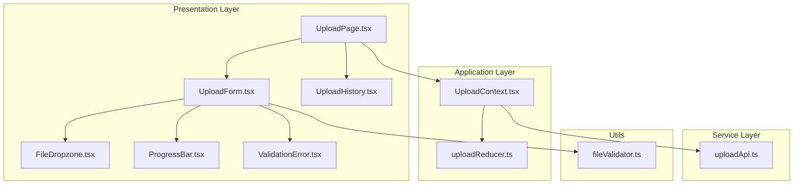
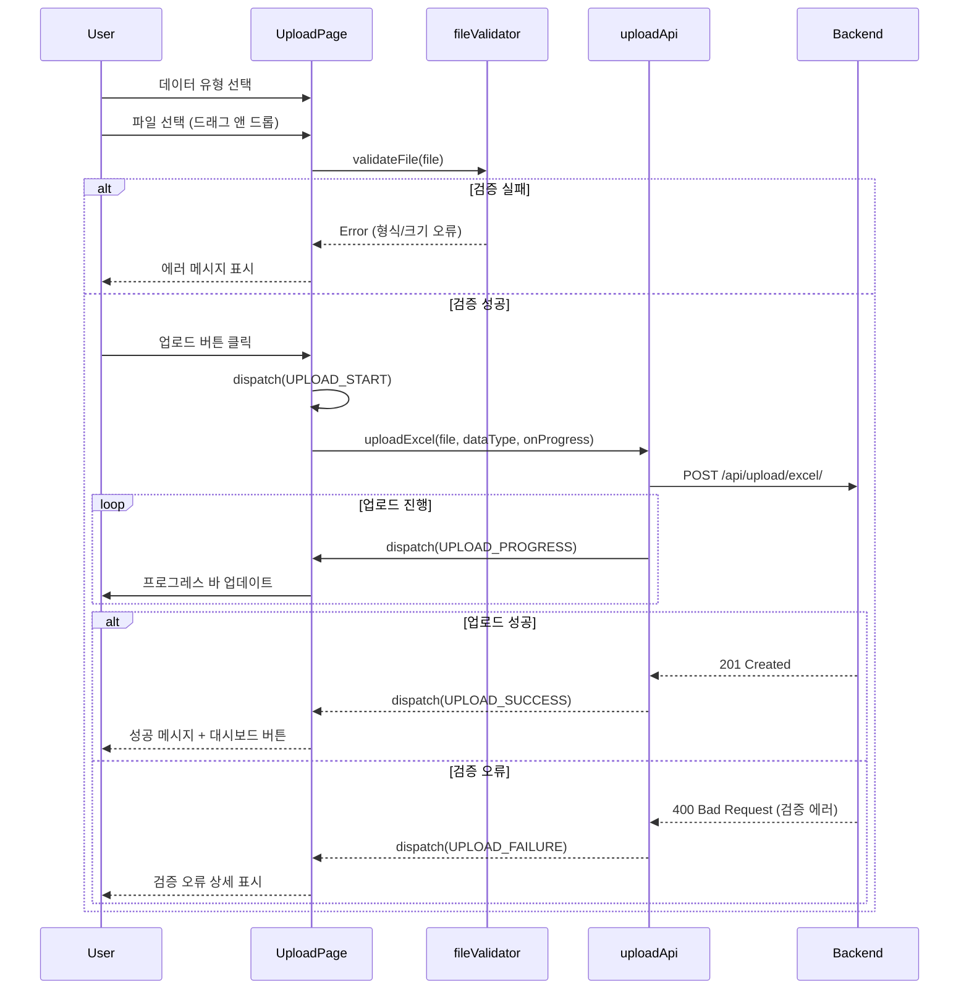

# 데이터 업로드 페이지 구현 계획

## 문서 정보
- **버전**: v1.0.0
- **작성일**: 2025년 11월 2일
- **상태**: 최종
- **관련 문서**:
  - `/docs/prd.md` (v1.1.0)
  - `/docs/usecases/003/spec.md` (UC-003: Excel 파일 업로드)
  - `/docs/pages/upload/state.md`
  - `/docs/rules/tdd.md`

---

## 1. 개요

### 1.1 목적
관리자가 4가지 데이터 유형(학과 KPI, 논문, 연구 과제, 학생 명단)의 Excel 파일을 업로드하여 데이터베이스에 저장할 수 있는 페이지를 구현합니다.

### 1.2 주요 기능
- 관리자 권한 검증
- 데이터 유형 선택 (4가지)
- 파일 드래그 앤 드롭 또는 선택
- 클라이언트 측 파일 검증 (형식, 크기)
- 서버로 파일 업로드 (멀티파트 폼 데이터)
- 업로드 진행률 표시 (프로그레스 바)
- 서버 응답 처리 (성공/실패)
- 검증 오류 처리 (필수 컬럼 누락, 데이터 타입 오류, 중복 데이터)
- 업로드 이력 표시 (과거 30일간)
- 에러 상태 및 재시도

### 1.3 상태 관리 방식
- **Context + useReducer**: 복잡한 비동기 업로드 흐름과 다양한 에러 상태 관리 필요

### 1.4 구현 모듈 목록

| 모듈명 | 위치 | 설명 |
|--------|------|------|
| **UploadPage** | `frontend/src/presentation/pages/UploadPage.tsx` | 업로드 페이지 메인 컴포넌트 |
| **UploadContext** | `frontend/src/application/contexts/UploadContext.tsx` | 업로드 상태 전역 관리 |
| **uploadReducer** | `frontend/src/application/contexts/uploadReducer.ts` | 업로드 상태 Reducer |
| **UploadForm** | `frontend/src/presentation/components/upload/UploadForm.tsx` | 업로드 폼 (데이터 유형 선택 + 파일 선택) |
| **FileDropzone** | `frontend/src/presentation/components/upload/FileDropzone.tsx` | 드래그 앤 드롭 영역 |
| **ProgressBar** | `frontend/src/presentation/components/upload/ProgressBar.tsx` | 업로드 진행률 표시 |
| **ValidationError** | `frontend/src/presentation/components/upload/ValidationError.tsx` | 검증 오류 표시 (행별 에러) |
| **UploadHistory** | `frontend/src/presentation/components/upload/UploadHistory.tsx` | 업로드 이력 테이블 |
| **uploadApi** | `frontend/src/services/api/uploadApi.ts` | 업로드 API 클라이언트 |
| **fileValidator** | `frontend/src/utils/fileValidator.ts` | 파일 검증 유틸리티 |

---

## 2. 아키텍처 다이어그램

### 2.1 모듈 관계도



### 2.2 상태 관리 구조

```mermaid
flowchart TB
    subgraph State
        S1[file: File | null]
        S2[dataType: string]
        S3[upload: progress, isUploading]
        S4[result: success, rows_processed]
        S5[ui: error, validationErrors]
    end

    subgraph Actions
        A1[SELECT_FILE]
        A2[SELECT_DATA_TYPE]
        A3[UPLOAD_START]
        A4[UPLOAD_PROGRESS]
        A5[UPLOAD_SUCCESS]
        A6[UPLOAD_FAILURE]
        A7[RESET_UPLOAD]
    end

    Actions --> |dispatch| Reducer
    Reducer --> |update| State
    State --> |re-render| View
```

### 2.3 데이터 흐름



---

## 3. 구현 계획 (TDD 기반)

### 3.1 TDD 프로세스 개요

**FIRST 원칙 준수**:
- **Fast**: 외부 API Mock, 각 테스트 100ms 이내
- **Independent**: `beforeEach`로 상태 초기화
- **Repeatable**: 동일 환경에서 반복 가능
- **Self-validating**: expect 문으로 자동 검증
- **Timely**: 구현 전 테스트 작성

**테스트 피라미드 비율**:
- Unit Tests: 70% (Reducer, Validator, 유틸리티)
- Integration Tests: 20% (Context + API 통합)
- E2E Tests: 10% (업로드 시나리오)

---

### 3.2 구현 순서

#### 단계 1: 파일 검증 유틸리티 (Utils Layer)

**파일**: `frontend/src/utils/fileValidator.ts`

##### RED: 테스트 작성
```typescript
// frontend/src/utils/__tests__/fileValidator.test.ts
describe('fileValidator', () => {
  it('올바른 확장자일 때 true를 반환해야 함', () => {
    const file = new File([], 'data.xlsx', { type: 'application/vnd.openxmlformats-officedocument.spreadsheetml.sheet' });
    expect(validateFileExtension(file)).toBe(true);
  });

  it('잘못된 확장자일 때 false를 반환해야 함', () => {
    const file = new File([], 'data.pdf', { type: 'application/pdf' });
    expect(validateFileExtension(file)).toBe(false);
  });

  it('파일 크기가 10MB 이하일 때 true를 반환해야 함', () => {
    const file = new File(['a'.repeat(5 * 1024 * 1024)], 'data.xlsx');
    expect(validateFileSize(file, 10 * 1024 * 1024)).toBe(true);
  });

  it('파일 크기가 10MB 초과일 때 false를 반환해야 함', () => {
    const file = new File(['a'.repeat(15 * 1024 * 1024)], 'data.xlsx');
    expect(validateFileSize(file, 10 * 1024 * 1024)).toBe(false);
  });
});
```

**실행**: `npm test fileValidator.test.ts` → **실패 확인**

##### GREEN: 구현
```typescript
// frontend/src/utils/fileValidator.ts
const ALLOWED_EXTENSIONS = ['.xlsx', '.csv'];
const MAX_FILE_SIZE = 10 * 1024 * 1024; // 10MB

export const validateFileExtension = (file: File): boolean => {
  const extension = file.name.substring(file.name.lastIndexOf('.')).toLowerCase();
  return ALLOWED_EXTENSIONS.includes(extension);
};

export const validateFileSize = (file: File, maxSize: number = MAX_FILE_SIZE): boolean => {
  return file.size <= maxSize;
};

export const validateFile = (file: File): { valid: boolean; error?: string } => {
  if (!validateFileExtension(file)) {
    return { valid: false, error: 'Excel 파일(.xlsx, .csv)만 업로드 가능합니다' };
  }

  if (!validateFileSize(file)) {
    const sizeMB = (file.size / (1024 * 1024)).toFixed(2);
    return { valid: false, error: `파일 크기가 10MB를 초과합니다 (현재: ${sizeMB}MB)` };
  }

  return { valid: true };
};
```

**실행**: `npm test fileValidator.test.ts` → **통과 확인**

---

#### 단계 2: Upload Reducer (Application Layer)

**파일**: `frontend/src/application/contexts/uploadReducer.ts`

##### RED: 테스트 작성
```typescript
// frontend/src/application/contexts/__tests__/uploadReducer.test.ts
describe('uploadReducer', () => {
  it('SELECT_FILE 액션 시 파일을 설정해야 함', () => {
    const file = new File([], 'data.xlsx');
    const state = uploadReducer(initialState, {
      type: 'SELECT_FILE',
      payload: file,
    });

    expect(state.file).toBe(file);
  });

  it('UPLOAD_START 액션 시 isUploading을 true로 설정해야 함', () => {
    const state = uploadReducer(initialState, { type: 'UPLOAD_START' });

    expect(state.upload.isUploading).toBe(true);
    expect(state.upload.progress).toBe(0);
    expect(state.ui.error).toBeNull();
  });

  it('UPLOAD_PROGRESS 액션 시 진행률을 업데이트해야 함', () => {
    const state = uploadReducer(initialState, {
      type: 'UPLOAD_PROGRESS',
      payload: 50,
    });

    expect(state.upload.progress).toBe(50);
  });

  it('UPLOAD_SUCCESS 액션 시 결과를 설정하고 isUploading을 false로 설정해야 함', () => {
    const result = { id: 1, filename: 'data.xlsx', rows_processed: 100 };
    const state = uploadReducer(initialState, {
      type: 'UPLOAD_SUCCESS',
      payload: result,
    });

    expect(state.result).toEqual(result);
    expect(state.upload.isUploading).toBe(false);
    expect(state.upload.progress).toBe(100);
  });

  it('UPLOAD_FAILURE 액션 시 에러를 설정해야 함', () => {
    const error = '파일이 손상되었습니다';
    const state = uploadReducer(initialState, {
      type: 'UPLOAD_FAILURE',
      payload: error,
    });

    expect(state.ui.error).toBe(error);
    expect(state.upload.isUploading).toBe(false);
  });

  it('RESET_UPLOAD 액션 시 상태를 초기화해야 함', () => {
    const state = uploadReducer(
      { ...initialState, file: new File([], 'data.xlsx') },
      { type: 'RESET_UPLOAD' }
    );

    expect(state.file).toBeNull();
    expect(state.result).toBeNull();
    expect(state.ui.error).toBeNull();
  });
});
```

**실행**: `npm test uploadReducer.test.ts` → **실패 확인**

##### GREEN: 구현
```typescript
// frontend/src/application/contexts/uploadReducer.ts
export interface UploadState {
  file: File | null;
  dataType: string;
  upload: {
    isUploading: boolean;
    progress: number;
  };
  result: {
    id: number;
    filename: string;
    rows_processed: number;
  } | null;
  ui: {
    error: string | null;
    validationErrors: Array<{ row: number; message: string }>;
  };
}

export const initialState: UploadState = {
  file: null,
  dataType: '',
  upload: {
    isUploading: false,
    progress: 0,
  },
  result: null,
  ui: {
    error: null,
    validationErrors: [],
  },
};

export type UploadAction =
  | { type: 'SELECT_FILE'; payload: File }
  | { type: 'SELECT_DATA_TYPE'; payload: string }
  | { type: 'UPLOAD_START' }
  | { type: 'UPLOAD_PROGRESS'; payload: number }
  | { type: 'UPLOAD_SUCCESS'; payload: { id: number; filename: string; rows_processed: number } }
  | { type: 'UPLOAD_FAILURE'; payload: string }
  | { type: 'VALIDATION_ERROR'; payload: Array<{ row: number; message: string }> }
  | { type: 'RESET_UPLOAD' };

export const uploadReducer = (state: UploadState, action: UploadAction): UploadState => {
  switch (action.type) {
    case 'SELECT_FILE':
      return {
        ...state,
        file: action.payload,
        ui: { error: null, validationErrors: [] },
      };

    case 'SELECT_DATA_TYPE':
      return {
        ...state,
        dataType: action.payload,
      };

    case 'UPLOAD_START':
      return {
        ...state,
        upload: {
          isUploading: true,
          progress: 0,
        },
        ui: { error: null, validationErrors: [] },
      };

    case 'UPLOAD_PROGRESS':
      return {
        ...state,
        upload: {
          ...state.upload,
          progress: action.payload,
        },
      };

    case 'UPLOAD_SUCCESS':
      return {
        ...state,
        result: action.payload,
        upload: {
          isUploading: false,
          progress: 100,
        },
        ui: { error: null, validationErrors: [] },
      };

    case 'UPLOAD_FAILURE':
      return {
        ...state,
        upload: {
          isUploading: false,
          progress: 0,
        },
        ui: { ...state.ui, error: action.payload },
      };

    case 'VALIDATION_ERROR':
      return {
        ...state,
        upload: {
          isUploading: false,
          progress: 0,
        },
        ui: { error: '데이터 검증 오류', validationErrors: action.payload },
      };

    case 'RESET_UPLOAD':
      return initialState;

    default:
      return state;
  }
};
```

**실행**: `npm test uploadReducer.test.ts` → **통과 확인**

---

#### 단계 3: Upload API (Service Layer)

**파일**: `frontend/src/services/api/uploadApi.ts`

##### RED: 테스트 작성
```typescript
// frontend/src/services/api/__tests__/uploadApi.test.ts
import { uploadApi } from '../uploadApi';
import { axiosClient } from '@/infrastructure/external/axiosClient';

jest.mock('@/infrastructure/external/axiosClient');

describe('uploadApi', () => {
  it('uploadExcel이 파일과 데이터 유형을 전송해야 함', async () => {
    const file = new File([], 'data.xlsx');
    const dataType = 'department_kpi';
    const mockResponse = {
      data: { id: 1, filename: 'data.xlsx', rows_processed: 100 },
    };

    (axiosClient.post as jest.Mock).mockResolvedValue(mockResponse);

    const result = await uploadApi.uploadExcel(file, dataType);

    expect(axiosClient.post).toHaveBeenCalledWith(
      '/api/upload/excel/',
      expect.any(FormData),
      expect.objectContaining({
        headers: { 'Content-Type': 'multipart/form-data' },
      })
    );
    expect(result).toEqual(mockResponse.data);
  });

  it('uploadExcel이 진행률 콜백을 호출해야 함', async () => {
    const file = new File([], 'data.xlsx');
    const dataType = 'department_kpi';
    const onProgress = jest.fn();

    (axiosClient.post as jest.Mock).mockImplementation((url, data, config) => {
      config.onUploadProgress({ loaded: 50, total: 100 });
      return Promise.resolve({ data: {} });
    });

    await uploadApi.uploadExcel(file, dataType, onProgress);

    expect(onProgress).toHaveBeenCalledWith(50);
  });

  it('uploadExcel이 에러 시 에러를 throw해야 함', async () => {
    const file = new File([], 'data.xlsx');
    const dataType = 'department_kpi';

    (axiosClient.post as jest.Mock).mockRejectedValue({
      response: { data: { error: '파일 손상' } },
    });

    await expect(uploadApi.uploadExcel(file, dataType)).rejects.toThrow('파일 손상');
  });
});
```

**실행**: `npm test uploadApi.test.ts` → **실패 확인**

##### GREEN: 구현
```typescript
// frontend/src/services/api/uploadApi.ts
import { axiosClient } from '@/infrastructure/external/axiosClient';

export const uploadApi = {
  async uploadExcel(
    file: File,
    dataType: string,
    onProgress?: (progress: number) => void
  ): Promise<{ id: number; filename: string; rows_processed: number }> {
    const formData = new FormData();
    formData.append('file', file);
    formData.append('data_type', dataType);

    const response = await axiosClient.post('/api/upload/excel/', formData, {
      headers: {
        'Content-Type': 'multipart/form-data',
      },
      onUploadProgress: (progressEvent: any) => {
        if (onProgress && progressEvent.total) {
          const percentCompleted = Math.round(
            (progressEvent.loaded * 100) / progressEvent.total
          );
          onProgress(percentCompleted);
        }
      },
    });

    return response.data;
  },

  async getUploadHistory(): Promise<any[]> {
    const response = await axiosClient.get('/api/upload/history/');
    return response.data;
  },
};
```

**실행**: `npm test uploadApi.test.ts` → **통과 확인**

---

#### 단계 4-8: UI 컴포넌트 및 Context

UI 컴포넌트는 QA Sheet 기반으로 테스트하며, Context는 통합 테스트로 검증합니다.

**구현 순서**:
1. **FileDropzone** - 드래그 앤 드롭 영역 (QA Sheet)
2. **ProgressBar** - 진행률 표시 (QA Sheet)
3. **ValidationError** - 검증 오류 표시 (QA Sheet)
4. **UploadHistory** - 업로드 이력 테이블 (QA Sheet)
5. **UploadForm** - 업로드 폼 통합
6. **UploadContext** - Context 통합 테스트
7. **UploadPage** - 메인 페이지 통합
8. **E2E 테스트** - 업로드 시나리오

---

## 4. 파일 구조

```
frontend/src/
├── presentation/
│   ├── pages/
│   │   ├── UploadPage.tsx
│   │   └── __tests__/
│   │
│   └── components/
│       └── upload/
│           ├── UploadForm.tsx
│           ├── FileDropzone.tsx
│           ├── ProgressBar.tsx
│           ├── ValidationError.tsx
│           ├── UploadHistory.tsx
│           └── __tests__/
│
├── application/
│   └── contexts/
│       ├── UploadContext.tsx
│       ├── uploadReducer.ts
│       └── __tests__/
│
├── services/
│   └── api/
│       ├── uploadApi.ts
│       └── __tests__/
│
└── utils/
    ├── fileValidator.ts
    └── __tests__/
```

---

## 5. 의존성

```json
{
  "dependencies": {
    "react-dropzone": "^14.2.0"
  }
}
```

---

## 6. 구현 우선순위

### Phase 1: 유틸리티 및 Reducer (Day 1-2)
1. fileValidator (TDD)
2. uploadReducer (TDD)
3. uploadApi (TDD)

### Phase 2: Context (Day 3)
1. UploadContext (TDD)

### Phase 3: UI 컴포넌트 (Day 4-6)
1. FileDropzone (QA Sheet)
2. ProgressBar (QA Sheet)
3. ValidationError (QA Sheet)
4. UploadHistory (QA Sheet)
5. UploadForm (통합)

### Phase 4: 메인 페이지 (Day 7)
1. UploadPage (통합)

### Phase 5: E2E 테스트 (Day 8)
1. 업로드 시나리오 작성 및 실행

---

## 7. 예상 소요 시간

| 단계 | 예상 시간 |
|------|-----------|
| Phase 1: 유틸리티 및 Reducer | 12시간 |
| Phase 2: Context | 8시간 |
| Phase 3: UI 컴포넌트 | 20시간 |
| Phase 4: 메인 페이지 | 8시간 |
| Phase 5: E2E 테스트 | 4시간 |
| **총합** | **52시간 (약 10일)** |

---

## 8. 테스트 체크리스트

### 8.1 Unit Tests (70%)
- [ ] fileValidator (6개 테스트)
- [ ] uploadReducer (8개 테스트)
- [ ] uploadApi (5개 테스트)

### 8.2 Integration Tests (20%)
- [ ] UploadContext (6개 테스트)
- [ ] UploadPage 통합 (4개 테스트)

### 8.3 E2E Tests (10%)
- [ ] 업로드 성공 시나리오
- [ ] 검증 오류 시나리오
- [ ] 권한 없음 시나리오

---

## 9. 완료 조건

- [x] 모든 Unit Tests 통과
- [x] 모든 Integration Tests 통과
- [x] 모든 E2E Tests 통과
- [x] 테스트 커버리지 80% 이상
- [x] 프로그레스 바 정상 작동
- [x] 검증 오류 정확히 표시
- [x] 프로덕션 빌드 성공

---

**문서 작성 완료**
**다음 단계**: 데이터 조회 및 프로필 페이지 구현 계획 작성
