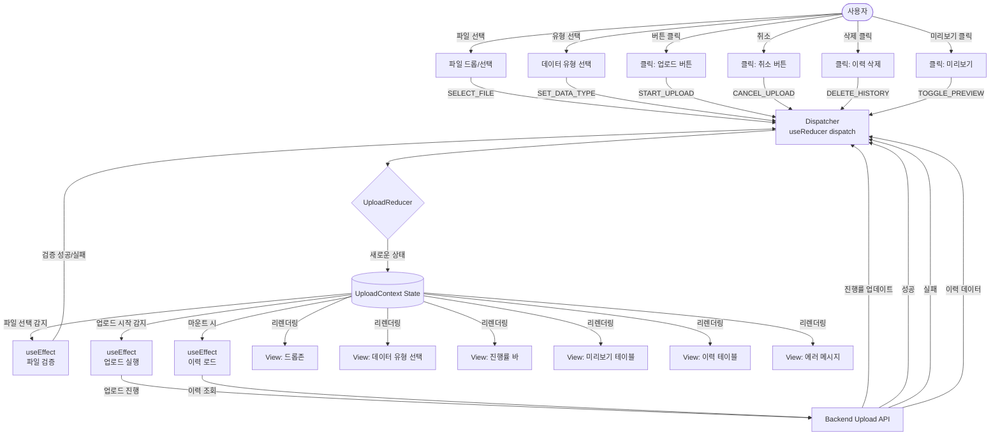
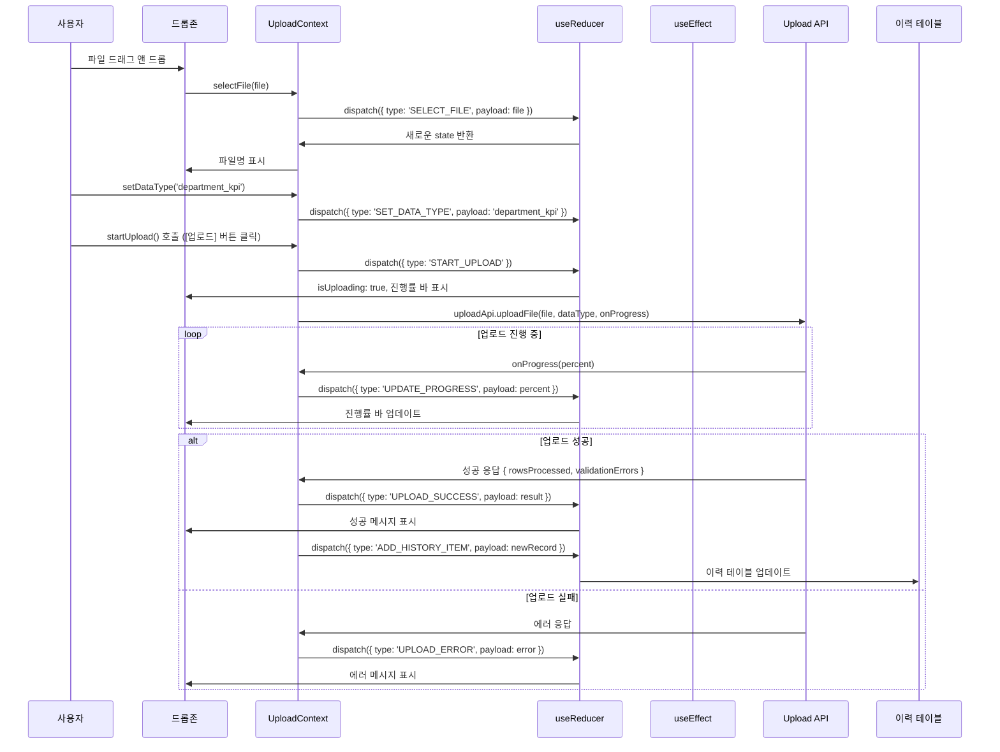

# 데이터 업로드 페이지 상태관리 설계

## 1. 상태 필요성 판단

데이터 업로드 페이지는 **Context + useReducer를 사용한 복잡한 상태관리가 필요**합니다.

### 이유
1. **복잡한 업로드 프로세스**: 파일 선택 → 검증 → 업로드 → 파싱 → 결과 표시
2. **다중 상태 관리**: 파일, 진행률, 에러, 이력, 미리보기 등
3. **비동기 작업 추적**: 업로드 진행 상태, 파싱 상태, 검증 상태
4. **하위 컴포넌트 많음**: 드롭존, 진행률 바, 이력 테이블, 미리보기 등
5. **재사용성**: 업로드 로직을 다른 페이지에서도 사용 가능

## 2. 관리할 데이터 분류

### 2.1 상태 데이터 (State)

#### 2.1.1 파일 상태 (file)
| 상태명 | 타입 | 초기값 | 설명 |
|--------|------|--------|------|
| selectedFile | File \| null | null | 사용자가 선택한 파일 객체 |
| fileName | string \| null | null | 파일명 |
| fileSize | number \| null | null | 파일 크기 (bytes) |
| dataType | DataType \| null | null | 데이터 유형 (학과KPI, 논문, 연구과제, 학생) |

#### 2.1.2 업로드 상태 (upload)
| 상태명 | 타입 | 초기값 | 설명 |
|--------|------|--------|------|
| isUploading | boolean | false | 업로드 진행 중 여부 |
| uploadProgress | number | 0 | 업로드 진행률 (0-100) |
| status | UploadStatus | 'idle' | 업로드 상태 (idle, uploading, parsing, success, error) |

#### 2.1.3 결과 상태 (result)
| 상태명 | 타입 | 초기값 | 설명 |
|--------|------|--------|------|
| previewData | any[] \| null | null | 파싱된 데이터 미리보기 (처음 10행) |
| rowsProcessed | number \| null | null | 처리된 행 수 |
| rowsError | number \| null | null | 오류 행 수 |
| validationErrors | ValidationError[] | [] | 검증 오류 목록 |

#### 2.1.4 이력 상태 (history)
| 상태명 | 타입 | 초기값 | 설명 |
|--------|------|--------|------|
| uploadHistory | UploadRecord[] | [] | 과거 업로드 이력 목록 |
| isLoadingHistory | boolean | false | 이력 로딩 중 여부 |

#### 2.1.5 UI 상태 (ui)
| 상태명 | 타입 | 초기값 | 설명 |
|--------|------|--------|------|
| error | string \| null | null | 전역 에러 메시지 |
| showPreview | boolean | false | 미리보기 모달 표시 여부 |
| showErrorDetails | boolean | false | 에러 상세 모달 표시 여부 |

### 2.2 화면상에 보이지만 상태가 아닌 것
- **정적 UI 요소**: 페이지 제목, 안내 문구, 아이콘
- **드롭존 안내 텍스트**: "파일을 드래그하거나 클릭하여 선택하세요"
- **레이블**: "데이터 유형 선택", "업로드 이력" 등
- **버튼 텍스트**: "업로드", "취소", "삭제" 등

### 2.3 파생 데이터 (계산 가능한 값)
- **canUpload**: `selectedFile !== null && dataType !== null && !isUploading`
- **hasErrors**: `validationErrors.length > 0`
- **uploadSuccessRate**: `rowsProcessed / (rowsProcessed + rowsError) * 100`
- **formattedFileSize**: `fileSize / 1024 / 1024` (MB 단위)

## 3. 상태 변경 조건 및 화면 반영

| 상태 | 변경 조건 | 화면 변경 사항 |
|------|-----------|----------------|
| **selectedFile** | 파일 드롭 또는 파일 선택 다이얼로그 | 파일명 표시, 파일 아이콘 변경, [업로드] 버튼 활성화 |
| **dataType** | 드롭다운에서 데이터 유형 선택 | 선택된 유형 표시, [업로드] 버튼 활성화 (파일도 선택된 경우) |
| **isUploading** | true: [업로드] 버튼 클릭<br/>false: 업로드 완료 또는 실패 | true: 진행률 바 표시, 버튼 비활성화<br/>false: 진행률 바 숨김, 버튼 활성화 |
| **uploadProgress** | 업로드 중 서버 응답 | 진행률 바 업데이트 (0% → 100%) |
| **status** | 업로드 단계별 변경 | 'uploading': "파일 업로드 중..."<br/>'parsing': "데이터 파싱 중..."<br/>'success': "업로드 완료"<br/>'error': "업로드 실패" |
| **previewData** | 파싱 성공 시 데이터 수신 | 미리보기 테이블 표시 (첫 10행) |
| **rowsProcessed** | 업로드 성공 시 서버 응답 | "245행이 처리되었습니다" 메시지 표시 |
| **validationErrors** | 파싱 중 오류 발생 시 배열 추가 | 에러 목록 표시, [오류 상세 보기] 버튼 표시 |
| **uploadHistory** | 페이지 로드 시 API 호출<br/>업로드 성공 시 추가 | 이력 테이블 업데이트, 최신 항목 최상단 표시 |
| **error** | API 오류 발생 시 | 붉은색 에러 배너 표시 |

## 4. Flux 패턴 흐름도 (Mermaid)



## 5. Context + useReducer 상태관리 설계

### 5.1 상태 구조 (TypeScript Interface)

```typescript
// 데이터 유형 열거
type DataType = 'department_kpi' | 'publication_list' | 'research_project' | 'student_roster';

// 업로드 상태 열거
type UploadStatus = 'idle' | 'uploading' | 'parsing' | 'success' | 'error';

// 검증 오류 인터페이스
interface ValidationError {
  row: number;
  column: string;
  message: string;
  value?: any;
}

// 업로드 이력 레코드
interface UploadRecord {
  id: number;
  fileName: string;
  dataType: DataType;
  uploadedAt: string; // ISO 8601
  rowsProcessed: number;
  status: 'success' | 'failed';
  uploadedBy: string;
}

// 파일 상태
interface FileState {
  selectedFile: File | null;
  fileName: string | null;
  fileSize: number | null;
  dataType: DataType | null;
}

// 업로드 상태
interface UploadState {
  isUploading: boolean;
  uploadProgress: number;
  status: UploadStatus;
}

// 결과 상태
interface ResultState {
  previewData: any[] | null;
  rowsProcessed: number | null;
  rowsError: number | null;
  validationErrors: ValidationError[];
}

// 이력 상태
interface HistoryState {
  uploadHistory: UploadRecord[];
  isLoadingHistory: boolean;
}

// UI 상태
interface UIState {
  error: string | null;
  showPreview: boolean;
  showErrorDetails: boolean;
}

// 전체 상태
interface UploadPageState {
  file: FileState;
  upload: UploadState;
  result: ResultState;
  history: HistoryState;
  ui: UIState;
}
```

### 5.2 액션 타입 정의

```typescript
type UploadActionType =
  // 파일 액션
  | 'SELECT_FILE'
  | 'SET_DATA_TYPE'
  | 'CLEAR_FILE'
  // 업로드 액션
  | 'START_UPLOAD'
  | 'UPDATE_PROGRESS'
  | 'UPLOAD_SUCCESS'
  | 'UPLOAD_ERROR'
  | 'CANCEL_UPLOAD'
  // 결과 액션
  | 'SET_PREVIEW_DATA'
  | 'SET_VALIDATION_ERRORS'
  | 'CLEAR_RESULT'
  // 이력 액션
  | 'FETCH_HISTORY_START'
  | 'FETCH_HISTORY_SUCCESS'
  | 'DELETE_HISTORY_ITEM'
  | 'ADD_HISTORY_ITEM'
  // UI 액션
  | 'SET_ERROR'
  | 'CLEAR_ERROR'
  | 'TOGGLE_PREVIEW'
  | 'TOGGLE_ERROR_DETAILS';

interface UploadAction {
  type: UploadActionType;
  payload?: any;
}
```

### 5.3 Reducer 함수 설계

```typescript
const uploadReducer = (
  state: UploadPageState,
  action: UploadAction
): UploadPageState => {
  switch (action.type) {
    // 파일 선택
    case 'SELECT_FILE':
      return {
        ...state,
        file: {
          ...state.file,
          selectedFile: action.payload.file,
          fileName: action.payload.file.name,
          fileSize: action.payload.file.size,
        },
        ui: { ...state.ui, error: null },
      };

    case 'SET_DATA_TYPE':
      return {
        ...state,
        file: { ...state.file, dataType: action.payload },
      };

    case 'CLEAR_FILE':
      return {
        ...state,
        file: {
          selectedFile: null,
          fileName: null,
          fileSize: null,
          dataType: null,
        },
        result: {
          previewData: null,
          rowsProcessed: null,
          rowsError: null,
          validationErrors: [],
        },
      };

    // 업로드 시작
    case 'START_UPLOAD':
      return {
        ...state,
        upload: {
          isUploading: true,
          uploadProgress: 0,
          status: 'uploading',
        },
        ui: { ...state.ui, error: null },
      };

    // 진행률 업데이트
    case 'UPDATE_PROGRESS':
      return {
        ...state,
        upload: {
          ...state.upload,
          uploadProgress: action.payload,
          status: action.payload < 100 ? 'uploading' : 'parsing',
        },
      };

    // 업로드 성공
    case 'UPLOAD_SUCCESS':
      return {
        ...state,
        upload: {
          isUploading: false,
          uploadProgress: 100,
          status: 'success',
        },
        result: {
          ...state.result,
          rowsProcessed: action.payload.rowsProcessed,
          rowsError: action.payload.rowsError || 0,
          validationErrors: action.payload.validationErrors || [],
        },
      };

    // 업로드 실패
    case 'UPLOAD_ERROR':
      return {
        ...state,
        upload: {
          isUploading: false,
          uploadProgress: 0,
          status: 'error',
        },
        ui: {
          ...state.ui,
          error: action.payload,
        },
      };

    // 업로드 취소
    case 'CANCEL_UPLOAD':
      return {
        ...state,
        upload: {
          isUploading: false,
          uploadProgress: 0,
          status: 'idle',
        },
      };

    // 미리보기 데이터 설정
    case 'SET_PREVIEW_DATA':
      return {
        ...state,
        result: {
          ...state.result,
          previewData: action.payload,
        },
      };

    // 이력 조회 시작
    case 'FETCH_HISTORY_START':
      return {
        ...state,
        history: {
          ...state.history,
          isLoadingHistory: true,
        },
      };

    // 이력 조회 성공
    case 'FETCH_HISTORY_SUCCESS':
      return {
        ...state,
        history: {
          uploadHistory: action.payload,
          isLoadingHistory: false,
        },
      };

    // 이력 항목 추가
    case 'ADD_HISTORY_ITEM':
      return {
        ...state,
        history: {
          ...state.history,
          uploadHistory: [action.payload, ...state.history.uploadHistory],
        },
      };

    // 이력 항목 삭제
    case 'DELETE_HISTORY_ITEM':
      return {
        ...state,
        history: {
          ...state.history,
          uploadHistory: state.history.uploadHistory.filter(
            (item) => item.id !== action.payload
          ),
        },
      };

    // UI 상태
    case 'SET_ERROR':
      return {
        ...state,
        ui: { ...state.ui, error: action.payload },
      };

    case 'CLEAR_ERROR':
      return {
        ...state,
        ui: { ...state.ui, error: null },
      };

    case 'TOGGLE_PREVIEW':
      return {
        ...state,
        ui: { ...state.ui, showPreview: !state.ui.showPreview },
      };

    case 'TOGGLE_ERROR_DETAILS':
      return {
        ...state,
        ui: { ...state.ui, showErrorDetails: !state.ui.showErrorDetails },
      };

    default:
      return state;
  }
};
```

### 5.4 초기 상태

```typescript
const initialUploadState: UploadPageState = {
  file: {
    selectedFile: null,
    fileName: null,
    fileSize: null,
    dataType: null,
  },
  upload: {
    isUploading: false,
    uploadProgress: 0,
    status: 'idle',
  },
  result: {
    previewData: null,
    rowsProcessed: null,
    rowsError: null,
    validationErrors: [],
  },
  history: {
    uploadHistory: [],
    isLoadingHistory: false,
  },
  ui: {
    error: null,
    showPreview: false,
    showErrorDetails: false,
  },
};
```

### 5.5 Context 생성

```typescript
interface UploadContextValue {
  state: UploadPageState;
  dispatch: React.Dispatch<UploadAction>;
  // 헬퍼 함수들
  selectFile: (file: File) => void;
  setDataType: (dataType: DataType) => void;
  startUpload: () => Promise<void>;
  cancelUpload: () => void;
  clearFile: () => void;
  deleteHistoryItem: (id: number) => Promise<void>;
  retryUpload: (historyItem: UploadRecord) => Promise<void>;
}

const UploadContext = createContext<UploadContextValue | undefined>(undefined);
```

## 6. Context Provider 구현 설계

### 6.1 데이터 흐름 시각화



### 6.2 Provider 컴포넌트 구조

```typescript
// frontend/src/application/contexts/UploadContext.tsx

const UploadProvider: React.FC<{ children: React.ReactNode }> = ({
  children,
}) => {
  const [state, dispatch] = useReducer(uploadReducer, initialUploadState);

  const uploadApi = useMemo(() => new UploadApiService(), []);

  // 초기 이력 로드
  useEffect(() => {
    const fetchHistory = async () => {
      dispatch({ type: 'FETCH_HISTORY_START' });
      try {
        const history = await uploadApi.getUploadHistory();
        dispatch({ type: 'FETCH_HISTORY_SUCCESS', payload: history });
      } catch (error) {
        dispatch({ type: 'SET_ERROR', payload: error.message });
      }
    };

    fetchHistory();
  }, [uploadApi]);

  // 파일 선택
  const selectFile = useCallback((file: File) => {
    // 클라이언트 측 파일 검증
    if (file.size > 10 * 1024 * 1024) {
      // 10MB
      dispatch({
        type: 'SET_ERROR',
        payload: '파일 크기는 10MB 이하여야 합니다.',
      });
      return;
    }

    if (!file.name.match(/\.(xlsx|xls)$/i)) {
      dispatch({
        type: 'SET_ERROR',
        payload: 'Excel 파일(.xlsx, .xls)만 업로드 가능합니다.',
      });
      return;
    }

    dispatch({ type: 'SELECT_FILE', payload: { file } });
  }, []);

  // 데이터 유형 선택
  const setDataType = useCallback((dataType: DataType) => {
    dispatch({ type: 'SET_DATA_TYPE', payload: dataType });
  }, []);

  // 업로드 시작
  const startUpload = useCallback(async () => {
    if (!state.file.selectedFile || !state.file.dataType) {
      dispatch({
        type: 'SET_ERROR',
        payload: '파일과 데이터 유형을 모두 선택해주세요.',
      });
      return;
    }

    dispatch({ type: 'START_UPLOAD' });

    try {
      const result = await uploadApi.uploadFile(
        state.file.selectedFile,
        state.file.dataType,
        (progress) => {
          dispatch({ type: 'UPDATE_PROGRESS', payload: progress });
        }
      );

      dispatch({
        type: 'UPLOAD_SUCCESS',
        payload: {
          rowsProcessed: result.rowsProcessed,
          rowsError: result.rowsError,
          validationErrors: result.validationErrors,
        },
      });

      // 이력에 추가
      const newRecord: UploadRecord = {
        id: result.id,
        fileName: state.file.fileName!,
        dataType: state.file.dataType,
        uploadedAt: new Date().toISOString(),
        rowsProcessed: result.rowsProcessed,
        status: 'success',
        uploadedBy: 'Current User',
      };

      dispatch({ type: 'ADD_HISTORY_ITEM', payload: newRecord });
    } catch (error) {
      dispatch({ type: 'UPLOAD_ERROR', payload: error.message });
    }
  }, [state.file, uploadApi]);

  // 업로드 취소
  const cancelUpload = useCallback(() => {
    // TODO: Axios cancelToken 사용하여 실제 취소 구현
    dispatch({ type: 'CANCEL_UPLOAD' });
  }, []);

  // 파일 초기화
  const clearFile = useCallback(() => {
    dispatch({ type: 'CLEAR_FILE' });
  }, []);

  // 이력 항목 삭제
  const deleteHistoryItem = useCallback(
    async (id: number) => {
      try {
        await uploadApi.deleteUploadHistory(id);
        dispatch({ type: 'DELETE_HISTORY_ITEM', payload: id });
      } catch (error) {
        dispatch({ type: 'SET_ERROR', payload: error.message });
      }
    },
    [uploadApi]
  );

  // 재시도
  const retryUpload = useCallback(
    async (historyItem: UploadRecord) => {
      // TODO: 실패한 파일 재처리 로직 구현
      console.log('Retry upload:', historyItem);
    },
    []
  );

  const value: UploadContextValue = {
    state,
    dispatch,
    selectFile,
    setDataType,
    startUpload,
    cancelUpload,
    clearFile,
    deleteHistoryItem,
    retryUpload,
  };

  return (
    <UploadContext.Provider value={value}>{children}</UploadContext.Provider>
  );
};
```

### 6.3 Custom Hook 설계

```typescript
// frontend/src/application/hooks/useUpload.ts

const useUpload = () => {
  const context = useContext(UploadContext);

  if (!context) {
    throw new Error('useUpload must be used within UploadProvider');
  }

  return context;
};

// 드롭존 전용 훅
const useUploadDropzone = () => {
  const { state, selectFile, setDataType, startUpload, clearFile } = useUpload();

  return {
    file: state.file,
    upload: state.upload,
    error: state.ui.error,
    selectFile,
    setDataType,
    startUpload,
    clearFile,
    canUpload:
      state.file.selectedFile !== null &&
      state.file.dataType !== null &&
      !state.upload.isUploading,
  };
};

// 이력 전용 훅
const useUploadHistory = () => {
  const { state, deleteHistoryItem, retryUpload } = useUpload();

  return {
    history: state.history.uploadHistory,
    isLoading: state.history.isLoadingHistory,
    deleteHistoryItem,
    retryUpload,
  };
};

// 결과 전용 훅
const useUploadResult = () => {
  const { state } = useUpload();

  return {
    result: state.result,
    hasErrors: state.result.validationErrors.length > 0,
    successRate:
      state.result.rowsProcessed && state.result.rowsError
        ? (state.result.rowsProcessed /
            (state.result.rowsProcessed + state.result.rowsError)) *
          100
        : null,
  };
};
```

## 7. 하위 컴포넌트에 노출할 변수 및 함수

### 7.1 드롭존 컴포넌트 (UploadDropzone.tsx)

#### 노출 변수
- `file: FileState` - 현재 선택된 파일 정보
- `upload: UploadState` - 업로드 진행 상태
- `error: string | null` - 에러 메시지
- `canUpload: boolean` - 업로드 가능 여부

#### 노출 함수
- `selectFile: (file: File) => void` - 파일 선택
- `setDataType: (dataType: DataType) => void` - 데이터 유형 선택
- `startUpload: () => Promise<void>` - 업로드 시작
- `clearFile: () => void` - 파일 초기화

### 7.2 진행률 바 컴포넌트 (UploadProgress.tsx)

#### 노출 변수
- `uploadProgress: number` - 진행률 (0-100)
- `status: UploadStatus` - 현재 상태
- `isUploading: boolean` - 업로드 중 여부

### 7.3 이력 테이블 컴포넌트 (UploadHistory.tsx)

#### 노출 변수
- `history: UploadRecord[]` - 업로드 이력 목록
- `isLoading: boolean` - 이력 로딩 중 여부

#### 노출 함수
- `deleteHistoryItem: (id: number) => Promise<void>` - 이력 삭제
- `retryUpload: (item: UploadRecord) => Promise<void>` - 재시도

### 7.4 결과 패널 컴포넌트 (UploadResult.tsx)

#### 노출 변수
- `result: ResultState` - 업로드 결과
- `hasErrors: boolean` - 에러 존재 여부
- `successRate: number | null` - 성공률

## 8. 컴포넌트 트리 구조

```
UploadProvider (Context)
│
└── UploadPage
    ├── UploadDropzone (useUploadDropzone)
    │   ├── FileInput
    │   ├── DataTypeSelect
    │   └── UploadButton
    │
    ├── UploadProgress (useUpload)
    │   └── ProgressBar
    │
    ├── UploadResult (useUploadResult)
    │   ├── ResultSummary
    │   ├── PreviewTable (선택 사항)
    │   └── ErrorList (선택 사항)
    │
    └── UploadHistory (useUploadHistory)
        └── HistoryTable
            ├── HistoryRow
            └── ActionButtons ([삭제], [재시도])
```

## 9. 주요 액션 흐름

### 9.1 파일 업로드 전체 흐름
```
사용자가 파일 드롭
→ selectFile(file) 호출
→ 클라이언트 측 검증 (크기, 확장자)
→ dispatch({ type: 'SELECT_FILE', payload: file })
→ 파일명 표시, [업로드] 버튼 활성화

사용자가 데이터 유형 선택
→ setDataType('department_kpi')
→ dispatch({ type: 'SET_DATA_TYPE', payload: 'department_kpi' })

사용자가 [업로드] 클릭
→ startUpload() 호출
→ dispatch({ type: 'START_UPLOAD' })
→ API 호출 (uploadApi.uploadFile)
→ 진행률 콜백으로 dispatch({ type: 'UPDATE_PROGRESS', payload: percent })
→ (성공) dispatch({ type: 'UPLOAD_SUCCESS', payload: result })
→ 이력에 추가 dispatch({ type: 'ADD_HISTORY_ITEM', payload: newRecord })
→ (실패) dispatch({ type: 'UPLOAD_ERROR', payload: error })
```

### 9.2 이력 삭제 흐름
```
사용자가 이력 항목의 [삭제] 클릭
→ deleteHistoryItem(id) 호출
→ 확인 다이얼로그 표시 (옵션)
→ API 호출 (uploadApi.deleteUploadHistory)
→ dispatch({ type: 'DELETE_HISTORY_ITEM', payload: id })
→ 이력 테이블에서 항목 제거 (애니메이션)
```

## 10. 에러 처리 시나리오

| 에러 유형 | 조건 | 에러 메시지 | 화면 동작 |
|-----------|------|-------------|-----------|
| **파일 크기 초과** | fileSize > 10MB | "파일 크기는 10MB 이하여야 합니다." | 붉은색 에러 배너 표시 |
| **잘못된 파일 형식** | !fileName.match(/\.(xlsx\|xls)$/) | "Excel 파일(.xlsx, .xls)만 업로드 가능합니다." | 붉은색 에러 배너 표시 |
| **필수 컬럼 누락** | API 응답 validationErrors | "필수 컬럼이 누락되었습니다: [날짜, 금액]" | 에러 상세 모달 표시 |
| **데이터 타입 오류** | API 응답 validationErrors | "5행 금액: '백만원'은 숫자가 아닙니다." | 에러 목록 표시 |
| **네트워크 오류** | API 요청 실패 | "서버에 연결할 수 없습니다. 다시 시도해주세요." | 에러 배너 + [재시도] 버튼 |

## 11. 성능 최적화 전략

### 11.1 메모이제이션
- **useCallback**: 헬퍼 함수들 (selectFile, startUpload 등)
- **useMemo**: API 서비스 인스턴스
- **React.memo**: 이력 테이블 행 컴포넌트

### 11.2 대용량 파일 처리
- 청크 단위 업로드 (선택 사항)
- 서버측 비동기 처리 (100만 행 이상)
- WebWorker로 파일 검증 (브라우저 블로킹 방지)

## 12. 파일 구조

```
frontend/src/
├── application/
│   ├── contexts/
│   │   └── UploadContext.tsx
│   │
│   └── hooks/
│       ├── useUpload.ts
│       ├── useUploadDropzone.ts
│       ├── useUploadHistory.ts
│       └── useUploadResult.ts
│
├── presentation/
│   ├── pages/
│   │   └── UploadPage.tsx
│   │
│   └── components/
│       └── upload/
│           ├── UploadDropzone.tsx
│           ├── UploadProgress.tsx
│           ├── UploadResult.tsx
│           └── UploadHistory.tsx
│
├── domain/
│   └── models/
│       └── Upload.ts
│
└── services/
    └── api/
        └── uploadApi.ts
```

## 13. 결론

데이터 업로드 페이지는 **Context + useReducer를 사용한 복잡한 상태관리가 필수**입니다.

### 핵심 이유
1. **복잡한 비동기 프로세스**: 파일 선택 → 검증 → 업로드 → 파싱 → 결과
2. **다중 상태 추적**: 파일, 진행률, 결과, 이력, 에러
3. **하위 컴포넌트 많음**: 드롭존, 진행률, 결과, 이력 등 분리된 컴포넌트들
4. **재사용성**: 업로드 로직을 다른 기능에서도 활용 가능

### 구현 우선순위
1. **UploadContext 및 Reducer 구현** (최우선)
2. **파일 업로드 API 연동** (진행률 콜백 포함)
3. **검증 로직 및 에러 처리** (사용자 경험 중요)
4. **이력 관리 기능** (CRUD)
5. **UI 피드백 개선** (진행률 바, 애니메이션)

---

**문서 버전**: v1.0.0
**작성일**: 2025년 11월 2일
**상태**: 최종 (Context + useReducer 필수)
