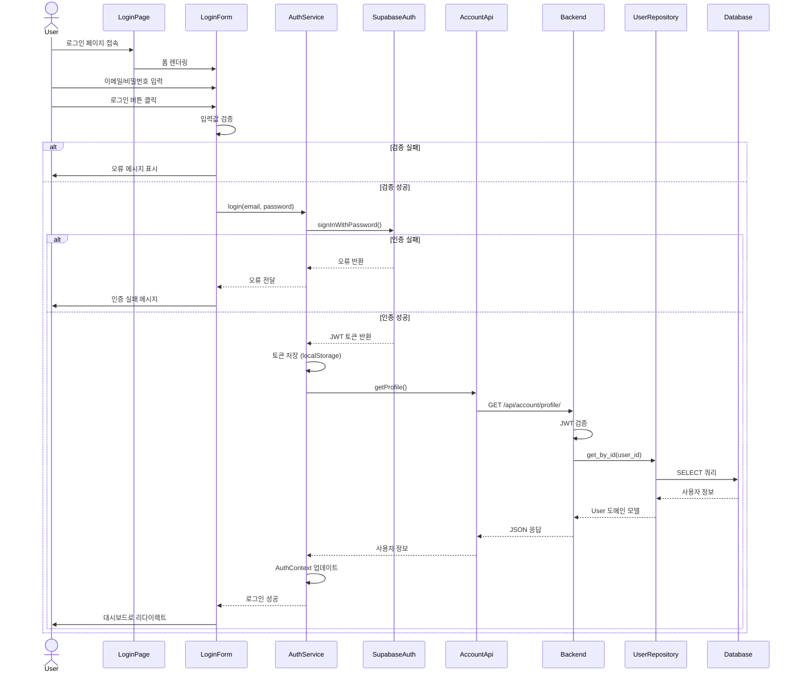
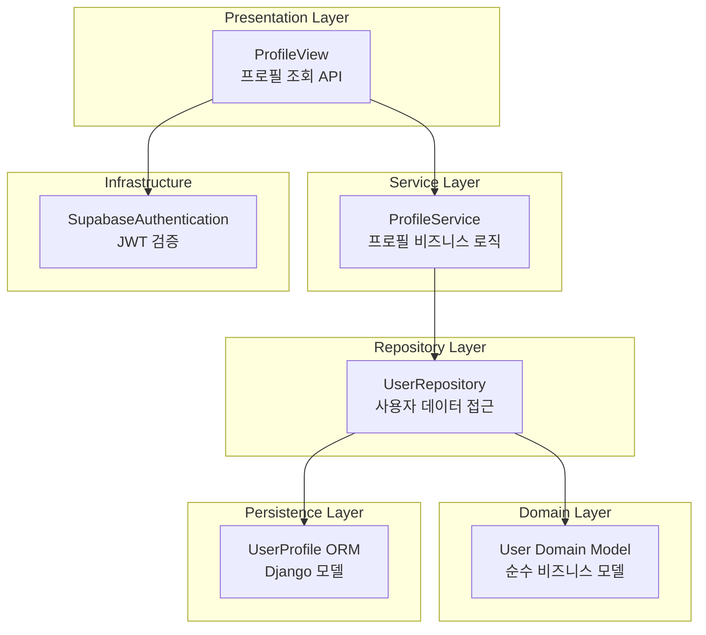
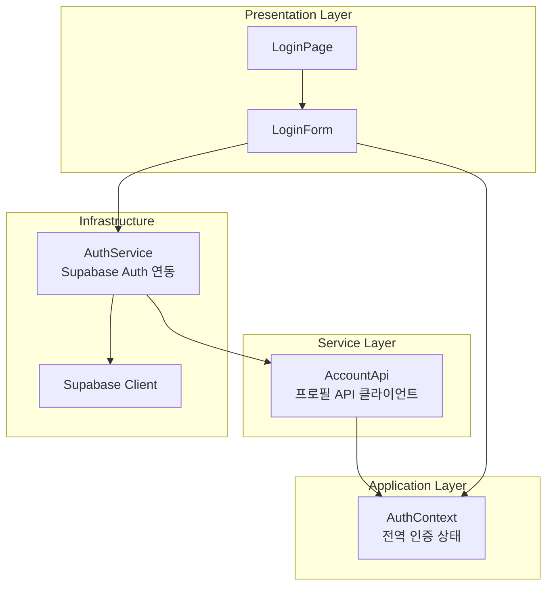

# UC-001: 사용자 로그인 구현 계획

## 개요

본 문서는 UC-001(사용자 로그인) 기능의 구현 계획을 정의합니다.

### 모듈 목록

#### Backend 모듈
1. **Infrastructure Layer**
   - `backend/infrastructure/authentication/supabase_auth.py`: Supabase JWT 검증 미들웨어 (공통 모듈 활용)
   - `backend/infrastructure/authentication/permissions.py`: 권한 체크 데코레이터 (공통 모듈 활용)

2. **Accounts App - Presentation Layer**
   - `backend/apps/accounts/presentation/views.py`: 로그인 이력 조회 API View
   - `backend/apps/accounts/presentation/serializers.py`: 프로필 Serializer
   - `backend/apps/accounts/presentation/urls.py`: URL 라우팅

3. **Accounts App - Service Layer**
   - `backend/apps/accounts/services/profile_service.py`: 프로필 조회 비즈니스 로직

4. **Accounts App - Repository Layer**
   - `backend/apps/accounts/repositories/user_repository.py`: 사용자 데이터 접근

5. **Accounts App - Domain Layer**
   - `backend/apps/accounts/domain/models.py`: User 도메인 모델

6. **Accounts App - Persistence Layer**
   - `backend/apps/accounts/persistence/models.py`: UserProfile ORM 모델

#### Frontend 모듈
1. **Infrastructure Layer**
   - `frontend/src/infrastructure/external/supabase.ts`: Supabase 클라이언트 (공통 모듈 활용)
   - `frontend/src/infrastructure/external/authService.ts`: 인증 서비스 (공통 모듈 활용)

2. **Application Layer**
   - `frontend/src/application/contexts/AuthContext.tsx`: 인증 Context (공통 모듈 활용)

3. **Presentation Layer**
   - `frontend/src/presentation/pages/LoginPage.tsx`: 로그인 페이지
   - `frontend/src/presentation/components/forms/LoginForm.tsx`: 로그인 폼 컴포넌트

4. **Service Layer**
   - `frontend/src/services/api/accountApi.ts`: 계정 API 클라이언트

5. **Domain Layer**
   - `frontend/src/domain/models/User.ts`: User 타입 정의 (공통 모듈 활용)

---

## Diagram

### 전체 아키텍처 흐름



### Backend 모듈 다이어그램



### Frontend 모듈 다이어그램



---

## Implementation Plan

### 1. Backend 구현 계획

#### 1.1 Infrastructure: Supabase JWT 검증 미들웨어

**파일**: `backend/infrastructure/authentication/supabase_auth.py`

**역할**:
- HTTP 요청에서 JWT 토큰 추출 및 검증
- 사용자 ID 추출 후 request 객체에 첨부

**TDD 테스트 시나리오**:

```python
# backend/infrastructure/authentication/tests/test_supabase_auth.py

class TestSupabaseAuthentication:
    """SupabaseAuthentication 미들웨어 테스트 (TDD)"""

    # RED: 실패하는 테스트 먼저 작성
    def test_authenticate_with_valid_token_returns_user_id(self):
        """유효한 JWT 토큰으로 인증 시 사용자 ID 반환"""
        # Arrange
        valid_token = generate_test_jwt(user_id='test-uuid-123')
        request = create_mock_request(auth_header=f'Bearer {valid_token}')
        auth = SupabaseAuthentication()

        # Act
        user_id, token = auth.authenticate(request)

        # Assert
        assert user_id == 'test-uuid-123'
        assert token == valid_token

    def test_authenticate_with_expired_token_raises_authentication_failed(self):
        """만료된 토큰으로 인증 시 AuthenticationFailed 예외 발생"""
        # Arrange
        expired_token = generate_expired_jwt()
        request = create_mock_request(auth_header=f'Bearer {expired_token}')
        auth = SupabaseAuthentication()

        # Act & Assert
        with pytest.raises(AuthenticationFailed, match="토큰이 만료되었습니다"):
            auth.authenticate(request)

    def test_authenticate_with_invalid_signature_raises_authentication_failed(self):
        """잘못된 서명의 토큰으로 인증 시 AuthenticationFailed 예외 발생"""
        # Arrange
        tampered_token = generate_jwt_with_wrong_signature()
        request = create_mock_request(auth_header=f'Bearer {tampered_token}')
        auth = SupabaseAuthentication()

        # Act & Assert
        with pytest.raises(AuthenticationFailed, match="토큰 서명이 유효하지 않습니다"):
            auth.authenticate(request)

    def test_authenticate_with_no_auth_header_returns_none(self):
        """Authorization 헤더 없을 시 None 반환 (익명 사용자)"""
        # Arrange
        request = create_mock_request(auth_header=None)
        auth = SupabaseAuthentication()

        # Act
        result = auth.authenticate(request)

        # Assert
        assert result is None

    def test_authenticate_with_malformed_header_raises_authentication_failed(self):
        """Bearer 형식이 아닌 헤더 시 AuthenticationFailed 예외 발생"""
        # Arrange
        request = create_mock_request(auth_header='InvalidFormat token123')
        auth = SupabaseAuthentication()

        # Act & Assert
        with pytest.raises(AuthenticationFailed, match="Bearer 형식이어야 합니다"):
            auth.authenticate(request)
```

**구현 코드 (GREEN 단계)**:

```python
# backend/infrastructure/authentication/supabase_auth.py

import jwt
from django.conf import settings
from rest_framework import authentication
from rest_framework.exceptions import AuthenticationFailed

class SupabaseAuthentication(authentication.BaseAuthentication):
    """Supabase JWT 토큰 검증 인증 클래스"""

    def authenticate(self, request):
        """
        JWT 토큰을 검증하고 사용자 ID를 반환

        Args:
            request: HTTP 요청 객체

        Returns:
            (user_id, token) 튜플 또는 None (익명 사용자)

        Raises:
            AuthenticationFailed: 토큰이 유효하지 않은 경우
        """
        auth_header = request.META.get('HTTP_AUTHORIZATION', '')

        if not auth_header:
            return None

        parts = auth_header.split()

        if len(parts) != 2 or parts[0].lower() != 'bearer':
            raise AuthenticationFailed('Authorization 헤더는 Bearer 형식이어야 합니다')

        token = parts[1]

        try:
            payload = jwt.decode(
                token,
                settings.SUPABASE_JWT_SECRET,
                algorithms=['HS256'],
                audience='authenticated'
            )

            user_id = payload.get('sub')
            if not user_id:
                raise AuthenticationFailed('토큰에 사용자 ID가 없습니다')

            return (user_id, token)

        except jwt.ExpiredSignatureError:
            raise AuthenticationFailed('토큰이 만료되었습니다')
        except jwt.InvalidSignatureError:
            raise AuthenticationFailed('토큰 서명이 유효하지 않습니다')
        except jwt.DecodeError:
            raise AuthenticationFailed('토큰을 디코드할 수 없습니다')
        except Exception as e:
            raise AuthenticationFailed(f'토큰 검증 중 오류: {str(e)}')
```

**REFACTOR 단계**:
- 중복 코드 제거
- 에러 메시지 상수화
- 타입 힌팅 추가

---

#### 1.2 Accounts App - Domain Layer

**파일**: `backend/apps/accounts/domain/models.py`

**역할**: 순수 비즈니스 도메인 모델 (Framework 독립적)

**TDD 테스트 시나리오**:

```python
# backend/apps/accounts/domain/tests/test_models.py

class TestUserDomainModel:
    """User 도메인 모델 테스트 (TDD)"""

    def test_create_user_domain_model_with_valid_data(self):
        """유효한 데이터로 User 도메인 모델 생성"""
        # Arrange & Act
        user = User(
            id='uuid-123',
            email='test@example.com',
            full_name='홍길동',
            department='컴퓨터공학과',
            role='user',
            is_active=True
        )

        # Assert
        assert user.id == 'uuid-123'
        assert user.email == 'test@example.com'
        assert user.full_name == '홍길동'
        assert user.is_admin() is False

    def test_is_admin_returns_true_for_admin_role(self):
        """관리자 역할일 때 is_admin() True 반환"""
        # Arrange
        admin_user = User(
            id='uuid-123',
            email='admin@example.com',
            full_name='관리자',
            role='admin',
            is_active=True
        )

        # Act & Assert
        assert admin_user.is_admin() is True

    def test_is_active_user_when_is_active_true(self):
        """활성화된 사용자일 때 is_active True"""
        # Arrange
        user = User(
            id='uuid-123',
            email='test@example.com',
            full_name='홍길동',
            role='user',
            is_active=True
        )

        # Act & Assert
        assert user.is_active is True
```

**구현 코드**:

```python
# backend/apps/accounts/domain/models.py

from dataclasses import dataclass
from datetime import datetime
from typing import Optional

@dataclass
class User:
    """사용자 도메인 모델"""
    id: str
    email: str
    full_name: str
    role: str  # 'admin' or 'user'
    is_active: bool
    department: Optional[str] = None
    profile_picture_url: Optional[str] = None
    created_at: Optional[datetime] = None
    updated_at: Optional[datetime] = None

    def is_admin(self) -> bool:
        """관리자 권한 여부 확인"""
        return self.role == 'admin'

    def __repr__(self) -> str:
        return f"User(id={self.id}, email={self.email}, role={self.role})"
```

---

#### 1.3 Accounts App - Persistence Layer

**파일**: `backend/apps/accounts/persistence/models.py`

**역할**: Django ORM 모델 (데이터베이스 스키마)

**TDD 테스트 시나리오**:

```python
# backend/apps/accounts/persistence/tests/test_models.py

@pytest.mark.django_db
class TestUserProfileORM:
    """UserProfile ORM 모델 테스트 (TDD)"""

    def test_create_user_profile_with_valid_data(self):
        """유효한 데이터로 UserProfile 생성"""
        # Arrange & Act
        user = UserProfile.objects.create(
            id='uuid-123',
            email='test@example.com',
            full_name='홍길동',
            department='컴퓨터공학과',
            role='user'
        )

        # Assert
        assert user.email == 'test@example.com'
        assert user.full_name == '홍길동'
        assert user.is_active is True

    def test_email_field_is_unique(self):
        """이메일 필드가 유일해야 함"""
        # Arrange
        UserProfile.objects.create(
            id='uuid-1',
            email='duplicate@example.com',
            full_name='User1',
            role='user'
        )

        # Act & Assert
        with pytest.raises(Exception):  # IntegrityError
            UserProfile.objects.create(
                id='uuid-2',
                email='duplicate@example.com',
                full_name='User2',
                role='user'
            )

    def test_default_role_is_user(self):
        """기본 역할은 'user'"""
        # Arrange & Act
        user = UserProfile.objects.create(
            id='uuid-123',
            email='test@example.com',
            full_name='홍길동'
        )

        # Assert
        assert user.role == 'user'
```

**구현 코드**:

```python
# backend/apps/accounts/persistence/models.py

import uuid
from django.db import models

class UserProfile(models.Model):
    """사용자 프로필 ORM 모델"""

    ROLE_CHOICES = [
        ('admin', '관리자'),
        ('user', '일반 사용자'),
    ]

    id = models.UUIDField(primary_key=True, default=uuid.uuid4, editable=False)
    email = models.EmailField(unique=True, max_length=255)
    full_name = models.CharField(max_length=100, null=True, blank=True)
    department = models.CharField(max_length=100, null=True, blank=True)
    role = models.CharField(max_length=20, choices=ROLE_CHOICES, default='user')
    profile_picture_url = models.TextField(null=True, blank=True)
    is_active = models.BooleanField(default=True)
    created_at = models.DateTimeField(auto_now_add=True)
    updated_at = models.DateTimeField(auto_now=True)

    class Meta:
        db_table = 'user_profiles'
        ordering = ['-created_at']

    def __str__(self):
        return f"{self.email} ({self.get_role_display()})"
```

---

#### 1.4 Accounts App - Repository Layer

**파일**: `backend/apps/accounts/repositories/user_repository.py`

**역할**: 사용자 데이터 접근 추상화 (ORM → Domain Model 변환)

**TDD 테스트 시나리오**:

```python
# backend/apps/accounts/repositories/tests/test_user_repository.py

@pytest.mark.django_db
class TestUserRepository:
    """UserRepository 테스트 (TDD)"""

    def test_get_by_id_returns_user_domain_model(self):
        """ID로 사용자 조회 시 도메인 모델 반환"""
        # Arrange
        user_orm = UserProfile.objects.create(
            id='uuid-123',
            email='test@example.com',
            full_name='홍길동',
            role='user'
        )
        repository = UserRepository()

        # Act
        user = repository.get_by_id('uuid-123')

        # Assert
        assert isinstance(user, User)
        assert user.id == 'uuid-123'
        assert user.email == 'test@example.com'

    def test_get_by_id_returns_none_when_not_found(self):
        """존재하지 않는 ID 조회 시 None 반환"""
        # Arrange
        repository = UserRepository()

        # Act
        user = repository.get_by_id('non-existent')

        # Assert
        assert user is None

    def test_get_by_email_returns_user_domain_model(self):
        """이메일로 사용자 조회 시 도메인 모델 반환"""
        # Arrange
        UserProfile.objects.create(
            id='uuid-123',
            email='test@example.com',
            full_name='홍길동',
            role='user'
        )
        repository = UserRepository()

        # Act
        user = repository.get_by_email('test@example.com')

        # Assert
        assert isinstance(user, User)
        assert user.email == 'test@example.com'
```

**구현 코드**:

```python
# backend/apps/accounts/repositories/user_repository.py

from typing import Optional
from apps.accounts.domain.models import User
from apps.accounts.persistence.models import UserProfile

class UserRepository:
    """사용자 데이터 접근 Repository"""

    def get_by_id(self, user_id: str) -> Optional[User]:
        """ID로 사용자 조회"""
        try:
            user_orm = UserProfile.objects.get(id=user_id, is_active=True)
            return self._to_domain(user_orm)
        except UserProfile.DoesNotExist:
            return None

    def get_by_email(self, email: str) -> Optional[User]:
        """이메일로 사용자 조회"""
        try:
            user_orm = UserProfile.objects.get(email=email, is_active=True)
            return self._to_domain(user_orm)
        except UserProfile.DoesNotExist:
            return None

    def _to_domain(self, user_orm: UserProfile) -> User:
        """ORM 모델을 도메인 모델로 변환"""
        return User(
            id=str(user_orm.id),
            email=user_orm.email,
            full_name=user_orm.full_name or '',
            department=user_orm.department,
            role=user_orm.role,
            is_active=user_orm.is_active,
            profile_picture_url=user_orm.profile_picture_url,
            created_at=user_orm.created_at,
            updated_at=user_orm.updated_at
        )
```

---

#### 1.5 Accounts App - Service Layer

**파일**: `backend/apps/accounts/services/profile_service.py`

**역할**: 프로필 조회 비즈니스 로직

**TDD 테스트 시나리오**:

```python
# backend/apps/accounts/services/tests/test_profile_service.py

class TestProfileService:
    """ProfileService 테스트 (TDD)"""

    def test_get_profile_returns_user_domain_model(self):
        """프로필 조회 시 도메인 모델 반환"""
        # Arrange
        mock_repository = MagicMock(spec=UserRepository)
        mock_repository.get_by_id.return_value = User(
            id='uuid-123',
            email='test@example.com',
            full_name='홍길동',
            role='user',
            is_active=True
        )
        service = ProfileService(user_repository=mock_repository)

        # Act
        user = service.get_profile('uuid-123')

        # Assert
        assert user.id == 'uuid-123'
        assert user.email == 'test@example.com'
        mock_repository.get_by_id.assert_called_once_with('uuid-123')

    def test_get_profile_raises_not_found_when_user_not_exists(self):
        """존재하지 않는 사용자 조회 시 ResourceNotFoundError 발생"""
        # Arrange
        mock_repository = MagicMock(spec=UserRepository)
        mock_repository.get_by_id.return_value = None
        service = ProfileService(user_repository=mock_repository)

        # Act & Assert
        with pytest.raises(ResourceNotFoundError, match="사용자를 찾을 수 없습니다"):
            service.get_profile('non-existent')
```

**구현 코드**:

```python
# backend/apps/accounts/services/profile_service.py

from apps.core.exceptions import ResourceNotFoundError
from apps.accounts.domain.models import User
from apps.accounts.repositories.user_repository import UserRepository

class ProfileService:
    """프로필 관리 서비스"""

    def __init__(self, user_repository: UserRepository = None):
        self.user_repository = user_repository or UserRepository()

    def get_profile(self, user_id: str) -> User:
        """사용자 프로필 조회

        Args:
            user_id: 사용자 UUID

        Returns:
            User 도메인 모델

        Raises:
            ResourceNotFoundError: 사용자를 찾을 수 없는 경우
        """
        user = self.user_repository.get_by_id(user_id)

        if not user:
            raise ResourceNotFoundError("사용자를 찾을 수 없습니다")

        return user
```

---

#### 1.6 Accounts App - Presentation Layer

**파일**: `backend/apps/accounts/presentation/views.py`

**역할**: 프로필 조회 API View (HTTP 요청/응답 처리)

**TDD 테스트 시나리오**:

```python
# backend/apps/accounts/presentation/tests/test_views.py

@pytest.mark.django_db
class TestProfileView:
    """ProfileView API 테스트 (TDD)"""

    def test_get_profile_returns_200_with_valid_token(self, authenticated_client):
        """유효한 토큰으로 프로필 조회 시 200 OK 반환"""
        # Arrange
        UserProfile.objects.create(
            id='uuid-123',
            email='test@example.com',
            full_name='홍길동',
            role='user'
        )

        # Act
        response = authenticated_client.get('/api/account/profile/')

        # Assert
        assert response.status_code == 200
        data = response.json()
        assert data['email'] == 'test@example.com'
        assert data['full_name'] == '홍길동'

    def test_get_profile_returns_401_without_token(self, api_client):
        """토큰 없이 프로필 조회 시 401 Unauthorized 반환"""
        # Arrange & Act
        response = api_client.get('/api/account/profile/')

        # Assert
        assert response.status_code == 401

    def test_get_profile_returns_404_when_user_not_found(self, authenticated_client):
        """사용자 없을 시 404 Not Found 반환"""
        # Arrange
        # 사용자 생성하지 않음

        # Act
        response = authenticated_client.get('/api/account/profile/')

        # Assert
        assert response.status_code == 404
```

**구현 코드**:

```python
# backend/apps/accounts/presentation/views.py

from rest_framework.views import APIView
from rest_framework.response import Response
from rest_framework import status
from apps.infrastructure.authentication.supabase_auth import SupabaseAuthentication
from apps.accounts.services.profile_service import ProfileService
from apps.accounts.presentation.serializers import UserProfileSerializer
from apps.core.exceptions import ResourceNotFoundError

class ProfileView(APIView):
    """사용자 프로필 API View"""

    authentication_classes = [SupabaseAuthentication]

    def __init__(self):
        self.profile_service = ProfileService()

    def get(self, request):
        """사용자 프로필 조회

        Returns:
            200: 프로필 정보
            401: 인증 실패
            404: 사용자 없음
        """
        try:
            # request.user는 SupabaseAuthentication에서 설정한 user_id
            user_id = request.user

            user = self.profile_service.get_profile(user_id)
            serializer = UserProfileSerializer(user)

            return Response(serializer.data, status=status.HTTP_200_OK)

        except ResourceNotFoundError as e:
            return Response(
                {'error': str(e)},
                status=status.HTTP_404_NOT_FOUND
            )
```

**Serializer**:

```python
# backend/apps/accounts/presentation/serializers.py

from rest_framework import serializers

class UserProfileSerializer(serializers.Serializer):
    """사용자 프로필 Serializer"""

    id = serializers.UUIDField()
    email = serializers.EmailField()
    full_name = serializers.CharField(allow_null=True)
    department = serializers.CharField(allow_null=True)
    role = serializers.CharField()
    profile_picture_url = serializers.CharField(allow_null=True)
    is_active = serializers.BooleanField()
    created_at = serializers.DateTimeField(allow_null=True)
    updated_at = serializers.DateTimeField(allow_null=True)
```

---

### 2. Frontend 구현 계획

#### 2.1 Infrastructure: Supabase 인증 서비스 (공통 모듈 활용)

**파일**: `frontend/src/infrastructure/external/authService.ts`

**TDD 테스트 시나리오**:

```typescript
// frontend/src/infrastructure/external/authService.test.ts

import { describe, it, expect, beforeEach } from 'vitest'
import { authService } from './authService'
import { server } from '@/tests/mocks/server'
import { http, HttpResponse } from 'msw'

describe('AuthService', () => {
  beforeEach(() => {
    localStorage.clear()
  })

  it('로그인 성공 시 토큰과 사용자 정보 반환', async () => {
    // Arrange
    const email = 'test@example.com'
    const password = 'password123'

    // Act
    const { data, error } = await authService.signIn(email, password)

    // Assert
    expect(error).toBeNull()
    expect(data).toBeDefined()
    expect(data.session.access_token).toBeDefined()
    expect(data.user.email).toBe(email)
  })

  it('로그인 실패 시 오류 반환', async () => {
    // Arrange
    const email = 'wrong@example.com'
    const password = 'wrongpassword'

    // Act
    const { data, error } = await authService.signIn(email, password)

    // Assert
    expect(data).toBeNull()
    expect(error).toBeDefined()
    expect(error.message).toContain('Invalid login credentials')
  })

  it('로그아웃 시 토큰 삭제', async () => {
    // Arrange
    await authService.signIn('test@example.com', 'password123')

    // Act
    const { error } = await authService.signOut()

    // Assert
    expect(error).toBeNull()
  })

  it('현재 사용자 조회', async () => {
    // Arrange
    await authService.signIn('test@example.com', 'password123')

    // Act
    const user = await authService.getCurrentUser()

    // Assert
    expect(user).toBeDefined()
    expect(user.email).toBe('test@example.com')
  })
})
```

---

#### 2.2 Application Layer: AuthContext

**파일**: `frontend/src/application/contexts/AuthContext.tsx`

**TDD 테스트 시나리오**:

```typescript
// frontend/src/application/contexts/AuthContext.test.tsx

import { describe, it, expect, beforeEach } from 'vitest'
import { render, screen, waitFor } from '@testing-library/react'
import { AuthProvider, useAuth } from './AuthContext'

const TestComponent = () => {
  const { user, isAuthenticated, login, logout } = useAuth()

  return (
    <div>
      <div data-testid="auth-status">{isAuthenticated ? '인증됨' : '비인증'}</div>
      {user && <div data-testid="user-email">{user.email}</div>}
      <button onClick={() => login('test@example.com', 'password')}>로그인</button>
      <button onClick={logout}>로그아웃</button>
    </div>
  )
}

describe('AuthContext', () => {
  it('초기 상태는 비인증', () => {
    // Arrange & Act
    render(
      <AuthProvider>
        <TestComponent />
      </AuthProvider>
    )

    // Assert
    expect(screen.getByTestId('auth-status')).toHaveTextContent('비인증')
  })

  it('로그인 성공 시 사용자 정보 저장', async () => {
    // Arrange
    render(
      <AuthProvider>
        <TestComponent />
      </AuthProvider>
    )

    // Act
    screen.getByText('로그인').click()

    // Assert
    await waitFor(() => {
      expect(screen.getByTestId('auth-status')).toHaveTextContent('인증됨')
      expect(screen.getByTestId('user-email')).toHaveTextContent('test@example.com')
    })
  })

  it('로그아웃 시 사용자 정보 제거', async () => {
    // Arrange
    render(
      <AuthProvider>
        <TestComponent />
      </AuthProvider>
    )
    screen.getByText('로그인').click()
    await waitFor(() => screen.getByTestId('user-email'))

    // Act
    screen.getByText('로그아웃').click()

    // Assert
    await waitFor(() => {
      expect(screen.getByTestId('auth-status')).toHaveTextContent('비인증')
      expect(screen.queryByTestId('user-email')).not.toBeInTheDocument()
    })
  })
})
```

---

#### 2.3 Presentation Layer: LoginPage

**파일**: `frontend/src/presentation/pages/LoginPage.tsx`

**QA Sheet (UI 테스트 시나리오)**:

| ID | 테스트 시나리오 | 입력 | 예상 출력 | 실제 결과 | Pass/Fail |
|----|----------------|------|-----------|-----------|-----------|
| LP-001 | 로그인 페이지 접속 | URL: /login | 로그인 폼 표시 (이메일, 비밀번호 입력 필드, 로그인 버튼) | | |
| LP-002 | 이메일 형식 검증 | 이메일: "invalid", 비밀번호: "password123" | "올바른 이메일 형식을 입력해주세요" 오류 메시지 | | |
| LP-003 | 필수값 검증 | 이메일: 공백, 비밀번호: 공백 | "이메일을 입력해주세요" 오류 메시지 | | |
| LP-004 | 로그인 성공 | 이메일: "test@example.com", 비밀번호: "password123" | 대시보드 페이지로 리다이렉트, "환영합니다" 메시지 | | |
| LP-005 | 로그인 실패 | 이메일: "test@example.com", 비밀번호: "wrong" | "이메일 또는 비밀번호가 올바르지 않습니다" 오류 메시지 | | |
| LP-006 | 로딩 상태 표시 | 로그인 버튼 클릭 | 로딩 스피너 표시, 버튼 비활성화 | | |
| LP-007 | 비밀번호 가시성 토글 | 눈 아이콘 클릭 | 비밀번호 표시/숨김 전환 | | |
| LP-008 | "로그인 상태 유지" 체크박스 | 체크박스 선택 후 로그인 | localStorage에 토큰 저장 (sessionStorage 아님) | | |

**컴포넌트 테스트**:

```typescript
// frontend/src/presentation/pages/LoginPage.test.tsx

import { describe, it, expect, vi } from 'vitest'
import { render, screen, fireEvent, waitFor } from '@testing-library/react'
import { BrowserRouter } from 'react-router-dom'
import { LoginPage } from './LoginPage'
import { AuthProvider } from '@/application/contexts/AuthContext'

const renderLoginPage = () => {
  return render(
    <BrowserRouter>
      <AuthProvider>
        <LoginPage />
      </AuthProvider>
    </BrowserRouter>
  )
}

describe('LoginPage', () => {
  it('로그인 폼 렌더링', () => {
    // Arrange & Act
    renderLoginPage()

    // Assert
    expect(screen.getByLabelText(/이메일/i)).toBeInTheDocument()
    expect(screen.getByLabelText(/비밀번호/i)).toBeInTheDocument()
    expect(screen.getByRole('button', { name: /로그인/i })).toBeInTheDocument()
  })

  it('이메일 형식 검증 실패 시 오류 메시지 표시', async () => {
    // Arrange
    renderLoginPage()
    const emailInput = screen.getByLabelText(/이메일/i)
    const submitButton = screen.getByRole('button', { name: /로그인/i })

    // Act
    fireEvent.change(emailInput, { target: { value: 'invalid-email' } })
    fireEvent.click(submitButton)

    // Assert
    await waitFor(() => {
      expect(screen.getByText(/올바른 이메일 형식/i)).toBeInTheDocument()
    })
  })

  it('로그인 성공 시 대시보드로 리다이렉트', async () => {
    // Arrange
    const mockNavigate = vi.fn()
    vi.mock('react-router-dom', () => ({
      ...vi.importActual('react-router-dom'),
      useNavigate: () => mockNavigate
    }))
    renderLoginPage()

    // Act
    fireEvent.change(screen.getByLabelText(/이메일/i), {
      target: { value: 'test@example.com' }
    })
    fireEvent.change(screen.getByLabelText(/비밀번호/i), {
      target: { value: 'password123' }
    })
    fireEvent.click(screen.getByRole('button', { name: /로그인/i }))

    // Assert
    await waitFor(() => {
      expect(mockNavigate).toHaveBeenCalledWith('/dashboard')
    })
  })

  it('로그인 실패 시 오류 메시지 표시', async () => {
    // Arrange
    renderLoginPage()

    // Act
    fireEvent.change(screen.getByLabelText(/이메일/i), {
      target: { value: 'wrong@example.com' }
    })
    fireEvent.change(screen.getByLabelText(/비밀번호/i), {
      target: { value: 'wrongpassword' }
    })
    fireEvent.click(screen.getByRole('button', { name: /로그인/i }))

    // Assert
    await waitFor(() => {
      expect(screen.getByText(/이메일 또는 비밀번호가 올바르지 않습니다/i)).toBeInTheDocument()
    })
  })

  it('로그인 중 로딩 상태 표시', async () => {
    // Arrange
    renderLoginPage()

    // Act
    fireEvent.change(screen.getByLabelText(/이메일/i), {
      target: { value: 'test@example.com' }
    })
    fireEvent.change(screen.getByLabelText(/비밀번호/i), {
      target: { value: 'password123' }
    })
    fireEvent.click(screen.getByRole('button', { name: /로그인/i }))

    // Assert
    expect(screen.getByRole('button', { name: /로그인/i })).toBeDisabled()
    await waitFor(() => {
      expect(screen.queryByRole('progressbar')).toBeInTheDocument()
    })
  })
})
```

---

## TDD 프로세스 준수 체크리스트

### Red-Green-Refactor 사이클
- [x] 각 기능에 대해 실패하는 테스트를 먼저 작성
- [x] 테스트를 통과하는 최소한의 코드 작성
- [x] 중복 제거 및 코드 품질 개선 계획 포함

### FIRST 원칙
- [x] **Fast**: In-memory DB 사용, Mock 활용으로 빠른 테스트
- [x] **Independent**: 각 테스트는 독립적으로 실행 가능
- [x] **Repeatable**: 동일한 입력에 동일한 결과 보장
- [x] **Self-validating**: assert 문으로 자동 검증
- [x] **Timely**: 구현 전에 테스트 작성

### 테스트 피라미드
- [x] 단위 테스트 (80%): Domain, Service, Repository 레이어
- [x] 통합 테스트 (15%): API Endpoint 테스트
- [x] E2E 테스트 (5%): 로그인 플로우 전체 테스트

### 안티-패턴 회피
- [x] 구현 세부사항이 아닌 동작(Behavior) 테스트
- [x] 과도한 Mock 지양 (실제 Repository 사용)
- [x] 테스트 간 의존성 제거 (각 테스트는 독립적)

### 실행 가능성
- [x] 명확한 Arrange-Act-Assert 구조
- [x] 테스트 설명이 명확하고 구체적
- [x] 테스트 픽스처 및 팩토리 함수 제공

---

## 파일 생성 순서

### Backend
1. Domain Layer: `apps/accounts/domain/models.py`
2. Persistence Layer: `apps/accounts/persistence/models.py`
3. Repository Layer: `apps/accounts/repositories/user_repository.py`
4. Service Layer: `apps/accounts/services/profile_service.py`
5. Presentation Layer:
   - `apps/accounts/presentation/serializers.py`
   - `apps/accounts/presentation/views.py`
   - `apps/accounts/presentation/urls.py`
6. Infrastructure: `infrastructure/authentication/supabase_auth.py` (공통 모듈)

### Frontend
1. Domain Layer: `domain/models/User.ts`
2. Infrastructure Layer:
   - `infrastructure/external/supabase.ts` (공통 모듈)
   - `infrastructure/external/authService.ts` (공통 모듈)
3. Service Layer: `services/api/accountApi.ts`
4. Application Layer: `application/contexts/AuthContext.tsx` (공통 모듈)
5. Presentation Layer:
   - `presentation/components/forms/LoginForm.tsx`
   - `presentation/pages/LoginPage.tsx`

---

## 의존성 주입 (DI) 전략

### Backend
```python
# Service Layer는 Repository 인터페이스에 의존
class ProfileService:
    def __init__(self, user_repository: UserRepository = None):
        self.user_repository = user_repository or UserRepository()

# 테스트 시 Mock Repository 주입 가능
mock_repo = MagicMock(spec=UserRepository)
service = ProfileService(user_repository=mock_repo)
```

### Frontend
```typescript
// Hook을 통한 Context 주입
const { user, login, logout } = useAuth()

// 테스트 시 Mock Provider로 감싸기
<AuthProvider value={mockAuthContext}>
  <ComponentUnderTest />
</AuthProvider>
```

---

## 성공 기준

### Backend
- [ ] 모든 단위 테스트 통과 (커버리지 80% 이상)
- [ ] 통합 테스트 통과 (API Endpoint)
- [ ] JWT 검증 미들웨어 정상 작동
- [ ] 프로필 조회 API 200 OK 응답

### Frontend
- [ ] 모든 컴포넌트 테스트 통과 (커버리지 80% 이상)
- [ ] QA Sheet 시나리오 100% 통과
- [ ] 로그인 성공 시 대시보드 리다이렉트
- [ ] 로그인 실패 시 명확한 오류 메시지 표시

---

## 참고 문서
- `docs/prd.md`: 기능 요구사항
- `docs/userflow.md`: 사용자 플로우
- `docs/database.md`: 데이터베이스 스키마
- `docs/common-modules.md`: 공통 모듈 목록
- `CLAUDE.md`: 아키텍처 가이드
