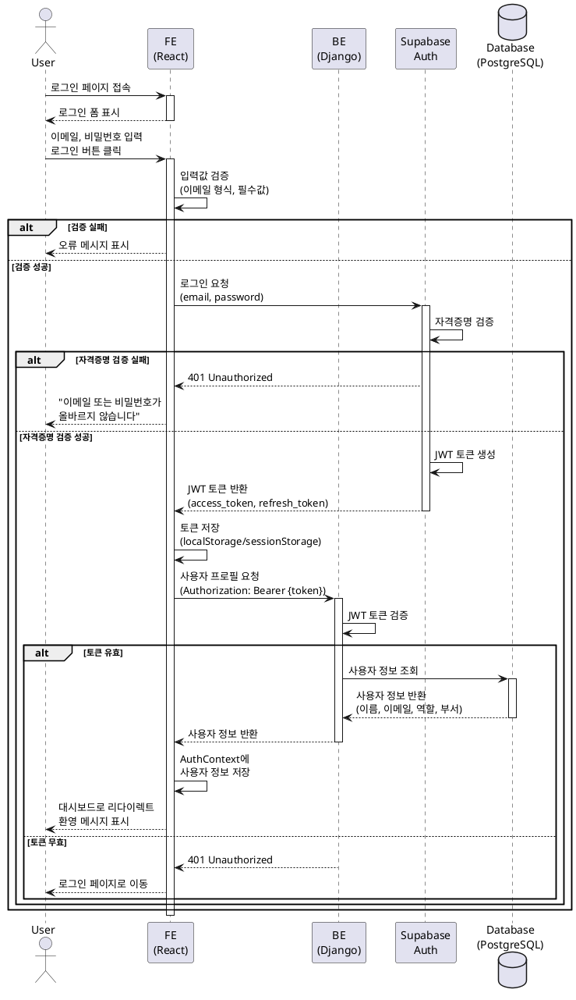

# UC-001: 사용자 로그인

## Primary Actor
- 대학교 내부 직원 (관리자 또는 일반 사용자)

## Precondition
- 사용자는 시스템에 등록된 계정을 보유하고 있어야 함
- 사용자는 인터넷에 연결된 웹 브라우저를 사용 중이어야 함
- 사용자는 로그아웃 상태여야 함

## Trigger
- 사용자가 대시보드 URL에 접속

## Main Scenario

1. 시스템이 로그인 페이지를 표시함
2. 사용자가 이메일과 비밀번호를 입력함
3. 사용자가 "로그인" 버튼을 클릭함
4. 시스템이 입력된 자격증명을 검증함
5. Supabase Auth가 JWT 토큰을 생성하여 반환함
6. 시스템이 토큰을 로컬 스토리지에 저장함
7. 시스템이 사용자 권한을 확인함
8. 시스템이 대시보드 페이지로 리다이렉트함
9. 시스템이 환영 메시지를 표시함

**Result**: 사용자가 대시보드에 접근 가능한 인증된 상태가 됨

## Alternative Scenarios

### 3a. 이메일 형식 오류
3a1. 시스템이 이메일 형식 검증에 실패함
3a2. 시스템이 "올바른 이메일 형식을 입력해주세요" 메시지를 표시함
3a3. 사용자가 올바른 이메일 형식을 입력함
3a4. Main Scenario의 3단계로 돌아감

### 4a. 잘못된 자격증명
4a1. Supabase Auth가 자격증명 검증에 실패함
4a2. 시스템이 "이메일 또는 비밀번호가 올바르지 않습니다" 메시지를 표시함
4a3. 사용자가 올바른 자격증명을 재입력함
4a4. Main Scenario의 3단계로 돌아감

### 4b. 계정 비활성화
4b1. 시스템이 계정이 비활성화되었음을 감지함
4b2. 시스템이 "이 계정은 비활성화되었습니다. 관리자에게 문의하세요" 메시지를 표시함
4b3. 사용 종료

### 4c. 로그인 시도 횟수 초과
4c1. 시스템이 5회 연속 로그인 실패를 감지함
4c2. 시스템이 계정을 15분간 잠금 처리함
4c3. 시스템이 "로그인 시도 횟수를 초과했습니다. 15분 후 다시 시도해주세요" 메시지를 표시함
4c4. 사용 종료

### 5a. 네트워크 오류
5a1. 인증 요청 중 네트워크 연결이 끊김
5a2. 시스템이 최대 3회 자동 재시도함
5a3. 재시도 실패 시 "서버에 연결할 수 없습니다. 인터넷 연결을 확인해주세요" 메시지를 표시함
5a4. Main Scenario의 3단계로 돌아감

## Edge Cases

- **동시 로그인**: 동일 계정으로 여러 브라우저에서 로그인 가능 (별도 제한 없음)
- **세션 만료 후 재로그인**: 기존 토큰 자동 폐기 후 새 토큰 발급
- **브라우저 자동완성**: 브라우저 저장된 자격증명 사용 가능
- **비밀번호 가시성 토글**: 비밀번호 입력 필드의 눈 아이콘 클릭 시 비밀번호 표시/숨김 가능
- **HTTPS 미사용 환경**: HTTPS 프로토콜 필수, HTTP 접속 시 HTTPS로 자동 리다이렉트

## Business Rules

- BR-001: 이메일 주소는 유효한 이메일 형식이어야 함 (`^[^\s@]+@[^\s@]+\.[^\s@]+$`)
- BR-002: 비밀번호는 8자 이상, 영문/숫자/특수문자 조합이어야 함
- BR-003: JWT 토큰 만료 시간은 24시간임
- BR-004: 연속 5회 로그인 실패 시 계정 15분간 잠금
- BR-005: 로그인 시도는 모두 로그에 기록됨 (성공/실패 모두)
- BR-006: 사용자 역할은 관리자(Admin) 또는 일반 사용자(User) 둘 중 하나임
- BR-007: 비활성화된 계정은 로그인 불가함
- BR-008: "로그인 상태 유지" 옵션 선택 시 토큰을 localStorage에 저장, 미선택 시 sessionStorage에 저장

## Sequence Diagram

## Post-conditions

### Success
- 사용자는 인증된 상태로 시스템에 접근 가능함
- JWT 토큰이 로컬 스토리지에 저장됨
- 사용자 정보가 AuthContext에 저장됨
- 로그인 이력이 데이터베이스에 기록됨
- 대시보드 페이지가 표시됨

### Failure
- 사용자는 로그아웃 상태로 유지됨
- 로그인 페이지에 머무름
- 오류 메시지가 표시됨
- 로그인 실패 이력이 데이터베이스에 기록됨

## Related Use Cases
- UC-002: 대시보드 조회 (로그인 성공 후 자동 진입)
- UC-006: 프로필 관리 (로그인된 사용자만 접근 가능)
- UC-007: 로그아웃 (로그인 후 사용 가능)
