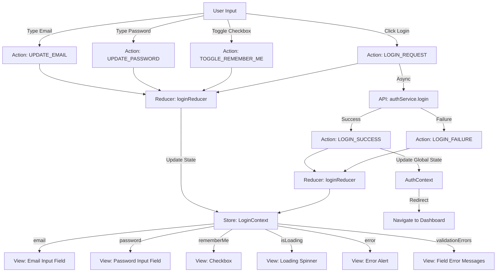
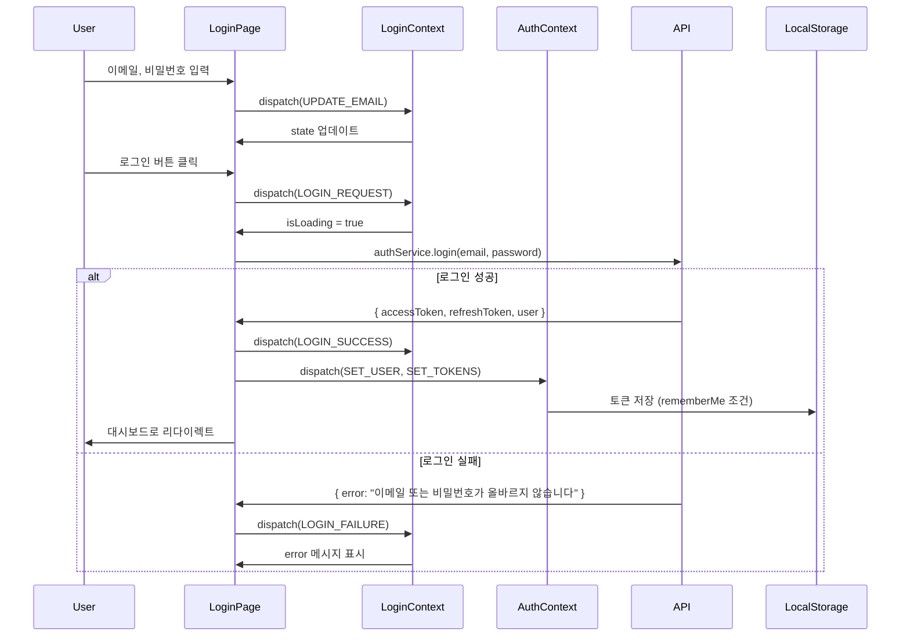

# UC-001: 로그인 페이지 상태관리 설계

## 1. 상태 데이터 목록

### 관리해야 할 상태 (State)

| 상태명 | 타입 | 초기값 | 설명 |
|--------|------|--------|------|
| `email` | string | "" | 사용자 입력 이메일 |
| `password` | string | "" | 사용자 입력 비밀번호 |
| `rememberMe` | boolean | false | 로그인 상태 유지 체크박스 |
| `isLoading` | boolean | false | 로그인 요청 진행 중 여부 |
| `error` | string \| null | null | 로그인 오류 메시지 |
| `validationErrors` | object | {} | 필드별 유효성 검증 오류 |

### 화면에 보여지지만 상태가 아닌 것 (Derived/Computed)

| 항목 | 타입 | 설명 |
|------|------|------|
| `isFormValid` | boolean | email과 password가 모두 유효한지 여부 (computed) |
| `canSubmit` | boolean | isFormValid && !isLoading (computed) |

### 전역 상태 (AuthContext)

| 상태명 | 타입 | 초기값 | 설명 |
|--------|------|--------|------|
| `user` | User \| null | null | 로그인된 사용자 정보 |
| `isAuthenticated` | boolean | false | 인증 여부 |
| `accessToken` | string \| null | null | JWT Access Token |
| `refreshToken` | string \| null | null | JWT Refresh Token |

---

## 2. 상태 변경 조건 및 화면 변화

| 상태 | 변경 조건 | 화면 변화 |
|------|----------|----------|
| `email` | 사용자가 이메일 입력 필드에 타이핑 | 입력 필드 값 업데이트, 유효성 검증 실행 |
| `password` | 사용자가 비밀번호 입력 필드에 타이핑 | 입력 필드 값 업데이트, 유효성 검증 실행 |
| `rememberMe` | 사용자가 체크박스 클릭 | 체크박스 체크/언체크 토글 |
| `isLoading` | 로그인 버튼 클릭 시 true, 응답 수신 시 false | 로딩 스피너 표시, 버튼 비활성화 |
| `error` | API 오류 응답 시 오류 메시지 설정 | 오류 메시지 Alert/Snackbar 표시 |
| `validationErrors.email` | 이메일 형식 검증 실패 시 | 이메일 필드 하단에 빨간색 오류 메시지 표시 |
| `validationErrors.password` | 비밀번호 필드 비어있을 시 | 비밀번호 필드 하단에 빨간색 오류 메시지 표시 |
| `user` (AuthContext) | 로그인 성공 시 사용자 정보 저장 | 대시보드로 리다이렉트, Navigation Bar에 사용자 정보 표시 |
| `isAuthenticated` (AuthContext) | 로그인 성공 시 true | 로그인 페이지 접근 불가, 보호된 페이지 접근 가능 |
| `accessToken` (AuthContext) | 로그인 성공 시 토큰 저장 | 모든 API 요청 헤더에 자동 포함 |

---

## 3. Flux 패턴 시각화 (Action → Store → View)



---

## 4. Context + useReducer 설계

### 4.1. State Interface

```typescript
interface LoginState {
  email: string;
  password: string;
  rememberMe: boolean;
  isLoading: boolean;
  error: string | null;
  validationErrors: {
    email?: string;
    password?: string;
  };
}

interface User {
  id: string;
  email: string;
  full_name: string;
  department: string;
  role: 'admin' | 'user';
  profile_picture_url?: string;
}

interface AuthState {
  user: User | null;
  isAuthenticated: boolean;
  accessToken: string | null;
  refreshToken: string | null;
}
```

### 4.2. Action Types

```typescript
type LoginAction =
  | { type: 'UPDATE_EMAIL'; payload: string }
  | { type: 'UPDATE_PASSWORD'; payload: string }
  | { type: 'TOGGLE_REMEMBER_ME' }
  | { type: 'LOGIN_REQUEST' }
  | { type: 'LOGIN_SUCCESS' }
  | { type: 'LOGIN_FAILURE'; payload: string }
  | { type: 'SET_VALIDATION_ERROR'; field: 'email' | 'password'; message: string }
  | { type: 'CLEAR_VALIDATION_ERRORS' }
  | { type: 'RESET_STATE' };

type AuthAction =
  | { type: 'SET_USER'; payload: User }
  | { type: 'SET_TOKENS'; payload: { accessToken: string; refreshToken: string } }
  | { type: 'LOGOUT' };
```

### 4.3. Reducer

```typescript
const loginReducer = (state: LoginState, action: LoginAction): LoginState => {
  switch (action.type) {
    case 'UPDATE_EMAIL':
      return { ...state, email: action.payload, error: null };

    case 'UPDATE_PASSWORD':
      return { ...state, password: action.payload, error: null };

    case 'TOGGLE_REMEMBER_ME':
      return { ...state, rememberMe: !state.rememberMe };

    case 'LOGIN_REQUEST':
      return { ...state, isLoading: true, error: null };

    case 'LOGIN_SUCCESS':
      return { ...state, isLoading: false, error: null };

    case 'LOGIN_FAILURE':
      return { ...state, isLoading: false, error: action.payload };

    case 'SET_VALIDATION_ERROR':
      return {
        ...state,
        validationErrors: {
          ...state.validationErrors,
          [action.field]: action.message,
        },
      };

    case 'CLEAR_VALIDATION_ERRORS':
      return { ...state, validationErrors: {} };

    case 'RESET_STATE':
      return initialLoginState;

    default:
      return state;
  }
};

const authReducer = (state: AuthState, action: AuthAction): AuthState => {
  switch (action.type) {
    case 'SET_USER':
      return { ...state, user: action.payload, isAuthenticated: true };

    case 'SET_TOKENS':
      return {
        ...state,
        accessToken: action.payload.accessToken,
        refreshToken: action.payload.refreshToken,
      };

    case 'LOGOUT':
      return {
        user: null,
        isAuthenticated: false,
        accessToken: null,
        refreshToken: null,
      };

    default:
      return state;
  }
};
```

---

## 5. Context 데이터 흐름 시각화



---

## 6. 하위 컴포넌트에 노출할 변수 및 함수

### LoginContext 노출 인터페이스

```typescript
interface LoginContextValue {
  // 상태
  state: LoginState;

  // 계산된 값
  isFormValid: boolean;
  canSubmit: boolean;

  // 액션 함수
  updateEmail: (email: string) => void;
  updatePassword: (password: string) => void;
  toggleRememberMe: () => void;
  handleLogin: () => Promise<void>;
  resetState: () => void;

  // 유효성 검증 함수
  validateEmail: (email: string) => boolean;
  validatePassword: (password: string) => boolean;
}
```

### AuthContext 노출 인터페이스

```typescript
interface AuthContextValue {
  // 상태
  user: User | null;
  isAuthenticated: boolean;
  accessToken: string | null;

  // 액션 함수
  login: (user: User, accessToken: string, refreshToken: string) => void;
  logout: () => void;
  refreshAccessToken: () => Promise<string | null>;

  // 유틸리티
  isAdmin: boolean;
  hasPermission: (permission: string) => boolean;
}
```

---

## 7. 주요 구현 로직 (인터페이스)

### 7.1. 로그인 핸들러

```typescript
const handleLogin = async (): Promise<void> => {
  // 1. 유효성 검증
  dispatch({ type: 'CLEAR_VALIDATION_ERRORS' });

  if (!validateEmail(state.email)) {
    dispatch({
      type: 'SET_VALIDATION_ERROR',
      field: 'email',
      message: '올바른 이메일 형식을 입력해주세요',
    });
    return;
  }

  if (!validatePassword(state.password)) {
    dispatch({
      type: 'SET_VALIDATION_ERROR',
      field: 'password',
      message: '비밀번호를 입력해주세요',
    });
    return;
  }

  // 2. 로그인 요청
  dispatch({ type: 'LOGIN_REQUEST' });

  try {
    const { user, accessToken, refreshToken } = await authService.login(
      state.email,
      state.password
    );

    // 3. 성공 처리
    dispatch({ type: 'LOGIN_SUCCESS' });

    // 4. 전역 상태 업데이트
    authDispatch({ type: 'SET_USER', payload: user });
    authDispatch({ type: 'SET_TOKENS', payload: { accessToken, refreshToken } });

    // 5. 토큰 저장
    const storage = state.rememberMe ? localStorage : sessionStorage;
    storage.setItem('accessToken', accessToken);
    storage.setItem('refreshToken', refreshToken);

    // 6. 리다이렉트
    navigate('/dashboard');

  } catch (error) {
    // 7. 실패 처리
    dispatch({
      type: 'LOGIN_FAILURE',
      payload: error.message || '로그인 중 오류가 발생했습니다',
    });
  }
};
```

### 7.2. 유효성 검증

```typescript
const validateEmail = (email: string): boolean => {
  const emailRegex = /^[^\s@]+@[^\s@]+\.[^\s@]+$/;
  return emailRegex.test(email);
};

const validatePassword = (password: string): boolean => {
  return password.length > 0;
};
```

---

## 8. 설계 원칙 준수

### DRY (Don't Repeat Yourself)
- 유효성 검증 로직을 별도 함수로 분리
- 공통 오류 처리 로직을 reducer에서 관리
- API 호출 로직을 authService로 추상화

### Single Responsibility
- LoginContext: 로그인 폼 상태 관리만 담당
- AuthContext: 전역 인증 상태 관리만 담당
- Reducer: 상태 업데이트 로직만 담당

### Separation of Concerns
- Presentation (LoginPage): UI 렌더링만 담당
- Application (LoginContext): 로그인 플로우 상태 관리
- Service (authService): API 통신
- Infrastructure (AuthContext): 인증 토큰 관리

---

## 9. 주의사항

1. **보안**: 비밀번호는 절대 상태에 평문으로 저장하지 않음 (API 전송 시 HTTPS 필수)
2. **메모리 누수**: 컴포넌트 언마운트 시 상태 초기화 (`resetState`)
3. **토큰 저장**: `rememberMe` 조건에 따라 localStorage vs sessionStorage 선택
4. **오류 처리**: 네트워크 오류, 서버 오류, 검증 오류를 명확히 구분
5. **접근성**: 오류 메시지는 스크린 리더가 읽을 수 있도록 aria-live 영역에 표시
