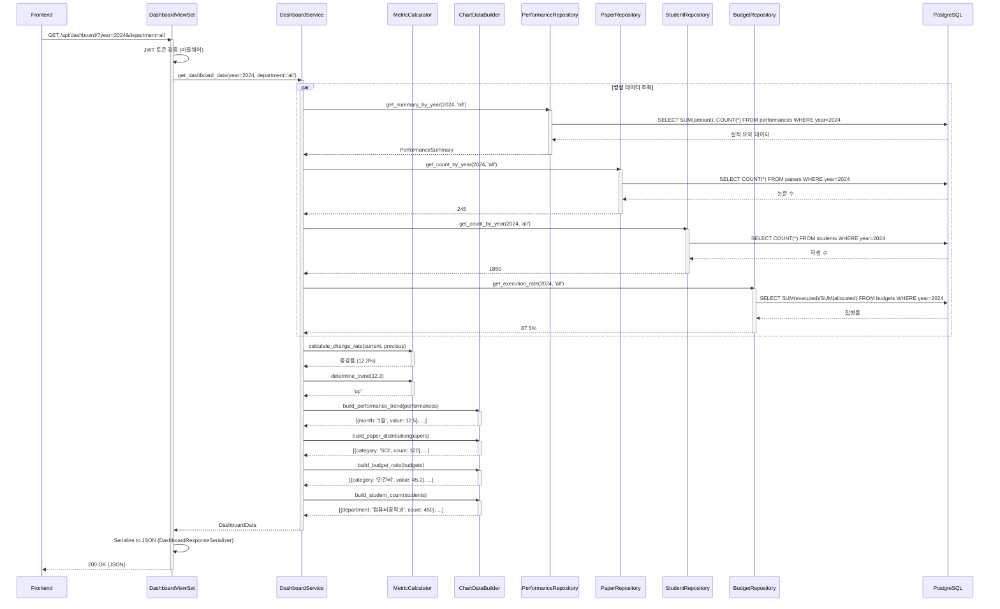
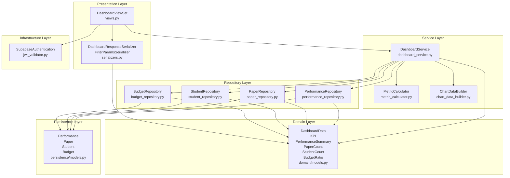
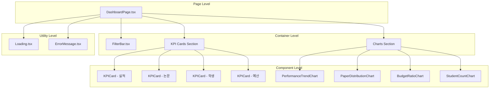

# UC-002: 대시보드 조회 - 구현 계획

## 1. 개요

### 1.1 기능 요약
- **목적**: 로그인한 사용자에게 대학교 실적, 논문, 학생, 예산 데이터를 시각화하여 제공
- **핵심 기능**:
  - 4개 KPI 카드 표시 (실적, 논문, 학생, 예산)
  - 4개 차트 표시 (실적 추세 라인, 논문 분포 막대, 예산 비율 파이, 학생 수 막대)
  - 연도 및 부서별 필터링
  - 전년 대비 증감률 표시
  - 차트 인터랙션 (툴팁, 클릭 이벤트)
- **사용자**: 모든 로그인 사용자 (관리자, 일반 사용자)

### 1.2 아키텍처 원칙
- **Layered Architecture**: Infrastructure → Presentation → Service → Repository → Domain → Persistence
- **SOLID 원칙 준수**: 각 레이어는 단일 책임을 가지며, 의존성은 내부 방향으로만 흐름
- **TDD**: Red-Green-Refactor 사이클을 엄격히 준수
- **공통 모듈 최대 활용**: common-modules.md에 정의된 재사용 가능한 모듈 활용

---

## 2. Backend 구현

### 2.1 Backend 모듈 구조

#### 2.1.1 Infrastructure Layer
**책임**: JWT 인증 미들웨어 (UC-001에서 이미 구현됨)

**파일**: `backend/infrastructure/authentication/jwt_validator.py` (재사용)

#### 2.1.2 Presentation Layer
**책임**: HTTP 요청/응답 처리

**파일**:
- `backend/apps/dashboard/presentation/views.py` - DashboardViewSet
- `backend/apps/dashboard/presentation/serializers.py` - DashboardResponseSerializer, FilterParamsSerializer
- `backend/apps/dashboard/presentation/urls.py` - URL 라우팅

**API 엔드포인트**:
```
GET /api/dashboard/
Query Parameters:
  - year: int (optional, default: 현재 연도)
  - department: str (optional, default: 'all')

Response 200 OK:
{
  "kpis": {
    "performance": {
      "value": 150.5,  // 억원
      "unit": "억원",
      "change_rate": 12.3,  // %
      "trend": "up"  // "up", "down", "neutral"
    },
    "papers": {
      "value": 245,  // 편
      "unit": "편",
      "change_rate": -5.2,
      "trend": "down"
    },
    "students": {
      "value": 1850,  // 명
      "unit": "명",
      "change_rate": 3.1,
      "trend": "up"
    },
    "budget": {
      "value": 87.5,  // %
      "unit": "%",
      "change_rate": 0.0,
      "trend": "neutral"
    }
  },
  "charts": {
    "performance_trend": [
      {"month": "1월", "value": 12.5},
      {"month": "2월", "value": 15.3},
      ...
    ],
    "paper_distribution": [
      {"category": "SCI", "count": 120},
      {"category": "KCI", "count": 80},
      {"category": "기타", "count": 45}
    ],
    "budget_ratio": [
      {"category": "인건비", "value": 45.2, "percentage": 51.7},
      {"category": "연구비", "value": 30.5, "percentage": 34.9},
      {"category": "운영비", "value": 11.8, "percentage": 13.4}
    ],
    "student_count": [
      {"department": "컴퓨터공학과", "count": 450},
      {"department": "전자공학과", "count": 380},
      ...
    ]
  },
  "filters": {
    "year": 2024,
    "department": "all"
  }
}

Response 401 Unauthorized:
{
  "error": "인증이 필요합니다"
}

Response 500 Internal Server Error:
{
  "error": "데이터를 불러오는 중 오류가 발생했습니다"
}
```

#### 2.1.3 Service Layer
**책임**: 대시보드 비즈니스 로직 (데이터 집계, 증감률 계산, 차트 데이터 생성)

**파일**:
- `backend/apps/dashboard/services/dashboard_service.py` - DashboardService
- `backend/apps/dashboard/services/metric_calculator.py` - MetricCalculator
- `backend/apps/dashboard/services/chart_data_builder.py` - ChartDataBuilder

**주요 메서드**:
```python
# DashboardService
class DashboardService:
    def get_dashboard_data(self, year: int, department: str) -> DashboardData:
        """대시보드 전체 데이터 조회 및 생성"""
        pass

    def _build_kpis(self, year: int, department: str) -> Dict[str, KPI]:
        """KPI 데이터 생성"""
        pass

    def _build_charts(self, year: int, department: str) -> Dict[str, List]:
        """차트 데이터 생성"""
        pass

# MetricCalculator
class MetricCalculator:
    @staticmethod
    def calculate_change_rate(current_value: Decimal, previous_value: Decimal) -> Decimal:
        """전년 대비 증감률 계산"""
        pass

    @staticmethod
    def determine_trend(change_rate: Decimal) -> str:
        """증감 추세 판단 (up/down/neutral)"""
        pass

# ChartDataBuilder
class ChartDataBuilder:
    def build_performance_trend(self, performances: List[Performance]) -> List[Dict]:
        """실적 추세 라인 차트 데이터 생성"""
        pass

    def build_paper_distribution(self, papers: List[Paper]) -> List[Dict]:
        """논문 분포 막대 차트 데이터 생성"""
        pass

    def build_budget_ratio(self, budgets: List[Budget]) -> List[Dict]:
        """예산 비율 파이 차트 데이터 생성"""
        pass

    def build_student_count(self, students: List[Student]) -> List[Dict]:
        """학생 수 막대 차트 데이터 생성"""
        pass
```

#### 2.1.4 Repository Layer
**책임**: 데이터 접근 추상화

**파일**:
- `backend/apps/dashboard/repositories/performance_repository.py` - PerformanceRepository
- `backend/apps/dashboard/repositories/paper_repository.py` - PaperRepository
- `backend/apps/dashboard/repositories/student_repository.py` - StudentRepository
- `backend/apps/dashboard/repositories/budget_repository.py` - BudgetRepository

**주요 메서드**:
```python
# PerformanceRepository
class PerformanceRepository:
    def get_summary_by_year(self, year: int, department: str = 'all') -> PerformanceSummary:
        """연도별 실적 요약 조회"""
        pass

    def get_monthly_trend(self, year: int, department: str = 'all') -> List[Performance]:
        """월별 실적 추세 조회"""
        pass

# PaperRepository
class PaperRepository:
    def get_count_by_year(self, year: int, department: str = 'all') -> int:
        """연도별 논문 수 조회"""
        pass

    def get_distribution_by_category(self, year: int, department: str = 'all') -> List[PaperCount]:
        """카테고리별 논문 분포 조회"""
        pass

# StudentRepository
class StudentRepository:
    def get_count_by_year(self, year: int, department: str = 'all') -> int:
        """연도별 학생 수 조회"""
        pass

    def get_count_by_department(self, year: int) -> List[StudentCount]:
        """부서별 학생 수 조회"""
        pass

# BudgetRepository
class BudgetRepository:
    def get_execution_rate(self, year: int, department: str = 'all') -> Decimal:
        """예산 집행률 조회"""
        pass

    def get_ratio_by_category(self, year: int, department: str = 'all') -> List[BudgetRatio]:
        """카테고리별 예산 비율 조회"""
        pass
```

#### 2.1.5 Domain Layer
**책임**: 비즈니스 엔티티 정의

**파일**: `backend/apps/dashboard/domain/models.py`

```python
from dataclasses import dataclass
from decimal import Decimal
from typing import List, Dict

@dataclass
class KPI:
    value: Decimal
    unit: str
    change_rate: Decimal
    trend: str  # 'up', 'down', 'neutral'

@dataclass
class DashboardData:
    kpis: Dict[str, KPI]
    charts: Dict[str, List[Dict]]
    filters: Dict[str, any]

@dataclass
class PerformanceSummary:
    total_amount: Decimal
    count: int
    year: int

@dataclass
class PaperCount:
    category: str
    count: int

@dataclass
class StudentCount:
    department: str
    count: int

@dataclass
class BudgetRatio:
    category: str
    amount: Decimal
    percentage: Decimal
```

#### 2.1.6 Persistence Layer
**책임**: ORM 모델 (이미 database.md에서 정의됨)

**파일**:
- `backend/apps/dashboard/persistence/models.py` (Performance, Paper, Student, Budget 모델)
- 이미 정의된 모델 재사용

---

### 2.2 Backend 시퀀스 다이어그램



---

### 2.3 Backend 모듈 관계도



---

## 3. Frontend 구현

### 3.1 Frontend 모듈 구조

#### 3.1.1 Infrastructure Layer
**책임**: Axios 클라이언트 설정 (UC-001에서 이미 구현됨)

**파일**: `frontend/src/infrastructure/external/client.ts` (재사용)

#### 3.1.2 Application Layer
**책임**: 대시보드 상태 관리 및 훅

**파일**:
- `frontend/src/application/hooks/useDashboard.ts` - 대시보드 데이터 조회 및 필터링 로직
- `frontend/src/application/hooks/useDebounce.ts` - 필터 디바운싱 (공통 모듈 재사용)

**주요 훅**:
```typescript
// useDashboard.ts
export const useDashboard = (initialYear?: number, initialDepartment?: string) => {
  const [data, setData] = useState<DashboardData | null>(null);
  const [loading, setLoading] = useState(false);
  const [error, setError] = useState<string | null>(null);
  const [filters, setFilters] = useState({
    year: initialYear || new Date().getFullYear(),
    department: initialDepartment || 'all'
  });

  const fetchDashboard = async () => {
    setLoading(true);
    setError(null);
    try {
      const response = await dashboardApi.getDashboard(filters.year, filters.department);
      setData(response);
    } catch (err) {
      setError('대시보드 데이터를 불러오는 중 오류가 발생했습니다');
    } finally {
      setLoading(false);
    }
  };

  useEffect(() => {
    fetchDashboard();
  }, [filters]);

  return { data, loading, error, filters, setFilters, refetch: fetchDashboard };
};
```

#### 3.1.3 Service Layer
**책임**: API 통신 및 데이터 변환

**파일**:
- `frontend/src/services/api/dashboardApi.ts` - Dashboard API 클라이언트
- `frontend/src/services/transformers/chartTransformer.ts` - 차트 데이터 변환

**주요 메서드**:
```typescript
// dashboardApi.ts
export const dashboardApi = {
  async getDashboard(year: number, department: string): Promise<DashboardData> {
    const response = await client.get('/dashboard/', {
      params: { year, department }
    });
    return response.data;
  }
};

// chartTransformer.ts
export const chartTransformer = {
  transformPerformanceTrend(data: any[]): ChartData[] {
    return data.map(item => ({
      name: item.month,
      value: item.value
    }));
  },

  transformPaperDistribution(data: any[]): ChartData[] {
    return data.map(item => ({
      name: item.category,
      value: item.count
    }));
  },

  transformBudgetRatio(data: any[]): PieChartData[] {
    return data.map(item => ({
      name: item.category,
      value: item.value,
      percentage: item.percentage
    }));
  },

  transformStudentCount(data: any[]): ChartData[] {
    return data.map(item => ({
      name: item.department,
      value: item.count
    }));
  }
};
```

#### 3.1.4 Presentation Layer
**책임**: UI 렌더링

**파일**:
- `frontend/src/presentation/pages/DashboardPage.tsx` - 대시보드 페이지
- `frontend/src/presentation/components/charts/KPICard.tsx` - KPI 카드 컴포넌트
- `frontend/src/presentation/components/charts/PerformanceTrendChart.tsx` - 실적 추세 라인 차트
- `frontend/src/presentation/components/charts/PaperDistributionChart.tsx` - 논문 분포 막대 차트
- `frontend/src/presentation/components/charts/BudgetRatioChart.tsx` - 예산 비율 파이 차트
- `frontend/src/presentation/components/charts/StudentCountChart.tsx` - 학생 수 막대 차트
- `frontend/src/presentation/components/common/FilterBar.tsx` - 필터 바 컴포넌트
- `frontend/src/presentation/components/common/Loading.tsx` - 로딩 스피너 (재사용)
- `frontend/src/presentation/components/common/ErrorMessage.tsx` - 에러 메시지 (재사용)

#### 3.1.5 Domain Layer
**책임**: 타입 정의

**파일**: `frontend/src/domain/models/Dashboard.ts`

```typescript
export interface KPI {
  value: number;
  unit: string;
  change_rate: number;
  trend: 'up' | 'down' | 'neutral';
}

export interface DashboardData {
  kpis: {
    performance: KPI;
    papers: KPI;
    students: KPI;
    budget: KPI;
  };
  charts: {
    performance_trend: ChartDataPoint[];
    paper_distribution: ChartDataPoint[];
    budget_ratio: PieChartDataPoint[];
    student_count: ChartDataPoint[];
  };
  filters: {
    year: number;
    department: string;
  };
}

export interface ChartDataPoint {
  name: string;
  value: number;
}

export interface PieChartDataPoint extends ChartDataPoint {
  percentage: number;
}
```

---

### 3.2 Frontend 컴포넌트 계층 구조



---

## 4. TDD 구현 계획

### 4.1 Backend TDD 시나리오

#### 4.1.1 Infrastructure Layer
**이미 UC-001에서 구현 완료** - JWT 인증 미들웨어 테스트

#### 4.1.2 Domain Layer 테스트

**파일**: `backend/apps/dashboard/tests/test_domain.py`

**Test Case 1: KPI 도메인 모델 생성**
```python
class TestKPIDomain:
    def test_kpi_creation_with_valid_data(self):
        # Arrange & Act
        kpi = KPI(
            value=Decimal('150.5'),
            unit='억원',
            change_rate=Decimal('12.3'),
            trend='up'
        )

        # Assert
        assert kpi.value == Decimal('150.5')
        assert kpi.unit == '억원'
        assert kpi.change_rate == Decimal('12.3')
        assert kpi.trend == 'up'

class TestDashboardDataDomain:
    def test_dashboard_data_creation_with_all_fields(self):
        # Arrange
        kpis = {
            'performance': KPI(Decimal('150.5'), '억원', Decimal('12.3'), 'up')
        }
        charts = {
            'performance_trend': [{'month': '1월', 'value': 12.5}]
        }
        filters = {'year': 2024, 'department': 'all'}

        # Act
        dashboard_data = DashboardData(kpis=kpis, charts=charts, filters=filters)

        # Assert
        assert dashboard_data.kpis['performance'].value == Decimal('150.5')
        assert len(dashboard_data.charts['performance_trend']) == 1
        assert dashboard_data.filters['year'] == 2024
```

#### 4.1.3 Repository Layer 테스트

**파일**: `backend/apps/dashboard/tests/test_repositories.py`

**Test Case 2: PerformanceRepository - 연도별 요약 조회**
```python
@pytest.mark.django_db
class TestPerformanceRepository:
    def test_get_summary_by_year_returns_correct_aggregation(self):
        # Arrange
        PerformanceFactory.create(year=2024, amount=Decimal('100.0'))
        PerformanceFactory.create(year=2024, amount=Decimal('50.5'))
        PerformanceFactory.create(year=2023, amount=Decimal('200.0'))  # 다른 연도

        repo = PerformanceRepository()

        # Act
        summary = repo.get_summary_by_year(year=2024)

        # Assert
        assert summary.total_amount == Decimal('150.5')
        assert summary.count == 2
        assert summary.year == 2024

    def test_get_summary_by_year_with_department_filter(self):
        # Arrange
        PerformanceFactory.create(year=2024, department='컴퓨터공학과', amount=Decimal('100.0'))
        PerformanceFactory.create(year=2024, department='전자공학과', amount=Decimal('50.0'))

        repo = PerformanceRepository()

        # Act
        summary = repo.get_summary_by_year(year=2024, department='컴퓨터공학과')

        # Assert
        assert summary.total_amount == Decimal('100.0')
        assert summary.count == 1

    def test_get_monthly_trend_returns_ordered_data(self):
        # Arrange
        PerformanceFactory.create(year=2024, month=3, amount=Decimal('30.0'))
        PerformanceFactory.create(year=2024, month=1, amount=Decimal('10.0'))
        PerformanceFactory.create(year=2024, month=2, amount=Decimal('20.0'))

        repo = PerformanceRepository()

        # Act
        trend = repo.get_monthly_trend(year=2024)

        # Assert
        assert len(trend) == 3
        assert trend[0].month == 1
        assert trend[1].month == 2
        assert trend[2].month == 3

@pytest.mark.django_db
class TestPaperRepository:
    def test_get_count_by_year_returns_correct_count(self):
        # Arrange
        PaperFactory.create_batch(5, year=2024)
        PaperFactory.create_batch(3, year=2023)

        repo = PaperRepository()

        # Act
        count = repo.get_count_by_year(year=2024)

        # Assert
        assert count == 5

    def test_get_distribution_by_category_groups_correctly(self):
        # Arrange
        PaperFactory.create_batch(3, year=2024, category='SCI')
        PaperFactory.create_batch(2, year=2024, category='KCI')
        PaperFactory.create_batch(1, year=2024, category='기타')

        repo = PaperRepository()

        # Act
        distribution = repo.get_distribution_by_category(year=2024)

        # Assert
        assert len(distribution) == 3
        sci_count = next(d for d in distribution if d.category == 'SCI')
        assert sci_count.count == 3
```

#### 4.1.4 Service Layer 테스트

**파일**: `backend/apps/dashboard/tests/test_services.py`

**Test Case 3: MetricCalculator - 증감률 계산**
```python
class TestMetricCalculator:
    def test_calculate_change_rate_with_positive_change(self):
        # Arrange
        current_value = Decimal('112.3')
        previous_value = Decimal('100.0')

        # Act
        change_rate = MetricCalculator.calculate_change_rate(current_value, previous_value)

        # Assert
        assert change_rate == Decimal('12.3')

    def test_calculate_change_rate_with_negative_change(self):
        # Arrange
        current_value = Decimal('90.0')
        previous_value = Decimal('100.0')

        # Act
        change_rate = MetricCalculator.calculate_change_rate(current_value, previous_value)

        # Assert
        assert change_rate == Decimal('-10.0')

    def test_calculate_change_rate_with_zero_previous_value_raises_error(self):
        # Arrange
        current_value = Decimal('100.0')
        previous_value = Decimal('0.0')

        # Act & Assert
        with pytest.raises(ValueError, match='이전 값은 0이 될 수 없습니다'):
            MetricCalculator.calculate_change_rate(current_value, previous_value)

    def test_determine_trend_returns_up_for_positive_rate(self):
        # Arrange
        change_rate = Decimal('12.3')

        # Act
        trend = MetricCalculator.determine_trend(change_rate)

        # Assert
        assert trend == 'up'

    def test_determine_trend_returns_down_for_negative_rate(self):
        # Arrange
        change_rate = Decimal('-5.2')

        # Act
        trend = MetricCalculator.determine_trend(change_rate)

        # Assert
        assert trend == 'down'

    def test_determine_trend_returns_neutral_for_zero_rate(self):
        # Arrange
        change_rate = Decimal('0.0')

        # Act
        trend = MetricCalculator.determine_trend(change_rate)

        # Assert
        assert trend == 'neutral'

class TestChartDataBuilder:
    def test_build_performance_trend_transforms_correctly(self):
        # Arrange
        performances = [
            Performance(month=1, amount=Decimal('10.5')),
            Performance(month=2, amount=Decimal('12.3')),
        ]
        builder = ChartDataBuilder()

        # Act
        chart_data = builder.build_performance_trend(performances)

        # Assert
        assert len(chart_data) == 2
        assert chart_data[0]['month'] == '1월'
        assert chart_data[0]['value'] == Decimal('10.5')

    def test_build_paper_distribution_groups_by_category(self):
        # Arrange
        papers = [
            Paper(category='SCI'),
            Paper(category='SCI'),
            Paper(category='KCI'),
        ]
        builder = ChartDataBuilder()

        # Act
        chart_data = builder.build_paper_distribution(papers)

        # Assert
        assert len(chart_data) == 2
        sci_item = next(d for d in chart_data if d['category'] == 'SCI')
        assert sci_item['count'] == 2

@pytest.mark.django_db
class TestDashboardService:
    def test_get_dashboard_data_returns_complete_structure(self):
        # Arrange
        PerformanceFactory.create_batch(3, year=2024)
        PaperFactory.create_batch(5, year=2024)
        StudentFactory.create_batch(10, year=2024)
        BudgetFactory.create_batch(2, year=2024)

        service = DashboardService()

        # Act
        dashboard_data = service.get_dashboard_data(year=2024, department='all')

        # Assert
        assert 'performance' in dashboard_data.kpis
        assert 'papers' in dashboard_data.kpis
        assert 'students' in dashboard_data.kpis
        assert 'budget' in dashboard_data.kpis
        assert 'performance_trend' in dashboard_data.charts
        assert 'paper_distribution' in dashboard_data.charts
        assert dashboard_data.filters['year'] == 2024

    def test_build_kpis_calculates_change_rate_correctly(self, mocker):
        # Arrange
        mock_perf_repo = mocker.Mock(spec=PerformanceRepository)
        mock_perf_repo.get_summary_by_year.side_effect = [
            PerformanceSummary(total_amount=Decimal('150.5'), count=10, year=2024),
            PerformanceSummary(total_amount=Decimal('100.0'), count=8, year=2023)
        ]

        service = DashboardService(performance_repo=mock_perf_repo)

        # Act
        kpis = service._build_kpis(year=2024, department='all')

        # Assert
        assert kpis['performance'].value == Decimal('150.5')
        assert kpis['performance'].change_rate == Decimal('50.5')  # (150.5 - 100) / 100 * 100
        assert kpis['performance'].trend == 'up'
```

#### 4.1.5 Presentation Layer 테스트

**파일**: `backend/apps/dashboard/tests/test_views.py`

**Test Case 4: DashboardViewSet - API 엔드포인트**
```python
@pytest.mark.django_db
class TestDashboardViewSet:
    def test_get_dashboard_with_authenticated_user_returns_200(self, api_client, auth_token):
        # Arrange
        PerformanceFactory.create_batch(3, year=2024)
        api_client.credentials(HTTP_AUTHORIZATION=f'Bearer {auth_token}')

        # Act
        response = api_client.get('/api/dashboard/')

        # Assert
        assert response.status_code == 200
        assert 'kpis' in response.data
        assert 'charts' in response.data
        assert 'filters' in response.data

    def test_get_dashboard_without_authentication_returns_401(self, api_client):
        # Act
        response = api_client.get('/api/dashboard/')

        # Assert
        assert response.status_code == 401

    def test_get_dashboard_with_year_filter_returns_filtered_data(self, api_client, auth_token):
        # Arrange
        PerformanceFactory.create_batch(3, year=2024)
        PerformanceFactory.create_batch(5, year=2023)
        api_client.credentials(HTTP_AUTHORIZATION=f'Bearer {auth_token}')

        # Act
        response = api_client.get('/api/dashboard/', {'year': 2023})

        # Assert
        assert response.status_code == 200
        assert response.data['filters']['year'] == 2023

    def test_get_dashboard_with_department_filter_returns_filtered_data(self, api_client, auth_token):
        # Arrange
        PerformanceFactory.create(year=2024, department='컴퓨터공학과')
        api_client.credentials(HTTP_AUTHORIZATION=f'Bearer {auth_token}')

        # Act
        response = api_client.get('/api/dashboard/', {'department': '컴퓨터공학과'})

        # Assert
        assert response.status_code == 200
        assert response.data['filters']['department'] == '컴퓨터공학과'

    def test_get_dashboard_with_invalid_year_returns_400(self, api_client, auth_token):
        # Arrange
        api_client.credentials(HTTP_AUTHORIZATION=f'Bearer {auth_token}')

        # Act
        response = api_client.get('/api/dashboard/', {'year': 'invalid'})

        # Assert
        assert response.status_code == 400

    def test_get_dashboard_handles_service_error_gracefully(self, api_client, auth_token, mocker):
        # Arrange
        api_client.credentials(HTTP_AUTHORIZATION=f'Bearer {auth_token}')
        mocker.patch(
            'apps.dashboard.services.dashboard_service.DashboardService.get_dashboard_data',
            side_effect=Exception('Database error')
        )

        # Act
        response = api_client.get('/api/dashboard/')

        # Assert
        assert response.status_code == 500
        assert 'error' in response.data
```

---

### 4.2 Frontend TDD 시나리오

#### 4.2.1 Service Layer 테스트

**파일**: `frontend/src/services/api/__tests__/dashboardApi.test.ts`

**Test Case 5: Dashboard API 클라이언트**
```typescript
import { describe, it, expect, vi } from 'vitest';
import { dashboardApi } from '../dashboardApi';
import client from '@/infrastructure/external/client';

vi.mock('@/infrastructure/external/client');

describe('dashboardApi', () => {
  it('getDashboard는 올바른 파라미터로 GET 요청을 보낸다', async () => {
    // Arrange
    const mockData = { kpis: {}, charts: {}, filters: {} };
    (client.get as any).mockResolvedValue({ data: mockData });

    // Act
    const result = await dashboardApi.getDashboard(2024, 'all');

    // Assert
    expect(client.get).toHaveBeenCalledWith('/dashboard/', {
      params: { year: 2024, department: 'all' }
    });
    expect(result).toEqual(mockData);
  });

  it('getDashboard는 네트워크 오류를 전파한다', async () => {
    // Arrange
    (client.get as any).mockRejectedValue(new Error('Network error'));

    // Act & Assert
    await expect(dashboardApi.getDashboard(2024, 'all')).rejects.toThrow('Network error');
  });
});
```

**파일**: `frontend/src/services/transformers/__tests__/chartTransformer.test.ts`

**Test Case 6: Chart 데이터 변환**
```typescript
import { describe, it, expect } from 'vitest';
import { chartTransformer } from '../chartTransformer';

describe('chartTransformer', () => {
  it('transformPerformanceTrend는 월별 데이터를 차트 형식으로 변환한다', () => {
    // Arrange
    const rawData = [
      { month: '1월', value: 12.5 },
      { month: '2월', value: 15.3 }
    ];

    // Act
    const result = chartTransformer.transformPerformanceTrend(rawData);

    // Assert
    expect(result).toEqual([
      { name: '1월', value: 12.5 },
      { name: '2월', value: 15.3 }
    ]);
  });

  it('transformBudgetRatio는 예산 비율 데이터를 파이 차트 형식으로 변환한다', () => {
    // Arrange
    const rawData = [
      { category: '인건비', value: 45.2, percentage: 51.7 }
    ];

    // Act
    const result = chartTransformer.transformBudgetRatio(rawData);

    // Assert
    expect(result[0]).toHaveProperty('name', '인건비');
    expect(result[0]).toHaveProperty('value', 45.2);
    expect(result[0]).toHaveProperty('percentage', 51.7);
  });
});
```

#### 4.2.2 Application Layer 테스트

**파일**: `frontend/src/application/hooks/__tests__/useDashboard.test.ts`

**Test Case 7: useDashboard 훅**
```typescript
import { renderHook, waitFor } from '@testing-library/react';
import { describe, it, expect, vi } from 'vitest';
import { useDashboard } from '../useDashboard';
import { dashboardApi } from '@/services/api/dashboardApi';

vi.mock('@/services/api/dashboardApi');

describe('useDashboard', () => {
  it('초기 로딩 시 데이터를 가져온다', async () => {
    // Arrange
    const mockData = {
      kpis: { performance: { value: 150.5, unit: '억원', change_rate: 12.3, trend: 'up' } },
      charts: {},
      filters: { year: 2024, department: 'all' }
    };
    (dashboardApi.getDashboard as any).mockResolvedValue(mockData);

    // Act
    const { result } = renderHook(() => useDashboard());

    // Assert
    expect(result.current.loading).toBe(true);

    await waitFor(() => {
      expect(result.current.loading).toBe(false);
      expect(result.current.data).toEqual(mockData);
      expect(result.current.error).toBeNull();
    });
  });

  it('필터 변경 시 데이터를 다시 가져온다', async () => {
    // Arrange
    const mockData1 = { kpis: {}, charts: {}, filters: { year: 2024, department: 'all' } };
    const mockData2 = { kpis: {}, charts: {}, filters: { year: 2023, department: 'all' } };
    (dashboardApi.getDashboard as any)
      .mockResolvedValueOnce(mockData1)
      .mockResolvedValueOnce(mockData2);

    // Act
    const { result } = renderHook(() => useDashboard());

    await waitFor(() => expect(result.current.loading).toBe(false));

    result.current.setFilters({ year: 2023, department: 'all' });

    // Assert
    await waitFor(() => {
      expect(dashboardApi.getDashboard).toHaveBeenCalledTimes(2);
      expect(result.current.data).toEqual(mockData2);
    });
  });

  it('API 오류 시 에러 상태를 설정한다', async () => {
    // Arrange
    (dashboardApi.getDashboard as any).mockRejectedValue(new Error('API Error'));

    // Act
    const { result } = renderHook(() => useDashboard());

    // Assert
    await waitFor(() => {
      expect(result.current.loading).toBe(false);
      expect(result.current.error).toBe('대시보드 데이터를 불러오는 중 오류가 발생했습니다');
      expect(result.current.data).toBeNull();
    });
  });
});
```

#### 4.2.3 Presentation Layer 테스트

**파일**: `frontend/src/presentation/components/charts/__tests__/KPICard.test.tsx`

**Test Case 8: KPICard 컴포넌트**
```typescript
import { render, screen } from '@testing-library/react';
import { describe, it, expect } from 'vitest';
import KPICard from '../KPICard';

describe('KPICard', () => {
  it('KPI 데이터를 올바르게 렌더링한다', () => {
    // Arrange
    const kpi = {
      value: 150.5,
      unit: '억원',
      change_rate: 12.3,
      trend: 'up' as const
    };

    // Act
    render(<KPICard title="실적" kpi={kpi} />);

    // Assert
    expect(screen.getByText('실적')).toBeInTheDocument();
    expect(screen.getByText('150.5억원')).toBeInTheDocument();
    expect(screen.getByText('12.3%')).toBeInTheDocument();
    expect(screen.getByText('↑')).toBeInTheDocument();
  });

  it('증가 추세는 녹색으로 표시한다', () => {
    // Arrange
    const kpi = { value: 100, unit: '편', change_rate: 5.0, trend: 'up' as const };

    // Act
    render(<KPICard title="논문" kpi={kpi} />);

    // Assert
    const trendElement = screen.getByText('↑');
    expect(trendElement).toHaveStyle({ color: 'green' });
  });

  it('감소 추세는 빨간색으로 표시한다', () => {
    // Arrange
    const kpi = { value: 100, unit: '명', change_rate: -3.2, trend: 'down' as const };

    // Act
    render(<KPICard title="학생" kpi={kpi} />);

    // Assert
    const trendElement = screen.getByText('↓');
    expect(trendElement).toHaveStyle({ color: 'red' });
  });

  it('동일 추세는 회색으로 표시한다', () => {
    // Arrange
    const kpi = { value: 87.5, unit: '%', change_rate: 0.0, trend: 'neutral' as const };

    // Act
    render(<KPICard title="예산" kpi={kpi} />);

    // Assert
    const trendElement = screen.getByText('→');
    expect(trendElement).toHaveStyle({ color: 'gray' });
  });
});
```

**파일**: `frontend/src/presentation/pages/__tests__/DashboardPage.test.tsx`

**Test Case 9: DashboardPage 컴포넌트**
```typescript
import { render, screen, waitFor } from '@testing-library/react';
import { describe, it, expect, vi } from 'vitest';
import DashboardPage from '../DashboardPage';
import { useDashboard } from '@/application/hooks/useDashboard';

vi.mock('@/application/hooks/useDashboard');

describe('DashboardPage', () => {
  it('로딩 중일 때 스피너를 표시한다', () => {
    // Arrange
    (useDashboard as any).mockReturnValue({
      data: null,
      loading: true,
      error: null
    });

    // Act
    render(<DashboardPage />);

    // Assert
    expect(screen.getByTestId('loading-spinner')).toBeInTheDocument();
  });

  it('데이터 로드 성공 시 KPI 카드와 차트를 렌더링한다', async () => {
    // Arrange
    const mockData = {
      kpis: {
        performance: { value: 150.5, unit: '억원', change_rate: 12.3, trend: 'up' },
        papers: { value: 245, unit: '편', change_rate: -5.2, trend: 'down' },
        students: { value: 1850, unit: '명', change_rate: 3.1, trend: 'up' },
        budget: { value: 87.5, unit: '%', change_rate: 0.0, trend: 'neutral' }
      },
      charts: {
        performance_trend: [{ name: '1월', value: 12.5 }],
        paper_distribution: [{ name: 'SCI', value: 120 }],
        budget_ratio: [{ name: '인건비', value: 45.2, percentage: 51.7 }],
        student_count: [{ name: '컴퓨터공학과', value: 450 }]
      },
      filters: { year: 2024, department: 'all' }
    };
    (useDashboard as any).mockReturnValue({
      data: mockData,
      loading: false,
      error: null
    });

    // Act
    render(<DashboardPage />);

    // Assert
    await waitFor(() => {
      expect(screen.getByText('실적')).toBeInTheDocument();
      expect(screen.getByText('논문')).toBeInTheDocument();
      expect(screen.getByText('학생')).toBeInTheDocument();
      expect(screen.getByText('예산')).toBeInTheDocument();
    });
  });

  it('에러 발생 시 에러 메시지를 표시한다', () => {
    // Arrange
    (useDashboard as any).mockReturnValue({
      data: null,
      loading: false,
      error: '대시보드 데이터를 불러오는 중 오류가 발생했습니다'
    });

    // Act
    render(<DashboardPage />);

    // Assert
    expect(screen.getByText('대시보드 데이터를 불러오는 중 오류가 발생했습니다')).toBeInTheDocument();
    expect(screen.getByText('다시 시도')).toBeInTheDocument();
  });

  it('데이터가 없을 때 빈 상태 UI를 표시한다', () => {
    // Arrange
    (useDashboard as any).mockReturnValue({
      data: { kpis: {}, charts: {}, filters: {} },
      loading: false,
      error: null
    });

    // Act
    render(<DashboardPage />);

    // Assert
    expect(screen.getByText('조회 가능한 데이터가 없습니다')).toBeInTheDocument();
  });
});
```

---

### 4.3 Frontend QA Sheet

#### 4.3.1 DashboardPage QA

| Test Case | Input | Expected Output | Status |
|-----------|-------|-----------------|--------|
| 페이지 초기 로드 | 대시보드 접근 | 로딩 스피너 표시 → 데이터 로드 → KPI 카드 4개 + 차트 4개 렌더링 | - |
| 인증 실패 | 유효하지 않은 JWT 토큰 | 로그인 페이지로 리다이렉트 | - |
| 데이터 없음 (관리자) | 빈 데이터베이스 | "조회 가능한 데이터가 없습니다. Excel 파일을 업로드해주세요" + [업로드 페이지로 이동] 버튼 | - |
| 데이터 없음 (일반 사용자) | 빈 데이터베이스 | "조회 가능한 데이터가 없습니다" | - |
| 부분 데이터 로드 실패 | 일부 repository 오류 | 성공한 차트만 표시, 실패한 영역에 "데이터를 불러올 수 없습니다. [재시도]" | - |
| 전체 데이터 로드 실패 | Backend 500 에러 | "대시보드 데이터를 불러오는 중 오류가 발생했습니다" + [다시 시도] 버튼 | - |
| 네트워크 오류 | API 요청 실패 | 자동 재시도 (최대 3회, 지수 백오프) | - |

#### 4.3.2 FilterBar QA

| Test Case | Input | Expected Output | Status |
|-----------|-------|-----------------|--------|
| 연도 필터 변경 | 2023 선택 | 2023년 데이터로 대시보드 업데이트 | - |
| 부서 필터 변경 | "컴퓨터공학과" 선택 | 해당 부서 데이터만 표시 | - |
| 필터 초기화 | [초기화] 버튼 클릭 | 현재 연도, 전체 부서로 복원 | - |
| URL 쿼리 파라미터 복원 | ?year=2023&department=all | URL에서 필터 조건 복원 | - |

#### 4.3.3 KPICard QA

| Test Case | Input | Expected Output | Status |
|-----------|-------|-----------------|--------|
| 증가 추세 표시 | change_rate: 12.3, trend: 'up' | 녹색 ↑ 아이콘, +12.3% | - |
| 감소 추세 표시 | change_rate: -5.2, trend: 'down' | 빨간색 ↓ 아이콘, -5.2% | - |
| 동일 추세 표시 | change_rate: 0.0, trend: 'neutral' | 회색 → 아이콘, 0.0% | - |
| 소수점 표시 | value: 150.5 | 소수점 첫째 자리까지 표시 | - |

#### 4.3.4 Chart 컴포넌트 QA

| Test Case | Input | Expected Output | Status |
|-----------|-------|-----------------|--------|
| PerformanceTrendChart 렌더링 | 월별 실적 데이터 | 라인 차트 표시 | - |
| 차트 툴팁 호버 | 마우스 호버 | 상세 정보 툴팁 표시 (<100ms) | - |
| 차트 항목 클릭 | 차트 데이터 포인트 클릭 | 상세 정보 모달 표시 | - |
| 빈 데이터 차트 | 데이터 없음 | "데이터 없음" 메시지 표시 | - |
| 반응형 레이아웃 | 모바일 화면 | 차트 1열 레이아웃으로 변경 | - |

---

## 5. 파일 생성 순서 (TDD 기반)

### 5.1 Backend 파일 생성 순서

```
1. Domain Layer (도메인 모델 정의)
   ├── backend/apps/dashboard/domain/models.py
   └── backend/apps/dashboard/tests/test_domain.py

2. Persistence Layer (ORM 모델, 이미 존재)
   └── backend/apps/dashboard/persistence/models.py (재사용)

3. Repository Layer (데이터 접근)
   ├── backend/apps/dashboard/tests/test_repositories.py (테스트 먼저!)
   ├── backend/apps/dashboard/repositories/performance_repository.py
   ├── backend/apps/dashboard/repositories/paper_repository.py
   ├── backend/apps/dashboard/repositories/student_repository.py
   └── backend/apps/dashboard/repositories/budget_repository.py

4. Service Layer (비즈니스 로직)
   ├── backend/apps/dashboard/tests/test_services.py (테스트 먼저!)
   ├── backend/apps/dashboard/services/metric_calculator.py
   ├── backend/apps/dashboard/services/chart_data_builder.py
   └── backend/apps/dashboard/services/dashboard_service.py

5. Presentation Layer (API)
   ├── backend/apps/dashboard/tests/test_views.py (테스트 먼저!)
   ├── backend/apps/dashboard/presentation/serializers.py
   ├── backend/apps/dashboard/presentation/views.py
   └── backend/apps/dashboard/presentation/urls.py

6. Integration
   └── backend/config/urls.py (URL 패턴 추가)
```

### 5.2 Frontend 파일 생성 순서

```
1. Domain Layer (타입 정의)
   └── frontend/src/domain/models/Dashboard.ts

2. Infrastructure Layer (이미 존재)
   └── frontend/src/infrastructure/external/client.ts (재사용)

3. Service Layer (API 클라이언트)
   ├── frontend/src/services/api/__tests__/dashboardApi.test.ts (테스트 먼저!)
   ├── frontend/src/services/api/dashboardApi.ts
   ├── frontend/src/services/transformers/__tests__/chartTransformer.test.ts
   └── frontend/src/services/transformers/chartTransformer.ts

4. Application Layer (훅)
   ├── frontend/src/application/hooks/__tests__/useDashboard.test.ts (테스트 먼저!)
   └── frontend/src/application/hooks/useDashboard.ts

5. Presentation Layer (컴포넌트)
   ├── frontend/src/presentation/components/charts/__tests__/KPICard.test.tsx (테스트 먼저!)
   ├── frontend/src/presentation/components/charts/KPICard.tsx
   ├── frontend/src/presentation/components/charts/__tests__/PerformanceTrendChart.test.tsx
   ├── frontend/src/presentation/components/charts/PerformanceTrendChart.tsx
   ├── frontend/src/presentation/components/charts/PaperDistributionChart.tsx
   ├── frontend/src/presentation/components/charts/BudgetRatioChart.tsx
   ├── frontend/src/presentation/components/charts/StudentCountChart.tsx
   ├── frontend/src/presentation/components/common/FilterBar.tsx
   ├── frontend/src/presentation/pages/__tests__/DashboardPage.test.tsx
   └── frontend/src/presentation/pages/DashboardPage.tsx

6. Routing
   └── frontend/src/infrastructure/routing/routes.tsx (라우트 추가)
```

---

## 6. 의존성 주입 (DI) 전략

### 6.1 Backend DI

**DashboardService 의존성 주입**:
```python
# backend/apps/dashboard/services/dashboard_service.py
class DashboardService:
    def __init__(
        self,
        performance_repo: PerformanceRepository = None,
        paper_repo: PaperRepository = None,
        student_repo: StudentRepository = None,
        budget_repo: BudgetRepository = None,
        metric_calculator: MetricCalculator = None,
        chart_builder: ChartDataBuilder = None
    ):
        self.performance_repo = performance_repo or PerformanceRepository()
        self.paper_repo = paper_repo or PaperRepository()
        self.student_repo = student_repo or StudentRepository()
        self.budget_repo = budget_repo or BudgetRepository()
        self.metric_calculator = metric_calculator or MetricCalculator()
        self.chart_builder = chart_builder or ChartDataBuilder()
```

**DashboardViewSet에서 DI 사용**:
```python
# backend/apps/dashboard/presentation/views.py
class DashboardViewSet(viewsets.ViewSet):
    authentication_classes = [SupabaseAuthentication]
    permission_classes = [permissions.IsAuthenticated]

    def __init__(self, **kwargs):
        super().__init__(**kwargs)
        self.dashboard_service = DashboardService()  # 프로덕션용

    def list(self, request):
        year = request.query_params.get('year', datetime.now().year)
        department = request.query_params.get('department', 'all')

        dashboard_data = self.dashboard_service.get_dashboard_data(year, department)
        serializer = DashboardResponseSerializer(dashboard_data)
        return Response(serializer.data)
```

**테스트에서 Mock 주입**:
```python
# backend/apps/dashboard/tests/test_services.py
def test_dashboard_service_with_mocked_repos(mocker):
    # Mock repository 생성
    mock_perf_repo = mocker.Mock(spec=PerformanceRepository)
    mock_perf_repo.get_summary_by_year.return_value = PerformanceSummary(...)

    # DI를 통해 Mock 주입
    service = DashboardService(performance_repo=mock_perf_repo)

    # 테스트 실행
    result = service._build_kpis(year=2024, department='all')

    # 검증
    assert mock_perf_repo.get_summary_by_year.called
```

### 6.2 Frontend DI

Frontend에서는 React의 Context API를 활용하여 의존성 주입을 구현할 수 있지만, 이 프로젝트에서는 간단한 함수 기반 주입을 사용합니다.

**테스트에서 API Mock**:
```typescript
// frontend/src/application/hooks/__tests__/useDashboard.test.ts
vi.mock('@/services/api/dashboardApi');

const mockDashboardApi = {
  getDashboard: vi.fn()
};

// 테스트 실행
```

---

## 7. TDD 준수 체크리스트

### 7.1 Red-Green-Refactor 사이클

- [ ] **Red**: 실패하는 테스트를 먼저 작성
  - 각 기능에 대해 테스트 파일을 먼저 생성
  - 테스트 실행 시 실패 확인
- [ ] **Green**: 테스트를 통과하는 최소한의 코드 작성
  - 기능 구현 시 테스트 통과만을 목표로 함
  - 불필요한 코드 작성 지양
- [ ] **Refactor**: 코드 개선 및 중복 제거
  - 테스트 통과 후 리팩토링 수행
  - 테스트는 여전히 통과해야 함

### 7.2 FIRST 원칙

- [ ] **Fast**: 각 테스트는 1초 이내에 실행됨
- [ ] **Independent**: 테스트는 서로 독립적이며, 순서에 관계없이 실행 가능
- [ ] **Repeatable**: 동일한 입력에 대해 항상 동일한 결과 반환
- [ ] **Self-Validating**: 테스트는 boolean 결과를 반환 (pass/fail)
- [ ] **Timely**: 프로덕션 코드 작성 전에 테스트 작성

### 7.3 테스트 피라미드

- [ ] **Unit Tests (80%)**:
  - Domain, Repository, Service, Presentation Layer 각각 단위 테스트
  - 외부 의존성은 Mock 처리
- [ ] **Integration Tests (15%)**:
  - Service + Repository 통합 테스트
  - 실제 테스트 데이터베이스 사용
- [ ] **E2E Tests (5%)**:
  - 사용자 시나리오 기반 전체 플로우 테스트
  - Playwright 또는 Cypress 사용

### 7.4 안티패턴 회피

- [ ] **테스트 코드에 프로덕션 로직 포함 금지**: 테스트는 명확하고 단순해야 함
- [ ] **테스트 간 의존성 금지**: 각 테스트는 독립적으로 실행 가능해야 함
- [ ] **과도한 Mock 사용 지양**: 실제 객체 사용이 가능하면 Mock 대신 사용
- [ ] **테스트 커버리지 100% 집착 금지**: 중요한 비즈니스 로직에 집중

---

## 8. 성공 기준

### 8.1 Backend 성공 기준

- [ ] 모든 Repository 테스트 통과 (100% 커버리지)
- [ ] 모든 Service Layer 테스트 통과 (100% 커버리지)
- [ ] 모든 API 엔드포인트 테스트 통과
- [ ] JWT 인증 미들웨어 정상 작동
- [ ] GET `/api/dashboard/` 엔드포인트 3초 이내 응답
- [ ] 전년 대비 증감률 계산 정확도 100%
- [ ] 차트 데이터 변환 정확도 100%
- [ ] 부서 필터링 정상 작동
- [ ] 빈 데이터 시나리오 처리 정상
- [ ] 에러 핸들링 정상 작동 (500, 401)

### 8.2 Frontend 성공 기준

- [ ] 모든 컴포넌트 테스트 통과
- [ ] 모든 훅 테스트 통과
- [ ] DashboardPage 로딩 스피너 표시 정상
- [ ] KPI 카드 4개 정상 렌더링
- [ ] 차트 4개 정상 렌더링 (Recharts)
- [ ] 증감률 색상 표시 정상 (녹색/빨간색/회색)
- [ ] 필터 변경 시 데이터 재조회 정상
- [ ] 에러 발생 시 에러 메시지 표시
- [ ] 빈 데이터 시나리오 처리 (관리자/일반 사용자 구분)
- [ ] 차트 툴팁 호버 시 100ms 이내 표시
- [ ] 반응형 디자인 정상 작동 (모바일/태블릿)
- [ ] URL 쿼리 파라미터 복원 정상

### 8.3 Integration 성공 기준

- [ ] Frontend → Backend API 통신 정상
- [ ] JWT 토큰 인증 플로우 정상
- [ ] 데이터 조회 및 필터링 end-to-end 테스트 통과
- [ ] 네트워크 오류 시 자동 재시도 (최대 3회) 정상
- [ ] 페이지 새로고침 시 필터 조건 복원 정상

---

## 9. 구현 예시 코드

### 9.1 Backend 핵심 코드

#### 9.1.1 MetricCalculator (Service Layer)
```python
# backend/apps/dashboard/services/metric_calculator.py
from decimal import Decimal
from typing import Literal

class MetricCalculator:
    @staticmethod
    def calculate_change_rate(current_value: Decimal, previous_value: Decimal) -> Decimal:
        """
        전년 대비 증감률 계산

        Args:
            current_value: 현재 연도 값
            previous_value: 이전 연도 값

        Returns:
            증감률 (%) - 소수점 첫째 자리까지

        Raises:
            ValueError: previous_value가 0인 경우
        """
        if previous_value == Decimal('0.0'):
            raise ValueError('이전 값은 0이 될 수 없습니다')

        change_rate = ((current_value - previous_value) / previous_value) * Decimal('100.0')
        return round(change_rate, 1)

    @staticmethod
    def determine_trend(change_rate: Decimal) -> Literal['up', 'down', 'neutral']:
        """
        증감 추세 판단

        Args:
            change_rate: 증감률 (%)

        Returns:
            'up': 증가, 'down': 감소, 'neutral': 동일
        """
        if change_rate > Decimal('0.0'):
            return 'up'
        elif change_rate < Decimal('0.0'):
            return 'down'
        else:
            return 'neutral'
```

#### 9.1.2 PerformanceRepository (Repository Layer)
```python
# backend/apps/dashboard/repositories/performance_repository.py
from typing import List, Optional
from decimal import Decimal
from django.db.models import Sum, Count
from apps.dashboard.persistence.models import Performance as PerformanceORM
from apps.dashboard.domain.models import Performance, PerformanceSummary

class PerformanceRepository:
    def get_summary_by_year(self, year: int, department: str = 'all') -> PerformanceSummary:
        """
        연도별 실적 요약 조회

        Args:
            year: 조회할 연도
            department: 부서명 (기본값: 'all')

        Returns:
            PerformanceSummary: 총액, 건수, 연도
        """
        queryset = PerformanceORM.objects.filter(year=year)

        if department != 'all':
            queryset = queryset.filter(department=department)

        aggregation = queryset.aggregate(
            total_amount=Sum('amount'),
            count=Count('id')
        )

        return PerformanceSummary(
            total_amount=aggregation['total_amount'] or Decimal('0.0'),
            count=aggregation['count'] or 0,
            year=year
        )

    def get_monthly_trend(self, year: int, department: str = 'all') -> List[Performance]:
        """
        월별 실적 추세 조회

        Args:
            year: 조회할 연도
            department: 부서명 (기본값: 'all')

        Returns:
            List[Performance]: 월별 실적 리스트 (1월부터 12월 순서)
        """
        queryset = PerformanceORM.objects.filter(year=year)

        if department != 'all':
            queryset = queryset.filter(department=department)

        performances = queryset.order_by('month')

        return [self._to_domain(perf) for perf in performances]

    def _to_domain(self, perf_orm: PerformanceORM) -> Performance:
        """ORM 모델을 도메인 모델로 변환"""
        return Performance(
            id=perf_orm.id,
            year=perf_orm.year,
            month=perf_orm.month,
            department=perf_orm.department,
            amount=perf_orm.amount,
            category=perf_orm.category
        )
```

#### 9.1.3 DashboardService (Service Layer)
```python
# backend/apps/dashboard/services/dashboard_service.py
from typing import Dict, List
from decimal import Decimal
from apps.dashboard.domain.models import DashboardData, KPI
from apps.dashboard.repositories.performance_repository import PerformanceRepository
from apps.dashboard.repositories.paper_repository import PaperRepository
from apps.dashboard.repositories.student_repository import StudentRepository
from apps.dashboard.repositories.budget_repository import BudgetRepository
from apps.dashboard.services.metric_calculator import MetricCalculator
from apps.dashboard.services.chart_data_builder import ChartDataBuilder

class DashboardService:
    def __init__(
        self,
        performance_repo: PerformanceRepository = None,
        paper_repo: PaperRepository = None,
        student_repo: StudentRepository = None,
        budget_repo: BudgetRepository = None,
        metric_calculator: MetricCalculator = None,
        chart_builder: ChartDataBuilder = None
    ):
        self.performance_repo = performance_repo or PerformanceRepository()
        self.paper_repo = paper_repo or PaperRepository()
        self.student_repo = student_repo or StudentRepository()
        self.budget_repo = budget_repo or BudgetRepository()
        self.metric_calculator = metric_calculator or MetricCalculator()
        self.chart_builder = chart_builder or ChartDataBuilder()

    def get_dashboard_data(self, year: int, department: str) -> DashboardData:
        """
        대시보드 전체 데이터 조회 및 생성

        Args:
            year: 조회할 연도
            department: 부서명

        Returns:
            DashboardData: KPI, 차트, 필터 정보를 포함한 대시보드 데이터
        """
        kpis = self._build_kpis(year, department)
        charts = self._build_charts(year, department)
        filters = {'year': year, 'department': department}

        return DashboardData(kpis=kpis, charts=charts, filters=filters)

    def _build_kpis(self, year: int, department: str) -> Dict[str, KPI]:
        """KPI 데이터 생성 (병렬 조회 및 증감률 계산)"""
        # 현재 연도 데이터 조회
        current_perf = self.performance_repo.get_summary_by_year(year, department)
        current_paper_count = self.paper_repo.get_count_by_year(year, department)
        current_student_count = self.student_repo.get_count_by_year(year, department)
        current_budget_rate = self.budget_repo.get_execution_rate(year, department)

        # 이전 연도 데이터 조회
        previous_year = year - 1
        previous_perf = self.performance_repo.get_summary_by_year(previous_year, department)
        previous_paper_count = self.paper_repo.get_count_by_year(previous_year, department)
        previous_student_count = self.student_repo.get_count_by_year(previous_year, department)
        previous_budget_rate = self.budget_repo.get_execution_rate(previous_year, department)

        # 증감률 계산
        perf_change = self.metric_calculator.calculate_change_rate(
            current_perf.total_amount, previous_perf.total_amount
        ) if previous_perf.total_amount > 0 else Decimal('0.0')

        paper_change = self.metric_calculator.calculate_change_rate(
            Decimal(str(current_paper_count)), Decimal(str(previous_paper_count))
        ) if previous_paper_count > 0 else Decimal('0.0')

        student_change = self.metric_calculator.calculate_change_rate(
            Decimal(str(current_student_count)), Decimal(str(previous_student_count))
        ) if previous_student_count > 0 else Decimal('0.0')

        budget_change = self.metric_calculator.calculate_change_rate(
            current_budget_rate, previous_budget_rate
        ) if previous_budget_rate > 0 else Decimal('0.0')

        return {
            'performance': KPI(
                value=current_perf.total_amount,
                unit='억원',
                change_rate=perf_change,
                trend=self.metric_calculator.determine_trend(perf_change)
            ),
            'papers': KPI(
                value=Decimal(str(current_paper_count)),
                unit='편',
                change_rate=paper_change,
                trend=self.metric_calculator.determine_trend(paper_change)
            ),
            'students': KPI(
                value=Decimal(str(current_student_count)),
                unit='명',
                change_rate=student_change,
                trend=self.metric_calculator.determine_trend(student_change)
            ),
            'budget': KPI(
                value=current_budget_rate,
                unit='%',
                change_rate=budget_change,
                trend=self.metric_calculator.determine_trend(budget_change)
            )
        }

    def _build_charts(self, year: int, department: str) -> Dict[str, List[Dict]]:
        """차트 데이터 생성"""
        performances = self.performance_repo.get_monthly_trend(year, department)
        papers = self.paper_repo.get_all_by_year(year, department)
        budgets = self.budget_repo.get_all_by_year(year, department)
        students = self.student_repo.get_all_by_year(year, department)

        return {
            'performance_trend': self.chart_builder.build_performance_trend(performances),
            'paper_distribution': self.chart_builder.build_paper_distribution(papers),
            'budget_ratio': self.chart_builder.build_budget_ratio(budgets),
            'student_count': self.chart_builder.build_student_count(students)
        }
```

#### 9.1.4 DashboardViewSet (Presentation Layer)
```python
# backend/apps/dashboard/presentation/views.py
from rest_framework import viewsets, permissions, status
from rest_framework.response import Response
from datetime import datetime
from infrastructure.authentication.jwt_validator import SupabaseAuthentication
from apps.dashboard.services.dashboard_service import DashboardService
from apps.dashboard.presentation.serializers import DashboardResponseSerializer, FilterParamsSerializer

class DashboardViewSet(viewsets.ViewSet):
    authentication_classes = [SupabaseAuthentication]
    permission_classes = [permissions.IsAuthenticated]

    def __init__(self, **kwargs):
        super().__init__(**kwargs)
        self.dashboard_service = DashboardService()

    def list(self, request):
        """
        GET /api/dashboard/
        대시보드 데이터 조회
        """
        # 쿼리 파라미터 검증
        filter_serializer = FilterParamsSerializer(data=request.query_params)
        if not filter_serializer.is_valid():
            return Response(filter_serializer.errors, status=status.HTTP_400_BAD_REQUEST)

        year = filter_serializer.validated_data.get('year', datetime.now().year)
        department = filter_serializer.validated_data.get('department', 'all')

        try:
            # 서비스 호출
            dashboard_data = self.dashboard_service.get_dashboard_data(year, department)

            # 응답 직렬화
            response_serializer = DashboardResponseSerializer(dashboard_data)

            return Response(response_serializer.data, status=status.HTTP_200_OK)

        except Exception as e:
            return Response(
                {'error': '데이터를 불러오는 중 오류가 발생했습니다'},
                status=status.HTTP_500_INTERNAL_SERVER_ERROR
            )
```

---

### 9.2 Frontend 핵심 코드

#### 9.2.1 useDashboard 훅
```typescript
// frontend/src/application/hooks/useDashboard.ts
import { useState, useEffect } from 'react';
import { DashboardData } from '@/domain/models/Dashboard';
import { dashboardApi } from '@/services/api/dashboardApi';

interface UseDashboardReturn {
  data: DashboardData | null;
  loading: boolean;
  error: string | null;
  filters: { year: number; department: string };
  setFilters: (filters: { year: number; department: string }) => void;
  refetch: () => Promise<void>;
}

export const useDashboard = (
  initialYear?: number,
  initialDepartment?: string
): UseDashboardReturn => {
  const [data, setData] = useState<DashboardData | null>(null);
  const [loading, setLoading] = useState(false);
  const [error, setError] = useState<string | null>(null);
  const [filters, setFilters] = useState({
    year: initialYear || new Date().getFullYear(),
    department: initialDepartment || 'all'
  });

  const fetchDashboard = async () => {
    setLoading(true);
    setError(null);

    try {
      const response = await dashboardApi.getDashboard(filters.year, filters.department);
      setData(response);
    } catch (err: any) {
      if (err.response?.status === 401) {
        setError('인증이 필요합니다');
      } else {
        setError('대시보드 데이터를 불러오는 중 오류가 발생했습니다');
      }
    } finally {
      setLoading(false);
    }
  };

  useEffect(() => {
    fetchDashboard();
  }, [filters]);

  return { data, loading, error, filters, setFilters, refetch: fetchDashboard };
};
```

#### 9.2.2 KPICard 컴포넌트
```typescript
// frontend/src/presentation/components/charts/KPICard.tsx
import React from 'react';
import { Card, CardContent, Typography, Box } from '@mui/material';
import { TrendingUp, TrendingDown, TrendingFlat } from '@mui/icons-material';
import { KPI } from '@/domain/models/Dashboard';

interface KPICardProps {
  title: string;
  kpi: KPI;
}

const KPICard: React.FC<KPICardProps> = ({ title, kpi }) => {
  const getTrendIcon = () => {
    switch (kpi.trend) {
      case 'up':
        return <TrendingUp style={{ color: 'green' }} />;
      case 'down':
        return <TrendingDown style={{ color: 'red' }} />;
      case 'neutral':
        return <TrendingFlat style={{ color: 'gray' }} />;
    }
  };

  const getTrendColor = () => {
    switch (kpi.trend) {
      case 'up':
        return 'green';
      case 'down':
        return 'red';
      case 'neutral':
        return 'gray';
    }
  };

  return (
    <Card>
      <CardContent>
        <Typography variant="h6" color="text.secondary">
          {title}
        </Typography>
        <Typography variant="h3" sx={{ mt: 2 }}>
          {kpi.value.toLocaleString()}{kpi.unit}
        </Typography>
        <Box sx={{ display: 'flex', alignItems: 'center', mt: 1 }}>
          {getTrendIcon()}
          <Typography variant="body2" sx={{ ml: 0.5, color: getTrendColor() }}>
            {kpi.change_rate > 0 ? '+' : ''}{kpi.change_rate}%
          </Typography>
        </Box>
      </CardContent>
    </Card>
  );
};

export default KPICard;
```

#### 9.2.3 DashboardPage
```typescript
// frontend/src/presentation/pages/DashboardPage.tsx
import React from 'react';
import { Container, Grid, Typography, Box, Button } from '@mui/material';
import { useDashboard } from '@/application/hooks/useDashboard';
import KPICard from '@/presentation/components/charts/KPICard';
import PerformanceTrendChart from '@/presentation/components/charts/PerformanceTrendChart';
import PaperDistributionChart from '@/presentation/components/charts/PaperDistributionChart';
import BudgetRatioChart from '@/presentation/components/charts/BudgetRatioChart';
import StudentCountChart from '@/presentation/components/charts/StudentCountChart';
import FilterBar from '@/presentation/components/common/FilterBar';
import Loading from '@/presentation/components/common/Loading';
import ErrorMessage from '@/presentation/components/common/ErrorMessage';

const DashboardPage: React.FC = () => {
  const { data, loading, error, filters, setFilters, refetch } = useDashboard();

  if (loading) {
    return <Loading data-testid="loading-spinner" />;
  }

  if (error) {
    return (
      <ErrorMessage
        message={error}
        onRetry={refetch}
      />
    );
  }

  if (!data || !data.kpis || Object.keys(data.kpis).length === 0) {
    return (
      <Container>
        <Typography variant="h6">조회 가능한 데이터가 없습니다</Typography>
        {/* 관리자인 경우 업로드 버튼 표시 */}
      </Container>
    );
  }

  return (
    <Container maxWidth="xl" sx={{ mt: 4, mb: 4 }}>
      <Typography variant="h4" gutterBottom>
        대시보드
      </Typography>

      <FilterBar
        year={filters.year}
        department={filters.department}
        onFilterChange={setFilters}
      />

      {/* KPI 카드 */}
      <Grid container spacing={3} sx={{ mt: 2 }}>
        <Grid item xs={12} sm={6} md={3}>
          <KPICard title="실적" kpi={data.kpis.performance} />
        </Grid>
        <Grid item xs={12} sm={6} md={3}>
          <KPICard title="논문" kpi={data.kpis.papers} />
        </Grid>
        <Grid item xs={12} sm={6} md={3}>
          <KPICard title="학생" kpi={data.kpis.students} />
        </Grid>
        <Grid item xs={12} sm={6} md={3}>
          <KPICard title="예산" kpi={data.kpis.budget} />
        </Grid>
      </Grid>

      {/* 차트 */}
      <Grid container spacing={3} sx={{ mt: 3 }}>
        <Grid item xs={12} md={6}>
          <PerformanceTrendChart data={data.charts.performance_trend} />
        </Grid>
        <Grid item xs={12} md={6}>
          <PaperDistributionChart data={data.charts.paper_distribution} />
        </Grid>
        <Grid item xs={12} md={6}>
          <BudgetRatioChart data={data.charts.budget_ratio} />
        </Grid>
        <Grid item xs={12} md={6}>
          <StudentCountChart data={data.charts.student_count} />
        </Grid>
      </Grid>
    </Container>
  );
};

export default DashboardPage;
```

---

## 10. 마무리

이 구현 계획서는 UC-002 (대시보드 조회) 기능을 TDD 원칙에 따라 구현하기 위한 완전한 가이드입니다.

**핵심 원칙**:
1. **테스트 먼저 작성** (Red-Green-Refactor)
2. **계층 분리** (Presentation → Service → Repository → Domain → Persistence)
3. **의존성 주입**을 통한 테스트 용이성 확보
4. **SOLID 원칙** 준수
5. **공통 모듈** 최대 활용

이 계획서를 따라 구현하면, 유지보수 가능하고 확장 가능하며 테스트 커버리지가 높은 대시보드 기능을 완성할 수 있습니다.
