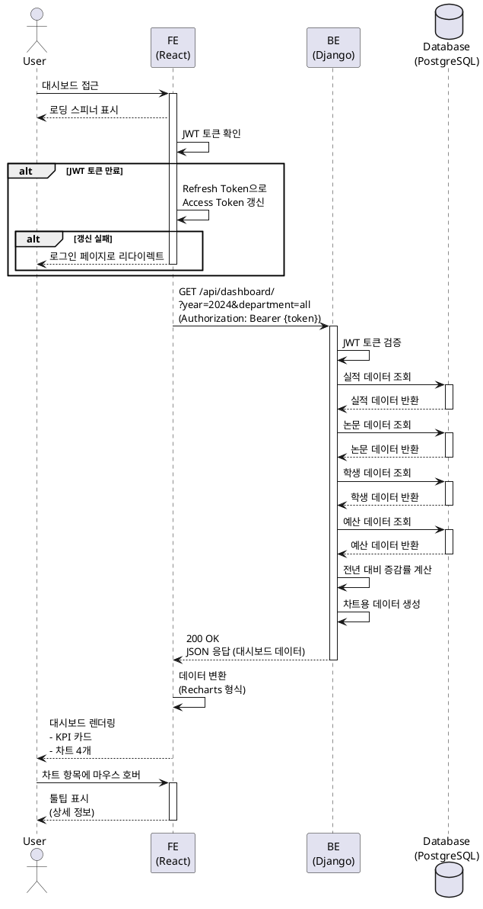

# UC-002: 대시보드 조회

## Primary Actor
- 인증된 대학교 직원 (관리자 또는 일반 사용자)

## Precondition
- 사용자가 로그인되어 있어야 함
- 사용자가 유효한 JWT 토큰을 보유하고 있어야 함
- 데이터베이스에 조회 가능한 데이터가 존재해야 함

## Trigger
- 로그인 성공 후 자동 리다이렉트
- Navigation Bar에서 "Dashboard" 메뉴 클릭

## Main Scenario

1. 사용자가 대시보드 페이지에 접근함
2. 시스템이 로딩 스피너를 표시함
3. 시스템이 JWT 토큰을 검증함
4. 시스템이 기본 필터 조건(현재 연도, 전체 부서)으로 대시보드 데이터를 요청함
5. Backend가 병렬로 여러 Repository를 호출하여 데이터를 조회함
   - 실적 데이터 요약
   - 논문 게재 수 통계
   - 학생 수 집계
   - 예산 집행 현황
6. Backend가 전년 대비 증감률을 계산함
7. Backend가 차트용 데이터를 생성함
8. Backend가 JSON 형식으로 응답을 반환함
9. Frontend가 데이터를 Recharts 형식으로 변환함
10. 시스템이 로딩 스피너를 제거하고 대시보드를 렌더링함
11. 시스템이 다음 컴포넌트를 표시함
    - KPI 카드 4개 (실적, 논문, 학생, 예산)
    - 실적 추세 라인 차트
    - 논문 분포 막대 차트
    - 예산 비율 파이 차트
    - 학생 수 막대 차트

**Result**: 사용자가 시각화된 대시보드를 확인하고 주요 지표를 파악함

## Alternative Scenarios

### 3a. JWT 토큰 만료
3a1. 시스템이 토큰 만료를 감지함
3a2. 시스템이 Refresh Token으로 Access Token 갱신을 시도함
3a3-1. 갱신 성공 시 Main Scenario의 4단계로 진행
3a3-2. 갱신 실패 시 "세션이 만료되었습니다. 다시 로그인해주세요" 메시지 표시 후 로그인 페이지로 리다이렉트

### 5a. 데이터 없음
5a1. Backend가 데이터베이스에서 데이터를 찾지 못함
5a2. Backend가 빈 배열 또는 null 값을 반환함
5a3. Frontend가 빈 상태 UI를 표시함
5a4-1. 관리자: "조회 가능한 데이터가 없습니다. Excel 파일을 업로드해주세요" + [업로드 페이지로 이동] 버튼
5a4-2. 일반 사용자: "조회 가능한 데이터가 없습니다"

### 5b. 부분 데이터 로드 실패
5b1. Backend가 일부 Repository 호출에서 오류 발생
5b2. Backend가 성공한 데이터만 반환하고 실패 항목은 null로 표시
5b3. Frontend가 성공한 차트만 표시함
5b4. Frontend가 실패한 차트 영역에 "데이터를 불러올 수 없습니다. [재시도]" 메시지 표시

### 5c. 전체 데이터 로드 실패
5c1. Backend에서 500 Internal Server Error 발생
5c2. Frontend가 오류 화면을 표시함
5c3. "대시보드 데이터를 불러오는 중 오류가 발생했습니다" 메시지 표시
5c4. [다시 시도] 버튼 제공

### 8a. 네트워크 연결 끊김
8a1. API 요청 중 네트워크 오류 발생
8a2. 시스템이 최대 3회 자동 재시도함 (지수 백오프: 1초, 2초, 4초)
8a3-1. 재시도 성공 시 Main Scenario의 9단계로 진행
8a3-2. 재시도 실패 시 "네트워크 오류가 발생했습니다" 메시지 표시 + [다시 시도] 버튼

## Edge Cases

- **필터 적용**: 사용자가 연도/부서 필터를 변경하면 대시보드 데이터가 재조회됨
- **차트 상호작용**: 차트 항목에 마우스 호버 시 툴팁 표시, 클릭 시 상세 정보 모달 표시
- **브라우저 새로고침**: 페이지 새로고침 시 필터 조건이 URL 쿼리 파라미터에서 복원됨
- **대용량 데이터**: 데이터가 많을 경우 차트 렌더링 성능 최적화 적용 (샘플링)
- **반응형 디자인**: 모바일/태블릿 화면에서는 차트 레이아웃이 1열로 변경됨

## Business Rules

- BR-001: 대시보드 데이터는 사용자의 권한과 무관하게 모든 로그인 사용자에게 동일하게 표시됨
- BR-002: 기본 필터 조건은 현재 연도, 전체 부서임
- BR-003: 전년 대비 증감률은 백분율로 표시되며, 증가는 녹색(↑), 감소는 빨간색(↓), 동일은 회색(→)으로 표시됨
- BR-004: KPI 카드는 다음 항목을 포함함
  - 실적: 총 실적 금액 (억원)
  - 논문: 총 논문 게재 수 (편)
  - 학생: 총 학생 수 (명)
  - 예산: 총 예산 집행률 (%)
- BR-005: 차트 데이터는 최대 최근 3년간의 데이터를 표시함
- BR-006: 대시보드 로딩 시간은 3초 이내여야 함 (NFR)
- BR-007: 차트 툴팁은 마우스 호버 시 즉시 표시되어야 함 (<100ms)
- BR-008: 데이터 캐싱은 5분 TTL을 적용함 (Backend Redis)

## Sequence Diagram

## Post-conditions

### Success
- 사용자는 시각화된 대시보드를 확인할 수 있음
- KPI 카드와 차트가 정상적으로 표시됨
- 사용자는 필터를 변경하여 다른 기간/부서의 데이터를 조회할 수 있음
- 사용자는 차트와 상호작용하여 상세 정보를 확인할 수 있음

### Failure
- 오류 메시지가 표시됨
- 사용자는 [다시 시도] 버튼을 클릭하여 재시도할 수 있음
- 세션 만료 시 로그인 페이지로 리다이렉트됨

## Related Use Cases
- UC-001: 사용자 로그인 (로그인 후 대시보드로 자동 이동)
- UC-003: Excel 파일 업로드 (관리자가 대시보드에 표시될 데이터 업로드)
- UC-004: 데이터 조회 (대시보드에서 상세 데이터 조회 페이지로 이동 가능)
