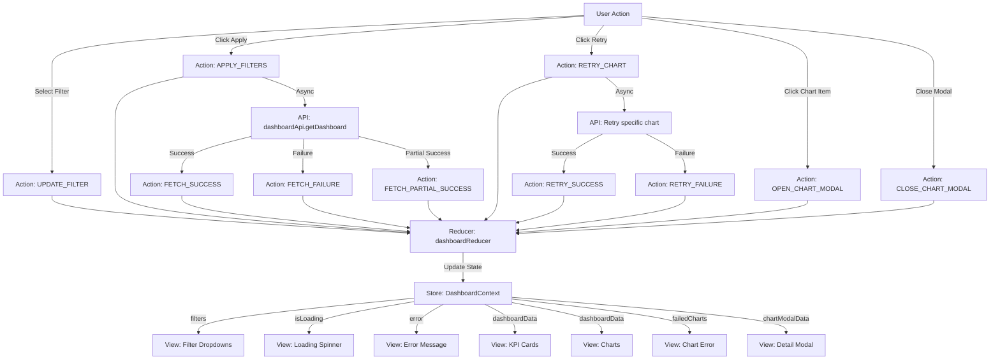
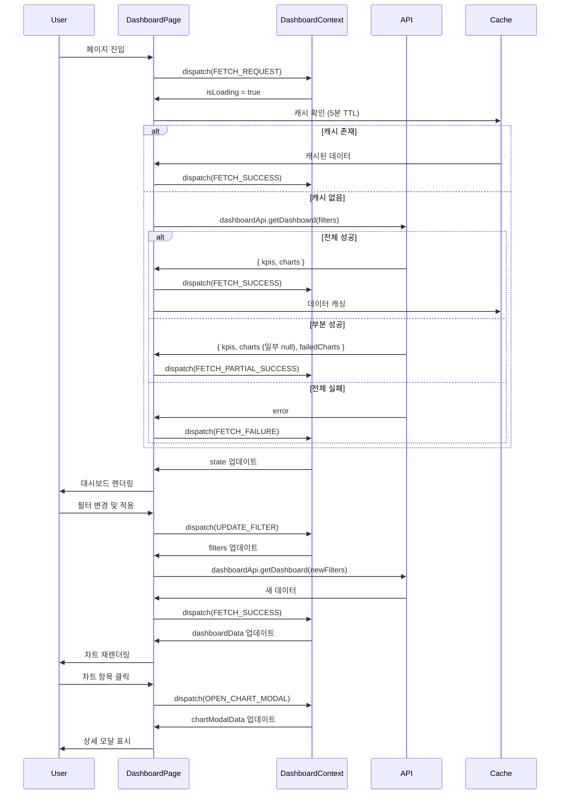

# UC-002: 대시보드 페이지 상태관리 설계

## 1. 상태 데이터 목록

### 관리해야 할 상태 (State)

| 상태명 | 타입 | 초기값 | 설명 |
|--------|------|--------|------|
| `dashboardData` | DashboardData \| null | null | 대시보드 전체 데이터 |
| `filters` | DashboardFilters | { year: currentYear, department: 'all', quarter: null } | 필터 조건 |
| `isLoading` | boolean | false | 데이터 로딩 중 여부 |
| `error` | string \| null | null | 데이터 로드 실패 오류 메시지 |
| `failedCharts` | string[] | [] | 로드 실패한 차트 ID 목록 |
| `selectedChart` | string \| null | null | 드릴다운을 위해 선택된 차트 ID |
| `chartModalData` | any \| null | null | 차트 상세 모달 데이터 |

### 화면에 보여지지만 상태가 아닌 것 (Derived/Computed)

| 항목 | 타입 | 설명 |
|------|------|------|
| `hasData` | boolean | dashboardData가 null이 아니고 비어있지 않은지 (computed) |
| `kpiCards` | KPICard[] | dashboardData에서 KPI 카드 데이터 추출 (computed) |
| `chartData` | ChartDataMap | dashboardData에서 차트별 데이터 추출 및 Recharts 형식 변환 (computed) |
| `filterQuery` | string | filters를 URL 쿼리 스트링으로 변환 (computed) |
| `isFiltered` | boolean | 기본 필터와 다른 필터가 적용되었는지 (computed) |

---

## 2. 상태 변경 조건 및 화면 변화

| 상태 | 변경 조건 | 화면 변화 |
|------|----------|----------|
| `dashboardData` | API 요청 성공 시 데이터 저장 | 로딩 스피너 제거, KPI 카드 및 차트 렌더링 |
| `filters.year` | 사용자가 연도 필터 선택 | 필터 드롭다운 값 변경, 필터 적용 시 데이터 재조회 |
| `filters.department` | 사용자가 부서 필터 선택 | 필터 드롭다운 값 변경, 필터 적용 시 데이터 재조회 |
| `filters.quarter` | 사용자가 분기 필터 선택 | 필터 드롭다운 값 변경, 필터 적용 시 데이터 재조회 |
| `isLoading` | API 요청 시작 시 true, 완료 시 false | 로딩 스피너 표시/제거, 차트 영역 반투명 처리 |
| `error` | 전체 데이터 로드 실패 시 | 오류 화면 표시, [다시 시도] 버튼 표시 |
| `failedCharts` | 특정 차트 로드 실패 시 차트 ID 추가 | 해당 차트 영역에 "데이터를 불러올 수 없습니다" 표시, [재시도] 버튼 |
| `selectedChart` | 차트 항목 클릭 시 | 드릴다운 모달 열림, 상세 데이터 표시 |
| `chartModalData` | 드릴다운 모달 오픈 시 | 모달에 차트 상세 데이터 테이블 표시 |

---

## 3. Flux 패턴 시각화 (Action → Store → View)



---

## 4. Context + useReducer 설계

### 4.1. State Interface

```typescript
interface DashboardFilters {
  year: number;
  department: string; // 'all' | 특정 부서명
  quarter: number | null; // 1-4 or null (전체)
}

interface KPICard {
  id: string;
  title: string;
  value: number | string;
  unit: string;
  trend: number; // 전년 대비 증감률 (%)
  trendDirection: 'up' | 'down' | 'neutral';
}

interface ChartData {
  id: string;
  type: 'line' | 'bar' | 'pie' | 'stacked_bar';
  title: string;
  data: any[]; // Recharts 형식 데이터
  xAxisKey?: string;
  yAxisKey?: string;
}

interface DashboardData {
  kpis: KPICard[];
  charts: ChartData[];
  lastUpdated: string;
}

interface DashboardState {
  dashboardData: DashboardData | null;
  filters: DashboardFilters;
  isLoading: boolean;
  error: string | null;
  failedCharts: string[]; // 실패한 차트 ID 목록
  selectedChart: string | null;
  chartModalData: any | null;
}
```

### 4.2. Action Types

```typescript
type DashboardAction =
  | { type: 'UPDATE_FILTER'; filterType: keyof DashboardFilters; value: any }
  | { type: 'APPLY_FILTERS' }
  | { type: 'RESET_FILTERS' }
  | { type: 'FETCH_REQUEST' }
  | { type: 'FETCH_SUCCESS'; payload: DashboardData }
  | { type: 'FETCH_FAILURE'; payload: string }
  | { type: 'FETCH_PARTIAL_SUCCESS'; payload: { data: DashboardData; failedCharts: string[] } }
  | { type: 'RETRY_CHART'; chartId: string }
  | { type: 'RETRY_SUCCESS'; chartId: string; chartData: ChartData }
  | { type: 'RETRY_FAILURE'; chartId: string }
  | { type: 'OPEN_CHART_MODAL'; chartId: string; data: any }
  | { type: 'CLOSE_CHART_MODAL' };
```

### 4.3. Reducer

```typescript
const dashboardReducer = (state: DashboardState, action: DashboardAction): DashboardState => {
  switch (action.type) {
    case 'UPDATE_FILTER':
      return {
        ...state,
        filters: {
          ...state.filters,
          [action.filterType]: action.value,
        },
      };

    case 'APPLY_FILTERS':
      // 필터 적용은 side effect에서 처리 (fetchDashboardData 호출)
      return state;

    case 'RESET_FILTERS':
      return {
        ...state,
        filters: {
          year: new Date().getFullYear(),
          department: 'all',
          quarter: null,
        },
      };

    case 'FETCH_REQUEST':
      return {
        ...state,
        isLoading: true,
        error: null,
        failedCharts: [],
      };

    case 'FETCH_SUCCESS':
      return {
        ...state,
        isLoading: false,
        dashboardData: action.payload,
        error: null,
        failedCharts: [],
      };

    case 'FETCH_FAILURE':
      return {
        ...state,
        isLoading: false,
        error: action.payload,
        dashboardData: null,
      };

    case 'FETCH_PARTIAL_SUCCESS':
      return {
        ...state,
        isLoading: false,
        dashboardData: action.payload.data,
        failedCharts: action.payload.failedCharts,
        error: null,
      };

    case 'RETRY_CHART':
      return state; // 재시도는 side effect

    case 'RETRY_SUCCESS':
      return {
        ...state,
        dashboardData: state.dashboardData
          ? {
              ...state.dashboardData,
              charts: state.dashboardData.charts.map((chart) =>
                chart.id === action.chartId ? action.chartData : chart
              ),
            }
          : null,
        failedCharts: state.failedCharts.filter((id) => id !== action.chartId),
      };

    case 'RETRY_FAILURE':
      return state; // 실패 시 failedCharts는 그대로 유지

    case 'OPEN_CHART_MODAL':
      return {
        ...state,
        selectedChart: action.chartId,
        chartModalData: action.data,
      };

    case 'CLOSE_CHART_MODAL':
      return {
        ...state,
        selectedChart: null,
        chartModalData: null,
      };

    default:
      return state;
  }
};
```

---

## 5. Context 데이터 흐름 시각화



---

## 6. 하위 컴포넌트에 노출할 변수 및 함수

### DashboardContext 노출 인터페이스

```typescript
interface DashboardContextValue {
  // 상태
  state: DashboardState;

  // 계산된 값
  hasData: boolean;
  kpiCards: KPICard[];
  chartDataMap: Map<string, ChartData>;
  isFiltered: boolean;

  // 필터 액션
  updateFilter: (filterType: keyof DashboardFilters, value: any) => void;
  applyFilters: () => Promise<void>;
  resetFilters: () => void;

  // 데이터 액션
  fetchDashboardData: (filters?: DashboardFilters) => Promise<void>;
  retryChart: (chartId: string) => Promise<void>;

  // 모달 액션
  openChartModal: (chartId: string, data: any) => void;
  closeChartModal: () => void;

  // 유틸리티
  getChartById: (chartId: string) => ChartData | undefined;
  isChartFailed: (chartId: string) => boolean;
}
```

---

## 7. 주요 구현 로직 (인터페이스)

### 7.1. 대시보드 데이터 조회

```typescript
const fetchDashboardData = async (filters?: DashboardFilters): Promise<void> => {
  const appliedFilters = filters || state.filters;

  // 1. 캐시 확인
  const cacheKey = `dashboard_${JSON.stringify(appliedFilters)}`;
  const cachedData = getCachedData(cacheKey);

  if (cachedData && !isCacheExpired(cachedData)) {
    dispatch({ type: 'FETCH_SUCCESS', payload: cachedData.data });
    return;
  }

  // 2. 로딩 시작
  dispatch({ type: 'FETCH_REQUEST' });

  try {
    // 3. API 호출
    const response = await dashboardApi.getDashboard(appliedFilters);

    // 4. 실패한 차트 확인
    const failedCharts = response.charts
      .filter((chart) => chart.data === null)
      .map((chart) => chart.id);

    if (failedCharts.length > 0) {
      // 부분 성공
      dispatch({
        type: 'FETCH_PARTIAL_SUCCESS',
        payload: {
          data: response,
          failedCharts,
        },
      });
    } else {
      // 전체 성공
      dispatch({ type: 'FETCH_SUCCESS', payload: response });

      // 5. 캐시 저장
      setCachedData(cacheKey, response, 5 * 60 * 1000); // 5분 TTL
    }

  } catch (error) {
    // 6. 실패 처리
    dispatch({
      type: 'FETCH_FAILURE',
      payload: error.message || '대시보드 데이터를 불러올 수 없습니다',
    });
  }
};
```

### 7.2. 필터 적용

```typescript
const applyFilters = async (): Promise<void> => {
  // URL 쿼리 파라미터 업데이트
  const queryString = new URLSearchParams({
    year: state.filters.year.toString(),
    department: state.filters.department,
    ...(state.filters.quarter && { quarter: state.filters.quarter.toString() }),
  }).toString();

  // 브라우저 히스토리에 추가 (뒤로가기 가능)
  navigate(`/dashboard?${queryString}`, { replace: false });

  // 데이터 재조회
  await fetchDashboardData();
};
```

### 7.3. 차트 재시도

```typescript
const retryChart = async (chartId: string): Promise<void> => {
  try {
    const chartData = await dashboardApi.getChartData(chartId, state.filters);

    dispatch({
      type: 'RETRY_SUCCESS',
      chartId,
      chartData,
    });

  } catch (error) {
    dispatch({ type: 'RETRY_FAILURE', chartId });

    // 사용자에게 알림
    showNotification('차트 데이터를 불러올 수 없습니다', 'error');
  }
};
```

### 7.4. 차트 드릴다운

```typescript
const openChartModal = (chartId: string, data: any): void => {
  dispatch({
    type: 'OPEN_CHART_MODAL',
    chartId,
    data,
  });
};

const closeChartModal = (): void => {
  dispatch({ type: 'CLOSE_CHART_MODAL' });
};
```

---

## 8. 설계 원칙 준수

### DRY (Don't Repeat Yourself)
- 차트 데이터 변환 로직을 `chartTransformer`로 분리
- API 호출 로직을 `dashboardApi`로 추상화
- 캐싱 로직을 유틸리티 함수로 분리

### Single Responsibility
- DashboardContext: 대시보드 상태 관리만 담당
- Reducer: 상태 업데이트 로직만 담당
- API Service: 데이터 페칭만 담당
- Transformer: 데이터 형식 변환만 담당

### Separation of Concerns
- Presentation (DashboardPage): UI 렌더링
- Application (DashboardContext): 상태 관리
- Service (dashboardApi): API 통신
- Domain (DashboardData): 비즈니스 모델

---

## 9. 성능 최적화

1. **메모이제이션**: `useMemo`로 계산된 값 캐싱
   ```typescript
   const kpiCards = useMemo(() => {
     return state.dashboardData?.kpis || [];
   }, [state.dashboardData]);
   ```

2. **캐싱**: 동일한 필터 조건의 데이터는 5분간 캐싱

3. **부분 로딩**: 차트별로 독립적으로 로드하여 일부 실패 시에도 나머지 표시

4. **디바운싱**: 필터 변경 시 즉시 요청하지 않고 사용자가 [적용] 버튼 클릭 시에만 요청

---

## 10. 주의사항

1. **메모리 관리**: 차트 데이터가 크므로 언마운트 시 캐시 정리
2. **오류 복구**: 실패한 차트는 [재시도] 버튼으로 개별 재로드 가능
3. **URL 동기화**: 필터 상태를 URL에 반영하여 새로고침 시에도 유지
4. **접근성**: 차트 툴팁은 키보드로도 접근 가능하도록 구현
5. **반응형**: 모바일 화면에서는 차트 레이아웃을 1열로 변경
