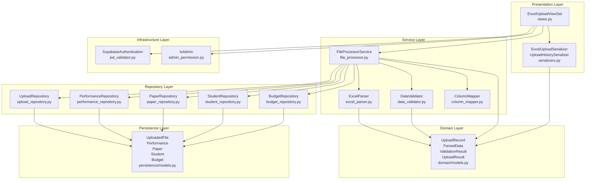
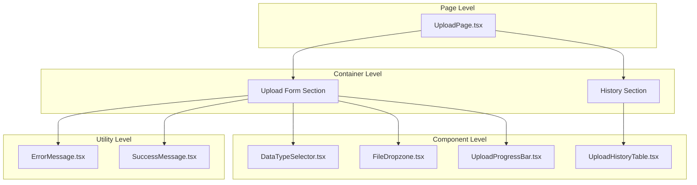

# UC-003: Excel 파일 업로드 - 구현 계획

## 1. 개요

### 1.1 기능 요약
- **목적**: 관리자가 Excel 파일을 업로드하여 실적, 논문, 학생, 예산 데이터를 일괄 등록
- **핵심 기능**:
  - 파일 드래그 앤 드롭 및 파일 선택 다이얼로그
  - 클라이언트 측 파일 검증 (형식, 크기)
  - Excel 파일 파싱 (openpyxl)
  - 데이터 검증 (필수 컬럼, 타입, 중복)
  - 트랜잭션 기반 배치 삽입
  - 업로드 이력 관리
  - 실시간 프로그레스 표시
- **사용자**: 관리자만

### 1.2 아키텍처 원칙
- **Layered Architecture**: Infrastructure → Presentation → Service → Repository → Domain → Persistence
- **SOLID 원칙 준수**: 각 레이어는 단일 책임, 의존성은 내부 방향으로만
- **TDD**: Red-Green-Refactor 사이클 엄격 준수
- **공통 모듈 최대 활용**: common-modules.md의 FileUploadService, ExcelParser 재사용

---

## 2. Backend 구현

### 2.1 Backend 모듈 구조

#### 2.1.1 Infrastructure Layer
**책임**: JWT 인증 미들웨어, 관리자 권한 검증 (UC-001에서 이미 구현됨)

**파일**:
- `backend/infrastructure/authentication/jwt_validator.py` (재사용)
- `backend/infrastructure/permissions/admin_permission.py` - IsAdmin 권한 클래스

**IsAdmin 권한 클래스**:
```python
# backend/infrastructure/permissions/admin_permission.py
from rest_framework import permissions

class IsAdmin(permissions.BasePermission):
    """관리자 권한 확인"""
    def has_permission(self, request, view):
        return request.user and hasattr(request.user, 'role') and request.user.role == 'admin'
```

#### 2.1.2 Presentation Layer
**책임**: HTTP 요청/응답 처리, 파일 업로드 처리

**파일**:
- `backend/apps/uploads/presentation/views.py` - ExcelUploadViewSet
- `backend/apps/uploads/presentation/serializers.py` - ExcelUploadSerializer, UploadHistorySerializer
- `backend/apps/uploads/presentation/urls.py` - URL 라우팅

**API 엔드포인트**:
```
POST /api/upload/excel/
Request (multipart/form-data):
  - file: File (Excel 파일)
  - data_type: str ('performance', 'paper', 'student', 'budget')

Response 201 Created:
{
  "id": 1,
  "filename": "실적_2024.xlsx",
  "data_type": "performance",
  "rows_processed": 150,
  "uploaded_at": "2024-11-01T10:30:00Z",
  "uploaded_by": "admin@university.ac.kr",
  "status": "success"
}

Response 400 Bad Request (검증 실패):
{
  "error": "필수 컬럼이 누락되었습니다",
  "details": {
    "missing_columns": ["금액"],
    "current_columns": ["날짜", "카테고리", "비고"]
  }
}

Response 400 Bad Request (데이터 타입 오류):
{
  "error": "데이터 형식 오류",
  "details": {
    "invalid_rows": [
      {"row": 5, "column": "금액", "value": "백만원", "message": "숫자가 아닙니다"},
      {"row": 12, "column": "날짜", "value": "작년", "message": "날짜 형식이 아닙니다 (YYYY-MM-DD 필요)"}
    ]
  }
}

Response 400 Bad Request (중복 데이터):
{
  "error": "중복 데이터 발견",
  "details": {
    "duplicates": [
      {"row": 15, "key": "2024-11-01 실적 데이터", "message": "이미 존재합니다"}
    ]
  }
}

Response 403 Forbidden:
{
  "error": "관리자만 접근할 수 있습니다"
}

Response 500 Internal Server Error:
{
  "error": "업로드 중 오류가 발생했습니다"
}

GET /api/upload/history/
Query Parameters:
  - page: int (기본값: 1)
  - page_size: int (기본값: 20)

Response 200 OK:
{
  "count": 50,
  "next": "/api/upload/history/?page=2",
  "previous": null,
  "results": [
    {
      "id": 10,
      "filename": "실적_2024.xlsx",
      "data_type": "performance",
      "rows_processed": 150,
      "uploaded_at": "2024-11-01T10:30:00Z",
      "uploaded_by": "admin@university.ac.kr",
      "status": "success"
    },
    ...
  ]
}
```

#### 2.1.3 Service Layer
**책임**: 파일 처리, 파싱, 검증 로직

**파일**:
- `backend/apps/uploads/services/file_processor.py` - FileProcessorService
- `backend/apps/uploads/services/excel_parser.py` - ExcelParser
- `backend/apps/uploads/services/data_validator.py` - DataValidator
- `backend/apps/uploads/services/column_mapper.py` - ColumnMapper

**주요 메서드**:
```python
# FileProcessorService
class FileProcessorService:
    def process_file(self, file, data_type: str, user_id: str) -> UploadResult:
        """파일 업로드 전체 프로세스 오케스트레이션"""
        pass

    def _save_temp_file(self, file) -> str:
        """임시 파일 저장"""
        pass

    def _cleanup_temp_file(self, file_path: str):
        """임시 파일 삭제"""
        pass

# ExcelParser
class ExcelParser:
    def parse(self, file_path: str) -> ParsedData:
        """Excel 파일 파싱"""
        pass

    def _extract_headers(self, worksheet) -> List[str]:
        """헤더 행 추출"""
        pass

    def _extract_rows(self, worksheet, start_row: int) -> List[Dict]:
        """데이터 행 추출"""
        pass

# DataValidator
class DataValidator:
    def validate(self, data: List[Dict], data_type: str) -> ValidationResult:
        """데이터 검증"""
        pass

    def _validate_required_columns(self, data: List[Dict], required_columns: List[str]) -> List[str]:
        """필수 컬럼 검증"""
        pass

    def _validate_data_types(self, data: List[Dict], column_types: Dict) -> List[ValidationError]:
        """데이터 타입 검증"""
        pass

    def _check_duplicates(self, data: List[Dict], unique_keys: List[str]) -> List[DuplicateError]:
        """중복 데이터 검사"""
        pass

# ColumnMapper
class ColumnMapper:
    PERFORMANCE_COLUMNS = {
        'required': ['날짜', '금액', '카테고리'],
        'optional': ['항목', '비고']
    }
    PAPER_COLUMNS = {
        'required': ['제목', '저자', '게재일', '분야'],
        'optional': ['저널명', 'DOI']
    }
    # ...

    @staticmethod
    def get_required_columns(data_type: str) -> List[str]:
        """데이터 유형별 필수 컬럼 반환"""
        pass

    @staticmethod
    def get_column_types(data_type: str) -> Dict[str, type]:
        """데이터 유형별 컬럼 타입 반환"""
        pass
```

#### 2.1.4 Repository Layer
**책임**: 데이터베이스 접근 추상화

**파일**:
- `backend/apps/uploads/repositories/upload_repository.py` - UploadRepository
- `backend/apps/uploads/repositories/performance_repository.py` - PerformanceRepository (재사용)
- `backend/apps/uploads/repositories/paper_repository.py` - PaperRepository (재사용)
- `backend/apps/uploads/repositories/student_repository.py` - StudentRepository (재사용)
- `backend/apps/uploads/repositories/budget_repository.py` - BudgetRepository (재사용)

**주요 메서드**:
```python
# UploadRepository
class UploadRepository:
    def create_upload_record(self, upload_data: UploadRecord) -> UploadRecord:
        """업로드 이력 생성"""
        pass

    def get_upload_history(self, page: int, page_size: int) -> PaginatedResult:
        """업로드 이력 조회 (페이지네이션)"""
        pass

    def update_upload_status(self, upload_id: int, status: str, rows_processed: int):
        """업로드 상태 업데이트"""
        pass

# PerformanceRepository (확장)
class PerformanceRepository:
    def bulk_create(self, performances: List[Performance]) -> int:
        """배치 생성"""
        pass

    def check_duplicates(self, performances: List[Performance]) -> List[Performance]:
        """중복 데이터 확인"""
        pass

    def bulk_update(self, performances: List[Performance]) -> int:
        """배치 업데이트 (덮어쓰기)"""
        pass
```

#### 2.1.5 Domain Layer
**책임**: 비즈니스 엔티티 정의

**파일**: `backend/apps/uploads/domain/models.py`

```python
from dataclasses import dataclass
from typing import List, Dict, Optional
from datetime import datetime

@dataclass
class UploadRecord:
    id: Optional[int]
    filename: str
    data_type: str
    rows_processed: int
    uploaded_at: datetime
    uploaded_by: str
    status: str  # 'success', 'failed', 'partial'

@dataclass
class ParsedData:
    headers: List[str]
    rows: List[Dict]
    total_rows: int

@dataclass
class ValidationResult:
    is_valid: bool
    missing_columns: List[str]
    invalid_rows: List[Dict]
    duplicates: List[Dict]

@dataclass
class UploadResult:
    success: bool
    upload_record: UploadRecord
    errors: Optional[List[str]]
```

#### 2.1.6 Persistence Layer
**책임**: ORM 모델 (database.md에서 정의됨)

**파일**:
- `backend/apps/uploads/persistence/models.py` (UploadedFile 모델)
- `backend/apps/dashboard/persistence/models.py` (Performance, Paper, Student, Budget 모델 재사용)

**UploadedFile ORM 모델**:
```python
# backend/apps/uploads/persistence/models.py
from django.db import models
from apps.core.models import BaseModel

class UploadedFile(BaseModel):
    filename = models.CharField(max_length=255)
    data_type = models.CharField(max_length=50, choices=[
        ('performance', '실적'),
        ('paper', '논문'),
        ('student', '학생'),
        ('budget', '예산')
    ])
    rows_processed = models.IntegerField(default=0)
    uploaded_by = models.CharField(max_length=255)  # user email
    status = models.CharField(max_length=20, choices=[
        ('success', '성공'),
        ('failed', '실패'),
        ('partial', '부분 성공')
    ])

    class Meta:
        db_table = 'uploaded_files'
        ordering = ['-created_at']
```

---

### 2.2 Backend 시퀀스 다이어그램

```mermaid
sequenceDiagram
    participant Client as Frontend
    participant View as ExcelUploadViewSet
    participant Processor as FileProcessorService
    participant Parser as ExcelParser
    participant Validator as DataValidator
    participant Mapper as ColumnMapper
    participant PerfRepo as PerformanceRepository
    participant UploadRepo as UploadRepository
    participant DB as PostgreSQL

    Client->>View: POST /api/upload/excel/ (file, data_type='performance')
    activate View

    View->>View: JWT 토큰 검증<br/>관리자 권한 확인 (IsAdmin)

    alt 일반 사용자
        View-->>Client: 403 Forbidden
        deactivate View
    end

    View->>Processor: process_file(file, 'performance', user_id)
    activate Processor

    Processor->>Processor: _save_temp_file(file)
    Note over Processor: 임시 디렉토리에 파일 저장

    Processor->>Parser: parse(temp_file_path)
    activate Parser

    Parser->>Parser: openpyxl로 파일 열기
    Parser->>Parser: _extract_headers(worksheet)
    Parser->>Parser: _extract_rows(worksheet, start_row=2)

    alt 파일 손상
        Parser-->>Processor: Exception (파일 파싱 실패)
        Processor->>Processor: _cleanup_temp_file()
        Processor-->>View: ParseError
        View-->>Client: 400 Bad Request (파일 손상)
        deactivate Parser
        deactivate Processor
        deactivate View
    end

    Parser-->>Processor: ParsedData (headers, rows)
    deactivate Parser

    Processor->>Mapper: get_required_columns('performance')
    activate Mapper
    Mapper-->>Processor: ['날짜', '금액', '카테고리']
    deactivate Mapper

    Processor->>Mapper: get_column_types('performance')
    activate Mapper
    Mapper-->>Processor: {'날짜': date, '금액': Decimal, ...}
    deactivate Mapper

    Processor->>Validator: validate(data, 'performance')
    activate Validator

    Validator->>Validator: _validate_required_columns(data, required_columns)

    alt 필수 컬럼 누락
        Validator-->>Processor: ValidationResult (is_valid=False, missing_columns)
        Processor->>Processor: _cleanup_temp_file()
        Processor-->>View: ValidationError
        View-->>Client: 400 Bad Request (필수 컬럼 누락)
        deactivate Validator
        deactivate Processor
        deactivate View
    end

    Validator->>Validator: _validate_data_types(data, column_types)

    alt 데이터 타입 오류
        Validator-->>Processor: ValidationResult (is_valid=False, invalid_rows)
        Processor->>Processor: _cleanup_temp_file()
        Processor-->>View: ValidationError
        View-->>Client: 400 Bad Request (데이터 형식 오류)
        deactivate Validator
        deactivate Processor
        deactivate View
    end

    Validator->>Validator: _check_duplicates(data, unique_keys=['날짜', '항목'])

    alt 중복 데이터 발견
        Validator-->>Processor: ValidationResult (is_valid=False, duplicates)
        Processor->>Processor: _cleanup_temp_file()
        Processor-->>View: ValidationError
        View-->>Client: 400 Bad Request (중복 데이터)
        deactivate Validator
        deactivate Processor
        deactivate View
    end

    Validator-->>Processor: ValidationResult (is_valid=True)
    deactivate Validator

    Processor->>DB: BEGIN TRANSACTION
    activate DB

    Processor->>UploadRepo: create_upload_record(upload_data)
    activate UploadRepo
    UploadRepo->>DB: INSERT INTO uploaded_files
    DB-->>UploadRepo: upload_id
    UploadRepo-->>Processor: UploadRecord (id=upload_id)
    deactivate UploadRepo

    Processor->>PerfRepo: bulk_create(performances)
    activate PerfRepo
    PerfRepo->>DB: BULK INSERT INTO performances
    DB-->>PerfRepo: rows_inserted
    PerfRepo-->>Processor: 150 (rows_processed)
    deactivate PerfRepo

    Processor->>UploadRepo: update_upload_status(upload_id, 'success', 150)
    activate UploadRepo
    UploadRepo->>DB: UPDATE uploaded_files SET status='success', rows_processed=150
    DB-->>UploadRepo: OK
    UploadRepo-->>Processor: OK
    deactivate UploadRepo

    Processor->>DB: COMMIT
    DB-->>Processor: Transaction Success
    deactivate DB

    Processor->>Processor: _cleanup_temp_file()
    Processor-->>View: UploadResult (success=True, upload_record)
    deactivate Processor

    View-->>Client: 201 Created (upload_record)
    deactivate View
```

---

### 2.3 Backend 모듈 관계도



---

## 3. Frontend 구현

### 3.1 Frontend 모듈 구조

#### 3.1.1 Infrastructure Layer
**책임**: Axios 클라이언트 설정 (UC-001에서 이미 구현됨)

**파일**: `frontend/src/infrastructure/external/client.ts` (재사용)

#### 3.1.2 Application Layer
**책임**: 업로드 상태 관리 및 훅

**파일**:
- `frontend/src/application/hooks/useFileUpload.ts` - 파일 업로드 로직
- `frontend/src/application/hooks/useUploadHistory.ts` - 업로드 이력 조회

**주요 훅**:
```typescript
// useFileUpload.ts
export const useFileUpload = () => {
  const [file, setFile] = useState<File | null>(null);
  const [dataType, setDataType] = useState<string>('');
  const [uploading, setUploading] = useState(false);
  const [progress, setProgress] = useState(0);
  const [error, setError] = useState<UploadError | null>(null);
  const [result, setResult] = useState<UploadResult | null>(null);

  const uploadFile = async () => {
    if (!file || !dataType) {
      setError({ message: '파일과 데이터 유형을 선택해주세요' });
      return;
    }

    setUploading(true);
    setProgress(0);
    setError(null);

    try {
      const formData = new FormData();
      formData.append('file', file);
      formData.append('data_type', dataType);

      const response = await uploadApi.uploadExcel(formData, (progressEvent) => {
        const percentCompleted = Math.round((progressEvent.loaded * 100) / progressEvent.total);
        setProgress(percentCompleted);
      });

      setResult(response);
      setProgress(100);
    } catch (err: any) {
      if (err.response?.data) {
        setError(err.response.data);
      } else {
        setError({ message: '업로드 중 오류가 발생했습니다' });
      }
    } finally {
      setUploading(false);
    }
  };

  const reset = () => {
    setFile(null);
    setDataType('');
    setProgress(0);
    setError(null);
    setResult(null);
  };

  return { file, setFile, dataType, setDataType, uploading, progress, error, result, uploadFile, reset };
};
```

#### 3.1.3 Service Layer
**책임**: API 통신

**파일**:
- `frontend/src/services/api/uploadApi.ts` - Upload API 클라이언트
- `frontend/src/services/validators/fileValidator.ts` - 클라이언트 측 파일 검증

**주요 메서드**:
```typescript
// uploadApi.ts
export const uploadApi = {
  async uploadExcel(
    formData: FormData,
    onUploadProgress?: (progressEvent: any) => void
  ): Promise<UploadResult> {
    const response = await client.post('/upload/excel/', formData, {
      headers: { 'Content-Type': 'multipart/form-data' },
      onUploadProgress
    });
    return response.data;
  },

  async getUploadHistory(page: number = 1, pageSize: number = 20): Promise<PaginatedUploadHistory> {
    const response = await client.get('/upload/history/', {
      params: { page, page_size: pageSize }
    });
    return response.data;
  }
};

// fileValidator.ts
export const fileValidator = {
  validateFileType(file: File): { valid: boolean; error?: string } {
    const allowedExtensions = ['.xlsx', '.xls'];
    const fileExtension = file.name.substring(file.name.lastIndexOf('.')).toLowerCase();

    if (!allowedExtensions.includes(fileExtension)) {
      return {
        valid: false,
        error: 'Excel 파일(.xlsx, .xls)만 업로드 가능합니다'
      };
    }

    return { valid: true };
  },

  validateFileSize(file: File, maxSizeMB: number = 10): { valid: boolean; error?: string } {
    const maxSizeBytes = maxSizeMB * 1024 * 1024;

    if (file.size > maxSizeBytes) {
      const fileSizeMB = (file.size / (1024 * 1024)).toFixed(2);
      return {
        valid: false,
        error: `파일 크기가 ${maxSizeMB}MB를 초과합니다. (현재: ${fileSizeMB}MB)`
      };
    }

    return { valid: true };
  }
};
```

#### 3.1.4 Presentation Layer
**책임**: UI 렌더링

**파일**:
- `frontend/src/presentation/pages/UploadPage.tsx` - 업로드 페이지
- `frontend/src/presentation/components/upload/FileDropzone.tsx` - 파일 드래그 앤 드롭 영역
- `frontend/src/presentation/components/upload/DataTypeSelector.tsx` - 데이터 유형 선택
- `frontend/src/presentation/components/upload/UploadProgressBar.tsx` - 업로드 프로그레스 바
- `frontend/src/presentation/components/upload/UploadHistoryTable.tsx` - 업로드 이력 테이블
- `frontend/src/presentation/components/common/ErrorMessage.tsx` - 에러 메시지 (재사용)

#### 3.1.5 Domain Layer
**책임**: 타입 정의

**파일**: `frontend/src/domain/models/Upload.ts`

```typescript
export interface UploadResult {
  id: number;
  filename: string;
  data_type: string;
  rows_processed: number;
  uploaded_at: string;
  uploaded_by: string;
  status: 'success' | 'failed' | 'partial';
}

export interface UploadError {
  error: string;
  details?: {
    missing_columns?: string[];
    current_columns?: string[];
    invalid_rows?: Array<{
      row: number;
      column: string;
      value: string;
      message: string;
    }>;
    duplicates?: Array<{
      row: number;
      key: string;
      message: string;
    }>;
  };
}

export interface PaginatedUploadHistory {
  count: number;
  next: string | null;
  previous: string | null;
  results: UploadResult[];
}
```

---

### 3.2 Frontend 컴포넌트 계층 구조



---

## 4. TDD 구현 계획

### 4.1 Backend TDD 시나리오

#### 4.1.1 Infrastructure Layer
**Test Case 1: IsAdmin 권한 검증**
```python
# backend/infrastructure/permissions/tests/test_admin_permission.py
class TestIsAdminPermission:
    def test_admin_user_has_permission(self):
        # Arrange
        admin_user = create_mock_user(role='admin')
        request = create_mock_request(user=admin_user)
        permission = IsAdmin()

        # Act
        has_perm = permission.has_permission(request, None)

        # Assert
        assert has_perm is True

    def test_regular_user_does_not_have_permission(self):
        # Arrange
        regular_user = create_mock_user(role='user')
        request = create_mock_request(user=regular_user)
        permission = IsAdmin()

        # Act
        has_perm = permission.has_permission(request, None)

        # Assert
        assert has_perm is False

    def test_anonymous_user_does_not_have_permission(self):
        # Arrange
        request = create_mock_request(user=None)
        permission = IsAdmin()

        # Act
        has_perm = permission.has_permission(request, None)

        # Assert
        assert has_perm is False
```

#### 4.1.2 Domain Layer 테스트

**파일**: `backend/apps/uploads/tests/test_domain.py`

**Test Case 2: UploadRecord 도메인 모델**
```python
class TestUploadRecordDomain:
    def test_upload_record_creation_with_valid_data(self):
        # Arrange & Act
        record = UploadRecord(
            id=1,
            filename='실적_2024.xlsx',
            data_type='performance',
            rows_processed=150,
            uploaded_at=datetime.now(),
            uploaded_by='admin@university.ac.kr',
            status='success'
        )

        # Assert
        assert record.filename == '실적_2024.xlsx'
        assert record.data_type == 'performance'
        assert record.rows_processed == 150
        assert record.status == 'success'
```

#### 4.1.3 Service Layer 테스트

**파일**: `backend/apps/uploads/tests/test_services.py`

**Test Case 3: ExcelParser - 파일 파싱**
```python
class TestExcelParser:
    def test_parse_valid_excel_file_returns_parsed_data(self, tmpdir):
        # Arrange
        excel_file = create_test_excel_file(tmpdir, [
            ['날짜', '금액', '카테고리'],
            ['2024-01-01', 1000000, '실적A'],
            ['2024-01-02', 2000000, '실적B']
        ])
        parser = ExcelParser()

        # Act
        parsed_data = parser.parse(str(excel_file))

        # Assert
        assert parsed_data.headers == ['날짜', '금액', '카테고리']
        assert len(parsed_data.rows) == 2
        assert parsed_data.rows[0]['날짜'] == '2024-01-01'
        assert parsed_data.rows[0]['금액'] == 1000000

    def test_parse_corrupted_file_raises_exception(self, tmpdir):
        # Arrange
        corrupted_file = tmpdir.join('corrupted.xlsx')
        corrupted_file.write_binary(b'corrupted data')
        parser = ExcelParser()

        # Act & Assert
        with pytest.raises(ParseError, match='파일이 손상되었습니다'):
            parser.parse(str(corrupted_file))

    def test_parse_empty_file_raises_exception(self, tmpdir):
        # Arrange
        empty_file = create_test_excel_file(tmpdir, [])
        parser = ExcelParser()

        # Act & Assert
        with pytest.raises(ParseError, match='파일이 비어있습니다'):
            parser.parse(str(empty_file))

class TestDataValidator:
    def test_validate_with_all_required_columns_returns_valid(self):
        # Arrange
        data = [
            {'날짜': '2024-01-01', '금액': 1000000, '카테고리': '실적A'},
            {'날짜': '2024-01-02', '금액': 2000000, '카테고리': '실적B'}
        ]
        validator = DataValidator()

        # Act
        result = validator.validate(data, 'performance')

        # Assert
        assert result.is_valid is True
        assert len(result.missing_columns) == 0
        assert len(result.invalid_rows) == 0

    def test_validate_with_missing_required_column_returns_invalid(self):
        # Arrange
        data = [
            {'날짜': '2024-01-01', '카테고리': '실적A'}  # 금액 누락
        ]
        validator = DataValidator()

        # Act
        result = validator.validate(data, 'performance')

        # Assert
        assert result.is_valid is False
        assert '금액' in result.missing_columns

    def test_validate_with_invalid_data_type_returns_errors(self):
        # Arrange
        data = [
            {'날짜': '작년', '금액': '백만원', '카테고리': '실적A'}
        ]
        validator = DataValidator()

        # Act
        result = validator.validate(data, 'performance')

        # Assert
        assert result.is_valid is False
        assert len(result.invalid_rows) == 1
        assert result.invalid_rows[0]['row'] == 1
        assert result.invalid_rows[0]['column'] == '금액'

    def test_validate_with_duplicate_data_returns_duplicates(self):
        # Arrange
        data = [
            {'날짜': '2024-01-01', '금액': 1000000, '카테고리': '실적A'},
            {'날짜': '2024-01-01', '금액': 1000000, '카테고리': '실적A'}  # 중복
        ]
        validator = DataValidator()

        # Act
        result = validator.validate(data, 'performance')

        # Assert
        assert result.is_valid is False
        assert len(result.duplicates) == 1

class TestColumnMapper:
    def test_get_required_columns_for_performance_returns_correct_list(self):
        # Act
        required_columns = ColumnMapper.get_required_columns('performance')

        # Assert
        assert required_columns == ['날짜', '금액', '카테고리']

    def test_get_column_types_for_performance_returns_correct_dict(self):
        # Act
        column_types = ColumnMapper.get_column_types('performance')

        # Assert
        assert column_types['날짜'] == date
        assert column_types['금액'] == Decimal
        assert column_types['카테고리'] == str

class TestFileProcessorService:
    @pytest.mark.django_db
    def test_process_file_with_valid_data_returns_success(self, mocker):
        # Arrange
        mock_file = create_mock_uploaded_file('실적_2024.xlsx')
        mock_parser = mocker.Mock(spec=ExcelParser)
        mock_parser.parse.return_value = ParsedData(
            headers=['날짜', '금액', '카테고리'],
            rows=[{'날짜': '2024-01-01', '금액': 1000000, '카테고리': '실적A'}],
            total_rows=1
        )

        mock_validator = mocker.Mock(spec=DataValidator)
        mock_validator.validate.return_value = ValidationResult(
            is_valid=True,
            missing_columns=[],
            invalid_rows=[],
            duplicates=[]
        )

        service = FileProcessorService(
            excel_parser=mock_parser,
            data_validator=mock_validator
        )

        # Act
        result = service.process_file(mock_file, 'performance', 'admin@university.ac.kr')

        # Assert
        assert result.success is True
        assert result.upload_record.rows_processed == 1
        assert result.upload_record.status == 'success'

    def test_process_file_with_missing_columns_returns_failure(self, mocker):
        # Arrange
        mock_file = create_mock_uploaded_file('실적_2024.xlsx')
        mock_parser = mocker.Mock(spec=ExcelParser)
        mock_parser.parse.return_value = ParsedData(
            headers=['날짜', '카테고리'],  # 금액 누락
            rows=[{'날짜': '2024-01-01', '카테고리': '실적A'}],
            total_rows=1
        )

        mock_validator = mocker.Mock(spec=DataValidator)
        mock_validator.validate.return_value = ValidationResult(
            is_valid=False,
            missing_columns=['금액'],
            invalid_rows=[],
            duplicates=[]
        )

        service = FileProcessorService(
            excel_parser=mock_parser,
            data_validator=mock_validator
        )

        # Act & Assert
        with pytest.raises(ValidationError, match='필수 컬럼이 누락되었습니다'):
            service.process_file(mock_file, 'performance', 'admin@university.ac.kr')
```

#### 4.1.4 Repository Layer 테스트

**파일**: `backend/apps/uploads/tests/test_repositories.py`

**Test Case 4: UploadRepository**
```python
@pytest.mark.django_db
class TestUploadRepository:
    def test_create_upload_record_saves_to_database(self):
        # Arrange
        upload_data = UploadRecord(
            id=None,
            filename='실적_2024.xlsx',
            data_type='performance',
            rows_processed=150,
            uploaded_at=datetime.now(),
            uploaded_by='admin@university.ac.kr',
            status='success'
        )
        repo = UploadRepository()

        # Act
        created_record = repo.create_upload_record(upload_data)

        # Assert
        assert created_record.id is not None
        assert UploadedFile.objects.filter(id=created_record.id).exists()

    def test_get_upload_history_returns_paginated_results(self):
        # Arrange
        UploadedFileFactory.create_batch(25)
        repo = UploadRepository()

        # Act
        page1 = repo.get_upload_history(page=1, page_size=20)
        page2 = repo.get_upload_history(page=2, page_size=20)

        # Assert
        assert page1.count == 25
        assert len(page1.results) == 20
        assert len(page2.results) == 5

@pytest.mark.django_db
class TestPerformanceRepository:
    def test_bulk_create_inserts_multiple_records(self):
        # Arrange
        performances = [
            Performance(date=date(2024, 1, 1), amount=Decimal('1000000'), category='실적A'),
            Performance(date=date(2024, 1, 2), amount=Decimal('2000000'), category='실적B')
        ]
        repo = PerformanceRepository()

        # Act
        rows_created = repo.bulk_create(performances)

        # Assert
        assert rows_created == 2
        assert PerformanceModel.objects.count() == 2

    def test_check_duplicates_finds_existing_records(self):
        # Arrange
        PerformanceFactory.create(date=date(2024, 1, 1), category='실적A')
        performances = [
            Performance(date=date(2024, 1, 1), amount=Decimal('1000000'), category='실적A')  # 중복
        ]
        repo = PerformanceRepository()

        # Act
        duplicates = repo.check_duplicates(performances)

        # Assert
        assert len(duplicates) == 1
```

#### 4.1.5 Presentation Layer 테스트

**파일**: `backend/apps/uploads/tests/test_views.py`

**Test Case 5: ExcelUploadViewSet**
```python
@pytest.mark.django_db
class TestExcelUploadViewSet:
    def test_upload_excel_with_admin_user_returns_201(self, api_client, admin_auth_token):
        # Arrange
        excel_file = create_test_excel_file([
            ['날짜', '금액', '카테고리'],
            ['2024-01-01', 1000000, '실적A']
        ])
        api_client.credentials(HTTP_AUTHORIZATION=f'Bearer {admin_auth_token}')

        # Act
        with open(excel_file, 'rb') as f:
            response = api_client.post('/api/upload/excel/', {
                'file': f,
                'data_type': 'performance'
            }, format='multipart')

        # Assert
        assert response.status_code == 201
        assert response.data['rows_processed'] == 1
        assert response.data['status'] == 'success'

    def test_upload_excel_with_regular_user_returns_403(self, api_client, user_auth_token):
        # Arrange
        api_client.credentials(HTTP_AUTHORIZATION=f'Bearer {user_auth_token}')

        # Act
        response = api_client.post('/api/upload/excel/', {}, format='multipart')

        # Assert
        assert response.status_code == 403

    def test_upload_excel_without_file_returns_400(self, api_client, admin_auth_token):
        # Arrange
        api_client.credentials(HTTP_AUTHORIZATION=f'Bearer {admin_auth_token}')

        # Act
        response = api_client.post('/api/upload/excel/', {
            'data_type': 'performance'
        }, format='multipart')

        # Assert
        assert response.status_code == 400

    def test_upload_excel_with_missing_columns_returns_400_with_details(self, api_client, admin_auth_token):
        # Arrange
        excel_file = create_test_excel_file([
            ['날짜', '카테고리'],  # 금액 누락
            ['2024-01-01', '실적A']
        ])
        api_client.credentials(HTTP_AUTHORIZATION=f'Bearer {admin_auth_token}')

        # Act
        with open(excel_file, 'rb') as f:
            response = api_client.post('/api/upload/excel/', {
                'file': f,
                'data_type': 'performance'
            }, format='multipart')

        # Assert
        assert response.status_code == 400
        assert 'missing_columns' in response.data['details']
        assert '금액' in response.data['details']['missing_columns']

    def test_get_upload_history_with_admin_user_returns_200(self, api_client, admin_auth_token):
        # Arrange
        UploadedFileFactory.create_batch(5)
        api_client.credentials(HTTP_AUTHORIZATION=f'Bearer {admin_auth_token}')

        # Act
        response = api_client.get('/api/upload/history/')

        # Assert
        assert response.status_code == 200
        assert response.data['count'] == 5
        assert len(response.data['results']) == 5
```

---

### 4.2 Frontend TDD 시나리오

#### 4.2.1 Service Layer 테스트

**파일**: `frontend/src/services/validators/__tests__/fileValidator.test.ts`

**Test Case 6: File Validator**
```typescript
import { describe, it, expect } from 'vitest';
import { fileValidator } from '../fileValidator';

describe('fileValidator', () => {
  describe('validateFileType', () => {
    it('xlsx 파일은 유효하다고 판단한다', () => {
      // Arrange
      const file = new File(['content'], 'data.xlsx', { type: 'application/vnd.openxmlformats-officedocument.spreadsheetml.sheet' });

      // Act
      const result = fileValidator.validateFileType(file);

      // Assert
      expect(result.valid).toBe(true);
      expect(result.error).toBeUndefined();
    });

    it('xls 파일은 유효하다고 판단한다', () => {
      // Arrange
      const file = new File(['content'], 'data.xls', { type: 'application/vnd.ms-excel' });

      // Act
      const result = fileValidator.validateFileType(file);

      // Assert
      expect(result.valid).toBe(true);
    });

    it('pdf 파일은 유효하지 않다고 판단하고 오류 메시지를 반환한다', () => {
      // Arrange
      const file = new File(['content'], 'data.pdf', { type: 'application/pdf' });

      // Act
      const result = fileValidator.validateFileType(file);

      // Assert
      expect(result.valid).toBe(false);
      expect(result.error).toBe('Excel 파일(.xlsx, .xls)만 업로드 가능합니다');
    });
  });

  describe('validateFileSize', () => {
    it('10MB 이하 파일은 유효하다고 판단한다', () => {
      // Arrange
      const file = new File([new ArrayBuffer(5 * 1024 * 1024)], 'data.xlsx'); // 5MB

      // Act
      const result = fileValidator.validateFileSize(file);

      // Assert
      expect(result.valid).toBe(true);
    });

    it('10MB 초과 파일은 유효하지 않다고 판단하고 오류 메시지를 반환한다', () => {
      // Arrange
      const file = new File([new ArrayBuffer(15 * 1024 * 1024)], 'data.xlsx'); // 15MB

      // Act
      const result = fileValidator.validateFileSize(file);

      // Assert
      expect(result.valid).toBe(false);
      expect(result.error).toContain('파일 크기가 10MB를 초과합니다');
    });
  });
});
```

**파일**: `frontend/src/services/api/__tests__/uploadApi.test.ts`

**Test Case 7: Upload API 클라이언트**
```typescript
import { describe, it, expect, vi } from 'vitest';
import { uploadApi } from '../uploadApi';
import client from '@/infrastructure/external/client';

vi.mock('@/infrastructure/external/client');

describe('uploadApi', () => {
  it('uploadExcel은 FormData를 POST 요청으로 전송한다', async () => {
    // Arrange
    const formData = new FormData();
    formData.append('file', new File(['content'], 'data.xlsx'));
    formData.append('data_type', 'performance');

    const mockResponse = {
      id: 1,
      filename: 'data.xlsx',
      rows_processed: 150,
      status: 'success'
    };
    (client.post as any).mockResolvedValue({ data: mockResponse });

    // Act
    const result = await uploadApi.uploadExcel(formData);

    // Assert
    expect(client.post).toHaveBeenCalledWith('/upload/excel/', formData, {
      headers: { 'Content-Type': 'multipart/form-data' },
      onUploadProgress: undefined
    });
    expect(result).toEqual(mockResponse);
  });

  it('uploadExcel은 업로드 진행률 콜백을 전달한다', async () => {
    // Arrange
    const formData = new FormData();
    const onProgressMock = vi.fn();
    (client.post as any).mockResolvedValue({ data: {} });

    // Act
    await uploadApi.uploadExcel(formData, onProgressMock);

    // Assert
    expect(client.post).toHaveBeenCalledWith(
      '/upload/excel/',
      formData,
      expect.objectContaining({ onUploadProgress: onProgressMock })
    );
  });
});
```

#### 4.2.2 Application Layer 테스트

**파일**: `frontend/src/application/hooks/__tests__/useFileUpload.test.ts`

**Test Case 8: useFileUpload 훅**
```typescript
import { renderHook, act, waitFor } from '@testing-library/react';
import { describe, it, expect, vi } from 'vitest';
import { useFileUpload } from '../useFileUpload';
import { uploadApi } from '@/services/api/uploadApi';

vi.mock('@/services/api/uploadApi');

describe('useFileUpload', () => {
  it('초기 상태는 파일과 데이터 유형이 비어있다', () => {
    // Act
    const { result } = renderHook(() => useFileUpload());

    // Assert
    expect(result.current.file).toBeNull();
    expect(result.current.dataType).toBe('');
    expect(result.current.uploading).toBe(false);
    expect(result.current.progress).toBe(0);
  });

  it('파일과 데이터 유형이 없으면 에러를 설정한다', async () => {
    // Arrange
    const { result } = renderHook(() => useFileUpload());

    // Act
    await act(async () => {
      await result.current.uploadFile();
    });

    // Assert
    expect(result.current.error).toEqual({ message: '파일과 데이터 유형을 선택해주세요' });
  });

  it('업로드 성공 시 결과를 설정하고 프로그레스를 100%로 변경한다', async () => {
    // Arrange
    const mockResult = { id: 1, filename: 'data.xlsx', rows_processed: 150, status: 'success' };
    (uploadApi.uploadExcel as any).mockResolvedValue(mockResult);

    const { result } = renderHook(() => useFileUpload());

    // Act
    act(() => {
      result.current.setFile(new File(['content'], 'data.xlsx'));
      result.current.setDataType('performance');
    });

    await act(async () => {
      await result.current.uploadFile();
    });

    // Assert
    await waitFor(() => {
      expect(result.current.result).toEqual(mockResult);
      expect(result.current.progress).toBe(100);
      expect(result.current.uploading).toBe(false);
    });
  });

  it('업로드 실패 시 에러를 설정한다', async () => {
    // Arrange
    const errorResponse = {
      response: {
        data: {
          error: '필수 컬럼이 누락되었습니다',
          details: { missing_columns: ['금액'] }
        }
      }
    };
    (uploadApi.uploadExcel as any).mockRejectedValue(errorResponse);

    const { result } = renderHook(() => useFileUpload());

    // Act
    act(() => {
      result.current.setFile(new File(['content'], 'data.xlsx'));
      result.current.setDataType('performance');
    });

    await act(async () => {
      await result.current.uploadFile();
    });

    // Assert
    await waitFor(() => {
      expect(result.current.error).toEqual(errorResponse.response.data);
      expect(result.current.uploading).toBe(false);
    });
  });

  it('reset 호출 시 모든 상태가 초기화된다', () => {
    // Arrange
    const { result } = renderHook(() => useFileUpload());

    act(() => {
      result.current.setFile(new File(['content'], 'data.xlsx'));
      result.current.setDataType('performance');
    });

    // Act
    act(() => {
      result.current.reset();
    });

    // Assert
    expect(result.current.file).toBeNull();
    expect(result.current.dataType).toBe('');
    expect(result.current.progress).toBe(0);
    expect(result.current.error).toBeNull();
  });
});
```

#### 4.2.3 Presentation Layer 테스트

**파일**: `frontend/src/presentation/components/upload/__tests__/FileDropzone.test.tsx`

**Test Case 9: FileDropzone 컴포넌트**
```typescript
import { render, screen, fireEvent } from '@testing-library/react';
import { describe, it, expect, vi } from 'vitest';
import FileDropzone from '../FileDropzone';

describe('FileDropzone', () => {
  it('파일 선택 시 onFileSelect 콜백을 호출한다', () => {
    // Arrange
    const onFileSelectMock = vi.fn();
    render(<FileDropzone onFileSelect={onFileSelectMock} />);

    const file = new File(['content'], 'data.xlsx', { type: 'application/vnd.openxmlformats-officedocument.spreadsheetml.sheet' });
    const input = screen.getByLabelText('파일 선택') as HTMLInputElement;

    // Act
    fireEvent.change(input, { target: { files: [file] } });

    // Assert
    expect(onFileSelectMock).toHaveBeenCalledWith(file);
  });

  it('드래그 앤 드롭 시 onFileSelect 콜백을 호출한다', () => {
    // Arrange
    const onFileSelectMock = vi.fn();
    render(<FileDropzone onFileSelect={onFileSelectMock} />);

    const file = new File(['content'], 'data.xlsx');
    const dropzone = screen.getByTestId('dropzone');

    // Act
    fireEvent.drop(dropzone, {
      dataTransfer: { files: [file] }
    });

    // Assert
    expect(onFileSelectMock).toHaveBeenCalledWith(file);
  });

  it('잘못된 파일 형식 선택 시 에러 메시지를 표시한다', () => {
    // Arrange
    render(<FileDropzone onFileSelect={vi.fn()} />);

    const file = new File(['content'], 'data.pdf', { type: 'application/pdf' });
    const input = screen.getByLabelText('파일 선택') as HTMLInputElement;

    // Act
    fireEvent.change(input, { target: { files: [file] } });

    // Assert
    expect(screen.getByText('Excel 파일(.xlsx, .xls)만 업로드 가능합니다')).toBeInTheDocument();
  });
});
```

**파일**: `frontend/src/presentation/pages/__tests__/UploadPage.test.tsx`

**Test Case 10: UploadPage 컴포넌트**
```typescript
import { render, screen, fireEvent, waitFor } from '@testing-library/react';
import { describe, it, expect, vi } from 'vitest';
import UploadPage from '../UploadPage';
import { useFileUpload } from '@/application/hooks/useFileUpload';
import { useAuth } from '@/application/hooks/useAuth';

vi.mock('@/application/hooks/useFileUpload');
vi.mock('@/application/hooks/useAuth');

describe('UploadPage', () => {
  it('관리자가 아닌 경우 403 페이지를 표시한다', () => {
    // Arrange
    (useAuth as any).mockReturnValue({ user: { role: 'user' } });

    // Act
    render(<UploadPage />);

    // Assert
    expect(screen.getByText('관리자만 접근할 수 있습니다')).toBeInTheDocument();
    expect(screen.getByText('대시보드로 돌아가기')).toBeInTheDocument();
  });

  it('관리자인 경우 업로드 폼을 표시한다', () => {
    // Arrange
    (useAuth as any).mockReturnValue({ user: { role: 'admin' } });
    (useFileUpload as any).mockReturnValue({
      file: null,
      dataType: '',
      uploading: false,
      progress: 0,
      error: null,
      result: null,
      uploadFile: vi.fn(),
      reset: vi.fn()
    });

    // Act
    render(<UploadPage />);

    // Assert
    expect(screen.getByText('데이터 유형 선택')).toBeInTheDocument();
    expect(screen.getByTestId('file-dropzone')).toBeInTheDocument();
  });

  it('업로드 버튼 클릭 시 uploadFile 함수를 호출한다', async () => {
    // Arrange
    const uploadFileMock = vi.fn();
    (useAuth as any).mockReturnValue({ user: { role: 'admin' } });
    (useFileUpload as any).mockReturnValue({
      file: new File(['content'], 'data.xlsx'),
      dataType: 'performance',
      uploading: false,
      uploadFile: uploadFileMock,
      reset: vi.fn()
    });

    // Act
    render(<UploadPage />);
    const uploadButton = screen.getByText('업로드');
    fireEvent.click(uploadButton);

    // Assert
    await waitFor(() => {
      expect(uploadFileMock).toHaveBeenCalled();
    });
  });

  it('업로드 중일 때 프로그레스 바를 표시한다', () => {
    // Arrange
    (useAuth as any).mockReturnValue({ user: { role: 'admin' } });
    (useFileUpload as any).mockReturnValue({
      file: new File(['content'], 'data.xlsx'),
      dataType: 'performance',
      uploading: true,
      progress: 50,
      uploadFile: vi.fn()
    });

    // Act
    render(<UploadPage />);

    // Assert
    expect(screen.getByRole('progressbar')).toBeInTheDocument();
    expect(screen.getByText('50%')).toBeInTheDocument();
  });

  it('업로드 성공 시 성공 메시지와 대시보드 버튼을 표시한다', () => {
    // Arrange
    (useAuth as any).mockReturnValue({ user: { role: 'admin' } });
    (useFileUpload as any).mockReturnValue({
      file: null,
      dataType: '',
      uploading: false,
      result: { rows_processed: 150, status: 'success' },
      uploadFile: vi.fn()
    });

    // Act
    render(<UploadPage />);

    // Assert
    expect(screen.getByText(/150행이 업로드되었습니다/)).toBeInTheDocument();
    expect(screen.getByText('대시보드 보기')).toBeInTheDocument();
  });

  it('업로드 실패 시 에러 메시지를 표시한다', () => {
    // Arrange
    (useAuth as any).mockReturnValue({ user: { role: 'admin' } });
    (useFileUpload as any).mockReturnValue({
      file: null,
      dataType: '',
      uploading: false,
      error: {
        error: '필수 컬럼이 누락되었습니다',
        details: { missing_columns: ['금액'] }
      },
      uploadFile: vi.fn()
    });

    // Act
    render(<UploadPage />);

    // Assert
    expect(screen.getByText('필수 컬럼이 누락되었습니다')).toBeInTheDocument();
    expect(screen.getByText(/금액/)).toBeInTheDocument();
  });
});
```

---

### 4.3 Frontend QA Sheet

#### 4.3.1 UploadPage QA

| Test Case | Input | Expected Output | Status |
|-----------|-------|-----------------|--------|
| 관리자 접근 | 관리자 계정으로 로그인 | 업로드 폼 + 이력 테이블 표시 | - |
| 일반 사용자 접근 | 일반 사용자 계정으로 로그인 | 403 Forbidden 페이지 + "관리자만 접근할 수 있습니다" | - |
| 파일 드래그 앤 드롭 | Excel 파일 드래그 앤 드롭 | 파일명 표시 | - |
| 파일 선택 다이얼로그 | [파일 선택] 클릭 → Excel 파일 선택 | 파일명 표시 | - |
| 잘못된 파일 형식 | PDF 파일 선택 | "Excel 파일(.xlsx, .xls)만 업로드 가능합니다" | - |
| 파일 크기 초과 | 15MB 파일 선택 | "파일 크기가 10MB를 초과합니다. (현재: 15.00MB)" | - |
| 데이터 유형 미선택 | 파일만 선택 후 업로드 클릭 | "파일과 데이터 유형을 선택해주세요" | - |
| 업로드 성공 | 유효한 파일 + 데이터 유형 선택 후 업로드 | 프로그레스 바 → 100% → "150행이 업로드되었습니다" + [대시보드 보기] 버튼 | - |
| 필수 컬럼 누락 | 금액 컬럼 없는 파일 업로드 | "필수 컬럼이 누락되었습니다: 금액" | - |
| 데이터 타입 오류 | 금액에 "백만원" 입력 | "5행 금액: '백만원'은 숫자가 아닙니다" | - |
| 중복 데이터 | 동일 날짜/항목 데이터 | "15행: 2024-11-01 실적 데이터는 이미 존재합니다" + [덮어쓰기] [건너뛰기] [취소] | - |
| 네트워크 오류 | 업로드 중 네트워크 끊김 | 자동 재시도 (3회) → 실패 시 "업로드 중 오류가 발생했습니다" + [재시도] | - |

#### 4.3.2 업로드 이력 테이블 QA

| Test Case | Input | Expected Output | Status |
|-----------|-------|-----------------|--------|
| 이력 조회 | 페이지 로드 | 최근 업로드 이력 20건 표시 | - |
| 페이지네이션 | [다음 페이지] 클릭 | 다음 20건 표시 | - |
| 상태 표시 | 업로드 이력 | 성공(녹색), 실패(빨간색), 부분 성공(주황색) 아이콘 표시 | - |

---

## 5. 파일 생성 순서 (TDD 기반)

### 5.1 Backend 파일 생성 순서

```
1. Domain Layer (도메인 모델 정의)
   ├── backend/apps/uploads/domain/models.py
   └── backend/apps/uploads/tests/test_domain.py

2. Infrastructure Layer (권한 클래스)
   ├── backend/infrastructure/permissions/tests/test_admin_permission.py (테스트 먼저!)
   └── backend/infrastructure/permissions/admin_permission.py

3. Persistence Layer (ORM 모델)
   ├── backend/apps/uploads/persistence/models.py
   └── backend/apps/uploads/migrations/

4. Repository Layer (데이터 접근)
   ├── backend/apps/uploads/tests/test_repositories.py (테스트 먼저!)
   ├── backend/apps/uploads/repositories/upload_repository.py
   ├── backend/apps/dashboard/repositories/performance_repository.py (bulk_create 추가)
   ├── backend/apps/dashboard/repositories/paper_repository.py (bulk_create 추가)
   ├── backend/apps/dashboard/repositories/student_repository.py (bulk_create 추가)
   └── backend/apps/dashboard/repositories/budget_repository.py (bulk_create 추가)

5. Service Layer (비즈니스 로직)
   ├── backend/apps/uploads/tests/test_services.py (테스트 먼저!)
   ├── backend/apps/uploads/services/column_mapper.py
   ├── backend/apps/uploads/services/excel_parser.py
   ├── backend/apps/uploads/services/data_validator.py
   └── backend/apps/uploads/services/file_processor.py

6. Presentation Layer (API)
   ├── backend/apps/uploads/tests/test_views.py (테스트 먼저!)
   ├── backend/apps/uploads/presentation/serializers.py
   ├── backend/apps/uploads/presentation/views.py
   └── backend/apps/uploads/presentation/urls.py

7. Integration
   └── backend/config/urls.py (URL 패턴 추가)
```

### 5.2 Frontend 파일 생성 순서

```
1. Domain Layer (타입 정의)
   └── frontend/src/domain/models/Upload.ts

2. Service Layer (API 클라이언트 및 검증)
   ├── frontend/src/services/validators/__tests__/fileValidator.test.ts (테스트 먼저!)
   ├── frontend/src/services/validators/fileValidator.ts
   ├── frontend/src/services/api/__tests__/uploadApi.test.ts (테스트 먼저!)
   └── frontend/src/services/api/uploadApi.ts

3. Application Layer (훅)
   ├── frontend/src/application/hooks/__tests__/useFileUpload.test.ts (테스트 먼저!)
   ├── frontend/src/application/hooks/useFileUpload.ts
   ├── frontend/src/application/hooks/__tests__/useUploadHistory.test.ts
   └── frontend/src/application/hooks/useUploadHistory.ts

4. Presentation Layer (컴포넌트)
   ├── frontend/src/presentation/components/upload/__tests__/FileDropzone.test.tsx (테스트 먼저!)
   ├── frontend/src/presentation/components/upload/FileDropzone.tsx
   ├── frontend/src/presentation/components/upload/DataTypeSelector.tsx
   ├── frontend/src/presentation/components/upload/UploadProgressBar.tsx
   ├── frontend/src/presentation/components/upload/UploadHistoryTable.tsx
   ├── frontend/src/presentation/pages/__tests__/UploadPage.test.tsx (테스트 먼저!)
   └── frontend/src/presentation/pages/UploadPage.tsx

5. Routing
   └── frontend/src/infrastructure/routing/routes.tsx (라우트 추가)
```

---

## 6. 의존성 주입 (DI) 전략

### 6.1 Backend DI

**FileProcessorService 의존성 주입**:
```python
# backend/apps/uploads/services/file_processor.py
class FileProcessorService:
    def __init__(
        self,
        excel_parser: ExcelParser = None,
        data_validator: DataValidator = None,
        column_mapper: ColumnMapper = None,
        upload_repo: UploadRepository = None,
        performance_repo: PerformanceRepository = None,
        paper_repo: PaperRepository = None,
        student_repo: StudentRepository = None,
        budget_repo: BudgetRepository = None
    ):
        self.excel_parser = excel_parser or ExcelParser()
        self.data_validator = data_validator or DataValidator()
        self.column_mapper = column_mapper or ColumnMapper()
        self.upload_repo = upload_repo or UploadRepository()
        self.performance_repo = performance_repo or PerformanceRepository()
        self.paper_repo = paper_repo or PaperRepository()
        self.student_repo = student_repo or StudentRepository()
        self.budget_repo = budget_repo or BudgetRepository()
```

**ExcelUploadViewSet에서 DI 사용**:
```python
# backend/apps/uploads/presentation/views.py
class ExcelUploadViewSet(viewsets.ViewSet):
    authentication_classes = [SupabaseAuthentication]
    permission_classes = [permissions.IsAuthenticated, IsAdmin]

    def __init__(self, **kwargs):
        super().__init__(**kwargs)
        self.file_processor = FileProcessorService()

    def create(self, request):
        file = request.FILES.get('file')
        data_type = request.data.get('data_type')

        try:
            result = self.file_processor.process_file(file, data_type, request.user.email)
            serializer = ExcelUploadSerializer(result.upload_record)
            return Response(serializer.data, status=status.HTTP_201_CREATED)
        except ValidationError as e:
            return Response({'error': str(e), 'details': e.details}, status=status.HTTP_400_BAD_REQUEST)
```

**테스트에서 Mock 주입**:
```python
# backend/apps/uploads/tests/test_services.py
def test_file_processor_with_mocked_parser(mocker):
    # Mock parser 생성
    mock_parser = mocker.Mock(spec=ExcelParser)
    mock_parser.parse.return_value = ParsedData(...)

    # DI를 통해 Mock 주입
    service = FileProcessorService(excel_parser=mock_parser)

    # 테스트 실행
    result = service.process_file(mock_file, 'performance', 'admin@university.ac.kr')

    # 검증
    assert mock_parser.parse.called
```

---

## 7. TDD 준수 체크리스트

### 7.1 Red-Green-Refactor 사이클

- [ ] **Red**: 실패하는 테스트를 먼저 작성
  - ExcelParser, DataValidator, FileProcessorService 각각 테스트 먼저
  - 테스트 실행 시 실패 확인
- [ ] **Green**: 테스트를 통과하는 최소한의 코드 작성
  - 기능 구현 시 테스트 통과만을 목표로 함
- [ ] **Refactor**: 코드 개선 및 중복 제거
  - 테스트 통과 후 리팩토링 수행

### 7.2 FIRST 원칙

- [ ] **Fast**: 각 테스트는 1초 이내에 실행됨
- [ ] **Independent**: 테스트는 서로 독립적
- [ ] **Repeatable**: 동일한 입력에 대해 항상 동일한 결과
- [ ] **Self-Validating**: boolean 결과 반환
- [ ] **Timely**: 프로덕션 코드 작성 전에 테스트 작성

### 7.3 테스트 피라미드

- [ ] **Unit Tests (80%)**:
  - ExcelParser, DataValidator, ColumnMapper, Repository 단위 테스트
- [ ] **Integration Tests (15%)**:
  - FileProcessorService + Repository 통합 테스트
- [ ] **E2E Tests (5%)**:
  - 파일 업로드 전체 플로우 테스트

### 7.4 안티패턴 회피

- [ ] **테스트 코드에 프로덕션 로직 포함 금지**
- [ ] **테스트 간 의존성 금지**
- [ ] **과도한 Mock 사용 지양**
- [ ] **테스트 커버리지 100% 집착 금지**

---

## 8. 성공 기준

### 8.1 Backend 성공 기준

- [ ] 모든 Repository 테스트 통과
- [ ] 모든 Service Layer 테스트 통과
- [ ] 모든 API 엔드포인트 테스트 통과
- [ ] 관리자 권한 검증 정상 작동
- [ ] Excel 파일 파싱 정확도 100%
- [ ] 데이터 검증 (필수 컬럼, 타입, 중복) 정상
- [ ] 트랜잭션 롤백 정상 작동
- [ ] 업로드 이력 기록 정상
- [ ] 에러 핸들링 정상 (400, 403, 500)

### 8.2 Frontend 성공 기준

- [ ] 모든 컴포넌트 테스트 통과
- [ ] 모든 훅 테스트 통과
- [ ] 파일 드래그 앤 드롭 정상
- [ ] 파일 검증 (형식, 크기) 정상
- [ ] 업로드 프로그레스 바 정상
- [ ] 업로드 성공 시 성공 메시지 및 대시보드 버튼 표시
- [ ] 업로드 실패 시 에러 메시지 표시 (필수 컬럼 누락, 타입 오류, 중복 등)
- [ ] 업로드 이력 테이블 정상 렌더링
- [ ] 403 Forbidden 페이지 정상 표시

### 8.3 Integration 성공 기준

- [ ] Frontend → Backend API 통신 정상
- [ ] JWT 토큰 및 관리자 권한 검증 플로우 정상
- [ ] 파일 업로드 end-to-end 테스트 통과
- [ ] 네트워크 오류 시 자동 재시도 정상

---

## 9. 구현 예시 코드

### 9.1 Backend 핵심 코드

#### 9.1.1 ExcelParser (Service Layer)
```python
# backend/apps/uploads/services/excel_parser.py
import openpyxl
from typing import List, Dict
from apps.uploads.domain.models import ParsedData
from apps.core.exceptions import ParseError

class ExcelParser:
    def parse(self, file_path: str) -> ParsedData:
        """
        Excel 파일 파싱

        Args:
            file_path: Excel 파일 경로

        Returns:
            ParsedData: 헤더, 데이터 행, 총 행 수

        Raises:
            ParseError: 파일 파싱 실패 시
        """
        try:
            workbook = openpyxl.load_workbook(file_path)
            worksheet = workbook.active

            headers = self._extract_headers(worksheet)
            rows = self._extract_rows(worksheet, start_row=2)

            if not rows:
                raise ParseError('파일이 비어있습니다')

            return ParsedData(headers=headers, rows=rows, total_rows=len(rows))

        except openpyxl.utils.exceptions.InvalidFileException:
            raise ParseError('파일이 손상되었거나 올바른 Excel 형식이 아닙니다')
        except Exception as e:
            raise ParseError(f'파일 파싱 중 오류 발생: {str(e)}')

    def _extract_headers(self, worksheet) -> List[str]:
        """헤더 행 추출 (1행)"""
        headers = []
        for cell in worksheet[1]:
            if cell.value:
                headers.append(str(cell.value).strip())
        return headers

    def _extract_rows(self, worksheet, start_row: int) -> List[Dict]:
        """데이터 행 추출 (2행부터)"""
        headers = self._extract_headers(worksheet)
        rows = []

        for row_idx, row in enumerate(worksheet.iter_rows(min_row=start_row), start=start_row):
            row_data = {}
            for col_idx, cell in enumerate(row):
                if col_idx < len(headers):
                    row_data[headers[col_idx]] = cell.value

            # 빈 행 제외
            if any(row_data.values()):
                rows.append(row_data)

        return rows
```

#### 9.1.2 DataValidator (Service Layer)
```python
# backend/apps/uploads/services/data_validator.py
from typing import List, Dict
from decimal import Decimal
from datetime import datetime
from apps.uploads.domain.models import ValidationResult
from apps.uploads.services.column_mapper import ColumnMapper

class DataValidator:
    def validate(self, data: List[Dict], data_type: str) -> ValidationResult:
        """
        데이터 검증

        Args:
            data: 파싱된 데이터
            data_type: 데이터 유형 ('performance', 'paper', 'student', 'budget')

        Returns:
            ValidationResult: 검증 결과
        """
        required_columns = ColumnMapper.get_required_columns(data_type)
        column_types = ColumnMapper.get_column_types(data_type)

        missing_columns = self._validate_required_columns(data, required_columns)
        if missing_columns:
            return ValidationResult(
                is_valid=False,
                missing_columns=missing_columns,
                invalid_rows=[],
                duplicates=[]
            )

        invalid_rows = self._validate_data_types(data, column_types)
        if invalid_rows:
            return ValidationResult(
                is_valid=False,
                missing_columns=[],
                invalid_rows=invalid_rows,
                duplicates=[]
            )

        duplicates = self._check_duplicates(data, unique_keys=['날짜', '항목'])
        if duplicates:
            return ValidationResult(
                is_valid=False,
                missing_columns=[],
                invalid_rows=[],
                duplicates=duplicates
            )

        return ValidationResult(
            is_valid=True,
            missing_columns=[],
            invalid_rows=[],
            duplicates=[]
        )

    def _validate_required_columns(self, data: List[Dict], required_columns: List[str]) -> List[str]:
        """필수 컬럼 검증"""
        if not data:
            return []

        first_row_columns = set(data[0].keys())
        missing = [col for col in required_columns if col not in first_row_columns]
        return missing

    def _validate_data_types(self, data: List[Dict], column_types: Dict) -> List[Dict]:
        """데이터 타입 검증"""
        invalid_rows = []

        for row_idx, row in enumerate(data, start=1):
            for column, expected_type in column_types.items():
                if column not in row:
                    continue

                value = row[column]
                if value is None:
                    continue

                try:
                    if expected_type == Decimal:
                        # 쉼표 제거 후 숫자 변환
                        Decimal(str(value).replace(',', ''))
                    elif expected_type == datetime:
                        # 날짜 파싱
                        if isinstance(value, str):
                            datetime.strptime(value, '%Y-%m-%d')
                except (ValueError, TypeError):
                    invalid_rows.append({
                        'row': row_idx,
                        'column': column,
                        'value': str(value),
                        'message': f'{expected_type.__name__}이(가) 아닙니다'
                    })

        return invalid_rows

    def _check_duplicates(self, data: List[Dict], unique_keys: List[str]) -> List[Dict]:
        """중복 데이터 검사"""
        seen = set()
        duplicates = []

        for row_idx, row in enumerate(data, start=1):
            key_values = tuple(row.get(key) for key in unique_keys if key in row)
            if key_values in seen:
                duplicates.append({
                    'row': row_idx,
                    'key': ' '.join(map(str, key_values)),
                    'message': '이미 존재합니다'
                })
            seen.add(key_values)

        return duplicates
```

#### 9.1.3 FileProcessorService (Service Layer)
```python
# backend/apps/uploads/services/file_processor.py
import os
import tempfile
from datetime import datetime
from django.db import transaction
from apps.uploads.domain.models import UploadResult, UploadRecord
from apps.uploads.services.excel_parser import ExcelParser
from apps.uploads.services.data_validator import DataValidator
from apps.uploads.services.column_mapper import ColumnMapper
from apps.uploads.repositories.upload_repository import UploadRepository
from apps.dashboard.repositories.performance_repository import PerformanceRepository
from apps.core.exceptions import ValidationError

class FileProcessorService:
    def __init__(
        self,
        excel_parser: ExcelParser = None,
        data_validator: DataValidator = None,
        column_mapper: ColumnMapper = None,
        upload_repo: UploadRepository = None,
        performance_repo: PerformanceRepository = None
    ):
        self.excel_parser = excel_parser or ExcelParser()
        self.data_validator = data_validator or DataValidator()
        self.column_mapper = column_mapper or ColumnMapper()
        self.upload_repo = upload_repo or UploadRepository()
        self.performance_repo = performance_repo or PerformanceRepository()

    def process_file(self, file, data_type: str, user_email: str) -> UploadResult:
        """
        파일 업로드 전체 프로세스

        Args:
            file: 업로드된 파일 객체
            data_type: 데이터 유형
            user_email: 업로드 사용자 이메일

        Returns:
            UploadResult: 업로드 결과

        Raises:
            ValidationError: 검증 실패 시
        """
        temp_file_path = None

        try:
            # 1. 임시 파일 저장
            temp_file_path = self._save_temp_file(file)

            # 2. Excel 파싱
            parsed_data = self.excel_parser.parse(temp_file_path)

            # 3. 데이터 검증
            validation_result = self.data_validator.validate(parsed_data.rows, data_type)
            if not validation_result.is_valid:
                raise ValidationError(
                    '데이터 검증 실패',
                    details={
                        'missing_columns': validation_result.missing_columns,
                        'invalid_rows': validation_result.invalid_rows,
                        'duplicates': validation_result.duplicates
                    }
                )

            # 4. 트랜잭션으로 데이터 저장
            with transaction.atomic():
                # 업로드 이력 생성
                upload_record = UploadRecord(
                    id=None,
                    filename=file.name,
                    data_type=data_type,
                    rows_processed=0,
                    uploaded_at=datetime.now(),
                    uploaded_by=user_email,
                    status='success'
                )
                created_record = self.upload_repo.create_upload_record(upload_record)

                # 데이터 배치 삽입
                rows_processed = self._bulk_insert_data(parsed_data.rows, data_type)

                # 업로드 상태 업데이트
                self.upload_repo.update_upload_status(created_record.id, 'success', rows_processed)
                created_record.rows_processed = rows_processed

            return UploadResult(success=True, upload_record=created_record, errors=None)

        finally:
            # 5. 임시 파일 삭제
            if temp_file_path:
                self._cleanup_temp_file(temp_file_path)

    def _save_temp_file(self, file) -> str:
        """임시 파일 저장"""
        temp_dir = tempfile.mkdtemp()
        temp_file_path = os.path.join(temp_dir, file.name)

        with open(temp_file_path, 'wb') as temp_file:
            for chunk in file.chunks():
                temp_file.write(chunk)

        return temp_file_path

    def _cleanup_temp_file(self, file_path: str):
        """임시 파일 삭제"""
        if os.path.exists(file_path):
            os.remove(file_path)

        temp_dir = os.path.dirname(file_path)
        if os.path.exists(temp_dir):
            os.rmdir(temp_dir)

    def _bulk_insert_data(self, rows: List[Dict], data_type: str) -> int:
        """데이터 배치 삽입"""
        if data_type == 'performance':
            performances = [self._row_to_performance(row) for row in rows]
            return self.performance_repo.bulk_create(performances)
        # elif data_type == 'paper':
        #     ...
        # 나머지 데이터 유형 처리

    def _row_to_performance(self, row: Dict) -> Performance:
        """행 데이터를 Performance 도메인 모델로 변환"""
        # 변환 로직
        pass
```

---

### 9.2 Frontend 핵심 코드

#### 9.2.1 FileDropzone 컴포넌트
```typescript
// frontend/src/presentation/components/upload/FileDropzone.tsx
import React, { useState, useCallback } from 'react';
import { Box, Typography } from '@mui/material';
import { CloudUpload } from '@mui/icons-material';
import { fileValidator } from '@/services/validators/fileValidator';

interface FileDropzoneProps {
  onFileSelect: (file: File) => void;
}

const FileDropzone: React.FC<FileDropzoneProps> = ({ onFileSelect }) => {
  const [error, setError] = useState<string | null>(null);
  const [dragOver, setDragOver] = useState(false);

  const handleFileValidation = (file: File) => {
    const typeValidation = fileValidator.validateFileType(file);
    if (!typeValidation.valid) {
      setError(typeValidation.error!);
      return false;
    }

    const sizeValidation = fileValidator.validateFileSize(file);
    if (!sizeValidation.valid) {
      setError(sizeValidation.error!);
      return false;
    }

    setError(null);
    return true;
  };

  const handleFileChange = (event: React.ChangeEvent<HTMLInputElement>) => {
    const file = event.target.files?.[0];
    if (file && handleFileValidation(file)) {
      onFileSelect(file);
    }
  };

  const handleDrop = useCallback((event: React.DragEvent<HTMLDivElement>) => {
    event.preventDefault();
    setDragOver(false);

    const file = event.dataTransfer.files[0];
    if (file && handleFileValidation(file)) {
      onFileSelect(file);
    }
  }, [onFileSelect]);

  const handleDragOver = (event: React.DragEvent<HTMLDivElement>) => {
    event.preventDefault();
    setDragOver(true);
  };

  const handleDragLeave = () => {
    setDragOver(false);
  };

  return (
    <Box
      data-testid="dropzone"
      onDrop={handleDrop}
      onDragOver={handleDragOver}
      onDragLeave={handleDragLeave}
      sx={{
        border: dragOver ? '2px dashed #1976d2' : '2px dashed #ccc',
        borderRadius: 2,
        p: 4,
        textAlign: 'center',
        cursor: 'pointer',
        backgroundColor: dragOver ? '#f0f8ff' : '#fafafa'
      }}
    >
      <CloudUpload sx={{ fontSize: 48, color: '#1976d2' }} />
      <Typography variant="h6" sx={{ mt: 2 }}>
        파일을 드래그 앤 드롭하거나 클릭하여 선택하세요
      </Typography>
      <Typography variant="body2" color="text.secondary">
        지원 형식: .xlsx, .xls (최대 10MB)
      </Typography>
      <input
        type="file"
        accept=".xlsx,.xls"
        onChange={handleFileChange}
        style={{ display: 'none' }}
        id="file-input"
        aria-label="파일 선택"
      />
      <label htmlFor="file-input">
        <Box
          component="span"
          sx={{
            display: 'inline-block',
            mt: 2,
            px: 3,
            py: 1,
            backgroundColor: '#1976d2',
            color: 'white',
            borderRadius: 1,
            cursor: 'pointer'
          }}
        >
          파일 선택
        </Box>
      </label>
      {error && (
        <Typography variant="body2" color="error" sx={{ mt: 2 }}>
          {error}
        </Typography>
      )}
    </Box>
  );
};

export default FileDropzone;
```

#### 9.2.2 UploadPage
```typescript
// frontend/src/presentation/pages/UploadPage.tsx
import React from 'react';
import { Container, Grid, Typography, Button, LinearProgress } from '@mui/material';
import { useNavigate } from 'react-router-dom';
import { useAuth } from '@/application/hooks/useAuth';
import { useFileUpload } from '@/application/hooks/useFileUpload';
import { useUploadHistory } from '@/application/hooks/useUploadHistory';
import FileDropzone from '@/presentation/components/upload/FileDropzone';
import DataTypeSelector from '@/presentation/components/upload/DataTypeSelector';
import UploadHistoryTable from '@/presentation/components/upload/UploadHistoryTable';
import ErrorMessage from '@/presentation/components/common/ErrorMessage';

const UploadPage: React.FC = () => {
  const { user } = useAuth();
  const navigate = useNavigate();
  const { file, setFile, dataType, setDataType, uploading, progress, error, result, uploadFile, reset } = useFileUpload();
  const { history, loading: historyLoading, refetch: refetchHistory } = useUploadHistory();

  if (user?.role !== 'admin') {
    return (
      <Container sx={{ mt: 4, textAlign: 'center' }}>
        <Typography variant="h5" color="error">
          관리자만 접근할 수 있습니다
        </Typography>
        <Button variant="contained" sx={{ mt: 2 }} onClick={() => navigate('/dashboard')}>
          대시보드로 돌아가기
        </Button>
      </Container>
    );
  }

  const handleUpload = async () => {
    await uploadFile();
    refetchHistory(); // 이력 갱신
  };

  return (
    <Container maxWidth="xl" sx={{ mt: 4, mb: 4 }}>
      <Typography variant="h4" gutterBottom>
        데이터 업로드
      </Typography>

      <Grid container spacing={3}>
        {/* 업로드 폼 */}
        <Grid item xs={12} md={6}>
          <Typography variant="h6" gutterBottom>
            데이터 유형 선택
          </Typography>
          <DataTypeSelector value={dataType} onChange={setDataType} />

          <Typography variant="h6" sx={{ mt: 3 }} gutterBottom>
            파일 선택
          </Typography>
          <FileDropzone onFileSelect={setFile} />

          {file && (
            <Typography variant="body2" sx={{ mt: 2 }}>
              선택된 파일: {file.name}
            </Typography>
          )}

          {uploading && (
            <Box sx={{ mt: 2 }}>
              <LinearProgress variant="determinate" value={progress} />
              <Typography variant="body2" sx={{ mt: 1 }}>
                {progress}%
              </Typography>
            </Box>
          )}

          {error && (
            <ErrorMessage
              error={error.error}
              details={error.details}
              onRetry={handleUpload}
            />
          )}

          {result && (
            <Box sx={{ mt: 2 }}>
              <Typography variant="h6" color="success.main">
                {result.rows_processed}행이 업로드되었습니다
              </Typography>
              <Button
                variant="contained"
                sx={{ mt: 2 }}
                onClick={() => navigate('/dashboard')}
              >
                대시보드 보기
              </Button>
              <Button
                variant="outlined"
                sx={{ mt: 2, ml: 2 }}
                onClick={reset}
              >
                다시 업로드
              </Button>
            </Box>
          )}

          <Button
            variant="contained"
            fullWidth
            sx={{ mt: 3 }}
            onClick={handleUpload}
            disabled={!file || !dataType || uploading}
          >
            업로드
          </Button>
        </Grid>

        {/* 업로드 이력 */}
        <Grid item xs={12} md={6}>
          <Typography variant="h6" gutterBottom>
            업로드 이력
          </Typography>
          <UploadHistoryTable history={history} loading={historyLoading} />
        </Grid>
      </Grid>
    </Container>
  );
};

export default UploadPage;
```

---

## 10. 마무리

이 구현 계획서는 UC-003 (Excel 파일 업로드) 기능을 TDD 원칙에 따라 구현하기 위한 완전한 가이드입니다.

**핵심 원칙**:
1. **테스트 먼저 작성** (Red-Green-Refactor)
2. **계층 분리** (Presentation → Service → Repository → Domain → Persistence)
3. **의존성 주입**을 통한 테스트 용이성
4. **SOLID 원칙** 준수
5. **트랜잭션 관리** (원자성 보장)
6. **파일 검증** (클라이언트 측 + 서버 측)

이 계획서를 따라 구현하면, 안전하고 확장 가능한 파일 업로드 기능을 완성할 수 있습니다.
