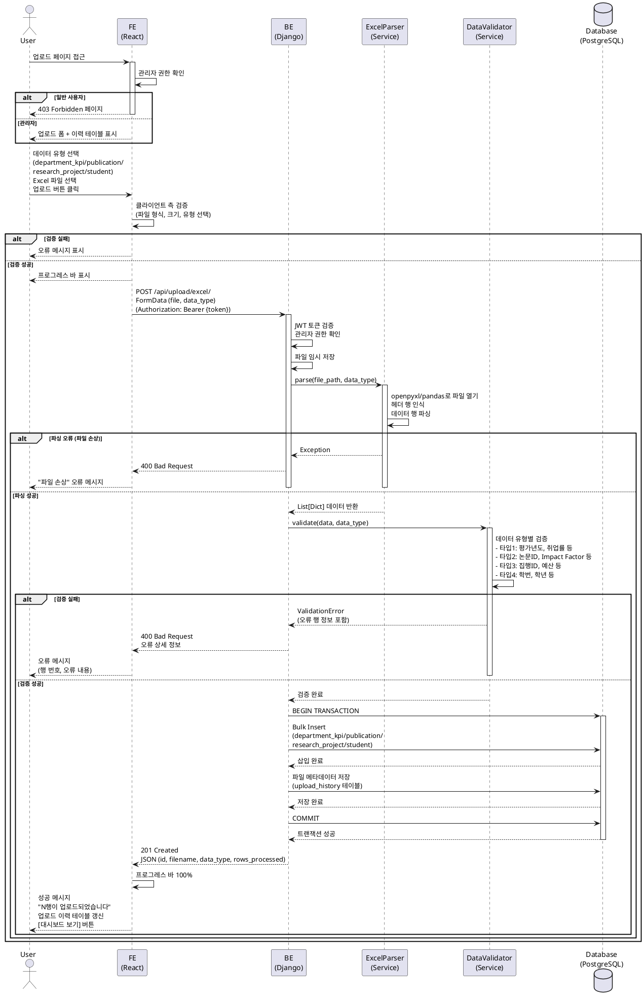

# UC-003: Excel 파일 업로드 (4가지 CSV 타입)

## Primary Actor
- 관리자 (Admin)

## Precondition
- 사용자가 관리자 권한으로 로그인되어 있어야 함
- 사용자가 업로드할 Excel 파일(.xlsx 또는 .csv)을 준비하고 있어야 함
- Excel 파일은 시스템이 요구하는 4가지 CSV 타입 중 하나의 컬럼 구조를 따라야 함

## Trigger
- Navigation Bar에서 "Upload" 메뉴 클릭

## Main Scenario

1. 사용자가 업로드 페이지에 접근함
2. 시스템이 권한을 검증함 (관리자 여부)
3. 시스템이 업로드 폼과 과거 업로드 이력 테이블을 표시함
4. 사용자가 데이터 유형을 선택함
   - 타입 1: 학과 KPI 데이터 (department_kpi)
   - 타입 2: 논문 목록 (publication_list)
   - 타입 3: 연구 과제 데이터 (research_project_data)
   - 타입 4: 학생 명단 (student_roster)
5. 사용자가 Excel 파일을 드래그 앤 드롭하거나 파일 선택 다이얼로그에서 선택함
6. 사용자가 "업로드" 버튼을 클릭함
7. 시스템이 클라이언트 측 검증을 수행함
   - 파일 확장자 확인 (.xlsx, .csv)
   - 파일 크기 확인 (최대 10MB)
   - 데이터 유형 선택 여부 확인
8. 시스템이 프로그레스 바를 표시하고 파일을 Backend로 전송함
9. Backend가 파일을 수신하고 임시 디렉토리에 저장함
10. Backend가 Excel 파일을 파싱함 (openpyxl 또는 pandas)
    - 헤더 행 인식
    - 데이터 행 파싱
11. Backend가 데이터를 검증함 (데이터 유형별 검증 규칙 적용)
    - **타입 1 (학과 KPI)**: 평가년도, 단과대학, 학과, 취업률, 교원 수, 기술이전 수입, 학술대회 개최 횟수
    - **타입 2 (논문 목록)**: 논문ID, 게재일, 학과, 논문제목, 주저자, 참여저자, 학술지명, 저널등급, Impact Factor, 과제연계여부
    - **타입 3 (연구 과제)**: 집행ID, 과제번호, 과제명, 연구책임자, 총연구비, 집행일자, 집행항목, 집행금액, 상태
    - **타입 4 (학생 명단)**: 학번, 이름, 학과, 학년, 과정구분, 학적상태, 성별, 입학년도, 지도교수, 이메일
12. Backend가 검증된 데이터를 데이터베이스에 배치 삽입함 (Bulk Create)
    - department_kpi 테이블 (타입 1)
    - publication 테이블 (타입 2)
    - research_project 테이블 (타입 3)
    - student 테이블 (타입 4)
13. Backend가 파일 메타데이터를 upload_history 테이블에 저장함
    - 파일명, 데이터 유형, 업로드 일시, 업로드 사용자, 처리된 행 수, 상태
14. Backend가 성공 응답을 반환함
15. Frontend가 프로그레스 바를 100%로 업데이트함
16. 시스템이 성공 메시지를 표시함: "파일이 성공적으로 업로드되었습니다. (N행 처리됨)"
17. 시스템이 업로드 이력 테이블을 갱신함
18. 시스템이 [대시보드 보기] 버튼을 표시함

**Result**: Excel 파일의 데이터가 해당 타입의 데이터베이스 테이블에 저장되고 대시보드에서 조회 가능해짐

## Alternative Scenarios

### 2a. 일반 사용자 접근
2a1. 시스템이 사용자가 관리자 권한이 없음을 감지함
2a2. 시스템이 403 Forbidden 페이지를 표시함
2a3. "관리자만 접근할 수 있습니다" 메시지와 [대시보드로 돌아가기] 버튼 표시
2a4. 사용 종료

### 7a. 파일 형식 오류
7a1. 시스템이 파일 확장자가 .xlsx 또는 .csv가 아님을 감지함
7a2. 시스템이 "Excel 파일(.xlsx, .csv)만 업로드 가능합니다" 메시지 표시
7a3. 사용자가 올바른 파일을 선택함
7a4. Main Scenario의 6단계로 돌아감

### 7b. 파일 크기 초과
7b1. 시스템이 파일 크기가 10MB를 초과함을 감지함
7b2. 시스템이 "파일 크기가 10MB를 초과합니다. (현재: NMB)" 메시지 표시
7b3. 사용자가 파일 크기를 줄이거나 다른 파일을 선택함
7b4. Main Scenario의 6단계로 돌아감

### 10a. Excel 파일 손상
10a1. Backend가 openpyxl/pandas 파싱 중 오류 발생
10a2. Backend가 400 Bad Request 응답 반환
10a3. Frontend가 "파일이 손상되었거나 올바른 Excel 형식이 아닙니다" 메시지 표시
10a4. 사용자가 파일을 수정하거나 다른 파일을 선택함
10a5. Main Scenario의 6단계로 돌아감

### 11a. 필수 컬럼 누락
11a1. Backend가 선택한 데이터 유형에 필요한 필수 컬럼이 누락되었음을 감지함
11a2. Backend가 400 Bad Request 응답 반환 (누락된 컬럼 목록 포함)
11a3. Frontend가 다음과 같은 메시지를 표시함
     ```
     필수 컬럼이 누락되었습니다:
     - Impact Factor (SCIE 논문은 필수)

     현재 파일의 컬럼: 논문ID, 게재일, 학과, 논문제목, 주저자, 학술지명, 저널등급
     ```
11a4. 사용자가 파일을 수정함
11a5. Main Scenario의 6단계로 돌아감

### 11b. 데이터 타입 오류
11b1. Backend가 데이터 타입 검증에 실패함 (예: 취업률이 100 초과, 날짜 형식 오류)
11b2. Backend가 오류 행 정보와 함께 400 Bad Request 응답 반환
11b3. Frontend가 다음 메시지를 표시함
     ```
     데이터 형식 오류:
     - 5행 취업률: 105.5는 0~100 범위를 초과합니다
     - 12행 게재일: "2024/01/30"은 YYYY-MM-DD 형식이 아닙니다

     오류 행을 제외하고 업로드하시겠습니까?
     ```
11b4. 사용자가 [제외하고 업로드] 또는 [취소] 선택
11b5-1. [제외하고 업로드]: Backend가 유효한 행만 저장, Main Scenario의 14단계로 진행
11b5-2. [취소]: Main Scenario의 6단계로 돌아감

### 11c. 중복 데이터
11c1. Backend가 이미 존재하는 데이터를 감지함
     - 타입 1: (평가년도, 학과) 조합 중복
     - 타입 2: 논문ID 중복
     - 타입 3: 집행ID 중복
     - 타입 4: 학번 중복
11c2. Frontend가 다음 메시지를 표시함
     ```
     중복 데이터 발견:
     - 15행: 논문ID "PUB-24-001"은 이미 존재합니다

     중복 데이터를 덮어쓰시겠습니까?
     ```
11c3. 사용자가 [덮어쓰기], [건너뛰기], 또는 [취소] 선택
11c4-1. [덮어쓰기]: Backend가 기존 데이터 업데이트, Main Scenario의 12단계로 진행
11c4-2. [건너뛰기]: Backend가 중복 행 제외하고 저장, Main Scenario의 12단계로 진행
11c4-3. [취소]: Main Scenario의 6단계로 돌아감

### 11d. 타입별 특수 검증 실패
11d1-1. **타입 2 (논문)**: SCIE 논문인데 Impact Factor가 누락됨
11d1-2. **타입 3 (연구 과제)**: 과제별 집행액 합계가 총연구비를 초과함
11d1-3. **타입 4 (학생)**: 석사/박사 학생의 학년이 0이 아님
11d2. Backend가 구체적인 검증 오류 메시지를 반환함
11d3. Frontend가 오류 내용을 표시하고 사용자에게 수정 요청
11d4. Main Scenario의 6단계로 돌아감

### 8a. 네트워크 오류
8a1. 업로드 중 네트워크 연결이 끊김
8a2. 시스템이 최대 3회 자동 재시도함
8a3-1. 재시도 성공 시 Main Scenario의 9단계로 진행
8a3-2. 재시도 실패 시 "업로드 중 오류가 발생했습니다" 메시지 표시 + [재시도] 버튼
8a4. 사용자가 [재시도] 클릭 시 Main Scenario의 6단계로 돌아감

### 12a. 트랜잭션 오류
12a1. 데이터베이스 저장 중 오류 발생
12a2. Backend가 트랜잭션 롤백 수행 (전체 성공 또는 전체 실패)
12a3. Backend가 500 Internal Server Error 응답 반환
12a4. Frontend가 "업로드 중 오류가 발생했습니다. 데이터가 저장되지 않았습니다" 메시지 표시
12a5. Main Scenario의 6단계로 돌아감

## Edge Cases

- **대용량 파일**: 10만 행 이상의 파일 업로드 시 백그라운드 처리 및 이메일 알림 제공
- **업로드 중단**: 사용자가 브라우저를 닫거나 새로고침 시 임시 파일 자동 삭제
- **동시 업로드**: 여러 관리자가 동시에 파일 업로드 가능 (각 트랜잭션 독립적 처리)
- **파일명 한글**: 한글 파일명 지원 (UTF-8 인코딩)
- **특수문자 처리**: 데이터에 특수문자(%, 쉼표, 세미콜론 등) 포함 시 자동 파싱

## Business Rules

### 공통 규칙
- BR-001: Excel 파일 업로드는 관리자만 가능함
- BR-002: 지원 파일 형식은 .xlsx, .csv임
- BR-003: 최대 파일 크기는 10MB임
- BR-004: 데이터 유형은 4가지 중 하나를 선택해야 함
- BR-005: 업로드 이력은 30일간 보관됨
- BR-006: 트랜잭션은 전체 성공 또는 전체 롤백 원칙을 따름 (원자성)
- BR-007: 업로드 성공 시 대시보드 캐시를 자동으로 무효화함

### 타입 1 (학과 KPI) 검증 규칙
- BR-101: 평가년도는 2020~2030 범위여야 함
- BR-102: (평가년도, 학과) 조합이 고유해야 함
- BR-103: 취업률은 0~100 범위, 소수점 2자리 이하
- BR-104: 교원 수, 학술대회 개최 횟수는 0 이상의 정수
- BR-105: 기술이전 수입액은 0 이상의 실수 (억원 단위)

### 타입 2 (논문 목록) 검증 규칙
- BR-201: 논문ID는 고유해야 하며, PUB-YY-NNN 형식을 따름
- BR-202: 게재일은 YYYY-MM-DD 형식
- BR-203: 저널등급은 SCIE 또는 KCI만 허용
- BR-204: SCIE 논문은 Impact Factor 필수, KCI는 빈값 허용
- BR-205: 과제연계여부는 Y 또는 N
- BR-206: 참여저자는 세미콜론(;)으로 구분

### 타입 3 (연구 과제) 검증 규칙
- BR-301: 집행ID는 고유해야 하며, T2324NNN 형식을 따름
- BR-302: 총연구비, 집행금액은 0 이상
- BR-303: 과제별 집행액 합계는 총연구비 이하여야 함
- BR-304: 집행일자는 YYYY-MM-DD 형식
- BR-305: 상태는 "집행완료" 또는 "처리중"만 허용

### 타입 4 (학생 명단) 검증 규칙
- BR-401: 학번은 고유해야 하며, YYYYMMNNN 형식을 따름
- BR-402: 이름은 2~50자
- BR-403: 학년은 0~4 범위 (학사: 1~4, 석사/박사: 0)
- BR-404: 과정구분은 학사, 석사, 박사 중 하나
- BR-405: 학적상태는 재학, 휴학, 졸업 중 하나
- BR-406: 성별은 남 또는 여
- BR-407: 입학년도는 2015~2025 범위
- BR-408: 이메일은 유효한 이메일 형식

## Sequence Diagram



## Post-conditions

### Success
- Excel 파일의 데이터가 선택한 데이터 유형에 해당하는 데이터베이스 테이블에 저장됨
  - 타입 1 → department_kpi 테이블
  - 타입 2 → publication 테이블
  - 타입 3 → research_project 테이블
  - 타입 4 → student 테이블
- 파일 메타데이터가 upload_history 테이블에 기록됨
- 업로드 이력 테이블이 갱신됨
- 대시보드 캐시가 무효화되어 새 데이터가 즉시 반영됨
- 사용자는 [대시보드 보기] 버튼을 통해 결과를 확인할 수 있음

### Failure
- 데이터베이스에 데이터가 저장되지 않음 (트랜잭션 롤백)
- 임시 파일이 삭제됨
- 오류 메시지가 표시됨
- 사용자는 파일을 수정하거나 다시 시도할 수 있음

## Related Use Cases
- UC-002: 대시보드 조회 (업로드된 데이터가 대시보드에 표시됨)
- UC-004: 데이터 조회 (업로드된 데이터를 상세 조회 가능)
