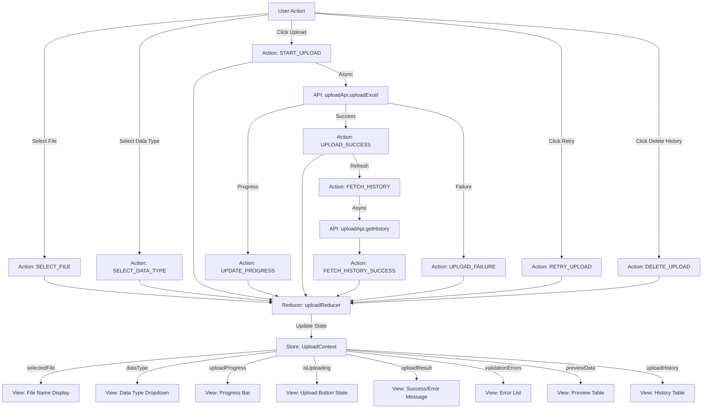
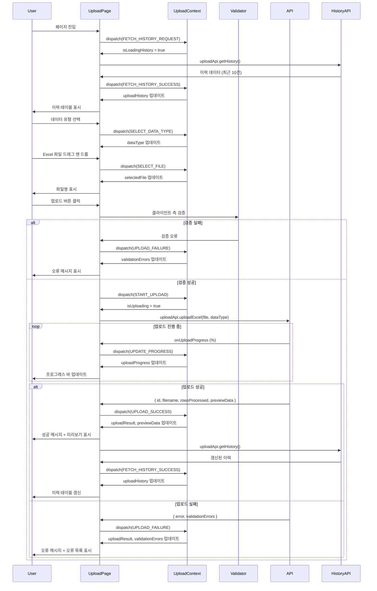

# UC-003: Excel 파일 업로드 페이지 상태관리 설계

## 1. 상태 데이터 목록

### 관리해야 할 상태 (State)

| 상태명 | 타입 | 초기값 | 설명 |
|--------|------|--------|------|
| `selectedFile` | File \| null | null | 선택된 Excel 파일 객체 |
| `dataType` | DataType \| null | null | 선택된 데이터 유형 (performance/paper/student/budget) |
| `uploadProgress` | number | 0 | 업로드 진행률 (0-100) |
| `isUploading` | boolean | false | 업로드 진행 중 여부 |
| `uploadResult` | UploadResult \| null | null | 업로드 결과 (성공/실패 정보) |
| `uploadHistory` | UploadHistoryItem[] | [] | 과거 업로드 이력 목록 (최근 10건) |
| `validationErrors` | ValidationError[] | [] | 파일 검증 오류 목록 |
| `previewData` | any[] | [] | 업로드 성공 시 데이터 미리보기 |
| `isLoadingHistory` | boolean | false | 업로드 이력 로딩 중 여부 |

### 화면에 보여지지만 상태가 아닌 것 (Derived/Computed)

| 항목 | 타입 | 설명 |
|------|------|------|
| `canUpload` | boolean | selectedFile && dataType && !isUploading (computed) |
| `uploadStatusMessage` | string | uploadProgress와 isUploading 기반 메시지 (computed) |
| `hasErrors` | boolean | validationErrors.length > 0 (computed) |
| `hasResult` | boolean | uploadResult !== null (computed) |

---

## 2. 상태 변경 조건 및 화면 변화

| 상태 | 변경 조건 | 화면 변화 |
|------|----------|----------|
| `selectedFile` | 사용자가 파일 선택 또는 드래그 앤 드롭 | 파일명 표시, 파일 아이콘 변경 (📄 → 📊) |
| `dataType` | 사용자가 데이터 유형 드롭다운 선택 | 드롭다운 값 업데이트 |
| `uploadProgress` | 업로드 진행 중 onUploadProgress 이벤트 | 프로그레스 바 업데이트 (0% → 100%) |
| `isUploading` | 업로드 시작 시 true, 완료 시 false | [업로드] 버튼 비활성화, 프로그레스 바 표시 |
| `uploadResult` | API 응답 수신 시 | 성공: 성공 메시지 + 미리보기 표시, 실패: 오류 메시지 표시 |
| `uploadHistory` | 페이지 진입 시 또는 업로드 성공 시 | 업로드 이력 테이블 갱신 |
| `validationErrors` | 클라이언트/서버 검증 실패 시 | 오류 목록 표시 (파일 형식, 크기, 필수 컬럼 등) |
| `previewData` | 업로드 성공 시 데이터 파싱 결과 | 데이터 테이블 미리보기 표시 (최대 100행) |
| `isLoadingHistory` | 이력 조회 시작 시 true, 완료 시 false | 이력 테이블 영역에 스켈레톤 로더 표시 |

---

## 3. Flux 패턴 시각화 (Action → Store → View)



---

## 4. Context + useReducer 설계

### 4.1. State Interface

```typescript
type DataType = 'performance' | 'paper' | 'student' | 'budget';

interface ValidationError {
  row?: number; // 행 번호 (optional)
  field?: string; // 컬럼명 (optional)
  message: string; // 오류 메시지
  severity: 'error' | 'warning'; // 심각도
}

interface UploadResult {
  success: boolean;
  filename: string;
  rowsProcessed: number;
  rowsFailed: number;
  uploadedAt: string;
  errors?: ValidationError[];
}

interface UploadHistoryItem {
  id: number;
  filename: string;
  dataType: DataType;
  status: 'success' | 'failed';
  rowsProcessed: number;
  uploadedBy: string;
  uploadedAt: string;
}

interface UploadState {
  selectedFile: File | null;
  dataType: DataType | null;
  uploadProgress: number;
  isUploading: boolean;
  uploadResult: UploadResult | null;
  uploadHistory: UploadHistoryItem[];
  validationErrors: ValidationError[];
  previewData: any[];
  isLoadingHistory: boolean;
}
```

### 4.2. Action Types

```typescript
type UploadAction =
  | { type: 'SELECT_FILE'; payload: File }
  | { type: 'REMOVE_FILE' }
  | { type: 'SELECT_DATA_TYPE'; payload: DataType }
  | { type: 'START_UPLOAD' }
  | { type: 'UPDATE_PROGRESS'; payload: number }
  | { type: 'UPLOAD_SUCCESS'; payload: UploadResult; previewData: any[] }
  | { type: 'UPLOAD_FAILURE'; payload: { message: string; errors?: ValidationError[] } }
  | { type: 'CLEAR_RESULT' }
  | { type: 'RETRY_UPLOAD' }
  | { type: 'FETCH_HISTORY_REQUEST' }
  | { type: 'FETCH_HISTORY_SUCCESS'; payload: UploadHistoryItem[] }
  | { type: 'FETCH_HISTORY_FAILURE' }
  | { type: 'DELETE_UPLOAD_REQUEST'; id: number }
  | { type: 'DELETE_UPLOAD_SUCCESS'; id: number }
  | { type: 'RESET_FORM' };
```

### 4.3. Reducer

```typescript
const uploadReducer = (state: UploadState, action: UploadAction): UploadState => {
  switch (action.type) {
    case 'SELECT_FILE':
      return {
        ...state,
        selectedFile: action.payload,
        uploadResult: null,
        validationErrors: [],
        previewData: [],
      };

    case 'REMOVE_FILE':
      return {
        ...state,
        selectedFile: null,
        uploadResult: null,
        validationErrors: [],
        previewData: [],
      };

    case 'SELECT_DATA_TYPE':
      return {
        ...state,
        dataType: action.payload,
        uploadResult: null,
        validationErrors: [],
      };

    case 'START_UPLOAD':
      return {
        ...state,
        isUploading: true,
        uploadProgress: 0,
        uploadResult: null,
        validationErrors: [],
        previewData: [],
      };

    case 'UPDATE_PROGRESS':
      return {
        ...state,
        uploadProgress: action.payload,
      };

    case 'UPLOAD_SUCCESS':
      return {
        ...state,
        isUploading: false,
        uploadProgress: 100,
        uploadResult: action.payload,
        previewData: action.previewData,
        validationErrors: [],
      };

    case 'UPLOAD_FAILURE':
      return {
        ...state,
        isUploading: false,
        uploadProgress: 0,
        uploadResult: {
          success: false,
          filename: state.selectedFile?.name || '',
          rowsProcessed: 0,
          rowsFailed: 0,
          uploadedAt: new Date().toISOString(),
        },
        validationErrors: action.payload.errors || [
          { message: action.payload.message, severity: 'error' },
        ],
      };

    case 'CLEAR_RESULT':
      return {
        ...state,
        uploadResult: null,
        validationErrors: [],
        previewData: [],
      };

    case 'RETRY_UPLOAD':
      // 재시도는 side effect에서 처리
      return state;

    case 'FETCH_HISTORY_REQUEST':
      return {
        ...state,
        isLoadingHistory: true,
      };

    case 'FETCH_HISTORY_SUCCESS':
      return {
        ...state,
        isLoadingHistory: false,
        uploadHistory: action.payload,
      };

    case 'FETCH_HISTORY_FAILURE':
      return {
        ...state,
        isLoadingHistory: false,
      };

    case 'DELETE_UPLOAD_REQUEST':
      return state; // 삭제는 side effect

    case 'DELETE_UPLOAD_SUCCESS':
      return {
        ...state,
        uploadHistory: state.uploadHistory.filter((item) => item.id !== action.id),
      };

    case 'RESET_FORM':
      return {
        ...state,
        selectedFile: null,
        dataType: null,
        uploadProgress: 0,
        isUploading: false,
        uploadResult: null,
        validationErrors: [],
        previewData: [],
      };

    default:
      return state;
  }
};
```

---

## 5. Context 데이터 흐름 시각화



---

## 6. 하위 컴포넌트에 노출할 변수 및 함수

### UploadContext 노출 인터페이스

```typescript
interface UploadContextValue {
  // 상태
  state: UploadState;

  // 계산된 값
  canUpload: boolean;
  uploadStatusMessage: string;
  hasErrors: boolean;
  hasResult: boolean;

  // 파일 액션
  selectFile: (file: File) => void;
  removeFile: () => void;
  selectDataType: (dataType: DataType) => void;

  // 업로드 액션
  handleUpload: () => Promise<void>;
  retryUpload: () => Promise<void>;
  clearResult: () => void;
  resetForm: () => void;

  // 이력 액션
  fetchUploadHistory: () => Promise<void>;
  deleteUpload: (id: number) => Promise<void>;

  // 검증 함수
  validateFile: (file: File) => ValidationError[];
  validateDataType: (dataType: DataType | null) => boolean;
}
```

---

## 7. 주요 구현 로직 (인터페이스)

### 7.1. 파일 선택 핸들러

```typescript
const selectFile = (file: File): void => {
  // 1. 파일 검증
  const errors = validateFile(file);

  if (errors.length > 0) {
    dispatch({
      type: 'UPLOAD_FAILURE',
      payload: {
        message: '파일 검증 실패',
        errors,
      },
    });
    return;
  }

  // 2. 파일 선택
  dispatch({ type: 'SELECT_FILE', payload: file });
};

const validateFile = (file: File): ValidationError[] => {
  const errors: ValidationError[] = [];

  // 파일 확장자 검증
  const validExtensions = ['.xlsx', '.xls'];
  const fileExtension = file.name.substring(file.name.lastIndexOf('.')).toLowerCase();

  if (!validExtensions.includes(fileExtension)) {
    errors.push({
      message: 'Excel 파일(.xlsx, .xls)만 업로드 가능합니다',
      severity: 'error',
    });
  }

  // 파일 크기 검증 (최대 10MB)
  const maxSize = 10 * 1024 * 1024; // 10MB
  if (file.size > maxSize) {
    errors.push({
      message: `파일 크기가 10MB를 초과합니다. (현재: ${(file.size / 1024 / 1024).toFixed(2)}MB)`,
      severity: 'error',
    });
  }

  return errors;
};
```

### 7.2. 업로드 핸들러

```typescript
const handleUpload = async (): Promise<void> => {
  // 1. 최종 검증
  if (!state.selectedFile || !state.dataType) {
    dispatch({
      type: 'UPLOAD_FAILURE',
      payload: {
        message: '파일과 데이터 유형을 선택해주세요',
      },
    });
    return;
  }

  // 2. FormData 생성
  const formData = new FormData();
  formData.append('file', state.selectedFile);
  formData.append('data_type', state.dataType);

  // 3. 업로드 시작
  dispatch({ type: 'START_UPLOAD' });

  try {
    // 4. API 호출 (진행률 추적)
    const response = await uploadApi.uploadExcel(
      formData,
      (progressEvent) => {
        const progress = Math.round((progressEvent.loaded * 100) / progressEvent.total);
        dispatch({ type: 'UPDATE_PROGRESS', payload: progress });
      }
    );

    // 5. 성공 처리
    dispatch({
      type: 'UPLOAD_SUCCESS',
      payload: {
        success: true,
        filename: state.selectedFile.name,
        rowsProcessed: response.rows_processed,
        rowsFailed: response.rows_failed || 0,
        uploadedAt: response.uploaded_at,
      },
      previewData: response.preview_data || [],
    });

    // 6. 이력 갱신
    await fetchUploadHistory();

    // 7. 성공 알림
    showNotification(`${response.rows_processed}행이 성공적으로 업로드되었습니다`, 'success');

  } catch (error) {
    // 8. 실패 처리
    const errorResponse = error.response?.data;

    dispatch({
      type: 'UPLOAD_FAILURE',
      payload: {
        message: errorResponse?.message || '파일 업로드 중 오류가 발생했습니다',
        errors: errorResponse?.errors || [],
      },
    });

    showNotification('파일 업로드 실패', 'error');
  }
};
```

### 7.3. 이력 조회

```typescript
const fetchUploadHistory = async (): Promise<void> => {
  dispatch({ type: 'FETCH_HISTORY_REQUEST' });

  try {
    const history = await uploadApi.getHistory({ limit: 10 });

    dispatch({
      type: 'FETCH_HISTORY_SUCCESS',
      payload: history,
    });

  } catch (error) {
    dispatch({ type: 'FETCH_HISTORY_FAILURE' });
    console.error('업로드 이력 조회 실패:', error);
  }
};
```

### 7.4. 이력 삭제

```typescript
const deleteUpload = async (id: number): Promise<void> => {
  // 1. 확인 다이얼로그
  const confirmed = await showConfirmDialog(
    '이 업로드 기록과 관련 데이터를 삭제하시겠습니까? 이 작업은 되돌릴 수 없습니다.'
  );

  if (!confirmed) return;

  // 2. 삭제 요청
  dispatch({ type: 'DELETE_UPLOAD_REQUEST', id });

  try {
    await uploadApi.deleteUpload(id);

    dispatch({ type: 'DELETE_UPLOAD_SUCCESS', id });

    showNotification('업로드 기록이 삭제되었습니다', 'success');

  } catch (error) {
    showNotification('삭제 중 오류가 발생했습니다', 'error');
  }
};
```

---

## 8. 설계 원칙 준수

### DRY (Don't Repeat Yourself)
- 파일 검증 로직을 `validateFile` 함수로 분리
- API 호출 로직을 `uploadApi`로 추상화
- 공통 알림 로직을 `showNotification` 유틸리티로 분리

### Single Responsibility
- UploadContext: 업로드 플로우 상태 관리만 담당
- Validator: 파일 검증만 담당
- API Service: 서버 통신만 담당
- Reducer: 상태 업데이트 로직만 담당

### Separation of Concerns
- Presentation (UploadPage): UI 렌더링
- Application (UploadContext): 업로드 플로우 상태 관리
- Service (uploadApi): API 통신
- Domain (UploadResult): 비즈니스 모델

---

## 9. 주의사항

1. **메모리 관리**: 대용량 파일 선택 시 메모리 누수 방지 (파일 객체 정리)
2. **진행률 추적**: Axios의 `onUploadProgress`로 실시간 진행률 업데이트
3. **오류 복구**: 네트워크 오류 시 자동 재시도 (최대 3회)
4. **중복 업로드 방지**: `isUploading` 상태로 버튼 비활성화
5. **접근성**: 오류 메시지는 스크린 리더가 읽을 수 있도록 aria-live 영역에 표시
6. **트랜잭션**: 서버에서 전체 성공 또는 전체 롤백 보장
7. **파일 정리**: 업로드 성공/실패 후 임시 파일 자동 삭제
