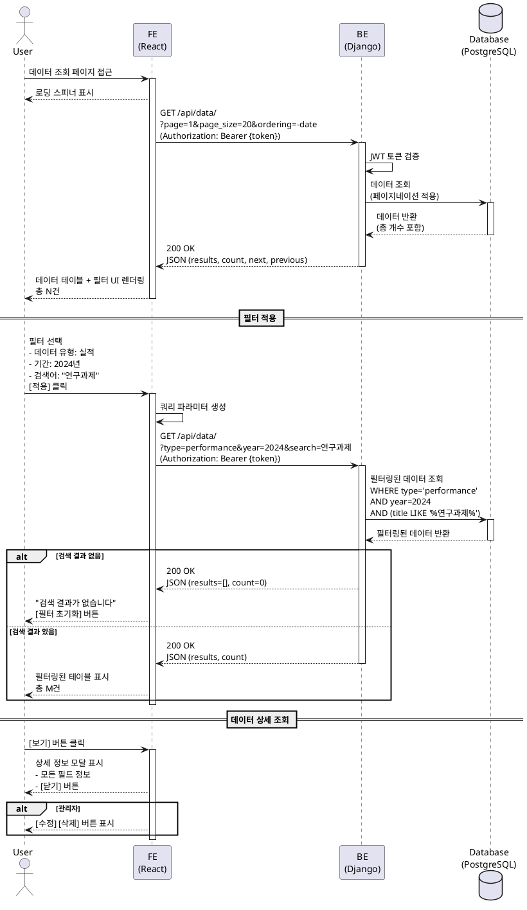

# UC-004: 데이터 조회 및 필터링

## Primary Actor
- 인증된 대학교 직원 (관리자 또는 일반 사용자)

## Precondition
- 사용자가 로그인되어 있어야 함
- 데이터베이스에 조회 가능한 데이터가 존재해야 함

## Trigger
- Navigation Bar에서 "Data" 메뉴 클릭

## Main Scenario

1. 사용자가 데이터 조회 페이지에 접근함
2. 시스템이 JWT 토큰을 검증함
3. 시스템이 기본 필터 조건으로 데이터를 요청함
   - 페이지: 1
   - 페이지 크기: 20
   - 정렬: 날짜 내림차순
4. Backend가 데이터베이스에서 데이터를 조회함 (페이지네이션 적용)
5. Backend가 총 결과 수와 함께 JSON 응답을 반환함
6. Frontend가 데이터 테이블과 필터 UI를 렌더링함
7. 시스템이 다음 요소를 표시함
   - 필터 옵션 (데이터 유형, 기간, 검색어)
   - 데이터 테이블 (날짜, 유형, 항목, 금액, 상세 버튼)
   - 페이지네이션 (이전, 다음, 페이지 번호)
   - 총 결과 수
   - [CSV 다운로드] 버튼

**Result**: 사용자가 테이블 형식으로 데이터를 조회하고 필터링할 수 있음

## Alternative Scenarios

### 4a. 데이터 없음
4a1. Backend가 데이터베이스에서 데이터를 찾지 못함
4a2. Backend가 빈 배열을 반환함
4a3. Frontend가 빈 상태 UI를 표시함
4a4-1. 관리자: "조회 가능한 데이터가 없습니다" + [Excel 업로드] 버튼
4a4-2. 일반 사용자: "조회 가능한 데이터가 없습니다"

### 필터링 시나리오

### 8. 사용자가 필터를 적용함
8.1. 사용자가 데이터 유형을 선택함 (예: "실적")
8.2. 사용자가 기간을 선택함 (예: "2024년")
8.3. 사용자가 검색어를 입력함 (예: "연구과제")
8.4. 사용자가 [적용] 버튼을 클릭함
8.5. 시스템이 쿼리 파라미터를 업데이트함
8.6. 시스템이 필터링된 데이터를 요청함
8.7. Backend가 필터 조건에 맞는 데이터를 조회함
8.8. Frontend가 필터링된 결과를 테이블에 표시함

### 8a. 검색 결과 없음
8a1. Backend가 필터 조건에 맞는 데이터를 찾지 못함
8a2. Frontend가 "검색 결과가 없습니다" 메시지를 표시함
8a3. Frontend가 [필터 초기화] 버튼을 제공함

### 데이터 상세 조회 시나리오

### 9. 사용자가 특정 행의 [보기] 버튼을 클릭함
9.1. 시스템이 상세 정보 모달을 표시함
9.2. 모달에 모든 필드 정보가 표시됨
   - 날짜, 유형, 항목, 금액, 카테고리, 설명
   - 업로드 일시, 업로드 사용자
9.3. 관리자인 경우 [수정], [삭제] 버튼이 표시됨
9.4. 사용자가 [닫기] 버튼을 클릭하여 모달을 닫음

### 페이지네이션 시나리오

### 10. 사용자가 다음 페이지를 요청함
10.1. 사용자가 페이지 번호 또는 [다음] 버튼을 클릭함
10.2. 시스템이 해당 페이지의 데이터를 요청함
10.3. Backend가 페이지네이션을 적용하여 데이터를 반환함
10.4. Frontend가 테이블을 새 데이터로 업데이트함

## Edge Cases

- **정렬**: 사용자가 테이블 헤더를 클릭하면 해당 컬럼 기준으로 오름차순/내림차순 정렬됨
- **다중 필터**: 여러 필터를 동시에 적용 가능 (AND 조건)
- **검색어 자동완성**: 검색어 입력 시 디바운싱 적용 (500ms 후 자동 검색)
- **URL 상태 동기화**: 필터 조건이 URL 쿼리 파라미터에 저장되어 공유 및 북마크 가능
- **데이터 수정/삭제**: 관리자만 가능, 일반 사용자는 버튼 미표시

## Business Rules

- BR-001: 모든 로그인 사용자는 데이터 조회 가능함
- BR-002: 데이터 수정/삭제는 관리자만 가능함
- BR-003: 기본 페이지 크기는 20행이며, 사용자가 50 또는 100으로 변경 가능함
- BR-004: 검색어는 항목명, 설명, 카테고리 필드에서 부분 일치 검색됨
- BR-005: 필터 조건은 다음과 같음
  - 데이터 유형: 전체, 실적, 논문, 학생, 예산
  - 기간: 연도 (2023, 2024, 2025 등)
  - 검색어: 텍스트 (2자 이상)
- BR-006: 날짜 정렬 기본값은 내림차순 (최신 데이터 우선)
- BR-007: 테이블에 표시되는 컬럼은 데이터 유형에 따라 동적으로 변경됨
- BR-008: 페이지네이션은 커서 기반이 아닌 오프셋 기반을 사용함
- BR-009: 데이터 조회 API 응답 시간은 평균 500ms 이내여야 함 (NFR)
- BR-010: 검색 디바운싱은 500ms 적용됨

## Sequence Diagram

## Post-conditions

### Success
- 사용자는 테이블 형식으로 데이터를 확인할 수 있음
- 사용자는 필터를 통해 원하는 데이터를 찾을 수 있음
- 사용자는 페이지네이션을 통해 대량의 데이터를 탐색할 수 있음
- 사용자는 상세 정보 모달을 통해 각 항목의 세부 정보를 확인할 수 있음
- 관리자는 데이터를 수정하거나 삭제할 수 있음

### Failure
- 오류 메시지가 표시됨
- 사용자는 [다시 시도] 버튼을 통해 재시도할 수 있음

## Related Use Cases
- UC-002: 대시보드 조회 (대시보드에서 데이터 조회 페이지로 이동 가능)
- UC-003: Excel 파일 업로드 (업로드된 데이터를 조회 가능)
- UC-005: 데이터 내보내기 (조회한 데이터를 CSV로 다운로드)
