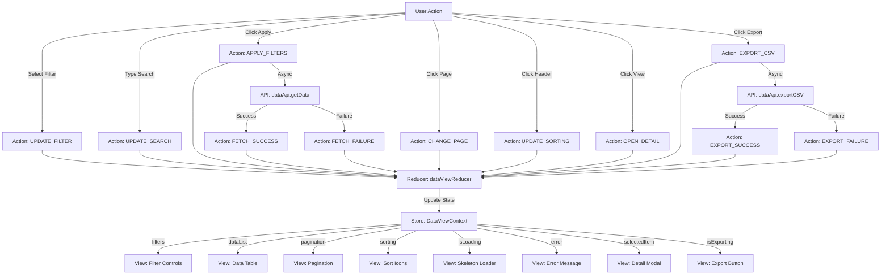
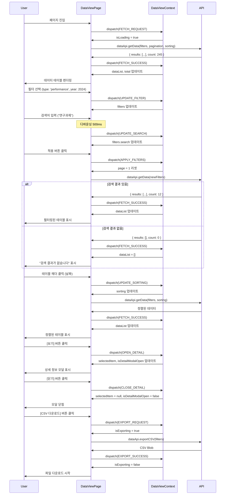

# UC-004: 데이터 조회 페이지 상태관리 설계

## 1. 상태 데이터 목록

### 관리해야 할 상태 (State)

| 상태명 | 타입 | 초기값 | 설명 |
|--------|------|--------|------|
| `dataList` | DataItem[] | [] | 조회된 데이터 목록 |
| `filters` | DataFilters | { type: 'all', year: null, search: '' } | 필터 조건 |
| `pagination` | Pagination | { page: 1, pageSize: 20, total: 0 } | 페이지네이션 정보 |
| `sorting` | Sorting | { field: 'date', order: 'desc' } | 정렬 조건 |
| `isLoading` | boolean | false | 데이터 로딩 중 여부 |
| `error` | string \| null | null | 데이터 조회 오류 메시지 |
| `selectedItem` | DataItem \| null | null | 상세 조회를 위해 선택된 항목 |
| `isDetailModalOpen` | boolean | false | 상세 모달 열림 여부 |
| `isExporting` | boolean | false | CSV 다운로드 진행 중 여부 |

### 화면에 보여지지만 상태가 아닌 것 (Derived/Computed)

| 항목 | 타입 | 설명 |
|------|------|------|
| `hasData` | boolean | dataList.length > 0 (computed) |
| `totalPages` | number | Math.ceil(pagination.total / pagination.pageSize) (computed) |
| `isFiltered` | boolean | 기본 필터와 다른 필터가 적용되었는지 (computed) |
| `filterQuery` | string | filters를 URL 쿼리 스트링으로 변환 (computed) |
| `canExport` | boolean | hasData && !isExporting (computed) |

---

## 2. 상태 변경 조건 및 화면 변화

| 상태 | 변경 조건 | 화면 변화 |
|------|----------|----------|
| `dataList` | API 요청 성공 시 데이터 저장 | 데이터 테이블 렌더링 |
| `filters.type` | 사용자가 데이터 유형 선택 | 필터 드롭다운 값 변경 |
| `filters.year` | 사용자가 연도 선택 | 필터 드롭다운 값 변경 |
| `filters.search` | 사용자가 검색어 입력 (디바운싱 500ms) | 검색 입력 필드 값 변경 |
| `pagination.page` | 사용자가 페이지 번호 클릭 | 테이블 데이터 교체, 페이지네이션 버튼 활성화 상태 변경 |
| `pagination.pageSize` | 사용자가 페이지 크기 선택 | 테이블 행 수 변경 |
| `pagination.total` | API 응답 시 총 개수 업데이트 | "총 N건" 표시 업데이트 |
| `sorting.field` | 사용자가 테이블 헤더 클릭 | 정렬 아이콘 변경, 데이터 재조회 |
| `sorting.order` | 헤더 클릭 시 asc/desc 토글 | 정렬 방향 아이콘 변경 (↑/↓) |
| `isLoading` | API 요청 시작 시 true, 완료 시 false | 테이블 영역에 스켈레톤 로더 표시 |
| `error` | 데이터 조회 실패 시 | 오류 메시지 표시, [다시 시도] 버튼 표시 |
| `selectedItem` | 사용자가 테이블 행의 [보기] 버튼 클릭 | 상세 모달 열림 |
| `isDetailModalOpen` | [보기] 클릭 시 true, [닫기] 클릭 시 false | 상세 정보 모달 표시/숨김 |
| `isExporting` | CSV 다운로드 시작 시 true, 완료 시 false | [CSV 다운로드] 버튼 비활성화, 로딩 표시 |

---

## 3. Flux 패턴 시각화 (Action → Store → View)



---

## 4. Context + useReducer 설계

### 4.1. State Interface

```typescript
type DataType = 'all' | 'performance' | 'paper' | 'student' | 'budget';

interface DataFilters {
  type: DataType;
  year: number | null;
  search: string;
}

interface Pagination {
  page: number;
  pageSize: number;
  total: number;
}

interface Sorting {
  field: string; // 'date' | 'type' | 'amount' 등
  order: 'asc' | 'desc';
}

interface DataItem {
  id: number;
  type: DataType;
  date: string;
  title: string;
  amount?: number;
  category?: string;
  description?: string;
  uploadedBy: string;
  uploadedAt: string;
  [key: string]: any; // 데이터 유형별 추가 필드
}

interface DataViewState {
  dataList: DataItem[];
  filters: DataFilters;
  pagination: Pagination;
  sorting: Sorting;
  isLoading: boolean;
  error: string | null;
  selectedItem: DataItem | null;
  isDetailModalOpen: boolean;
  isExporting: boolean;
}
```

### 4.2. Action Types

```typescript
type DataViewAction =
  | { type: 'UPDATE_FILTER'; filterType: keyof DataFilters; value: any }
  | { type: 'UPDATE_SEARCH'; payload: string }
  | { type: 'APPLY_FILTERS' }
  | { type: 'RESET_FILTERS' }
  | { type: 'CHANGE_PAGE'; payload: number }
  | { type: 'CHANGE_PAGE_SIZE'; payload: number }
  | { type: 'UPDATE_SORTING'; field: string }
  | { type: 'FETCH_REQUEST' }
  | { type: 'FETCH_SUCCESS'; payload: { data: DataItem[]; total: number } }
  | { type: 'FETCH_FAILURE'; payload: string }
  | { type: 'OPEN_DETAIL'; payload: DataItem }
  | { type: 'CLOSE_DETAIL' }
  | { type: 'EXPORT_REQUEST' }
  | { type: 'EXPORT_SUCCESS' }
  | { type: 'EXPORT_FAILURE'; payload: string };
```

### 4.3. Reducer

```typescript
const dataViewReducer = (state: DataViewState, action: DataViewAction): DataViewState => {
  switch (action.type) {
    case 'UPDATE_FILTER':
      return {
        ...state,
        filters: {
          ...state.filters,
          [action.filterType]: action.value,
        },
      };

    case 'UPDATE_SEARCH':
      return {
        ...state,
        filters: {
          ...state.filters,
          search: action.payload,
        },
      };

    case 'APPLY_FILTERS':
      // 필터 적용은 side effect (데이터 재조회)
      return {
        ...state,
        pagination: {
          ...state.pagination,
          page: 1, // 필터 변경 시 첫 페이지로 리셋
        },
      };

    case 'RESET_FILTERS':
      return {
        ...state,
        filters: {
          type: 'all',
          year: null,
          search: '',
        },
        pagination: {
          ...state.pagination,
          page: 1,
        },
      };

    case 'CHANGE_PAGE':
      return {
        ...state,
        pagination: {
          ...state.pagination,
          page: action.payload,
        },
      };

    case 'CHANGE_PAGE_SIZE':
      return {
        ...state,
        pagination: {
          ...state.pagination,
          pageSize: action.payload,
          page: 1, // 페이지 크기 변경 시 첫 페이지로 리셋
        },
      };

    case 'UPDATE_SORTING':
      return {
        ...state,
        sorting: {
          field: action.field,
          order:
            state.sorting.field === action.field && state.sorting.order === 'asc'
              ? 'desc'
              : 'asc',
        },
      };

    case 'FETCH_REQUEST':
      return {
        ...state,
        isLoading: true,
        error: null,
      };

    case 'FETCH_SUCCESS':
      return {
        ...state,
        isLoading: false,
        dataList: action.payload.data,
        pagination: {
          ...state.pagination,
          total: action.payload.total,
        },
        error: null,
      };

    case 'FETCH_FAILURE':
      return {
        ...state,
        isLoading: false,
        error: action.payload,
        dataList: [],
      };

    case 'OPEN_DETAIL':
      return {
        ...state,
        selectedItem: action.payload,
        isDetailModalOpen: true,
      };

    case 'CLOSE_DETAIL':
      return {
        ...state,
        selectedItem: null,
        isDetailModalOpen: false,
      };

    case 'EXPORT_REQUEST':
      return {
        ...state,
        isExporting: true,
      };

    case 'EXPORT_SUCCESS':
      return {
        ...state,
        isExporting: false,
      };

    case 'EXPORT_FAILURE':
      return {
        ...state,
        isExporting: false,
        error: action.payload,
      };

    default:
      return state;
  }
};
```

---

## 5. Context 데이터 흐름 시각화



---

## 6. 하위 컴포넌트에 노출할 변수 및 함수

### DataViewContext 노출 인터페이스

```typescript
interface DataViewContextValue {
  // 상태
  state: DataViewState;

  // 계산된 값
  hasData: boolean;
  totalPages: number;
  isFiltered: boolean;
  canExport: boolean;

  // 필터 액션
  updateFilter: (filterType: keyof DataFilters, value: any) => void;
  updateSearch: (search: string) => void;
  applyFilters: () => Promise<void>;
  resetFilters: () => Promise<void>;

  // 페이지네이션 액션
  changePage: (page: number) => void;
  changePageSize: (pageSize: number) => void;
  goToFirstPage: () => void;
  goToLastPage: () => void;
  goToNextPage: () => void;
  goToPreviousPage: () => void;

  // 정렬 액션
  updateSorting: (field: string) => void;

  // 데이터 액션
  fetchData: () => Promise<void>;
  refreshData: () => Promise<void>;

  // 상세 조회 액션
  openDetail: (item: DataItem) => void;
  closeDetail: () => void;

  // 내보내기 액션
  exportCSV: () => Promise<void>;

  // 유틸리티
  getColumnLabel: (dataType: DataType, field: string) => string;
  formatValue: (value: any, field: string) => string;
}
```

---

## 7. 주요 구현 로직 (인터페이스)

### 7.1. 데이터 조회

```typescript
const fetchData = async (): Promise<void> => {
  dispatch({ type: 'FETCH_REQUEST' });

  try {
    // URL 쿼리 파라미터 생성
    const queryParams = {
      page: state.pagination.page,
      page_size: state.pagination.pageSize,
      ordering: `${state.sorting.order === 'desc' ? '-' : ''}${state.sorting.field}`,
      ...(state.filters.type !== 'all' && { type: state.filters.type }),
      ...(state.filters.year && { year: state.filters.year }),
      ...(state.filters.search && { search: state.filters.search }),
    };

    const response = await dataApi.getData(queryParams);

    dispatch({
      type: 'FETCH_SUCCESS',
      payload: {
        data: response.results,
        total: response.count,
      },
    });

  } catch (error) {
    dispatch({
      type: 'FETCH_FAILURE',
      payload: error.message || '데이터를 불러올 수 없습니다',
    });
  }
};
```

### 7.2. 검색어 디바운싱

```typescript
const updateSearch = useCallback(
  debounce((search: string) => {
    dispatch({ type: 'UPDATE_SEARCH', payload: search });
  }, 500),
  []
);
```

### 7.3. 필터 적용

```typescript
const applyFilters = async (): Promise<void> => {
  // 1. 페이지를 1로 리셋
  dispatch({ type: 'APPLY_FILTERS' });

  // 2. URL 쿼리 파라미터 업데이트
  const queryString = new URLSearchParams({
    ...(state.filters.type !== 'all' && { type: state.filters.type }),
    ...(state.filters.year && { year: state.filters.year.toString() }),
    ...(state.filters.search && { search: state.filters.search }),
  }).toString();

  navigate(`/data?${queryString}`, { replace: false });

  // 3. 데이터 재조회
  await fetchData();
};
```

### 7.4. 정렬 변경

```typescript
const updateSorting = (field: string): void => {
  dispatch({ type: 'UPDATE_SORTING', field });

  // 정렬 변경 후 데이터 재조회
  fetchData();
};
```

### 7.5. 페이지네이션

```typescript
const changePage = (page: number): void => {
  dispatch({ type: 'CHANGE_PAGE', payload: page });

  // 페이지 변경 후 데이터 재조회
  fetchData();

  // 페이지 상단으로 스크롤
  window.scrollTo({ top: 0, behavior: 'smooth' });
};

const goToNextPage = (): void => {
  if (state.pagination.page < totalPages) {
    changePage(state.pagination.page + 1);
  }
};

const goToPreviousPage = (): void => {
  if (state.pagination.page > 1) {
    changePage(state.pagination.page - 1);
  }
};
```

### 7.6. CSV 내보내기

```typescript
const exportCSV = async (): Promise<void> => {
  // 1. 확인 다이얼로그
  const confirmed = await showConfirmDialog(
    `현재 필터 조건으로 ${state.pagination.total}건을 다운로드하시겠습니까?`
  );

  if (!confirmed) return;

  // 2. 내보내기 시작
  dispatch({ type: 'EXPORT_REQUEST' });

  try {
    // 3. API 호출 (필터만 전달, 페이지네이션 제외)
    const blob = await dataApi.exportCSV({
      ...(state.filters.type !== 'all' && { type: state.filters.type }),
      ...(state.filters.year && { year: state.filters.year }),
      ...(state.filters.search && { search: state.filters.search }),
    });

    // 4. 파일 다운로드
    const url = window.URL.createObjectURL(blob);
    const link = document.createElement('a');
    link.href = url;
    link.download = `data_export_${new Date().toISOString().slice(0, 10)}.csv`;
    link.click();
    window.URL.revokeObjectURL(url);

    // 5. 성공 처리
    dispatch({ type: 'EXPORT_SUCCESS' });

    showNotification(`${state.pagination.total}건의 데이터가 다운로드되었습니다`, 'success');

  } catch (error) {
    // 6. 실패 처리
    dispatch({
      type: 'EXPORT_FAILURE',
      payload: error.message || '파일 생성 중 오류가 발생했습니다',
    });

    showNotification('CSV 다운로드 실패', 'error');
  }
};
```

---

## 8. 설계 원칙 준수

### DRY (Don't Repeat Yourself)
- 데이터 조회 로직을 `fetchData` 함수로 통합
- URL 쿼리 파라미터 생성 로직을 재사용
- API 호출 로직을 `dataApi`로 추상화

### Single Responsibility
- DataViewContext: 데이터 조회 페이지 상태 관리만 담당
- Reducer: 상태 업데이트 로직만 담당
- API Service: 서버 통신만 담당

### Separation of Concerns
- Presentation (DataViewPage): UI 렌더링
- Application (DataViewContext): 상태 관리
- Service (dataApi): API 통신
- Domain (DataItem): 비즈니스 모델

---

## 9. 성능 최적화

1. **메모이제이션**: `useMemo`로 계산된 값 캐싱
2. **디바운싱**: 검색어 입력 시 500ms 디바운싱 적용
3. **가상 스크롤**: 대량 데이터 시 React Window로 최적화 (선택 사항)
4. **페이지네이션**: 한 번에 20건씩만 로드하여 초기 로딩 속도 향상

---

## 10. 주의사항

1. **URL 동기화**: 필터 상태를 URL에 반영하여 공유 및 북마크 가능
2. **무한 루프 방지**: useEffect 의존성 배열 신중하게 관리
3. **메모리 관리**: 컴포넌트 언마운트 시 디바운스 타이머 정리
4. **접근성**: 테이블은 키보드 네비게이션 지원, ARIA 속성 추가
5. **오류 복구**: 네트워크 오류 시 [다시 시도] 버튼 제공
