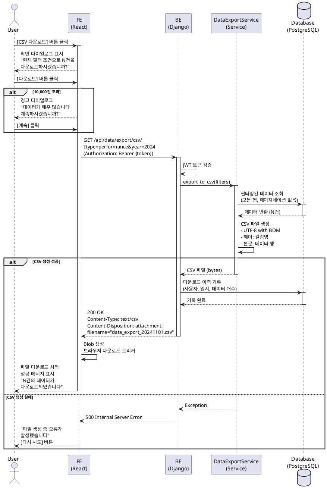

# UC-005: 데이터 내보내기 (CSV)

## Primary Actor
- 인증된 대학교 직원 (관리자 또는 일반 사용자)

## Precondition
- 사용자가 로그인되어 있어야 함
- 데이터 조회 페이지에 접근한 상태여야 함
- 데이터베이스에 내보낼 데이터가 존재해야 함

## Trigger
- 데이터 조회 페이지에서 [CSV 다운로드] 버튼 클릭

## Main Scenario

1. 사용자가 데이터 조회 페이지에서 필터를 적용함 (선택 사항)
2. 사용자가 [CSV 다운로드] 버튼을 클릭함
3. 시스템이 확인 다이얼로그를 표시함
   - "현재 필터 조건으로 N건을 다운로드하시겠습니까?"
   - [취소] [다운로드] 버튼
4. 사용자가 [다운로드] 버튼을 클릭함
5. Frontend가 현재 필터 조건을 포함하여 CSV 내보내기를 요청함
6. Backend가 JWT 토큰을 검증함
7. Backend가 필터 조건에 맞는 모든 데이터를 조회함 (페이지네이션 없음)
8. Backend가 CSV 파일을 생성함
   - UTF-8 with BOM 인코딩 (Excel 한글 호환)
   - 헤더: 컬럼명 (날짜, 유형, 항목, 금액, 카테고리, 설명 등)
   - 본문: 데이터 행
9. Backend가 CSV 파일을 HTTP 응답으로 반환함
   - Content-Type: text/csv; charset=utf-8
   - Content-Disposition: attachment; filename="data_export_YYYYMMDD_HHMMSS.csv"
10. Frontend가 Blob을 생성하고 브라우저 다운로드를 트리거함
11. 사용자의 브라우저가 다운로드 폴더에 CSV 파일을 저장함
12. 시스템이 성공 메시지를 표시함: "N건의 데이터가 다운로드되었습니다"

**Result**: 사용자가 필터링된 데이터를 CSV 파일로 다운로드하여 Excel 등에서 활용할 수 있음

## Alternative Scenarios

### 3a. 대용량 데이터 경고
3a1. 시스템이 다운로드 대상이 10,000건을 초과함을 감지함
3a2. 시스템이 경고 다이얼로그를 표시함
     ```
     데이터가 매우 많습니다 (N건)
     다운로드에 시간이 걸릴 수 있습니다
     계속하시겠습니까?
     ```
3a3. 사용자가 [취소] 또는 [계속] 선택
3a4-1. [취소]: 사용 종료
3a4-2. [계속]: Main Scenario의 5단계로 진행

### 7a. 데이터 없음
7a1. Backend가 필터 조건에 맞는 데이터를 찾지 못함
7a2. Backend가 400 Bad Request 응답 반환
7a3. Frontend가 "다운로드할 데이터가 없습니다" 메시지 표시
7a4. 사용 종료

### 8a. CSV 생성 오류
8a1. Backend에서 CSV 생성 중 메모리 부족 또는 인코딩 오류 발생
8a2. Backend가 500 Internal Server Error 응답 반환
8a3. Frontend가 "파일 생성 중 오류가 발생했습니다" 메시지 표시
8a4. [다시 시도] 버튼 제공

### 8b. 타임아웃 (대용량 데이터)
8b1. CSV 생성이 60초를 초과함
8b2. Backend가 비동기 처리로 전환함
8b3. Backend가 작업 ID를 반환함
8b4. Frontend가 다음 메시지를 표시함
     ```
     파일이 매우 큽니다. 백그라운드에서 처리됩니다
     처리 완료 시 이메일로 알림을 받으시겠습니까?
     [예] [아니오]
     ```
8b5. 사용자가 [예] 선택 시 이메일 주소 입력 받음
8b6. 처리 완료 후 이메일로 다운로드 링크 전송

### 10a. 브라우저 다운로드 차단
10a1. 브라우저 팝업 차단 설정으로 다운로드가 차단됨
10a2. Frontend가 "팝업 차단을 해제해주세요" 메시지 표시
10a3. 사용자가 팝업 차단을 해제함
10a4. Main Scenario의 2단계로 돌아감

## Edge Cases

- **필터 없이 전체 다운로드**: 필터를 적용하지 않으면 전체 데이터 다운로드
- **한글 파일명**: 브라우저에 따라 한글 파일명 인코딩 처리
- **특수문자 처리**: CSV 데이터에 쉼표, 따옴표 등 포함 시 이스케이프 처리
- **줄바꿈 처리**: 데이터에 줄바꿈 문자 포함 시 따옴표로 감싸서 처리
- **빈 값 처리**: NULL 값은 빈 문자열로 처리
- **날짜 형식**: 날짜는 YYYY-MM-DD 형식으로 통일

## Business Rules

- BR-001: 모든 로그인 사용자는 CSV 내보내기 가능함
- BR-002: CSV 파일 인코딩은 UTF-8 with BOM임 (Excel 한글 호환)
- BR-003: 파일명 형식은 `data_export_YYYYMMDD_HHMMSS.csv`임
- BR-004: CSV 헤더는 한글로 표시됨 (예: 날짜, 유형, 항목, 금액)
- BR-005: 현재 적용된 필터 조건이 그대로 CSV 내보내기에 적용됨
- BR-006: 데이터 개수가 10,000건을 초과하면 경고 메시지 표시
- BR-007: CSV 생성 타임아웃은 60초임
- BR-008: 대용량 데이터(100,000건 초과)는 비동기 처리 및 이메일 발송
- BR-009: CSV 파일 최대 크기는 100MB임
- BR-010: 다운로드 이력은 감사 로그에 기록됨 (사용자, 일시, 데이터 개수)

## Sequence Diagram



## Post-conditions

### Success
- CSV 파일이 사용자의 다운로드 폴더에 저장됨
- 파일은 Excel에서 바로 열 수 있는 형식임 (UTF-8 with BOM)
- 다운로드 이력이 감사 로그에 기록됨
- 성공 메시지가 표시됨

### Failure
- CSV 파일이 생성되지 않음
- 오류 메시지가 표시됨
- 사용자는 [다시 시도] 버튼을 통해 재시도할 수 있음

## Related Use Cases
- UC-004: 데이터 조회 및 필터링 (데이터 조회 페이지에서 CSV 다운로드 수행)
- UC-002: 대시보드 조회 (대시보드에서도 CSV 다운로드 가능하도록 확장 가능)
