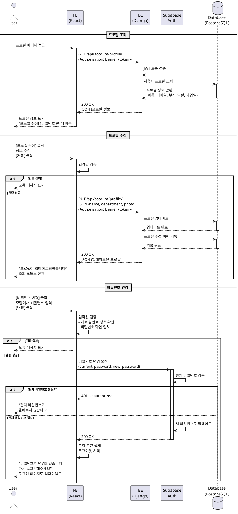

# UC-006: 프로필 관리

## Primary Actor
- 인증된 대학교 직원 (관리자 또는 일반 사용자)

## Precondition
- 사용자가 로그인되어 있어야 함
- 사용자가 유효한 JWT 토큰을 보유하고 있어야 함

## Trigger
- Navigation Bar에서 "Profile" 메뉴 클릭 또는 프로필 아이콘 클릭

## Main Scenario

1. 사용자가 프로필 페이지에 접근함
2. 시스템이 JWT 토큰을 검증함
3. Backend가 사용자 프로필 정보를 조회함
4. Backend가 다음 정보를 반환함
   - 이름, 이메일, 소속 부서, 역할(권한), 가입일, 마지막 로그인 시각
5. Frontend가 프로필 정보를 표시함
6. 시스템이 [프로필 수정] 및 [비밀번호 변경] 버튼을 표시함

**Result**: 사용자가 자신의 프로필 정보를 확인할 수 있음

## Alternative Scenarios

### 프로필 수정 시나리오

### 7. 사용자가 [프로필 수정] 버튼을 클릭함
7.1. 시스템이 수정 모드로 전환함
7.2. 수정 가능한 필드가 입력 필드로 활성화됨
    - 이름 (2-50자)
    - 소속 부서
    - 프로필 사진 (선택 사항)
7.3. [취소] [저장] 버튼이 표시됨
7.4. 사용자가 정보를 수정함
7.5. 사용자가 [저장] 버튼을 클릭함
7.6. 시스템이 입력값을 검증함
7.7. Frontend가 프로필 업데이트를 요청함
7.8. Backend가 데이터베이스를 업데이트함
7.9. Backend가 업데이트된 프로필 정보를 반환함
7.10. Frontend가 성공 메시지를 표시함: "프로필이 업데이트되었습니다"
7.11. 시스템이 조회 모드로 전환함

### 7a. 입력값 검증 실패
7a1. 시스템이 입력값 검증에 실패함
     - 이름: 2자 미만 또는 50자 초과
     - 프로필 사진: 2MB 초과 또는 지원하지 않는 형식
7a2. 시스템이 인라인 오류 메시지를 표시함
7a3. 사용자가 올바른 값을 입력함
7a4. Main Scenario의 7.5단계로 돌아감

### 7b. 사용자가 [취소] 버튼을 클릭함
7b1. 시스템이 변경사항을 폐기함
7b2. 시스템이 조회 모드로 전환함 (원래 정보 유지)

### 비밀번호 변경 시나리오

### 8. 사용자가 [비밀번호 변경] 버튼을 클릭함
8.1. 시스템이 비밀번호 변경 모달을 표시함
8.2. 모달에 다음 입력 필드가 표시됨
    - 현재 비밀번호
    - 새 비밀번호
    - 새 비밀번호 확인
8.3. [취소] [변경] 버튼이 표시됨
8.4. 사용자가 비밀번호를 입력함
8.5. 사용자가 [변경] 버튼을 클릭함
8.6. 시스템이 입력값을 검증함
    - 현재 비밀번호: 공백 불가
    - 새 비밀번호: 8자 이상, 영문+숫자+특수문자 조합
    - 비밀번호 확인: 새 비밀번호와 일치
8.7. Frontend가 Supabase Auth API를 호출하여 비밀번호를 변경함
8.8. Supabase Auth가 현재 비밀번호를 검증함
8.9. Supabase Auth가 새 비밀번호로 업데이트함
8.10. Frontend가 성공 메시지를 표시함: "비밀번호가 변경되었습니다. 다시 로그인해주세요"
8.11. 시스템이 로그아웃 처리함
8.12. 시스템이 로그인 페이지로 리다이렉트함

### 8a. 현재 비밀번호 불일치
8a1. Supabase Auth가 현재 비밀번호 검증에 실패함
8a2. Frontend가 "현재 비밀번호가 올바르지 않습니다" 메시지 표시
8a3. Main Scenario의 8.4단계로 돌아감

### 8b. 새 비밀번호 검증 실패
8b1. 시스템이 새 비밀번호가 정책을 만족하지 못함을 감지함
8b2. 시스템이 "비밀번호는 8자 이상, 영문, 숫자, 특수문자를 포함해야 합니다" 메시지 표시
8b3. Main Scenario의 8.4단계로 돌아감

### 8c. 비밀번호 확인 불일치
8c1. 시스템이 새 비밀번호와 비밀번호 확인이 일치하지 않음을 감지함
8c2. 시스템이 "비밀번호가 일치하지 않습니다" 메시지 표시
8c3. Main Scenario의 8.4단계로 돌아감

## Edge Cases

- **프로필 사진 업로드**: 사진 선택 시 미리보기 표시, 크롭 기능 제공 (선택 사항)
- **이메일 변경 불가**: 이메일은 계정 식별자이므로 변경 불가 (읽기 전용 표시)
- **역할 변경 불가**: 사용자는 자신의 역할을 변경할 수 없음 (관리자만 변경 가능)
- **동시 수정**: 다른 관리자가 사용자 정보를 수정하는 경우 충돌 감지 및 알림
- **비밀번호 강도 표시**: 새 비밀번호 입력 시 실시간 강도 표시 (약함/보통/강함)

## Business Rules

- BR-001: 모든 로그인 사용자는 자신의 프로필을 조회 및 수정할 수 있음
- BR-002: 수정 가능한 필드는 이름, 소속 부서, 프로필 사진임
- BR-003: 이메일, 역할, 가입일은 읽기 전용 필드임
- BR-004: 이름은 2자 이상 50자 이하여야 함
- BR-005: 프로필 사진은 JPG, PNG 형식만 지원하며 최대 크기는 2MB임
- BR-006: 비밀번호 정책은 다음과 같음
  - 최소 8자 이상
  - 영문 대문자 또는 소문자 1개 이상
  - 숫자 1개 이상
  - 특수문자 1개 이상 (!@#$%^&* 등)
- BR-007: 비밀번호 변경 후 자동으로 로그아웃 처리됨
- BR-008: 프로필 수정 이력은 감사 로그에 기록됨
- BR-009: 비밀번호는 이전 3개와 동일할 수 없음 (재사용 방지)
- BR-010: 비밀번호 변경은 최소 24시간 간격을 두어야 함

## Sequence Diagram

## Post-conditions

### Success (프로필 수정)
- 사용자의 프로필 정보가 데이터베이스에 업데이트됨
- 프로필 수정 이력이 감사 로그에 기록됨
- 성공 메시지가 표시됨
- 화면이 조회 모드로 전환됨

### Success (비밀번호 변경)
- 사용자의 비밀번호가 변경됨
- 사용자가 자동으로 로그아웃됨
- 로그인 페이지로 리다이렉트됨
- 비밀번호 변경 이력이 감사 로그에 기록됨

### Failure
- 데이터베이스가 업데이트되지 않음
- 오류 메시지가 표시됨
- 사용자는 수정 모드를 유지하며 재시도할 수 있음

## Related Use Cases
- UC-001: 사용자 로그인 (비밀번호 변경 후 재로그인 필요)
- UC-007: 로그아웃 (비밀번호 변경 후 자동 로그아웃)
