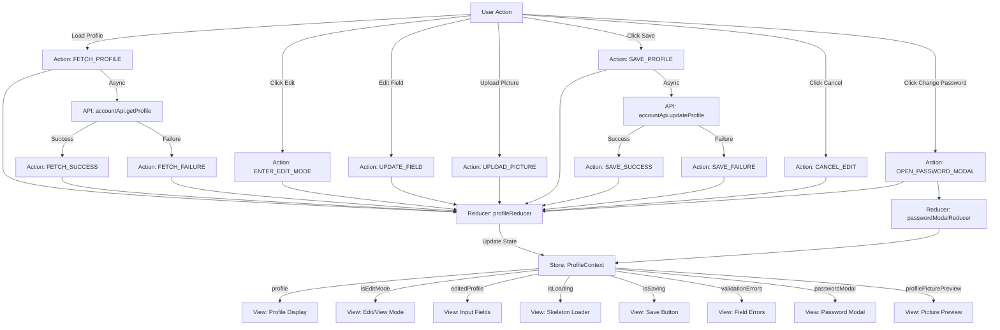
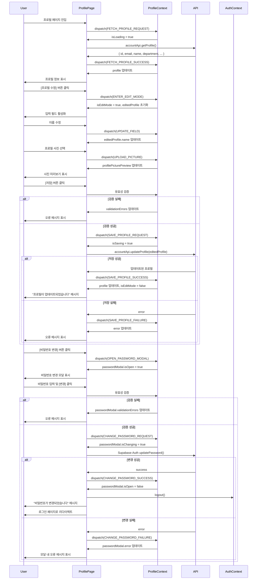

# UC-006: 프로필 페이지 상태관리 설계

## 1. 상태 데이터 목록

### 관리해야 할 상태 (State)

| 상태명 | 타입 | 초기값 | 설명 |
|--------|------|--------|------|
| `profile` | UserProfile \| null | null | 사용자 프로필 정보 |
| `isEditMode` | boolean | false | 프로필 수정 모드 여부 |
| `editedProfile` | Partial<UserProfile> | {} | 수정 중인 프로필 데이터 |
| `isLoading` | boolean | false | 프로필 조회/수정 진행 중 여부 |
| `isSaving` | boolean | false | 프로필 저장 진행 중 여부 |
| `error` | string \| null | null | 오류 메시지 |
| `validationErrors` | ValidationErrors | {} | 필드별 유효성 검증 오류 |
| `passwordModal` | PasswordModalState | { isOpen: false, ... } | 비밀번호 변경 모달 상태 |
| `profilePicturePreview` | string \| null | null | 프로필 사진 미리보기 URL |

### 화면에 보여지지만 상태가 아닌 것 (Derived/Computed)

| 항목 | 타입 | 설명 |
|------|------|------|
| `hasChanges` | boolean | editedProfile이 profile과 다른지 여부 (computed) |
| `canSave` | boolean | hasChanges && !isSaving && !hasValidationErrors (computed) |
| `hasValidationErrors` | boolean | Object.keys(validationErrors).length > 0 (computed) |

---

## 2. 상태 변경 조건 및 화면 변화

| 상태 | 변경 조건 | 화면 변화 |
|------|----------|----------|
| `profile` | 페이지 진입 시 API로 프로필 조회 성공 | 프로필 정보 표시 (이름, 이메일, 부서 등) |
| `isEditMode` | [프로필 수정] 버튼 클릭 시 true, [취소]/[저장] 시 false | 읽기 모드 ↔ 수정 모드 전환 |
| `editedProfile` | 수정 모드에서 사용자가 필드 입력 | 입력 필드 값 업데이트 |
| `isLoading` | 프로필 조회 시작 시 true, 완료 시 false | 스켈레톤 로더 표시/제거 |
| `isSaving` | 프로필 저장 시작 시 true, 완료 시 false | [저장] 버튼 비활성화, 로딩 표시 |
| `error` | API 오류 발생 시 | 오류 메시지 Alert 표시 |
| `validationErrors.name` | 이름이 2자 미만 또는 50자 초과 시 | 이름 필드 하단에 오류 메시지 표시 |
| `validationErrors.profilePicture` | 사진 파일이 2MB 초과 또는 지원하지 않는 형식 시 | 사진 업로드 영역에 오류 메시지 표시 |
| `passwordModal.isOpen` | [비밀번호 변경] 버튼 클릭 시 true | 비밀번호 변경 모달 열림 |
| `passwordModal.currentPassword` | 사용자가 현재 비밀번호 입력 | 입력 필드 값 업데이트 |
| `passwordModal.newPassword` | 사용자가 새 비밀번호 입력 | 입력 필드 값 업데이트, 강도 표시 |
| `passwordModal.confirmPassword` | 사용자가 비밀번호 확인 입력 | 입력 필드 값 업데이트 |
| `passwordModal.isChanging` | 비밀번호 변경 요청 시작 시 true | [변경] 버튼 비활성화 |
| `passwordModal.error` | 비밀번호 변경 실패 시 | 모달 내 오류 메시지 표시 |
| `profilePicturePreview` | 사용자가 새 사진 선택 시 | 프로필 사진 미리보기 업데이트 |

---

## 3. Flux 패턴 시각화 (Action → Store → View)



---

## 4. Context + useReducer 설계

### 4.1. State Interface

```typescript
interface UserProfile {
  id: string;
  email: string;
  full_name: string;
  department: string;
  role: 'admin' | 'user';
  profile_picture_url?: string;
  created_at: string;
  last_login?: string;
}

interface ValidationErrors {
  name?: string;
  department?: string;
  profilePicture?: string;
}

interface PasswordModalState {
  isOpen: boolean;
  currentPassword: string;
  newPassword: string;
  confirmPassword: string;
  isChanging: boolean;
  error: string | null;
  validationErrors: {
    currentPassword?: string;
    newPassword?: string;
    confirmPassword?: string;
  };
}

interface ProfileState {
  profile: UserProfile | null;
  isEditMode: boolean;
  editedProfile: Partial<UserProfile>;
  isLoading: boolean;
  isSaving: boolean;
  error: string | null;
  validationErrors: ValidationErrors;
  passwordModal: PasswordModalState;
  profilePicturePreview: string | null;
}
```

### 4.2. Action Types

```typescript
type ProfileAction =
  | { type: 'FETCH_PROFILE_REQUEST' }
  | { type: 'FETCH_PROFILE_SUCCESS'; payload: UserProfile }
  | { type: 'FETCH_PROFILE_FAILURE'; payload: string }
  | { type: 'ENTER_EDIT_MODE' }
  | { type: 'CANCEL_EDIT' }
  | { type: 'UPDATE_FIELD'; field: keyof UserProfile; value: any }
  | { type: 'UPLOAD_PICTURE'; file: File; previewUrl: string }
  | { type: 'REMOVE_PICTURE' }
  | { type: 'SET_VALIDATION_ERROR'; field: keyof ValidationErrors; message: string }
  | { type: 'CLEAR_VALIDATION_ERRORS' }
  | { type: 'SAVE_PROFILE_REQUEST' }
  | { type: 'SAVE_PROFILE_SUCCESS'; payload: UserProfile }
  | { type: 'SAVE_PROFILE_FAILURE'; payload: string }
  | { type: 'OPEN_PASSWORD_MODAL' }
  | { type: 'CLOSE_PASSWORD_MODAL' }
  | { type: 'UPDATE_PASSWORD_FIELD'; field: keyof PasswordModalState; value: string }
  | { type: 'CHANGE_PASSWORD_REQUEST' }
  | { type: 'CHANGE_PASSWORD_SUCCESS' }
  | { type: 'CHANGE_PASSWORD_FAILURE'; payload: string };
```

### 4.3. Reducer

```typescript
const profileReducer = (state: ProfileState, action: ProfileAction): ProfileState => {
  switch (action.type) {
    case 'FETCH_PROFILE_REQUEST':
      return {
        ...state,
        isLoading: true,
        error: null,
      };

    case 'FETCH_PROFILE_SUCCESS':
      return {
        ...state,
        isLoading: false,
        profile: action.payload,
        error: null,
      };

    case 'FETCH_PROFILE_FAILURE':
      return {
        ...state,
        isLoading: false,
        error: action.payload,
      };

    case 'ENTER_EDIT_MODE':
      return {
        ...state,
        isEditMode: true,
        editedProfile: {
          full_name: state.profile?.full_name,
          department: state.profile?.department,
        },
        validationErrors: {},
      };

    case 'CANCEL_EDIT':
      return {
        ...state,
        isEditMode: false,
        editedProfile: {},
        validationErrors: {},
        profilePicturePreview: null,
      };

    case 'UPDATE_FIELD':
      return {
        ...state,
        editedProfile: {
          ...state.editedProfile,
          [action.field]: action.value,
        },
      };

    case 'UPLOAD_PICTURE':
      return {
        ...state,
        editedProfile: {
          ...state.editedProfile,
          profile_picture: action.file,
        },
        profilePicturePreview: action.previewUrl,
        validationErrors: {
          ...state.validationErrors,
          profilePicture: undefined,
        },
      };

    case 'REMOVE_PICTURE':
      return {
        ...state,
        editedProfile: {
          ...state.editedProfile,
          profile_picture: null,
        },
        profilePicturePreview: null,
      };

    case 'SET_VALIDATION_ERROR':
      return {
        ...state,
        validationErrors: {
          ...state.validationErrors,
          [action.field]: action.message,
        },
      };

    case 'CLEAR_VALIDATION_ERRORS':
      return {
        ...state,
        validationErrors: {},
      };

    case 'SAVE_PROFILE_REQUEST':
      return {
        ...state,
        isSaving: true,
        error: null,
      };

    case 'SAVE_PROFILE_SUCCESS':
      return {
        ...state,
        isSaving: false,
        isEditMode: false,
        profile: action.payload,
        editedProfile: {},
        profilePicturePreview: null,
        error: null,
      };

    case 'SAVE_PROFILE_FAILURE':
      return {
        ...state,
        isSaving: false,
        error: action.payload,
      };

    case 'OPEN_PASSWORD_MODAL':
      return {
        ...state,
        passwordModal: {
          isOpen: true,
          currentPassword: '',
          newPassword: '',
          confirmPassword: '',
          isChanging: false,
          error: null,
          validationErrors: {},
        },
      };

    case 'CLOSE_PASSWORD_MODAL':
      return {
        ...state,
        passwordModal: {
          ...state.passwordModal,
          isOpen: false,
        },
      };

    case 'UPDATE_PASSWORD_FIELD':
      return {
        ...state,
        passwordModal: {
          ...state.passwordModal,
          [action.field]: action.value,
        },
      };

    case 'CHANGE_PASSWORD_REQUEST':
      return {
        ...state,
        passwordModal: {
          ...state.passwordModal,
          isChanging: true,
          error: null,
        },
      };

    case 'CHANGE_PASSWORD_SUCCESS':
      return {
        ...state,
        passwordModal: {
          isOpen: false,
          currentPassword: '',
          newPassword: '',
          confirmPassword: '',
          isChanging: false,
          error: null,
          validationErrors: {},
        },
      };

    case 'CHANGE_PASSWORD_FAILURE':
      return {
        ...state,
        passwordModal: {
          ...state.passwordModal,
          isChanging: false,
          error: action.payload,
        },
      };

    default:
      return state;
  }
};
```

---

## 5. Context 데이터 흐름 시각화



---

## 6. 하위 컴포넌트에 노출할 변수 및 함수

### ProfileContext 노출 인터페이스

```typescript
interface ProfileContextValue {
  // 상태
  state: ProfileState;

  // 계산된 값
  hasChanges: boolean;
  canSave: boolean;
  hasValidationErrors: boolean;

  // 프로필 액션
  fetchProfile: () => Promise<void>;
  enterEditMode: () => void;
  cancelEdit: () => void;
  updateField: (field: keyof UserProfile, value: any) => void;
  uploadPicture: (file: File) => void;
  removePicture: () => void;
  saveProfile: () => Promise<void>;

  // 비밀번호 액션
  openPasswordModal: () => void;
  closePasswordModal: () => void;
  updatePasswordField: (field: keyof PasswordModalState, value: string) => void;
  changePassword: () => Promise<void>;

  // 유효성 검증
  validateName: (name: string) => boolean;
  validateDepartment: (department: string) => boolean;
  validateProfilePicture: (file: File) => boolean;
  validatePassword: (password: string) => boolean;

  // 유틸리티
  getPasswordStrength: (password: string) => 'weak' | 'medium' | 'strong';
}
```

---

## 7. 주요 구현 로직 (인터페이스)

### 7.1. 프로필 조회

```typescript
const fetchProfile = async (): Promise<void> => {
  dispatch({ type: 'FETCH_PROFILE_REQUEST' });

  try {
    const profile = await accountApi.getProfile();

    dispatch({
      type: 'FETCH_PROFILE_SUCCESS',
      payload: profile,
    });

  } catch (error) {
    dispatch({
      type: 'FETCH_PROFILE_FAILURE',
      payload: error.message || '프로필을 불러올 수 없습니다',
    });
  }
};
```

### 7.2. 프로필 저장

```typescript
const saveProfile = async (): Promise<void> => {
  // 1. 유효성 검증
  dispatch({ type: 'CLEAR_VALIDATION_ERRORS' });

  if (state.editedProfile.full_name && !validateName(state.editedProfile.full_name)) {
    dispatch({
      type: 'SET_VALIDATION_ERROR',
      field: 'name',
      message: '이름은 2자 이상 50자 이하여야 합니다',
    });
    return;
  }

  // 2. 저장 요청
  dispatch({ type: 'SAVE_PROFILE_REQUEST' });

  try {
    // FormData 생성 (프로필 사진 포함)
    const formData = new FormData();

    if (state.editedProfile.full_name) {
      formData.append('full_name', state.editedProfile.full_name);
    }

    if (state.editedProfile.department) {
      formData.append('department', state.editedProfile.department);
    }

    if (state.editedProfile.profile_picture) {
      formData.append('profile_picture', state.editedProfile.profile_picture);
    }

    const updatedProfile = await accountApi.updateProfile(formData);

    dispatch({
      type: 'SAVE_PROFILE_SUCCESS',
      payload: updatedProfile,
    });

    showNotification('프로필이 업데이트되었습니다', 'success');

  } catch (error) {
    dispatch({
      type: 'SAVE_PROFILE_FAILURE',
      payload: error.message || '프로필 저장 중 오류가 발생했습니다',
    });

    showNotification('프로필 저장 실패', 'error');
  }
};
```

### 7.3. 프로필 사진 업로드

```typescript
const uploadPicture = (file: File): void => {
  // 1. 파일 검증
  if (!validateProfilePicture(file)) {
    dispatch({
      type: 'SET_VALIDATION_ERROR',
      field: 'profilePicture',
      message: '프로필 사진은 JPG, PNG 형식이며 2MB 이하여야 합니다',
    });
    return;
  }

  // 2. 미리보기 URL 생성
  const previewUrl = URL.createObjectURL(file);

  dispatch({
    type: 'UPLOAD_PICTURE',
    file,
    previewUrl,
  });
};

const validateProfilePicture = (file: File): boolean => {
  // 파일 형식 검증
  const validTypes = ['image/jpeg', 'image/jpg', 'image/png'];
  if (!validTypes.includes(file.type)) {
    return false;
  }

  // 파일 크기 검증 (최대 2MB)
  const maxSize = 2 * 1024 * 1024; // 2MB
  if (file.size > maxSize) {
    return false;
  }

  return true;
};
```

### 7.4. 비밀번호 변경

```typescript
const changePassword = async (): Promise<void> => {
  // 1. 유효성 검증
  const errors: any = {};

  if (!state.passwordModal.currentPassword) {
    errors.currentPassword = '현재 비밀번호를 입력해주세요';
  }

  if (!validatePassword(state.passwordModal.newPassword)) {
    errors.newPassword = '비밀번호는 8자 이상, 영문, 숫자, 특수문자를 포함해야 합니다';
  }

  if (state.passwordModal.newPassword !== state.passwordModal.confirmPassword) {
    errors.confirmPassword = '비밀번호가 일치하지 않습니다';
  }

  if (Object.keys(errors).length > 0) {
    // 검증 오류 표시
    return;
  }

  // 2. 비밀번호 변경 요청
  dispatch({ type: 'CHANGE_PASSWORD_REQUEST' });

  try {
    await supabaseAuthService.updatePassword(
      state.passwordModal.currentPassword,
      state.passwordModal.newPassword
    );

    dispatch({ type: 'CHANGE_PASSWORD_SUCCESS' });

    showNotification('비밀번호가 변경되었습니다. 다시 로그인해주세요', 'success');

    // 3. 로그아웃 처리
    authContext.logout();

    // 4. 로그인 페이지로 리다이렉트
    navigate('/login');

  } catch (error) {
    dispatch({
      type: 'CHANGE_PASSWORD_FAILURE',
      payload: error.message || '비밀번호 변경 중 오류가 발생했습니다',
    });
  }
};

const validatePassword = (password: string): boolean => {
  // 최소 8자 이상
  if (password.length < 8) return false;

  // 영문 포함
  if (!/[a-zA-Z]/.test(password)) return false;

  // 숫자 포함
  if (!/[0-9]/.test(password)) return false;

  // 특수문자 포함
  if (!/[!@#$%^&*]/.test(password)) return false;

  return true;
};

const getPasswordStrength = (password: string): 'weak' | 'medium' | 'strong' => {
  let strength = 0;

  if (password.length >= 8) strength++;
  if (password.length >= 12) strength++;
  if (/[a-z]/.test(password) && /[A-Z]/.test(password)) strength++;
  if (/[0-9]/.test(password)) strength++;
  if (/[!@#$%^&*]/.test(password)) strength++;

  if (strength <= 2) return 'weak';
  if (strength <= 3) return 'medium';
  return 'strong';
};
```

---

## 8. 설계 원칙 준수

### DRY (Don't Repeat Yourself)
- 유효성 검증 로직을 별도 함수로 분리
- 프로필 업데이트와 비밀번호 변경 로직을 각각 분리
- API 호출 로직을 `accountApi`로 추상화

### Single Responsibility
- ProfileContext: 프로필 관리 상태만 담당
- PasswordModal: 비밀번호 변경만 담당
- Validator: 유효성 검증만 담당

### Separation of Concerns
- Presentation (ProfilePage): UI 렌더링
- Application (ProfileContext): 상태 관리
- Service (accountApi): API 통신
- Domain (UserProfile): 비즈니스 모델

---

## 9. 주의사항

1. **보안**: 비밀번호는 평문으로 저장하지 않음, HTTPS 필수
2. **메모리 관리**: 프로필 사진 미리보기 URL은 컴포넌트 언마운트 시 해제
3. **변경 감지**: 페이지 이탈 시 저장하지 않은 변경사항이 있으면 확인 다이얼로그 표시
4. **비밀번호 변경 후 로그아웃**: 보안을 위해 비밀번호 변경 후 자동 로그아웃
5. **접근성**: 입력 필드는 label과 연결, 오류 메시지는 aria-live 영역에 표시
6. **이미지 최적화**: 프로필 사진은 서버에서 리사이즈 및 최적화
