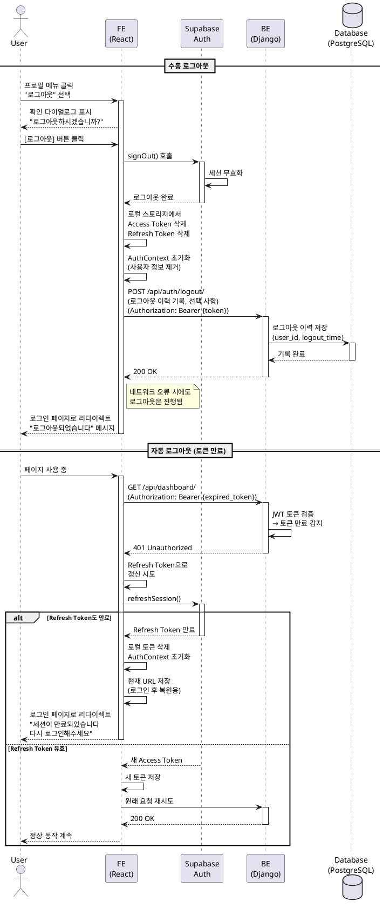

# UC-007: 로그아웃

## Primary Actor
- 인증된 대학교 직원 (관리자 또는 일반 사용자)

## Precondition
- 사용자가 로그인되어 있어야 함
- 사용자가 유효한 JWT 토큰을 보유하고 있어야 함

## Trigger
- Navigation Bar에서 프로필 드롭다운 메뉴의 "로그아웃" 버튼 클릭

## Main Scenario

1. 사용자가 프로필 아이콘 또는 메뉴를 클릭함
2. 시스템이 드롭다운 메뉴를 표시함 (프로필, 로그아웃)
3. 사용자가 "로그아웃" 버튼을 클릭함
4. 시스템이 확인 다이얼로그를 표시함
   - "로그아웃하시겠습니까?"
   - [취소] [로그아웃] 버튼
5. 사용자가 [로그아웃] 버튼을 클릭함
6. Frontend가 Supabase Auth 로그아웃 API를 호출함
7. Supabase Auth가 세션을 무효화함
8. Frontend가 로컬 스토리지에서 토큰을 삭제함
   - Access Token 삭제
   - Refresh Token 삭제
9. Frontend가 AuthContext를 초기화함
10. Frontend가 Backend에 로그아웃 이력을 기록함 (선택 사항)
11. Frontend가 로그인 페이지로 리다이렉트함
12. 시스템이 "로그아웃되었습니다" 메시지를 표시함

**Result**: 사용자가 로그아웃되어 인증이 필요한 페이지에 접근할 수 없게 됨

## Alternative Scenarios

### 5a. 사용자가 [취소] 버튼을 클릭함
5a1. 시스템이 확인 다이얼로그를 닫음
5a2. 사용자는 현재 페이지에 머무름 (로그인 상태 유지)
5a3. 사용 종료

### 6a. Supabase Auth API 호출 실패
6a1. 네트워크 오류 또는 서버 오류로 인해 API 호출 실패
6a2. Frontend가 로컬 토큰만 삭제하고 로그아웃 진행
6a3. Frontend가 "로그아웃되었습니다. (서버 동기화 실패)" 메시지 표시
6a4. Main Scenario의 11단계로 진행

### 자동 로그아웃 시나리오

### ALT-1. 토큰 만료로 인한 자동 로그아웃
ALT1-1. 사용자가 시스템을 사용 중 Access Token이 만료됨
ALT1-2. 시스템이 Refresh Token으로 갱신을 시도함
ALT1-3. Refresh Token도 만료되어 갱신 실패
ALT1-4. 시스템이 "세션이 만료되었습니다. 다시 로그인해주세요" 메시지 표시
ALT1-5. 시스템이 로컬 토큰을 삭제하고 AuthContext를 초기화함
ALT1-6. 시스템이 현재 URL을 저장함 (로그인 후 복원용)
ALT1-7. 시스템이 로그인 페이지로 리다이렉트함

### ALT-2. 비활성 타임아웃
ALT2-1. 사용자가 30분 이상 아무 활동도 하지 않음
ALT2-2. 시스템이 비활성 상태를 감지함
ALT2-3. 시스템이 경고 다이얼로그를 표시함
      ```
      비활성 상태로 인해 곧 로그아웃됩니다
      계속 사용하시겠습니까?
      (60초 후 자동 로그아웃)
      ```
ALT2-4-1. 사용자가 [계속 사용] 클릭 시: 타이머 리셋, 세션 유지
ALT2-4-2. 60초 경과 시: 자동 로그아웃 수행, Main Scenario의 6단계로 진행

### ALT-3. 다른 기기에서 로그인
ALT3-1. 사용자가 다른 기기에서 동일 계정으로 로그인함
ALT3-2. (선택 사항) Backend가 기존 세션을 무효화함
ALT3-3. (선택 사항) 기존 브라우저에서 다음 API 요청 시 401 Unauthorized 발생
ALT3-4. (선택 사항) 시스템이 "다른 기기에서 로그인되어 로그아웃되었습니다" 메시지 표시
ALT3-5. (선택 사항) Main Scenario의 11단계로 진행

## Edge Cases

- **페이지 새로고침**: 로그아웃 후 브라우저 뒤로가기 시 로그인 페이지로 리다이렉트됨
- **로그아웃 중 네트워크 끊김**: 로컬 토큰만 삭제하고 로그아웃 진행
- **여러 탭 동시 로그아웃**: 한 탭에서 로그아웃 시 다른 탭도 자동으로 로그아웃됨 (LocalStorage 이벤트 감지)
- **로그아웃 후 브라우저 닫기**: 세션이 이미 종료되어 다음 접속 시 로그인 필요
- **"로그인 상태 유지" 옵션**: 로그아웃 시 저장된 자동 로그인 정보도 함께 삭제됨

## Business Rules

- BR-001: 모든 로그인 사용자는 로그아웃할 수 있음
- BR-002: 로그아웃 시 Access Token과 Refresh Token 모두 삭제됨
- BR-003: 로그아웃 이력은 감사 로그에 기록됨 (사용자 ID, 로그아웃 시각)
- BR-004: 로그아웃 후 모든 인증이 필요한 API 호출은 401 Unauthorized 응답을 받음
- BR-005: 비활성 타임아웃은 30분임 (설정 가능)
- BR-006: 비활성 경고는 타임아웃 1분 전에 표시됨
- BR-007: Refresh Token 만료 시간은 30일임
- BR-008: 로그아웃 시 서버측 세션 무효화는 선택 사항임 (JWT는 Stateless이므로)
- BR-009: 로그아웃 후 사용자는 모든 페이지에서 로그인 페이지로 리다이렉트됨
- BR-010: 로그아웃 확인 다이얼로그는 중요한 작업 중(예: 파일 업로드 중)에는 추가 경고 표시

## Sequence Diagram



## Post-conditions

### Success
- 사용자의 세션이 종료됨
- 모든 토큰이 삭제됨
- AuthContext가 초기화됨
- 로그아웃 이력이 감사 로그에 기록됨
- 로그인 페이지가 표시됨
- 사용자는 인증이 필요한 페이지에 접근할 수 없음

### Failure (서버 동기화 실패)
- 로컬 토큰만 삭제되고 로그아웃 진행
- 경고 메시지가 표시됨
- 사용자는 여전히 로그아웃 상태가 됨

## Related Use Cases
- UC-001: 사용자 로그인 (로그아웃 후 재로그인 가능)
- UC-006: 프로필 관리 (비밀번호 변경 시 자동 로그아웃)
